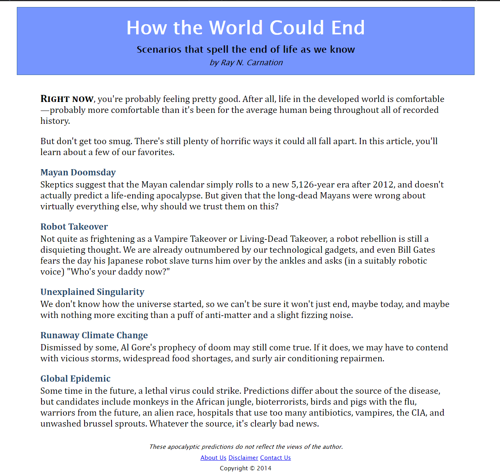
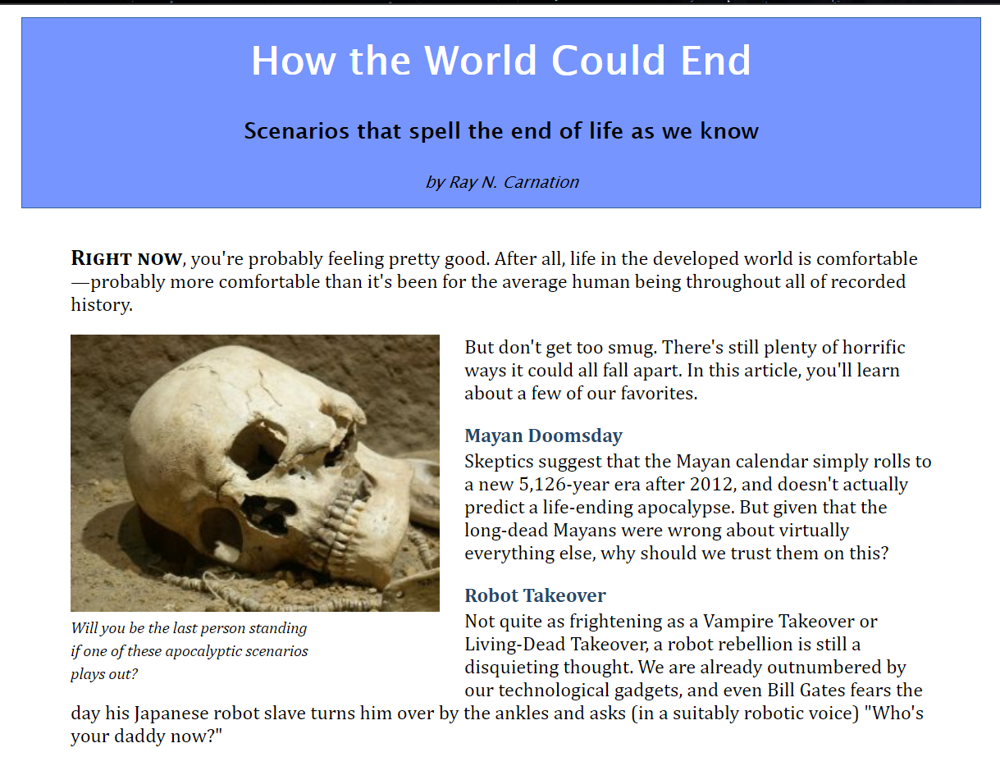
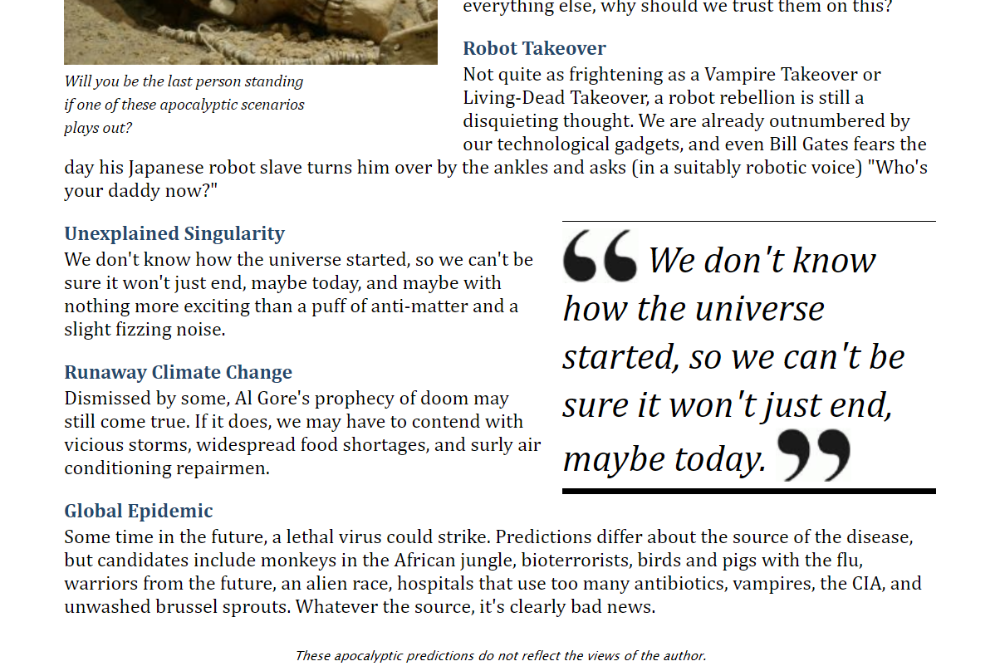
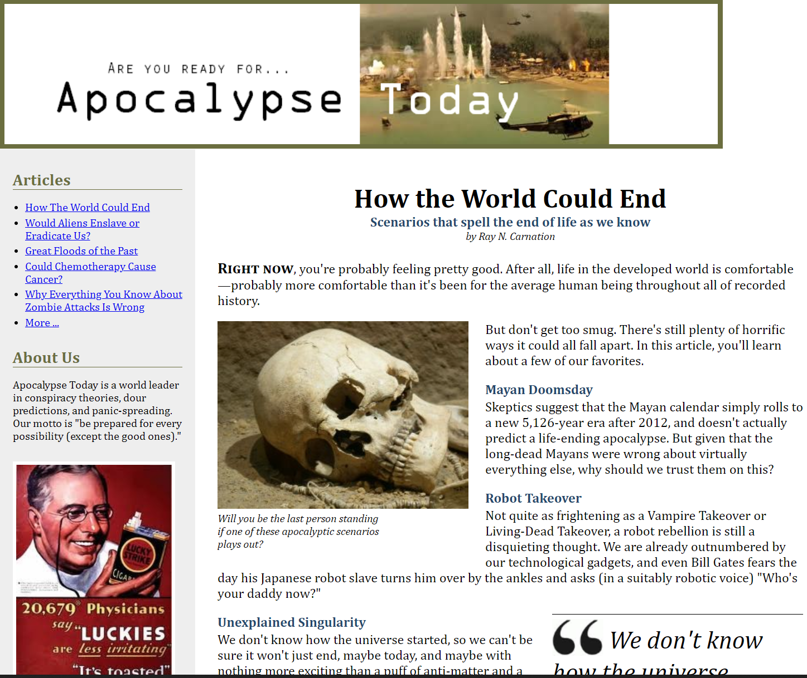
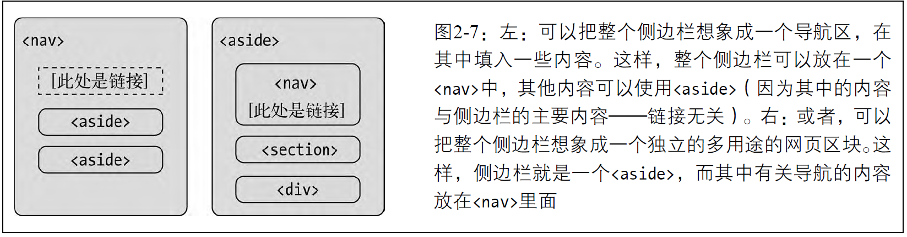
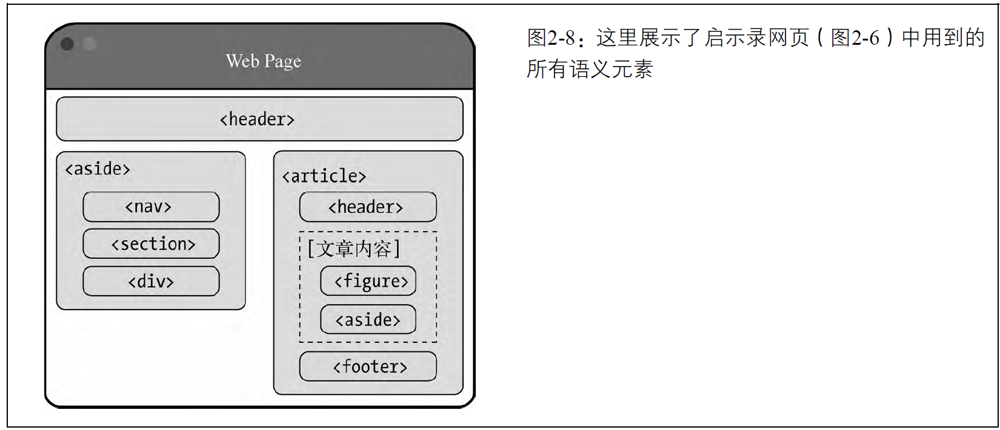
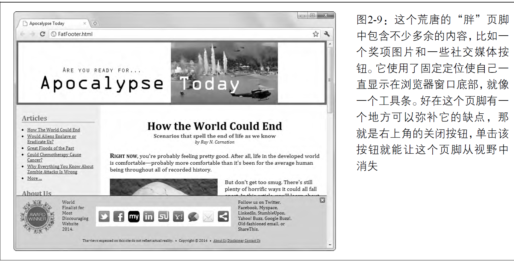
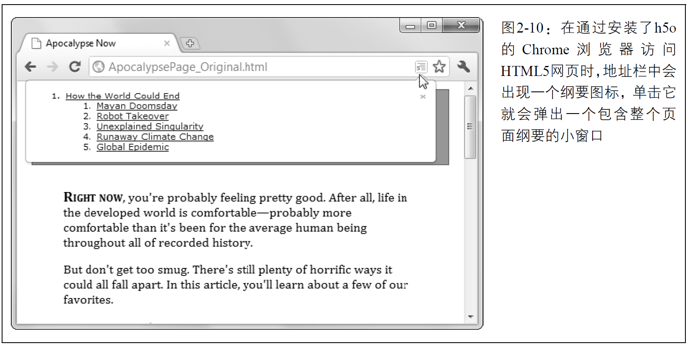

```json
{
  "item": "HTML5 秘籍",
  "priority": 3,
  "span": "1 week",
  "plan": "2 chapter/ 1 day"
}
```

**目录：**

- [1. HTML5 简介](#1-html5-简介)
  - [1.1. HTML5 的故事](#11-html5-的故事)
    - [1.1.1. XHTML 1.0：更严格的标准](#111-xhtml-10更严格的标准)
    - [1.1.2. XHTML 2：意想不到的失败](#112-xhtml-2意想不到的失败)
    - [1.1.3. HTML5：起死回生](#113-html5起死回生)
    - [1.1.4. HTML：活着的语言](#114-html活着的语言)
  - [1.2. HTML5 的三个主要原理](#12-html5-的三个主要原理)
    - [1.2.1. 不破坏 Web](#121-不破坏-web)
    - [1.2.2. 修补牛蹄子路](#122-修补牛蹄子路)
    - [1.2.3. 实用至上](#123-实用至上)
  - [1.3. HTML5 标记初体验](#13-html5-标记初体验)
    - [1.3.1. HTML5 文档类型](#131-html5-文档类型)
    - [1.3.2. 字符编码](#132-字符编码)
    - [1.3.3. 页面语言](#133-页面语言)
    - [1.3.4. 添加样式表](#134-添加样式表)
    - [1.3.5. 添加 JavaScript](#135-添加-javascript)
    - [1.3.6. 最终结果](#136-最终结果)
  - [1.4. HTML5 语法](#14-html5-语法)
    - [1.4.1. 放松的规则](#141-放松的规则)
    - [1.4.2. HTML5 验证](#142-html5-验证)
    - [1.4.3. XHTML 的回归](#143-xhtml-的回归)
  - [1.5. HTML5 元素家族](#15-html5-元素家族)
    - [1.5.1. 新增的元素](#151-新增的元素)
    - [1.5.2. 删除的元素](#152-删除的元素)
    - [1.5.3. 改变的元素](#153-改变的元素)
    - [1.5.4. 调整的元素](#154-调整的元素)
    - [1.5.5. 标准化的元素](#155-标准化的元素)
  - [1.6. 今天开始使用 HTML5](#16-今天开始使用-html5)
    - [1.6.1. 了解浏览器支持情况](#161-了解浏览器支持情况)
    - [1.6.2. 浏览器装机情况统计](#162-浏览器装机情况统计)
    - [1.6.3. 通过 Modernizr 检测功能](#163-通过-modernizr-检测功能)
    - [1.6.4. 使用“腻子脚本”填补功能缺陷](#164-使用腻子脚本填补功能缺陷)
- [2. 使用语义元素构造网页](#2-使用语义元素构造网页)
  - [2.1. 语义元素](#21-语义元素)
  - [2.2. 改造传统的 HTML 页面](#22-改造传统的-html-页面)
    - [2.2.1. 构造页面的老方法](#221-构造页面的老方法)
    - [2.2.2. 使用 HTML5 构造元素](#222-使用-html5-构造元素)
    - [2.2.3. 使用 `<figure>` 添加插图](#223-使用-figure-添加插图)
    - [2.2.4. 使用 `<aside>` 添加附注](#224-使用-aside-添加附注)
  - [2.3. 浏览器对语义元素的支持情况](#23-浏览器对语义元素的支持情况)
    - [2.3.1. 为语义元素添加样式](#231-为语义元素添加样式)
    - [2.3.2. 使用 HTML5 垫片](#232-使用-html5-垫片)
    - [2.3.3. Modernizr：一站式解决方案](#233-modernizr一站式解决方案)
  - [2.4. 使用语义元素设计站点](#24-使用语义元素设计站点)
    - [2.4.1. 理解 `<header>`](#241-理解-header)
    - [2.4.2. 用`<nav>`标注导航链接](#242-用nav标注导航链接)
    - [2.4.3. 理解区块](#243-理解区块)
    - [2.4.4. 理解 `<footer>`](#244-理解-footer)
    - [2.4.5. 用 `<main>` 表示主要内容](#245-用-main-表示主要内容)
  - [2.5. HTML 纲要](#25-html-纲要)
    - [2.5.1. 如何查看纲要](#251-如何查看纲要)
    - [2.5.2. 基本纲要](#252-基本纲要)
    - [2.5.3. 分块元素](#253-分块元素)
    - [2.5.4. 解决一个纲要问题](#254-解决一个纲要问题)
- [3. 编写更有意义的网页](#3-编写更有意义的网页)
  - [3.1. 回顾语义元素](#31-回顾语义元素)
    - [3.1.1. 使用 `<time>` 标记时间](#311-使用-time-标记时间)

# 1. HTML5 简介

如果说 HTML 是一部电影，那 HTML5 就是一次大转折。HTML 本来是不会活过 21 世纪的。官方 Web 标准组织 W3C 早在 1998 年就已经对 HTML 撒手不管了。W3C 把未来都寄托在 XHTML 这个更具现代特色的后续标准身上，XHTML 被视为 HTML 的严肃整洁版。 但 XHTML 举步维艰，是一群被剥夺了话语权的人，让 HTML 起死回生并为本书将要探讨的功能奠定了基础。

在本章里，你会了解 HTML 死亡的原因，以及它又是怎样复活的；了解 HTML5 的设计原理与功能；还将见识恼人的浏览器支持问题。在这一章，你将第一次看到真正的 HTML5 文档。

## 1.1. HTML5 的故事

HTML 的基本思想——使用元素为内容添加结构——从 Web 诞生以来就没有变过。事实上，即使是最陈旧的网页，在最新的浏览器中仍然可以得到完美的呈现。

年长和成功也会带来风险，那就是所有人都想取代你！1998 年，W3C 停止了对 HTML 的维护，作为对它的改进，开始制定一个基于 XML 的后续版本——XHTML 1.0。

### 1.1.1. XHTML 1.0：更严格的标准

XHTML 与 HTML 的语法绝大部分都是相同的，只不过要求更严格。很多以前不够严谨的 HTML 标记，在 XHTML 中都变成了不能接受的。

例如，假设你想把标题中的最后一个词标记为斜体，本来应该写：

```html
<h1>
  The Life of a
  <i>Duck</i>
</h1>
```

但你一不小心放错了最后两个标签的位置：

```html
<h1>The Life of a <i>Duck</h1></i>
```

浏览器在遇到这个稍微有点乱的标记之后，能明白你想干什么。于是，它就一声不吭地把最后一个词变成斜体。可是，标签不匹配违反了 XHTML 的规定。如果把页面复制到一个 XHTML 验证器中（或使用 Dreamweaver 之类的网页设计工具时），你就会看到一个警告，告诉你哪里有错误。从 Web 设计的角度看，XHTML 基于严格规则的这种提示很有用，因为你可以发现微小的错误，这些错误会导致在不同浏览器中显示结果不一致（这些错误在编辑和增强页面时还可能导致更严重的问题）。

最初，XHTML 获得了成功。由于厌倦了浏览器的古怪行为和怎么写都可以通过的不正常状态，专业的 Web 开发人员对 XHTML 还是非常拥护的。后来，XHTML 标准又强迫他们养成更好的习惯，同时放弃 HTML 中那些并不完善的格式化功能。可是，与 XML 工具协同，降低自动化程序处理页面的难度，方便地移植到移动平台，以及 XHTML 语言自身的可扩展性等这些预期的好处，从来没有在 XHTML 身上实现过。

即便如此，XHTML 仍然成为最严肃的 Web 设计师所遵循的标准。尽管看起来所有人都挺满意的，但实际上却存在一个潜规则：浏览器虽然理解 XHTML 标记，但却不会严格地按照标准执行错误检查。这就意味着页面仍然可以不遵守 XHTML 规则，浏览器则视而不见。事实上，没有什么可以阻止 Web 开发人员把乱糟糟的标记和陈旧的 HTML 内容混在一起，然后还说这是 XHTML 页面。世界上根本就没有一个浏览器站出来反对这种行为。这种情况让那些负责 XHTML 标准的人深感不安。

### 1.1.2. XHTML 2：意想不到的失败

解决方案就是通过 XHTML 2 来扭转这个乱糟糟的局面。这个新版本规定了严格的错误处理规则，强制要求浏览器拒绝无效的 XHTML 2 页面，同时也摒弃了很多从 HTML 沿袭下来的怪异行为和编码惯例。比如，以编号方式（`<h1>`、`<h2>`、`<h3>`等）区分标题的方法被一个新的`<h>`元素取代，这个元素的重要性取决于它在网页中的位置。类似地，由于允许 Web 开发人员将任何元素转换为链接，`<a>`元素的地位一落千丈。而``元素因为增加了一种提供替代内容的新方式，也丧失了原有的 alt 属性。

这些变化是 XHTML 2 的典型特征。从理论上看，这些改变的目的是让网页更整洁也更有逻辑性。而从实践角度说，这就要求 Web 设计人员必须改变以前编写网页的方式（已经存在的网页必须更新），但付出这些代价却没有增加任何新功能，让这种改变失去了价值。与此同时，XHTML 2 还宣布作废了几个众所周知的元素，比如用于加粗文本的`<b>`、用于变斜体的`<i>`和用于在网页中嵌入另一个网页的`<iframe>`，但这些元素在 Web 设计人员中仍然深得人心。

但最糟糕的，还是慢得要死的制定过程。XHTML 2 的制定过程整整拖了 5 年才完成，开发人员的激情早已荡然无存了。

### 1.1.3. HTML5：起死回生

几乎与此同时，从 2004 年开始就有一群人从另外一个角度展望 Web 的未来。他们想的不是从 HTML 中挑出各式各样的毛病（或者干脆说是主张“不纯粹的哲学观”），而是它还缺少什么 Web 开发人员编码时急需的功能。

归根结底，HTML 最早是作为显示文档的手段出现的。辅之以 JavaScript，它其实已经演变成了一个系统，可以开发搜索引擎、网上商店、在线地图、邮件客户端以及其他各种能够想象得到的 Web 应用。虽然设计巧妙的 Web 应用可以实现很多令人赞叹的功能，但开发这样的应用远非易事。多数 Web 应用都得手动编写大量 JavaScript 代码，还要用到一个或多个流行的 JavaScript 工具包，乃至在 Web 服务器上运行的服务器端模块。要让所有这些方面在不同的浏览器中都能紧密配合不出差错是一个挑战。即使是赢得了挑战，你还要记住把这些方面联系到一起的那些错综复杂的细节。

开发浏览器的人对这种情况特别关注。于是，来自 Opera Software（开发 Opera 浏览器的公司）和 Mozilla Foundation（开发 Firefox 浏览器的组织）的一些具有超前意识的人纷纷建言，希望 XHTML 能加入一些对开发人员更有用的功能。但他们的建议并没有被采纳，结果 Opera、Mozilla 和苹果公司自发地组建了 WHATWG（Web Hypertext Application Technology Working Group，Web 超文本应用技术工作组），致力于寻找新的解决方案。

WHATWG 的目的不是抛弃 HTML，而是考虑以无障碍、向后兼容的方式去扩展它。这个组织最早的工作成果包含两个补充规范：Web Application 1.0 和 Web Forms 2.0。而 HTML5 正是在这两个标准的基础上发展起来的。

注意 HTML5 中的数字 5 表示这个标准是 HTML 的后续版本（在 XHTML 之前，HTML 的版本号是 4.01）。当然，这个解释也不完全正确，因为 HTML5 支持自 HTML 4.01 发布以来的 10 年间出现在网页中的所有新东西，包括严格的 XHTML 风格的语法（只要你愿意就可以用）和大量的 JavaScript 创新。但不管怎么说，这个名字仍然清楚地表明：HTML5 虽然支持 XHTML 的规定，但它要求的则是 HTML 的规则。

2007 年，WHATWG 获得了全球 Web 开发人员空前的支持。痛定思痛之后，W3C 宣布解散负责制定 XHTML 2 标准的工作组，并开始致力于将 HTML5 改造为正式的标准。就这样，最初的 HTML5 被分割成多个容易管理的模块，而本来统称为 HTML5 的很多功能分散到了几个独立的标准中（更多信息，请详见后面的附注栏）。

提示 W3C 官方 HTML5 标准的网址是 http://www.w3.org/TR/html5。

**HTML5 包含哪些功能**

HTML5 包含多个标准，这些标准之间彼此关联。这种局面既好又不好。说好，是因为浏览器可以迅速实现 HTML5 中业已成熟的部分，而任由其他部分继续发展。说不好，则是因为编写网页的人必须检查浏览器是否支持自己想用的功能。本书将会介绍一些检测浏览器的技术，有的很麻烦，有的则没有那么麻烦。

以下列出了 HTML5 涵盖的一些主要功能。

- HTML5 核心。这一部分主要由 W3C 官方的规范组成，涉及新的语义元素（第 2 章和第 3 章）、新的增强的 Web 表单微件（第 4 章）、音频和视频支持（第 5 章）以及通过 JavaScript 绘图的 Canvas（第 8 章和第 9 章）。
- 曾经属于 HTML5 的功能。这一部分源自 WHATWG 最初制定的 HTML5 规范，其中大多数功能需要 JavaScript 且支持富 Web 应用开发。最重要的包括本地数据存储（第 10 章）、离线应用（第 11 章）和消息传递（第 12 章），但本书要介绍的内容还不止这些。
- 有时候会被称为 HTML5 的功能。这些通常是指下一代功能，虽然它们从未进入过 HTML5 标准，但人们还是经常会把它们与 HTML5 相提并论。这部分包括 CSS3（第 6 章和第 7 章）和地理定位（第 13 章）。

甚至连 W3C 都在有意无意地模糊“真正的”HTML5（已有标准）和“宣传用”版本（包括 HTML5 的所有新增部分和补充规范）之间的界限。举个例子，官方 W3C 标志网站（www.w3.org/html/logo）鼓励人们生成用于宣传CSS3和SVG的HTML5标志，而前两个标准在HTML5出现之前就已经在开发了。

### 1.1.4. HTML：活着的语言

从 W3C 到 WHATWG，然后再回到 W3C，这个过程导致了相当罕见的转换与磨合。从技术上说，什么是或什么不是 HTML5 由 W3C 说了算。但与此同时，WHATWG 一直在设计未来的 HTML 功能。直到最近，他们才不再把自己的工作成果称为 HTML5，而是简单地称为 HTML，表明 HTML 还会继续活下去。

因为 HTML 是一门活着的语言，所以 HTML 页面永远不会作废，也不会无法阅读。HTML 页面永远不需要版本号（甚至连文档类型声明都不需要），Web 开发人员也永远不需要为了让它能在新浏览器中运行，而把自己的标记从一个版本“升级”到另一个版本。同样，任何时候在 HTML 标准中都可能增添新功能。

Web 开发人员听到这么说，第一反应通常是大惑不解。毕竟，谁希望浏览器对标准的支持各不相同，而谁又愿意在选择功能时只凭它们将来会得到支持这个可能性呢？然而，冷静下来想一想，大多数 Web 开发人员还是不情愿地接受了这个现实：无论如何，浏览器从 Web 诞生的那一天起始终都是这样的。

前面我们解释过，今天的浏览器乐于接受支持一大堆乱七八糟的功能这个现实。你可以在激进的 XHTML 页面中加上像`<marquee>`元素（用于创建滚动文本，已废弃）这样被认为是倒行逆施的东西，任何浏览器都不会反对。类似地，即便是在对最老标准的支持方面，有些浏览器也仍然存在一些广为人知的遗漏。比如，有些浏览器开发商在完整地支持 CSS2 之前就开始实现 CSS3，结果很多 CSS2 特性后来都没有实现。唯一的区别就是 HTML5 现在把“活着的语言”变成了常规状态。同样，就像我们正在用新的、创新性的一章来介绍 HTML 一样，它经过了一番轮回终于又恢复了它的本来面貌，这不也正是一个天大的讽刺吗？

提示 要了解当下正在发展中的 HTML，包括被称为 HTML5 的部分和少量但始终在变化的、新的、还没有得到支持的功能，请访问http://whatwg.org/html。

## 1.2. HTML5 的三个主要原理

此时此刻，有的读者可能已经按捺不住了，迫不急待地想知道真正的 HTML5 页面到底是什么样子的。不过在此之前，有必要先了解一下制定 HTML5 规范的那些人当时是怎么想的。只有理解了这门语言背后的设计思想，才能真正明白本书将要介绍的那些古怪的行为、复杂的现象和偶尔会让人抓耳挠腮的问题。

### 1.2.1. 不破坏 Web

“不破坏 Web”的意思是标准不应该引入导致已有的网页无法工作的改变。幸运的是，这种事故极少发生。

“不破坏 Web”还意味着标准不应该出人意料地更改规则，不能认定今天还完美无缺的网页到了明天就要作废（即使可以使用也要作废）。比如，XHTML 2 破坏了 Web，因为它要求马上就显著改变以前编写网页的方式。没错，原来的网页还能用，但那都是浏览器支持向后兼容的功劳。如果你为将来打算，想按照最新标准重写网页，就得浪费数不清的时间去纠正 XHTML 2 已经明令禁止的“错误”。

HTML5 的立场不一样。HTML5 之前可以接受的，在 HTML5 中照样可以接受。事实也是，符合 HTML 4.01 标准的网页在 HTML5 中仍然是有效的。

注意 与以往的标准不同，HTML5 不仅向浏览器开发商明示该支持什么，还利用文档说明并规范化了它们原来的处理方式。由于 HTML5 标准描述的都是事实，而不是抛出一堆理想的规则了事，因此它有望成为有史以来受支持程度最高的 Web 标准。

**HTML5 怎么处理废弃元素**

因为 HTML5 支持所有 HTML，所以它支持很多被认为是废弃的功能。其中包括像`<font>`这样的格式化元素，被人厌恶的`<blink>`和`<marquee>`等特效元素，以及难对付的 HTML 框架体系。

这种无所不包的开放性是令很多 HTML5 新手感到困惑的一个原因。一方面，HTML5 无论如何还是应该禁止使用这些过时的元素，因为它们已经很多年没有出现在官方规范里了。另一方面，现代浏览器依然悄无声息地支持着这些元素，而 HTML5 就是要体现浏览器真实的处理方式。那么这个标准到底要怎么做呢？

为解决这个问题，HTML5 规范包含两个独立的部分。第一部分（也是本书将要介绍的）面向 Web 开发人员，要求摒弃过去的那些坏习惯和被废弃的元素。通过使用 HTML5 验证器可以确保遵循 HTML5 标准的这一部分。

第二部分，也是 HTML5 规范中篇幅更长的部分，针对的是浏览器开发商。它们需要支持 HTML 中存在的一切，以做到向后兼容。理想情况下，HTML5 标准中应该包含足够的信息，让人能够据以从头开发一个新浏览器，而且无论是处理新的还是旧的标记，该浏览器都应该能够与今天的现代浏览器完全兼容。这一部分标准就是告诉浏览器如何处理那些官方不鼓励使用但仍然必须支持的废弃元素。

有时候，HTML5 规范也会对浏览器应如何处理各种错误（如漏写或错配了标签）作出正式规定。这一点其实很重要，因为它可以确保有缺陷的页面在不同浏览器中都能够得到同样的处理，甚至都规定了将页面映射为 DOM（Document Object Model，文档对象模型，即内存中表现页面元素的对象树，供 JavaScript 使用）这么细节的问题。为了写出标准的这个冗长又乏味的部分，HTML5 的制定者们在现代浏览器上进行了彻底的测试，以便发现还没有作出规定的错误处理行为。然后再把该行为加到标准中。

### 1.2.2. 修补牛蹄子路

牛蹄子路（cowpath）指的是高低不平但使用频率很高的路，通过它可以从一个地方到达另一个地方。之所以存在牛蹄子路，就是因为有人走。也许这条路走起来不是最舒服的，但某种程度上却是最实际的解决之道。

HTML5 标准化了这些非官方（但广泛应用）的技术。或许与利用新方法修的高速公路相比，牛蹄子路没有那么平坦宽阔，但它赢得胜利的机会更大。因为对于一般的网站设计人员来说，切换到新技术可能会超出他们的能力范围，或者他们根本就没有兴趣。更大的问题在于，使用旧浏览器的访客无法因为新技术而受益。XHTML 2 企图把人们赶出牛蹄子路，结果败得非常惨。

注意 修补牛蹄子路有一个明显的好处：它使用已经得到浏览器某种程度支持的既定技术。假设有一种只被七成浏览器支持的漂亮的新技术，还有一种任何情况都能工作但不那么雅观的 hack，Web 开发人员始终都会选择不那么雅观的 hack，因为它适合更多的用户。

“修补牛蹄子路”的方法也需要折中。有时候，这意味着要包容那些得到广泛支持但设计却很拙劣的功能。HTML5 的拖放就是一个例子（参见 10.3.5 节），这个功能完全以微软为 IE5 设计的拖放机制为基础。尽管这个拖放功能目前得到了所有浏览器的支持，但由于使用起来不灵活而且过度复杂，因此几乎没有人不反感它。为此，不少的 Web 设计人员也抱怨“HTML5 不仅鼓励不良行为，而且还给它们正名。”

### 1.2.3. 实用至上

这个原理很简单：改变应该以实用为目的。改变得越多，代价也就越大。Web 开发人员可能更希望标准是精心设计、始终如一，而且是没有怪异行为的。但这个理由还不足以改变一门已经用来创建了数十亿网页的语言。当然，到底需要不需要改变还是要由某个人根据利害来评判。而现有网页都是怎么做的或者说试图怎么去做，可以作为很好的判断依据。

例如，（在本书写作时）YouTube 是世界上第三受欢迎的网站，但由于 HTML5 之前的 HTML 不真正支持视频，YouTube 一直都得依赖 Flash 插件。使用 Flash 插件没什么问题，因为只要是能上网的计算机，基本上都会安装这个插件。不过也有例外，比如某些公司会锁定它们的计算机，不允许安装 Flash，另外一些移动设备（如 iPhone、iPad 和 Kindle）也不支持 Flash。不管有多少计算机安装了 Flash，扩展 HTML 标准，使其直接支持人们今天使用 Web 的一种最基本方式——看视频，毋庸置疑是有必要的。

而 HTML5 中添加了更多交互功能的背后也有着同样的动机。像拖放、可编辑的 HTML 内容、在 Canvas 中绘制二维图形等，都是同样的情况。这些功能在我们身边的网页中并不鲜见，只不过有的通过 Adobe Flash 或微软 Silverlight 等插件实现，而有的则是利用 JavaScript 库或（更艰苦地）完全通过手工编写 JavaScript 代码来实现。因此，为什么不在 HTML 标准中加入官方的支持，让这些功能在所有浏览器中都能一致地工作呢？HTML5 正是要这么做。

注意 Flash 等浏览器插件不会一夜之间就消失。尽管 HTML5 有很多创新，但通过它来构建复杂的图形界面应用，仍然不是件轻而易举的事。不过，HTML5 的终极目标很清楚：让网站不依赖插件也能够提供视频、丰富的交互功能以及各种漂亮的效果。

## 1.3. HTML5 标记初体验

下面是一个最简单的 HTML5 文档。

```html
<!DOCTYPE html>
<title>A Tiny HTML Document</title>
<p>Let's rock the browser, HTML5 style.</p>
```

开始是 HTML5 的文档类型声明（下一节会详细介绍），然后是页面标题和一些内容。在这里，内容是包含在一个段落中的文本。

想必读者已经知道它在浏览器中是个什么样子了，不过为了验证你的直觉，可以参考图 1-1。


甚至还可以进一步给这个文档瘦身。比如，HTML5 标准不要求必须有最后面那个`</p>`标签，因为浏览器知道在文档后面要关闭所有没有关闭的标签（HTML5 标准规定浏览器必须这样处理）。可是，这种简单的写法会让标记显得很乱，甚至可能导致意料之外的错误。

如果有其他方式提供标题信息，HTML5 标准也允许你省略`<title>`元素。比如，在通过电子邮件发送 HTML 文档时，可以把标题放在邮件的标题中，而把其他标记（文档类型声明以及内容）放在邮件的正文里。不过，这很明显是一种特例。

更常见的情况，则是充实这个已经瘦骨嶙峋的 HTML5 文档。大多数 Web 开发人员都认为使用`<head>`和`<body>`来分块可以避免导致混乱，因为可以把关于页面的信息（头部）与页面的实际内容（主体）分开。在为页面添加脚本、样式表和元数据的时候，这种结构特别实用：

```html
<!DOCTYPE html>
<head>
  <title>A Tiny HTML Document</title>
</head>
<body>
  <p>Let's rock the browser, HTML5 style.</p>
</body>
```

当然，代码中的缩进不是必需的。这里使用缩进就是为了让人一眼就能看清楚页面结构。

最后，还可以选择用`<html>`元素来封装整个文档（不包含文档类型声明那一行）。结果就成了这样：

```html
<!DOCTYPE html>
<html>
  <head>
    <title>A Tiny HTML Document</title>
  </head>
  <body>
    <p>Let's rock the browser, HTML5 style.</p>
  </body>
</html>
```

在 HTML5 以前，所有版本的 HTML 官方规范都要求使用`<html>`元素，而实际上用不用它对浏览器来说是无所谓的。HTML5 则规定可用可不用。

注意 使不使用`<html>`、`<head>`和`<body>`元素只代表一种风格。即便是在 HTML5 诞生之前就已经存在的浏览器中，不用这些元素，页面照样可以完美呈现。事实上，浏览器会自动假设页面中已经包含了这些元素。因此，如果用 JavaScript 来查询 DOM（表示页面中元素的一组对象，可以通过编程方式访问），仍然能够找到`<html>`、`<head>`和`<body>`元素，无论你实际上加了还是没加。

现在，这个示例比最简单的 HTML5 文档复杂一些，但比真正实用的 HTML5 网页又简单一些。接下来的几节，我们会陆续向其中加入新内容，同时也对标记进行简单介绍。

### 1.3.1. HTML5 文档类型

每个 HTML5 文档的第一行都必须是一个特定的文档类型声明。这个文档类型声明用于宣告后面的文档标记遵循哪个标准。以下文档声明表示文档标记遵循 HTML5 标准：

```html
<!DOCTYPE html>
```

HTML5 的文档类型声明给人的第一印象就是极其简单。特别是与冗长的 XHTML 1.0 严格型的文档类型声明相比，这一点更明显：

```html
<!DOCTYPE html PUBLIC "-//W3C//DTD XHTML 1.0 Strict//EN" "http://www.w3.org/TR/xhtml1/DTD/xhtml1-strict.dtd">
```

面对如此复杂的 XHTML 文档类型声明，就连专业的 Web 开发人员也不得不采用复制粘贴的方法。相比之下，HTML5 的文档类型声明简约至上，手工输入也不麻烦。

另外，HTML5 的文档声明还有一点值得注意，那就是它不包含官方规范的版本号（即 HTML5 中的 5）。事实上，这个声明仅仅表明当前页面是 HTML 页面。这与 HTML5 作为一门活着的语言（见 1.1.4 节）的远见是分不开的。换句话说，只要有新功能添加到 HTML 语言中，你在页面中就可以使用它们，而不必为此修改文档类型声明。

由此，不少读者可能都会提出一个问题：既然 HTML5 是一门活语言，那为什么还要求网页中有这个所谓的文档类型声明呢？

要求保留文档类型声明，主要是由于历史原因。如果没有文档类型声明，那大多数浏览器（包括 Internet Explorer 和 Firefox）将转换到一种 **混杂模式(quirk mode)**。

IE5.5 引入了文档模式（document mode）的概念，这个概念是通过切换文档类型声明实现的。最初的两种文档模式是：混杂模式和标准模式。混杂模式会让 IE 的行为与（包含非标准特性的）IE5 相同，而标准模式则让 IE 的行为更接近标准行为。虽然这两种模式主要影响 CSS 内容的呈现，但在某些情况下也会影响到 JavaScript 的解释执行。

在这种模式下，浏览器会尝试根据有点不那么正常的规则呈现网页（那些规则是在浏览器的老版本中使用的）。而问题是，不同浏览器的混杂模式也不一样，因此为一种浏览器设计的页面到了另一个浏览器中，不是字体大小不一样，就是布局上有瑕疵，或者出现其他不一致的问题。

而在添加了文档类型声明后，浏览器就知道你想要使用更严格的 **标准模式(standard mode)**，在这种模式下，所有现代浏览器都会以一致的格式和布局来显示网页。浏览器不关心你使用的是哪种文档类型（个别情况下还有些例外），只要它检查到你有某种文档类型声明就好。HTML5 的文档类型声明是最短的有效文档类型声明，因此它总是能触发标准模式。

提示 HTML5 的文档类型声明可以触发所有具备标准模式的浏览器的标准模式，包括那些对 HTML5 一无所知的浏览器。为此，从现在开始，你可以在任何网页中都使用 HTML5 文档类型声明，即便使用很少得到支持的 HTML5 功能也没问题。

虽然文档类型声明主要的目的是告诉浏览器去做什么，但其他代理也可以检测该声明，比如，HTML5 验证器、搜索引擎、设计工具，还有人——在想知道你当初在页面中想写什么样的标记时。

### 1.3.2. 字符编码

字符编码是一种标准，计算机根据它把文本转换成保存在文档中的字节序列（或者在打开文件时再将字节序列转换成文本形式）。由于历史原因，现有的编码标准有很多种。但实际上，所有英文网站今天都在使用一种叫 UTF-8 的编码，这种编码简洁、转换速度快，而且支持任何你想要的非英文字符。

一般来说，经过配置的 Web 服务器会告诉浏览器它提供的网页采用了什么编码。但除非是你自己配置的 Web 服务器，否则这一步始终是不确定的。由于浏览器在猜测网页编码的时候可能会引发一些说不清的安全问题，因此最好在自己的标记中也加上编码信息。

在 HTML5 文档中添加字符编码信息也很简单。只要像下面这样在`<head>`区块的最开始处（如果没有添加`<head>`元素，则是紧跟在文档类型声明之后）添加相应的`<meta>`元素即可：

```html
<head>
  <meta charset="utf-8" />
  <title>A Tiny HTML Document</title>
</head>
```

Dreamweaver 等设计工具在创建新网页时会自动添加这个元信息，它们也会确保将文件保存为 UTF 编码格式。不过，如果你使用的是简单的文本编辑器，那就还要自己选择将文件保存为正确的格式。比如，使用 Windows 中的记事本程序编写 HTML 页面后，必须在“保存为”对话框下方的“编码”列表中选择“UTF-8”。而在使用 Mac OS 中的 TextEdit 时，首先需要选择“格式 ”
“生成纯文本”，以确保程序将页面保存为纯文本，然后必须再从“保存为”对话框的“纯文本编码”弹出菜单中选择“Unicode(UTF-8)”。

### 1.3.3. 页面语言

指明网页中使用的自然语言是一种好习惯。这个信息有时候对其他人有用，比如搜索引擎可
以通过它来筛选搜索结果，确保只向搜索者返回页面语言与他使用的语言相同的页面。

为给内容指定语言，可以在任何元素上使用 lang 属性，并为该属性指定相应的语言代码（比如，en 表示英语，zh-Hans 表示简体中文）。各国的语言代码可以在这里查到：https://www.w3schools.com/tags/ref_language_codes.asp。为整个页面添加语言说明的最简单方式，就是为`<html>`元素指定 lang 属性：

```html
<html lang="en"></html>
```

如果页面中包含多种语言的文本，那么这个细节信息对屏幕阅读器也是很有用的。在这种情况下，可以为文本中的不同区块指定 lang 属性，指明该区块中文本的语言（例如，可以给包含不同语言文本的`<div>`元素指定不同的 lang 属性）。这样，屏幕阅读器就可以选择朗读适当的文本了。

### 1.3.4. 添加样式表

只要是经过特意设计的专业网站，就一定会使用样式表。指定想要使用的 CSS 样式表时，需要在 HTML5 文档的`<head>`区块中添加`<link>`元素，例如：

```html
<head>
  <meta charset="utf-8" />
  <title>A Tiny HTML Document</title>
  <link href="styles.css" rel="stylesheet" />
</head>
```

这跟向传统的 HTML 文档中添加样式表大同小异，但稍微简单一点。

注意 因为 CSS 是网页中唯一可用的样式表语言，所以网页中过去要求的 type="text/css"属性就没有什么必要了。

### 1.3.5. 添加 JavaScript

JavaScript 最早是为了给网页添加一些闪光点和吸引力才出现的，不过编写起来比较费时间。今天，JavaScript 的主要用途不再是装饰用户界面，而是开发新奇的 Web 应用，包括在浏览器中运行的极其先进的电子邮件客户端、文字处理程序，以及地图引擎。

在 HTML5 页面中添加 JavaScript 与在传统页面中添加差不多，下面就是一个引用外部 JavaScript 代码文件的示例：

```html
<head>
  <meta charset="utf-8" />
  <title>A Tiny HTML Document</title>
  <script src="scripts.js"></script>
</head>
```

没有必要加上 language="JavaScript"属性。浏览器会假定你想要使用 JavaScript，除非你想使用其他脚本语言，因为 JavaScript 是唯一被浏览器广泛支持的 HTML 脚本编写语言，所以你不会指定其他语言。不过，即使是引用外部 JavaScript 文件，也不能忘了后面的`</script>`标签。假如你不写这个标签，或者使用空元素语法想缩短标记，页面将不会执行加载脚本。

如果你在 Internet Explorer 中要花大量时间测试包含 JavaScript 的页面，还应该在`<head>`区块中包含一行特殊的注释，叫做 **Web 标志(mark of the Web)**，参见：：http://msdn.microsoft.com/zh-cn/library/ms537628(v=vs.85).aspx；这行注释要放在指定字符编码的元数据标签后面，如下所示：

```html
<head>
  <meta charset="utf-8" />
  <!-- saved from url=(0014)about:internet -->
  <title>A Tiny HTML Document</title>
  <script src="scripts.js"></script>
</head>
```

这条注释告诉 Internet Explorer 将页面视为从远程网站上下载下来的。否则，IE 会切换到一种特殊的锁定模式，弹出一条安全警告，在你点了“允许阻止的内容”按钮之后才会执行 JavaScript 代码。

其他所有浏览器都会忽略这个“Web 标志”注释，对远程站点和本地文件使用相同的安全设置。

### 1.3.6. 最终结果

```html
<!DOCTYPE html>
<html lang="en">
  <head>
    <meta charset="utf-8" />
    <title>A Tiny HTML Document</title>
    <link href="styles.css" rel="stylesheet" />
    <script src="scripts.js"></script>
  </head>
  <body>
    <p>Let's rock the browser, HTML5 style.</p>
  </body>
</html>
```

虽然这不再是一个最短的 HTML5 文档，但以它为基础可以构建出任何网页。这个例子本身没什么可圈可点之处，不过在下一章创建真实网页的过程中，我们会为内容精心设计布局并通过 CSS 应用样式。

注意 本节介绍的所有 HTML5 语法——新的文档类型声明、声明字符编码的元数据元素、语言信息属性和引用样式表及 JavaScript 标签，同时适用于新旧浏览器。因为这些语法依赖于所有浏览器的默认行为和内置的纠错机制。

## 1.4. HTML5 语法

如前所述，HTML5 放松了某些规则。这是因为 HTML5 的制定者想让这门语言更紧密地反映浏览器的现实。换句话说，他们想缩小“可以工作的网页”与“根据标准是有效的网页”之间的差距。接下来，我们就介绍一下 HTML5 改变的语法规则。

注意 没错，还有很多浏览器支持的老式做法被 HTML5 标准严格排除在外。要想在自己的见面中及时改正这些老毛病，需要用到 1.4.2 节介绍的 HTML5 验证器。

### 1.4.1. 放松的规则

在初次体验 HTML5 文档之后，我们知道 HTML5 并不要求网页中必须包含`<html>`、`<head>`和`<body>`元素（尽管它们的存在有时候非常有用）。但 HTML5 的轻松态度还不止于此。

HTML5 不区分大小写，因此类似下面这样的标记是没有问题的：

```html
<p>
  Capital and lowercase letters
  <em>don't matter</em>
  in tag names.
</p>
.
```

HTML5 还允许省略关闭 **空元素(void element)** 的斜杠；所谓空元素，就是不会嵌套内容的元素，如``（图像）、`<br>`（换行）或`<hr>`（水平线）。以下是三种添加换行的等价方式：

```html
I cannot
<br />
move backward
<br />
or forward.
<br />
I am caught
```

HTML5 也修改属性的语法规则。属性值中只要不包含受限的字符（比如>、=或空格），就可以不加引号。下面这个``元素就利用了这一点：

```html

```

只有属性名没有属性值也可以。虽然 XHTML 要求必须采用如下冗余的语法将复选框设置为选中状态：

```html
<input type="checkbox" checked="checked" />
```

但现在可以只包含属性名，回到 HTML 4.01 时代的传统短语法形式：

```html
<input type="checkbox" checked />
```

对某些人来说，HTML5 最令人担心的还不是这些。他们担心那些经常改变风格的开发人员会在严格的和松散的语法之间摇摆不定，特别是在一个文档内部也经常转换风格。可是，这种情况在 XHTML 时代同样存在。无论是严格还是松散，良好的风格都取决于 Web 设计师，而浏览器则会无条件地接受你扔给它的任何东西。

如果能做到如下几点（也是本书后续示例遵循的约定——尽管不是必须遵循的），基本上就可以算作良好的 HTML5 风格了。

- 包含可选的`<html>`、`<body>`和`<head>`元素。要给页面定义自然语言（见 1.3.3 节），`<html>`是最理想的地方；而`<body>`和`<head>`有助于将页面内容与其他页面信息分离。
- 标签全部小写（如用`<p>`而非`<P>`）。虽然不是必须这么做，但这种形式很常见，输入起来要轻松容易得多（因为不需要按 Shift 键），而且不会让人触目惊心。
- 为属性值加引号。加引号是有理由的——防止你在不经意间犯错。要知道，没有引号的话，一个无效字符就可能破坏整个页面。

不过，还有一些老的约定这里并没有列出来（你也可以忽略）。本书的示例不会关闭空元素，因为在基于 HTML5 编写代码时，大多数人都不屑于添加额外的斜杠（/）。类似地，在属性名与属性值相同的情况下，还一味地留恋长属性的形式也没有什么道理。

### 1.4.2. HTML5 验证

没准儿新的松散的 HTML5 语法让你觉得很舒服。没准儿，一想到欢快的浏览器背后可能隐藏着不一致的、到处都是错误的标记，你简直夜不能寐。如果你不幸是后一种情况，那么一定会高兴听到这个消息：有验证工具可以帮你抓住那些与 HTML5 推荐标准不相符的标记，甚至都不会惊扰浏览器。

以下就是 HTML5 验证器会关注的一些可能的问题：

- 缺少必需的元素（例如`<title>`元素）；
- 有开始标签但没有结束标签；
- 标签嵌套错误；
- 不包含必要属性的标签（例如没有 src 属性的``元素）；
- 元素或内容放错了地方（例如把文本直接放在了`<head>`区块中）。

Dreamweaver 等 Web 设计工具都有它们自带的验证器。如果你嫌麻烦，也可以使用在线验证工具，下面我们展示如何使用 W3C 标准组织提供的流行的验证器。

1. 在浏览器中，打开http://validator.w3.org（图1-2）。


1. 单击相应的选项卡，提供 HTML 内容。

- “Validate by URI”可以验证已经存在的网页。只要在 Address（地址）框中输入页面的 URL 即可（例如http://www.mysloppysite.com/FlawedPage.html）。
- “Validate by File Upload”可以验证你电脑硬盘上的页面。首先，单击 Browse（浏览）按钮（在 Chrome 中单击 Choose File<选择文件>）。在“打开”对话框中，选择 HTML 文件并单击 Open（打开）。
- “Validate by Direct Input”可以验证任何标记——只要在大文本框里输入即可。从文本编辑器中直接把标记复制粘贴到 W3C 验证页面的文本框里是最简单的方式。

在继续之前，可以单击 More Options（更多选项）修改设置，不过一般不用。最好是让验证器自动检测文档类型，因为这样验证器会使用你在网页中指定的文档类型。类似地，除非你的页面中使用了不同的语言，而验证器无法确定正确的字符集，否则就用自动检测好了。

3. 单击 Check（检测）按钮。

这样就会把 HTML 页面发送到 W3C 验证器。稍微等一会儿，就会看到报告。你会看到自己的文档是否通过了验证，而如果失败的话，则会看到验证器检测到的错误。

注意 即便是验证之后没有发现一点问题的文档，验证器也会给出一些警告，包括字符编码是自动检测到的，HTML5 验证服务还处于试验阶段、还不完善，等等。

### 1.4.3. XHTML 的回归

如前所述，HTML5 宣布了上一个 Web 王朝——XHTML 时代的终结。但是，现实可没有那么简单，XHTML 的拥趸也不必放弃上一代标记语言中自己最热爱的东西。

首先，别忘了 XHTML 语法还在呢。XHTML 强制要求的规则要么仍具有指导意义（例如，元素要正确嵌套），要么仍然是一种得到支持的可选约定（例如，空元素可以包含结束的斜杠）。要是想强制使用 XHTML 语法呢？也许你担心自己（或者自己的同事）在不经意间“堕落”到使用过去 HTML 的松散语法。不要紧，可以使用 XHTML5；这个标准还没有多少人知道，其本质是给 HTML5 加上了 XML 的限制。

如果想把一个 HTML5 文档转换成 XHTML5 文档，必须在`<html>`元素中明确添加 XHTML 命名空间、关闭每一个元素、所有标签都要小写……下面就是一个 XHTML5 文档的示例：

```html
<!DOCTYPE html>
<html lang="en" xmlns="http://www.w3.org/1999/xhtml">
  <head>
    <meta charset="utf-8" />
    <title>A Tiny HTML Document</title>
    <link href="styles.css" rel="stylesheet" />
    <script src="scripts.js"></script>
  </head>
  <body>
    <p>Let's rock the browser, XHTML5 style.</p>
  </body>
</html>
```

这样，就可以使用 XHTML5 验证器基于早先的 XHTML 规则对其进行更严格的错误检测了。标准的 W3C 的验证器不行，但可以使用http://validator.w3.org/nu，这个验证器在Preset（预设）下拉列表中提供了XHTML5选项。如果你不是直接输入页面的标记，或者不是把标记粘贴到文本框中，那还需要选上“Be lax about content-type”（不严格要求 content-type）。

按照上述步骤，你可以创建并验证一个 XHTML 文档。可是，浏览器仍然只会将你的页面当成 HTML5 文档来解释，只不过这个文档有意要向 XML 靠拢罢了。除此之外，浏览器不会应用任何规则。

如果你想系统地支持 XHTML5， 还必须配置 Web 服务器， 以 application/xhtml+xml 或 application/xml 的 MIME 类型来提供网页（不能再使用 text/html；有关 MIME 类型请参见 5.3.1 节）。不过，在致电主机托管公司之前，务必清醒地认识到：这一修改会导致 IE9 之前所有版本的 Internet Explorer 均无法显示你的页面。换句话说，真正的 XHTML5 有浏览器兼容性问题。
有时候，即便支持 XHTML5 的浏览器在处理 XHTML5 文档时也会与处理普通的 HTML5 文档有所区别。这些浏览器将它作为 XML 文档处理，如果处理失败（比如因为你有个地方没写对），浏览器就不会再解释文档的其他部分了。

到底什么时候使用 XHTML5？对于绝大多数 Web 开发人员，无论是一般人还是 HTML5 的铁杆粉丝，都没有必要使用 XHTML5，以免招惹麻烦。唯一的例外，就是那些以 XML 作为开发目标的程序员。例如，想要使用 XQuery 和 XPath 等 XML 相关的标准来操作页面内容的开发人员。

提示 对于好奇的读者，我可以告诉你一个技巧，能让浏览器切换到 XHTML 模式——只要把文件的扩展名改为.xhtml 或.xht 即可。然后在硬盘中打开这个文件，多数浏览器（包括 Firefox、Chrome 和 IE9+）都会认为该页面是从 Web 服务器下载下来的，而且 MIME 类型为 XML。如果页面中有什么错误，浏览器窗口会显示只处理了一部分的页面（IE）、XML 错误消息（Firefox）或二者的组合（Chrome）。

## 1.5. HTML5 元素家族

到目前为止，本章集中讨论了 HTML5 语法的变化，但更重要的则是新增、减少及改变了 HTML 哪些支持的元素。接下来的几节将分别讨论这些方面的变化。

### 1.5.1. 新增的元素

在接下来的几章，我们将主要把时间放在学习新元素上，这些元素在此之前从来没有在网页中出现过。表 1-1 列表出这些新元素（以及哪一章包含对相应元素的详细介绍）。

**表 1-1 HTML5 新增的元素**

| 类 别                  | 元 素                                                                                                                             | 哪部分详细介绍                           |
| ---------------------- | --------------------------------------------------------------------------------------------------------------------------------- | ---------------------------------------- |
| 用于构建页面的语义元素 | `<article>`、`<aside>`、`<figcaption>`、`<figure>`、`<footer>`、`<header>`、`<nav>`、`<section>`、`<details>`、`<summary>`        | 第 2 章                                  |
| 用于标识文本的语义元素 | `<mark>`、`<time>`、`<wbr>`（以前就支持，但现在已经正式列入规范）                                                                 | 第 3 章                                  |
| Web 表单及交互         | `<input>`（不是新元素，但增加了很多了类型）、`<datalist>`、`<keygen>`、`<meter>`、`<progress>`、`<command>`、`<menu>`、`<output>` | 第 4 章                                  |
| 音频、视频及插件       | `<audio>`、`<video>`、`<source>`、`<embed>`（以前就支持，但现在已经正式列入规范）                                                 | 第 5 章                                  |
| Canvas                 | `<canvas>`                                                                                                                        | 第 8 章                                  |
| 非英语支持             | `<bdo>`、`<rp>`、`<rt>` `<ruby>`                                                                                                  | HTML5 规范http://dev.w3.org/html5/markup |

### 1.5.2. 删除的元素

HTML5 一方面添加了新元素，另一方面也从官方标准中剔除了少量元素。这些元素仍然可以得到浏览器支持，但任何遵循规范的 HTML5 验证器都会敏感地查出它们的藏身之所，并给出错误提示。

最明显的一点是，HTML5 沿袭了不欢迎表现性元素的思想（最初萌发于 XHTML）。所谓表现性元素，指的是那些仅仅是为网页添加样式的元素，而连最菜的 Web 设计人员也知道那是样式表该干的事儿。被剔除的元素都是专业开发人员很多年没有用过的元素（如`<big>`、`<center>`、`<font>`、`<tt>`和`<strike>`）。HTML 的表现性属性也与之“同归于尽”了，没有什么必要在这里列出来了。

此外，HTML5 进一步埋葬了 Web 开发人员原来已经摒弃的 HTML 框架。最初，HTML 框架似乎是在浏览器窗口中显示多个网页的不错方式，但如今，框架往往意味着严重的可访问性问题，因为它们难以适应搜索引擎、辅助软件和移动设备。而有意思的是，`<iframe>`元素（通过它可以将一个网页放在另一个网页中）倒是侥幸得以保留。究其原因，主要是 Web 应用经常要利用`<iframe>`实现一些集成任务，比如在网页中包含 YouTube 窗口、广告和谷歌搜索框等。

还有另外一些元素，由于冗余或容易导致误会等原因也被剔除了，比如`<acronym>`（代之以`<abbr>`）和`<applet>`（因为`<object>`更好）。但元素家族的绝大部分成员照旧还生活在 HTML5 时代。

注意 HTML5 元素家族中保留的元素超过 100 个。除此之外，差不多有 30 个新元素，还有大约 10 个有显著改变。要了解完整的元素列表（以及哪些是新元素、哪些改变了），请参考 http://dev.w3.org/html5/markup/。

### 1.5.3. 改变的元素

HTML5 还有另一个奇怪的做法：有时候会将一个旧元素用于新的目的。例如，`<small>`元素的用途不再是减少文本字体的大小（这本来应该是样式表的任务）。HTML5 虽然删除了`<big>`元素，但却保留了`<small>`元素，不过含义变了。现在，`<small>`元素表示“附属细则”（small print），比如页面底部没人想让你看到那些法律条款：

```html
<small>
  The creators of this site will not be held liable for any injuries that may
  result from unsupervised unicycle racing.
</small>
```

放在`<small>`元素中的文本仍然照常显示，只不过字体稍小一点，除非你可使用样式表重写它的样式。

注意 人们对`<small>`元素有两种看法。一种看法认为它做到了最大限度的向后兼容，因为老浏览器都支持`<small>`元素，而 HTML5 页面中还将继续支持它。另一种看法认为它会导致旧网页中相应元素的语义变化，过去是用`<small>`元素来减少文本大小，但其中的文本不一定就是“附属细则”之类的。

另一个改变的元素是`<hr>`（horizontal rule，水平线），用于在两个区块间画一条线。在 HTML5 中，`<hr>`表示主题的转换，即从一个主题变为另一个主题。默认的格式还在，只不过又赋予了新的含义。

类似地，`<s>`（struck text，删除的文本）也不仅仅是给文本加一条删除线那么简单了，它现在表示不再准确或不再相关的内容。`<hr>`元素与`<s>`元素的变化都不及`<small>`元素那么大，至少还与它们传统 HTML 中的用法有联系。

**粗体和斜体**

要说最重要的变化，非粗体和斜体这两个格式化元素莫属。XHTML 1.0 诞生后，HTML 中最常用的两个表示粗体和斜体的元素`<b>`和`<i>`部分被`<strong>`和`<em>`元素取代。其背后的思想是停止从格式（粗体和斜体）的角度来看问题，而是要换成使用具有真实逻辑含义（重要或重音）的
元素。这种思想当然很有意义，但`<b>`和`<i>`这两个标签仍然作为 XHTML 新引入的两个标签的简写形式存在着，因为大家对它们更熟悉。

HTML5 尝试解决这个问题。它没有强迫开发人员放弃`<b>`和`<i>`，而是为这两个元素赋予了新的含义。背后的思想就是允许上述 4 个元素在有效的 HTML5 文档中共存，但结果多少让人有点迷惑，下面分别说明。

- 使用`<strong>`表示重要的文本内容，也就是那些需要在周围文本中突出出来的文本。
- 使用`<b>`表示应该用粗体表示的文本，但该文本并不比其他文本更重要。比如，关键字、产品名称等所有需要用粗体表示的文本都可以用这个标签。
- 使用`<em>`表示重读的文本，也就是在朗读的时候要大声读出来。
- 使用`<i>`表示应该用斜体表示的文本，但该文本并不比其他文本更重要。比如，外文单词、技术术语等所有需要使用斜体表示的文本都可以用这个标签。

以下这段代码以适当的方式使用了上述全部 4 个标签：

```html
<strong>Breaking news!</strong>
There's a sale on
<i>leche quemada</i>
candy at the
<b>El Azul</b>
restaurant. Don't delay, because when the last candy is gone, it's
<em>gone</em>
.
```

对 Web 开发人员来说，他们有的会遵循 HTML5 这个善意的规则，有的还是继续使用自己最熟悉的元素去标粗体和斜体格式。

### 1.5.4. 调整的元素

HTML5 也调整了一些元素的使用规则。要说啊，这些调整只有那些死钻 HTML 的家伙才会注意到，但偶尔也会产生比较大的影响。举一个例子，不太常用的`<address>`元素并不适合标注邮政地址（尽管 address 是“地址”的意思）。实际上，这个元素只有一个目的，即提供 HTML 文档作者的联系信息，比如电子邮件地址或网站链接：

```html
Our website is managed by:
<address>
<a href="mailto:jsolo@mysite.com">John Solo</a>,
<a href="mailto:lcheng@mysite.com">Lisa Cheng<a>, and
<a href="mailto:rpavane@mysite.com">Ryan Pavane</a>.
</address>
```

再比如，`<cite>`元素的含义也不一样了。当然，像下面这样引用某些作品（如新闻、文章、电视节目）还是可以的：

```html
<p>
  Charles Dickens wrote
  <cite>A Tale of Two Cities</cite>
  .
</p>
```

可是，现在用`<cite>`去标注人名已经不对了。这个变化最终导致了令人意想不到的争议，因为以前是可以这么用的。一些“骨灰”级的 Web 开发人员公开发表言论，鼓动人们不用遵守`<cite>`的新使用规则。这可真让人有点匪夷所思，毕竟你一辈子能在编辑网页的时候看见几回`<cite>`元素啊？

对用于创建链接的`<a>`元素的调整幅度相对更大一些。HTML 以前的版本允许用`<a>`元素来标注可以单击的文本或图像。而在 HTML5 中，可以在`<a>`元素中放置任何东西；就是说，你在里面放上一大段文字、一个列表、几幅图像……都没有问题。（如果你真这么做，那就会发现里面的所有文本都会变成蓝色并带有下划线，而图像则会产生蓝色的边框。）Web 浏览器支持这种做法已经有很多年了，HTML5 只不过是把这种行为写进了规范，即便这种用法没什么大用处，但毕竟已经列入了标准。

还有一些调整在目前所有浏览器中都还未得到支持。例如，`<ol>`元素（有序列表）现在有了一个 reversed 属性，用于反转序号（直到 1 或其他通过 start 属性设置的正序时的起始值）。不过，这个属性目前只有 Chrome 和 Safari 支持。

在学习本书的过程中，我们还会陆续介绍其他一些被调整了使用规则的元素。

### 1.5.5. 标准化的元素

HTML5 还把一些浏览器实际支持，但并没有得到之前的 HTML 或 XHTML 规范承认的元素加入了标准。其中最广为人知的一个元素就是`<embed>`，这个元素在目前的网页中得到了普遍使用，成为了一种向页面中加入插件的通用方法。

另一个新元素是`<wbr>`，表示可以在某处断行。换句话说，如果某个词太长了，一行放不下，那浏览器就会在`<wbr>`标注的地方断开：

```html
<p>
  Many linguists remain unconvinced that
  <b>
    supercali
    <wbr />
    fragilistic
    <wbr />
    expialidocious
  </b>
  is indeed a word.
</p>
```

如果需要在小空间（如表格单元或小方块）里放长名字（比如编程语言中的变量名），可以用`<wbr>`来标注可以在名字的什么地方断行。不过，即使浏览器支持`<wbr>`，它也只会在相应空间盛不下长名字时才会断行。

说到`<wbr>`，难免会让人想起类似的`<nobr>`元素，后者用于阻止文本换行，可用空间再小也不行。但 HTML5 认为`<nobr>`已经不合时宜，建议所有自重的 Web 开发人员不要再使用它了。要想达到同样的效果，可以在 CSS 中使用 white-space 属性，将它的值设定为 nowrap。

## 1.6. 今天开始使用 HTML5

在使用 HTML5 之前，必须知道你的用户浏览器对它的支持情况。毕竟，我们希望得到的是一个耀眼的新页面，而非一堆混乱的标记和遇上过时浏览器就错误百出的脚本。

稍后，我们会介绍怎么知道 HTML5 的哪个具体功能得到了哪些浏览器的支持，以及你的用户中有多大比例在使用这些浏览器。不过，在此之前，我们先概括一下 HTML5 当前受支持的情况。

- 如果你的用户使用流行的 Chrome 或 Firefox，总体来说问题不大。这两款浏览器不仅已经支持 HTML5 很多年了，而且都能够自动升级。换句话说，不大可能有这两款浏览器的老版本存在。
- 如果你的用户使用 Safari 或 Opera，那也还好。这两款浏览器同样支持 HTML5 很多年了，同样也没有多少老版本用户。
- 如果你的用户使用平板电脑或智能手机，那可能某些功能会有一些限制，本书后面还会介绍到。不过，所有今天的移动浏览器在设计时都会考虑支持 HTML5，因此你的网页偶尔可能出现点问题，但总体还可以接受。
- 如果你的用户使用旧版本的 IE，也就是 IE10 之前的任何版本，那大多数 HTML5 功能都将无法使用。问题在哪儿呢？因为如今很多旧版本 Windows 仍然常见，这些操作系统都预装了旧版本 IE。更糟糕的是，很多旧版本 Windows 会阻止用户升级到现代的支持 HTML5 的 IE。比如 Windows Vista 只允许用户使用 IE9，而在令人谈之色变的 Windows XP 上则只能用 IE8。

并非微软想要阻挠 Web 的发展，而是新版本 IE 都是针对新硬件设计的。换句话说，新软件放到旧硬件上就是不能运行。然而，使用旧版 Windows 的用户还可以选择 Firefox 替代 IE，只不过有人不知道怎么安装 Firefox，或者不被允许这么干罢了。

注意 目前（2021 年 11 月）微软已经宣布要逐渐放弃了对 IE 的维护转至新的 Edge 浏览器，截至日期为 2022 年 6 月 15 日，。目前桌面浏览器的市场占有率排名为：Chrome 64.7%，Safari 19.04%，Edge 3.99%，Firefox 3.67%，Samsung Internet 2.8%，Opera 2.36%。

因此将来考虑到适配 IE11 浏览器或更老的浏览器的情况会逐渐减少。虽然如此，如果你依然希望适配 IE11 以前的浏览器，你可以使用 **腻子脚本(polyfill)** 等等。

### 1.6.1. 了解浏览器支持情况

到底能使用哪些 HTML5 的功能，最终还是由浏览器开发商说了算。如果它们不支持某个功能，无论标准里怎么说，最终还是不能用。今天，主流的浏览器差不多有四五个（不包括智能手机、平板电脑等能上网的设备中的移动浏览器）。作为个体，没有几个 Web 开发人员能自己完全测试每个浏览器的每一项功能，更不用说检测那些还被很多人使用的老浏览器的支持情况了。

好在，有一个 Can I use 网站可以帮我们。这个网站可以详细地列出每一款主流浏览器对 HTML5 的支持情况。更重要的是，它还能让你针对实际需要的功能查询浏览器。下面是这个网站的使用指南。

(1) 在浏览器中打开 http://caniuse.com。可以看到，主页面中有很多分了组的链接，如CSS、HTML5，等等。
(2) 选择你想了解的功能。

找到功能的最简单方法，就是在顶部的搜索框里输入并搜索。

或者，也可以通过点击首页中的链接来查询某一功能。比如，HTML5 链接组是 HTML5 标准中规定的功能；JS API 组是那些依赖 JavaScript 的功能，这些功能一开始属于 HTML5，但后来又被剥离了出来；而 CSS 组是属于 CSS3 的功能。

提示 点击每个组的链接，比如 HTML5 或 JS API，可以一次性查看所有功能的受支持情况。

(3) 查看结果（图 1-4）。


在每个功能的表格中，都会包含一组不同的浏览器版本。表格中用单元格的颜色表示对功能的支持情况：红色表示不支持，浅绿色表示支持，橄榄绿色表示部分支持，灰色表示不确定（一般是因为浏览器的当前版本还在开发过程中，相应功能还没有加入）。
(4) 查看更多浏览器细节。
起初，这个支持表格只包含流行浏览器的最新版本。而通过调整，也可以让它包含其他浏览器的支持情况，比如 IE10 或 Android 版移动 Firefox 浏览器。

### 1.6.2. 浏览器装机情况统计

怎么知道应该关注哪个浏览器版本呢？浏览器采用情况统计可以告诉你，有多少用户的浏览器支持你想使用的功能。为此，可以查看流行的流量跟踪站点 GlobalStats，用法如下。

(1) 在浏览器中打开 http://gs.statcounter.com。
打开网站后，可以看到一个折线图，显示着最近几年常用的浏览器。但此时的图表不包含版本信息，从中也看不出来有多少人还在使用 IE 的那些问题版本（IE10 之前的版本）。要看到这些信息，还要调整设置。
(2) 找到 Stat 链接（图表左下方），点击打开设置项，选择 Brower Version（Combine Chrome&Firefox）。

这样，不仅可以看到目前正在使用的浏览器，也能看到使用的是它们的哪个版本。组合 Chorme 和 Firefox，是因为这两款浏览器更新太快，这样可以减少十几条折线，让图形简单直观（图 1-5）。


(3) 在 Region 中选择地理区域。
默认设置是全球（Worldwide），即全世界的使用统计信息。可以在这里选择具体的国家（如 Bolivia）或地区（如 North America）。
(4) 在 Period 中选择日期范围。
一般来说，我们会关注一整年的浏览器使用率变化情况。但如有必要，也可以选择更短的时间范围，比如过去的三个月。
(5) 使用图表右侧的选项按钮切换图表类型。
选择 Line，就是以折线图显示浏览器使用率随时间推移的变化情况。选择 Bar，就是以柱形图显示当前浏览器使用率。选择 Map，则以彩色地图显示某地区使用率最高的浏览器。GlobalStats 每天都通过它遍布数百万网站的跟踪代码来生成统计信息。虽然涉及的页面量巨大，数据量也非常大，但总归还是整个 Web 的一小部分。换句话说，你不能假定自己的网站访客都使用相同的浏览器。

更进一步，浏览器装机份额还会随用户所在国家和网站类型而变化。比如，德国 40%以上的用户使用 Firefox，位居第一。在访问 TechCrunch 网站（计算机极客最喜欢的新闻网站）的用户中，使用旧版本 Internet Explorer 的非常少。所以说，要想设计符合自己用户需求的网站，就必须以你自己的页面生成的统计信息作为依据。（如果你还没有在自己的站点中使用网页跟踪服务，我推荐你使用最好用而且免费的 Google Analytics：www.google.com/analytics。）

### 1.6.3. 通过 Modernizr 检测功能

检测功能是应对浏览器支持差异的一个重要策略。典型的模式是：加载页面，通过 JavaScript 脚本检测某个具体的功能是否可用。然后，可以对用户给出提示（最衰的做法）、平稳退化到没那么花哨的版本（稍好一些），或者采用其他方法实现浏览器本该支持的 HTML5 功能（最佳）。

遗憾的是，由于 HTML5 本质上是一个松散的相关标准的集合，因此不可能通过一次测试就能验证所有功能。相反，为了检测不同的功能，必须分别运行各种不同的测试——甚至，有时候还会测试浏览器是否支持某项功能的某个部分，而测试速度会非常快。

检测支持通常需要检查某个可编程对象的属性，或者创建一个对象并以特定的方式使用它。不过，在按照这种思路编写测试代码之前，一定要三思而行；因为弄不好，可能会非常麻烦。比如，由于种种原因，你的测试代码在某些浏览器上总是失败，或者过不了多久，又要重写测试代码。所以，我建议你使用 Modernizr（http://www.modernizr.com），它是一个小巧的、持续更新的工具，专门用于测试浏览器对很多HTML5及相关功能的支持情况。如果你想使用新的CSS3功能，本书6.1.3节还将介绍一个实现后备支持的绝妙技巧。

### 1.6.4. 使用“腻子脚本”填补功能缺陷

Modernizr 可以帮你找出浏览器支持上的缺陷。它会在某个功能不可用时提醒你，但除此之外不会帮你弥补这些缺陷。而这正是我们要介绍的 **腻子脚本(polyfill)** 的用途所在。从根本上说，腻子脚本就是一大堆五花八门的技术，目的就是填平旧浏览器对 HTML5 支持上的缺陷。英文单词 polyfill 源自英国的一种腻子粉，而腻子粉就是在刷墙漆之前用来填补墙面裂缝和漏洞的（腻子粉在美国叫 spackling paste）。在 HTML5 中，理想的腻子脚本可以直接放到页面中使用，不必多做额外的工作。然后，这些脚本就能无缝地保持向后兼容，而且一点都不唐突，让你在其他人苦思冥想变通方案时就能用上纯粹的 HTML5。

不过，腻子脚本并不完美。有些腻子脚本依赖的技术同样得不到普遍支持。例如，有一个“腻子脚本”可以通过 Silverlight 插件在老版本的 Internet Explorer 中模拟 HTML5 的画布。而假如访客不愿意安装 Silverlight，那你还得考虑一种后备方案。还有一些腻子脚本实现的功能比 HTML5 规定的功能少一些，或者性能上要差一点。

有时候，本书会告诉你某个腻子脚本可以考虑。假如你想了解更多的信息，可以在 GitHub 上找到最相关的信息，乃至各种 HTML5 腻子脚本的完整集合，页面地址为：http://tinyurl.com/polyfill。不过我还要提醒一句：这些腻子脚本在品质、性能和支持等方面有着非常大的差异。

提示 光知道针对 HTML5 的某项功能有一个腻子脚本还不够。在自己的网站中实际地使用它们之前，必须先在各种老浏览器上测试，事先掌握它们的实际运行效果。

# 2. 使用语义元素构造网页

从 Web 诞生到现在的 25 年间，网站发生了天翻地覆的变化。不过，最让人叹为观止的，还不是 Web 的变化有多大，而是最古老的 HTML 元素到今天依然被沿用着！事实上，Web 开发人员在构建现代网站时使用的 HTML 元素，与 10 年前构建网站时使用的 HTML 元素别无二致。

有一个元素特别值得一提，那就是温和谦恭的`<div>`（division，分区）元素，它堪称每一个现代网页的柱石。利用`<div>`元素，可以把整个 HTML 文档分隔为页眉、侧边面板、导航条，等等。再辅以少量可靠的 CSS，就可以把这些区块转换成带边框的盒子或带阴影的分栏，而且各就各位。

这种`<div>`加样式的技术既简明又强大，还非常灵活——但不够透明。在查看别人的源代码时，必须费点劲才能知道哪个`<div>`表示什么，而整个页面又是怎么搭建起来的。为了理解页面的构造，不得不在标记、样式表和浏览器显示的页面之间跳来转去。特别是在破解别人编写的不怎么符合最佳实践的页面时，即便你也在自己的网站中应用了同样的设计技术，也少不了会面对这种困惑。

这种情况引发了人们的思考。是不是可以用更好的东西来代替`<div>`？这种东西需要发挥与`<div>`一样的作用，但却能传达出更多的语义。而且，要能够把侧边栏与页眉分开，以及把广告条与菜单分开。HTML5 为此引用了一组构造页面的新元素，实现了 Web 开发人员的这一夙愿。

## 2.1. 语义元素

要想让网页的结构更清晰，需要使用 HTML5 中新的 **语义元素(semantic element)**。这些元素可以为它们标注的内容赋予额外的含义。例如，新的`<time>`元素用于在网页中标注一个有效的日期或时间。下面就是`<time>`元素最简单的用例：

```html
Registration begins on
<time>2021-11-01</time>
.
```

最关键的是要理解，`<time>`元素没有任何内置的样式。实际上，网页的读者也没有办法知道有一个额外的元素包含了日期。你可以使用样式表为`<time>`元素添加样式，但默认情况下，`<time>`元素中的文本与普通文本没有任何区别。

设计`<time>`元素的用意是让它来包含一小段信息。不过，大多数 HTML5 语义元素的用途是标识页面中的一个内容区块。比如，`<nav>`元素用于标识一组导航链接。而`<footer>`元素用于标识通常放在页面底部的文脚（或页脚）。算起来，大概有十几个类似的新元素。

注意 尽管语义元素在 HTML5 的新功能里不怎么起眼，但它们的数量却不少。HTML5 新增的大部分元素都是语义元素。

所有语义元素都有一个显著的特点：不真正做任何事。相对来说，`<video>`元素则囊括了在页面中充当视频播放器的全部能力（参见 5.2.5 节）。有读者可能会问了，既然它们不会改变网页的外观，那为什么还要使用这些新元素呢？

有如下几条理由。

- 容易修改和维护。解读传统的网页比较困难。要想理解整体布局和不同区块的重要程度，必须得一遍一遍地看网页的样式表。但通过使用 HTML5 的语义元素，通过标记就可以传达出额外的结构化信息。这样，等你几个月后再回头修改网页，就不会像以前那么头疼了。当然，如果是其他人需要帮你改进页面，使用语义元素就显得更重要了。
- 无障碍性。现代 Web 设计的一个重要主题，就是让任何人都能无障碍地访问网页。换句话说，要让使用屏幕阅读器和其他辅助工具的人都能在页面中自由导航。兼容 HTML5 的无障碍工具可以为残疾人士提供更好的上网体验。（仅举一个例子，有了`<nav>`元素，屏幕阅读器就能够迅速返回导航区，进而找到网站的链接。）
- 搜索引擎优化。像谷歌这样的搜索引擎，会使用强大的 **搜索机器人(search bot)**，这些搜索机器人自动在 Web 中爬行并获取每一个网页。然后扫描网页内容并将它们索引到搜索数据库中。如果谷歌能够更好地理解你的站点，那搜索者的查询就会越容易与你的内容匹配，因而你的网站列在搜索结果中的可能性也就越大。搜索机器人已经在检查一些 HTML5 的语义元素了，这样可以收集到它们索引的页面的更多信息。
- 未来的功能。新浏览器和 Web 编辑工具一定会利用语义元素。比如，浏览器可以提供一个页面的内容纲要，以方便访客跳转到页面中适当的区块。（事实上，Chrome 已经提供了一个显示页面纲要的插件，详见 2.5.1 节。）类似地，网页设计工具也能包含一些方便你构建或编辑导航菜单的功能，而方法就是组织你放在`<nav>`区块中的内容。

最关键的问题在于，如果你正确地使用了语义元素，就能够创建更加清晰的页面结构，就能够适应未来的浏览器和 Web 设计工具的发展趋势。而如果你还是抱着原来写 HTML 标记的老习惯不放，那就要跟未来擦肩而过了。

## 2.2. 改造传统的 HTML 页面

要了解和熟悉新的语义元素（包括学习如何使用它们来构造页面），最好的方式莫过于拿一个经典的 HTML 文档作例子，然后把 HTML5 的一些新鲜营养充实进去。图 2-1 是我们要改造的第一个页面。这个页面很简单，只包含一篇文章，当然对于其他内容（如博客、产品说明或简短的新闻报道）也完全没有问题。

### 2.2.1. 构造页面的老方法

要生成图 2-1 所示的页面，有很多种构造方法。让人高兴的是，这个示例页面使用的是 HTML 最佳实践，因此没有任何通过标记来进行格式化的痕迹。没有粗体或斜体元素，没有嵌入的样式，当然更没有土得掉渣的`<font>`之类的东西。总之，这是一个格式非常规范的页面，所有样式均来自外部样式表。



以下是从页面中摘出的一段标记：

```html
<div class="Header">
  <h1>How the World Could End</h1>
  <p class="Teaser">Scenarios that spell the end of life as we know it</p>
  <p class="Byline">by Ray N. Carnation</p>
</div>
<div class="Content">
  <p>
    <span class="LeadIn">Right now</span>
    , you're probably ...
  </p>
  <p>...</p>
  <h2>Mayan Doomsday</h2>
  <p>Skeptics suggest ...</p>
  ...
</div>
<div class="Footer">
  <p class="Disclaimer">These apocalyptic predictions ...</p>
  <p>
    <a href="AboutUs.html">About Us</a>
    ...
  </p>
  <p>Copyright © 2014</p>
</div>
```

在一个（像这个一样的）编写规范的传统 HTML 页面中，通过使用`<div>`和`<span>`元素，已经把大部分工作移交给了样式表。通过`<span>`可以为处在其他元素中的少量文本添加样式，而通过`<div>`不仅可以为整个内容区块添加样式，还可以构建起整个页面的结构。

这个例子中的样式表比较简单。整个页面的最大宽度设置为 800 像素，避免文本在宽屏显示器上显示得过长。页眉位于一个带蓝色边框的盒子中，内容区的两侧都添加了内边距，而页脚在整个页面底部居中。

因为使用了`<div>`元素，所以添加样式很容易。比如，样式表 ApocalypsePage_Original.css 使用下列规则为页眉及其中内容添加样式。

```css
/*为<div>添加样式，使其具有页眉的外观（蓝色带边框）*/
.Header {
  background-color: #7695fe;
  border: thin #336699 solid;
  padding: 10px;
  margin: 10px;
  text-align: center;
}
/*为页眉中的<h1>添加样式（这是文章的标题）*/
.Header h1 {
  margin: 0px;
  color: white;
  font-size: xx-large;
}
/*为页眉中的子标题添加样式*/
.Header .Teaser {
  margin: 0px;
  font-weight: bold;
}
/*为页眉中的署名行添加样式*/
.Header .Byline {
  font-style: italic;
  font-size: small;
  margin: 0px;
}
```

你可能注意到了，这些规则有效利用了上下文选择符。比如，用选择符.Header h1 选择了页眉区域中的所有`<h1>`元素。

### 2.2.2. 使用 HTML5 构造元素

`<div>`目前依旧是 Web 设计的必备元素，它是一个直观、多用途的容器，可以通过它为页面中的任何区块应用样式。但`<div>`的问题在于，它本身不反映与页面相关的任何信息。在你（或浏览器、设计工具、屏幕阅读器、搜索机器人）遇到一个`<div>`元素时，你知道它是页面中独立的一个区块，可是你不知道那个区块的意图。

要通过 HTML5 改进这种情况，可以把`<div>`替换成更具有描述性的语义元素。这些语义元素的行为与`<div>`元素类似：它们仅包含一组标记，除此之外没有其他作用，可以将它作为“格式挂钩”来为页面应用样式。不过，除此之外，它们还会为页面添加一点语义。

下面的代码是在图 2-1 所示页面基础进行了简单修改之后的结果，删除了两个`<div>`元素，但添加了两个 HTML5 的语义元素：`<header>`和`<footer>`。

```html
<header class="Header">
  <h1>How the World Could End</h1>
  <p class="Teaser">Scenarios that spell the end of life as we know it</p>
  <p class="Byline">by Ray N. Carnation</p>
</header>
<div class="Content">
  <p>
    <span class="LeadIn">Right now</span>
    , you're probably ...
  </p>
  <p>...</p>
  <h2>Mayan Doomsday</h2>
  <p>Skeptics suggest ...</p>
  ...
</div>
<footer class="Footer">
  <p class="Disclaimer">These apocalyptic predictions ...</p>
  <p>
    <a href="AboutUs.html">About Us</a>
    ...
  </p>
  <p>Copyright © 2014</p>
</footer>
```

在这里，`<header>`和`<footer>`元素替代了原来的`<div>`元素。如果你在修改一个大型网站，可以考虑用 HTML5 中相应的语义元素来包装已有的`<div>`元素。

可能你已经注意到了，这个例子里的`<header>`和`<footer>`元素仍然使用了类名。这样做的目的就是不用修改原来的样式表。由于类名不变，所以原来应用到`<div>`元素的样式规则，可以应用给现在的`<header>`和`<footer>`元素。

不管怎么说，这里的类名还是有点多余。如果你想把它们都删掉，变成这样：

```html
<header>
  <h1>How the World Could End</h1>
  <p class="Teaser">Scenarios that spell the end of life as we know it</p>
  <p class="Byline">by Ray N. Carnation</p>
</header>
```

那就得修改样式表规则，直接通过元素名来应用样式。对于当前页面，这样做没有问题，因为其中只有一个`<header>`和一个`<footer>`元素。

下面是修改之后的为`<header>`及其包含的所有元素应用样式的规则：

```css
/*为<header>添加样式，使其具有页眉的外观（蓝色带边框）*/
header {
  ...;
}
/*为<header>中的<h1>添加样式（这是文章的标题）*/
header h1 {
  ...;
}
/*为<header>中的子标题添加样式*/
header .Teaser {
  ...;
}
/*为<header>中的署名行添加样式*/
header .Byline {
  ...;
}
```

这两种应用样式的方式会得到相同的结果。正如 HTML5 中的很多设计问题一样，可能需要充分地讨论，但到底该怎么做，没有硬性规定。

此时，也许你会问：为什么内容部分的`<div>`元素还保留着呢？这样没有问题，因为 HTML5 页面经常会混合各种语义元素和更通用的`<div>`容器。HTML5 没有“content”元素，所以仍然可以使用`<div>`元素。

最后，还有一个元素有必要用在示例页面中。那就是 HTML5 的`<article>`元素，这个元素表示一个完整的、自成一体的内容块，比如博客文章或新闻报道。`<article>`元素应该包含所有相关的内容，包括标题、作者署名以及正文。添加了`<article>`元素之后的页面结构就变成如下所示：

```html
<article>
  <header>
    <h1>How the World Could End</h1>
    ...
  </header>
  <div class="Content">
    <p>
      <span class="LeadIn">Right now</span>
      , you're probably ...
    </p>
    <p>...</p>
    <h2>Mayan Doomsday</h2>
    <p>Skeptics suggest ...</p>
    ...
  </div>
</article>
<footer>
  <p class="Disclaimer">These apocalyptic predictions ...</p>
  ...
</footer>
```

尽管此时的页面在浏览器中看起来还是一样的，但后台已经潜伏了一些额外的信息。此时，如果正好一个搜索机器人造访你的网站，停留在这个页面上，那它就能迅速找到页面的内容（通过`<article>`元素）以及该内容的标题（通过`<header>`元素）。至于页脚，它就不会太在意了。

注意 有时候，需要把一篇文章拆开，分几个页面来显示。目前关于这个问题的处理方案，就是把文章的每一部分都放在它自己的`<article>`元素中——即使内容并不完整，也不是自成一体的。在实际使用语义元素的时候，语义元素与页面表现之间经常会发生冲突，这只是一个典型的例子。

### 2.2.3. 使用 `<figure>` 添加插图

很多页面中都包含图片。但是，**插图(figure)** 与图片的概念还不完全一样。HTML5 规范建议我们把插图想象成一本书中的附图；换句话说，插图虽然独立于文本，但文本中会提到它。

一般来说，插图应该是浮动的；换句话说，应该把它放在相关文本旁边的一个比较近便的位置上，而不要把它们锁定在特定的词或元素旁边。而且，插图通常还会有与之相伴的浮动图题。

下面是给这篇启示录般的文章添加插图的 HTML 标记。其中也包含正好在它前面和后面的两个段落，这样你就能知道插图在标记中的确切位置了。

```html
<p>
  <span class="LeadIn">Right now</span>
  , you're probably ...
</p>
<div class="FloatFigure">
  
  <p>
    Will you be the last person standing if one of these apocalyptic scenarios
    plays out?
  </p>
</div>
<p>But don't get too smug ...</p>
```

光有这些标记还不行，必须还得有相应的样式表规则，才能把插图定位到适当的位置（同时添加外边距、控制图题文本的格式，当然你也可以自己给它添加一个边框）。下面就是本书给出的样式规则：

```css
/*为插图应用样式*/
.FloatFigure {
  float: left;
  margin-left: 0px;
  margin-top: 0px;
  margin-right: 20px;
  margin-bottom: 0px;
}
/*为图题应用样式*/
.FloatFigure p {
  max-width: 200px;
  font-size: small;
  font-style: italic;
  margin-bottom: 5px;
}
```

如下图所示：



如果你以前也是这样为内容添加插图的，那在听说 HTML5 专门为你量身打造了一个新的语义元素，一定会高兴得合不拢嘴。没错，在这里可以不再用那个乏味的`<div>`了，因为现在有了一个专门的`<figure>`元素。那么图题呢？图题可以放在`<figure>`中的`<figcaption>`元素里：

```html
<figure class="FloatFigure">
  
  <figcaption>
    Will you be the last person standing if one of these apocalyptic scenarios
    plays out?
  </figcaption>
</figure>
```

当然，给插图和图题应用什么样式，把它们放在什么位置上，还是由你说了算。对这个例子来说，你得修改样式规则的选择符，才能重新选中图题文本。现在使用的是.FloatFigure p，而修改之后应该是.FloatFigure figcaption。

打开浏览器看一下，插图还是那样。但不同的是标注插图的标记现在的含义已经非常明确了。（顺便提个醒，`<figcaption>`元素不是只能包含文本——任何 HTML 元素都可以，比如链接、小图标等。）

最后，有必要再说一件事。因为图题中经常就包含了对图片的完整说明，所以 alt 文本就显得有点多余了。这种情况下，可以把``元素中的 alt 属性删除：

```html
<figure class="FloatFigure">
  
  <figcaption>A human skull lies on the sand</figcaption>
</figure>
```

这里要小心的是，不能把 alt 文本设成空字符串。因为这就意味着你的图片纯粹是装饰用的，屏幕阅读器会忽略不读。

### 2.2.4. 使用 `<aside>` 添加附注

新的`<aside>`元素表示与它周围的文本没有密切关系的内容。这就是说，你可以像在印刷品中使用附注栏一样使用`<aside>`元素，可以通过它介绍另一个相关的话题，或者对主文档中提出的某个观点进行解释。（比如，可以直接翻到本节末尾的附注栏。）另外，也可以用`<aside>`来盛放广告、相关内容链接，甚至如下图所示的 **醒目引文(pull quote)**。



当然，使用熟悉的`<div>`元素也可以创造这种效果，但用`<aside>`元素包装同样的内容，可以让标记更富有意义：

```html
<p>... (in a suitably robotic voice) "Who's your daddy now?"</p>
<aside class="PullQuote">
  
  We don't know how the universe started, so we can't be sure it won't just end,
  maybe today.
  
</aside>
<h2>Unexplained Singularity</h2>
```

这一次，样式表把醒目引文浮动到了右边。为满足你的好奇心，下面给出了相应的样式：

```css
.PullQuote {
  float: right;
  max-width: 300px;
  border-top: thin black solid;
  border-bottom: thick black solid;
  font-size: 30px;
  line-height: 130%;
  font-style: italic;
  padding-top: 5px;
  padding-bottom: 5px;
  margin-left: 15px;
  margin-bottom: 10px;
}

.PullQuote img {
  vertical-align: bottom;
}
```

**语义元素是怎么来的**

在发明 HTML5 之前，其发明者花了很长时间研究已有的网页。他们不是光浏览自己喜欢看的站点，还研读了谷歌对十亿个网页的统计信息。（如果你对这个出色的研究感兴趣，可以看看这里：https://developers.google.com/webmasters/state-of-the-web/。）

谷歌公布的这个调查分析并列出了 Web 作者在自己网页中使用的类名。谷歌的目的是想告诉大家，你们使用的类名可能与匹配的元素的用途相悖，从而为大家构造网页提供有价值的参考。比如，要是所有人都给一个`<div>`元素指定名为 header 的类，那么就可以推断出大家都把页眉内容放在网页的顶部。

谷歌发现的最重要的一个现象，就是大量的网页根本不使用类名（甚至连样式表都没有）。然后，他们汇编了一组最常用的类名，包括 footer、header、title、menu、nav，分别对应着 HTML5 中的`<footer>`、`<header>`、`<nav>`等新语义元素。另外一些由其他人建议但尚未创造出来的语义元素有 search 和 copyright 等。

换句话说，Web 页面拥有一些共性的东西，比如页面都有页眉、页脚、侧边栏和导航菜单。只不过大家在区分这些构造时采用的方式多多少少有点不一致。基于这个认识，从人们普遍的做法中提取出相应的语义，据以为 HTML 语言添加一些新元素，也就成了自然而然的事了。这就是 HTML5 中语义元素的来历。

## 2.3. 浏览器对语义元素的支持情况

到目前为止，我们做练习做得还是很开心的。不过，这个结构良好的页面如果在旧版本浏览器里没法看，那用处可就不大了。

所幸的是，HTML5 的这些语义元素已经基本得到了所有现代浏览器的支持。就算你想找到一个不支持它们的 Chrome、Firefox、Safari 或 Opera 的版本，都不太可能。最大的绊脚石还是 IE9 之前的 Internet Explorer，包括仍然占很大比例的 IE8。

幸运的是，语义元素还是一个比较容易弥补的功能。毕竟，语义元素本身什么也不做，要支持它们，只要让浏览器把它们当做普通的`<div>`元素就行了。为此，我们要做的就是像接下来几节所说的，为它们添加点样式规则。之后就可以得到超级可靠的语义元素，即使用 10 年前的老古董浏览器来看，也不是问题了。

### 2.3.1. 为语义元素添加样式

浏览器在遇到不认识的元素时，会把它们当成内联（inline）元素。大多数 HTML5 语义元素（包括本章已经介绍的这些，但除`<time>`之外）都是块级元素，也就是需要在单独一行上来呈现它们，同时在它们与前后元素之间各添加一些空间。

不认识 HTML5 语义元素的浏览器不知道应该把它们显示为块级元素，所以很可能会把它们都挤到一起。为解决这个问题，只要在样式表中添加一条“超级规则”即可。下面就是一条为 9 个 HTML5 元素应用块级显示格式的规则：

```css
article,
aside,
figure,
figcaption,
footer,
header,
main,
nav,
section,
summary {
  display: block;
}
```

这条规则对于能够识别 HTML5 元素的浏览器没有作用，因为它们的 display 属性已经被默认设成了 block。而且这条规则也不影响我们已经为这些元素应用的样式。那些样式照样可以添加到它们身上。

### 2.3.2. 使用 HTML5 垫片

对于大多数浏览器而言，上一节介绍的技术可以解决兼容问题。但这里的“大多数”并不包括 IE8 及更早的版本。换句话说，对于较早版本的 IE，还要面临一个挑战：它们会拒绝给无法识别的元素应用样式。好在，有一个变通方案：通过 JavaScript 创建新元素，就可以骗过 IE，让它识别外来元素。比如，下面的脚本可以让 IE 识别并为`<header>`元素应用样式：

```html
<script>
  document.createElement('header');
</script>
```

实际上，你不用自己亲手写这些代码，因为已经有人为你写好了，只要拿过来用就可以了。要使用这个脚本，只要在页面的`<head>`区块中引用它即可，就像这样：

```html
<head>
  <title>...</title>
  <script src="http://html5shim.googlecode.com/svn/trunk/html5.js"></script>
  ...
  <head></head>
</head>
```

这行代码会从 html5shim.googlecode.com 这个 Web 服务器上取得脚本，然后在浏览器处理页面其余部分之前运行。这个脚本使用前面描述的 JavaScript 代码创建所有的新 HTML5 元素，然后还会为它们动态应用上一节提到的样式，确保新元素能正确地显示为块元素。现在，剩下的事儿就是使用这些元素，并为它们应用你自己的样式。

对了，刚才忘说了，前面的 html5.js 脚本应该是有条件执行的——只在你使用旧版本 Internet Explorer 的情况下才会执行。为了避免不必要地加载 JavaScript 文件，可以像下面这样把引用脚本的代码放在 IE 的条件注释中：

```html
<!--[if lt IE 9]>
  <script src="http://html5shim.googlecode.com/svn/trunk/html5.js"></script>
<![endif]-->
```

这样，其他浏览器（IE9 及更高版本）就会忽略这行脚本，为你的页面节省数毫秒的加载时间。

如果你把页面上传到网站中，就没有这个问题了，不过这无疑会增加测试的工作量。解决方案呢？就是在页面开头添加“Web 标志”，详见 1.3.5 节。

### 2.3.3. Modernizr：一站式解决方案

要解决为语义元素应用样式的问题，还有一个方案：使用 Modernizr（参见 1.6.7 节）。Modernizr 内置了 HTML5 垫片脚本，因此会自动替你解决上述问题，不用你再使用 html5.js 或者添加什么样式规则了。因此，如果你已经在用 Modernizr 检测功能了，那么要考虑的就只有怎么使用语义元素了。

## 2.4. 使用语义元素设计站点

在一个简单、类似文档的页面中应用语义元素相对容易。如果是把它们应用到整个站点也没有任何困难，但必须面对一系列新问题。因为 HTML5 还是一块未被开垦的处女地，很少有约定俗成的惯例（但却有一大堆合情合理的争议）。这样说吧，假设你准备从两种标记方案中选择一种，HTML5 标准会说它们都是完全可以接受的，至于哪个方案最适合你的内容，你自己说了算。

下图展示了我们接下来将要设计的一个更有创造性的作品。



### 2.4.1. 理解 `<header>`

对于`<header>`元素来说，有两种使用方式，但差别并不大。一种是用它标注内容的标题，另一种是用它标注网页的页眉。有时候，这两种用途是重叠的（比如图 2-1 中那个单页文章的例子）。但有时候，你的网页里不仅要用`<header>`标注页眉，还要用它去标注很多内容的标题。上图所示的例子就是这种情况。

但有时候到底该不该用`<header>`并不十分明确，因为要标注的内容区块的角色变化会影响最终的决策。如果你处理的是内容，那么除非必要，一般不必使用`<header>`。只有在内容标题还附带了其他信息的情况下，才有必要考虑`<header>`。也就是说，其中包含标题、概要、发表日期、作者署名、图片或子主题链接等很多内容，例如：

```html
<header>
  <h1>How the World Could End</h1>
  <p class="Tagline">Scenarios that spell the end of life as we know it</p>
  <p class="Byline">by Ray N. Carnation</p>
</header>
```

不过，在为网站创建页眉的时候，人们多数会直接考虑`<header>`元素，即便这个页眉就是一个 CSS 控制的长盒子，里面啥都没有。毕竟页眉是网站的一个核心组件，谁知道哪天你要往里面塞点什么东西呢！

结论如下：网页中可以包含多个`<header>`元素（通常也应该如此），即使相应的区块在页面中的角色不一样。

启示录网站用一个`<header>`元素作为站点的页眉，用另一个`<header>`元素作为文档的标题区。作为页眉的`<header>`中有一张横幅图片，图片中的文本也是由图片编辑器生成的：

```html
<header class="SiteHeader">
  
  <h1 style="display:none">Apocalypse Today</h1>
</header>
```

在此，我们注意到页眉中还包含一个我们在页面中看不到的`<h1>`元素，其中的内容与图片中的文本内容相同。而一条内联样式隐藏了这个标题。

这个例子提出了一个明显的问题——为什么要添加一个你看不见的标题？原因其实不止一个。首先，`<header>`元素中都应该包含某个级别的标题，这样做仅仅是为了遵守 HTML5 的规定。其次，这样设计可以让使用屏幕阅读器的人能够无障碍地阅读，因为他们经常会从一个标题跳到另一个标题，而不会关注标题之间的内容。最后，这样就为页面建立了标题结构，而页面其他部分的标题都要依序选用。如果我们说，在站点的页眉中使用了`<h1>`元素后，你就应该给页面中其他的区块（如“Articles”和“About Us”）选用`<h2>`元素作标题，你可能觉得有点怪。要了解为什么这样设计，请参考下面的附注栏“站点的标题结构”。

### 2.4.2. 用`<nav>`标注导航链接

这个启示录网站中最有意思的新功能就是左侧的侧边栏，其中包含网站的导航、其他信息和一张图片广告。（一般来说，广告位都是放一段 JavaScript 脚本，从类似 Google AdSense 等服务随机地提取广告。但我们这个例子就硬编码了一张图片，就算是一种替代吧。）

在传统的 HTML 网站中，你可能会把整个侧边栏都放到一个`<div>`中。而在 HTML5 时代，则应该主要使用两个针对性更强的元素：`<aside>`和`<nav>`。

要说<aside>元素，倒是跟<header>元素有点像，哪里像呢？<aside>的含义也有一点细微的发散。可以用它来标注一段与正文相关的内容（2.2.5 节正是这么做的），也可以用它表示页面中一个完全独立的区块——作为页面主要内容的陪衬。

而<nav>元素则用于包装一组链接。这些链接可以指向当前页面中的主题，也可以指向网站中的其他页面。多数页面中都会包含多个<nav>区块。但并不是所有链接都需要<nav>区块——相反，<nav>通常只用于页面中最大最主要的导航区。例如，对于一组文章的链接（像图 2-6 那样的），绝对需要一个<nav>区块。可是，如果只是放在页面底部几个许可或联系信息的链接，那大可不必麻烦<nav>。

明白了这两个元素的用途，接下来该付诸实践了。在一张纸上画一画，看你打算怎么用标记体现其中内容的结构。最后，再接着往下看，一块来找一个最佳方案。

事实上，如图 2-7 所示，至少有两个比较合理的方式来构造侧边栏。



这个启示录站点使用的是第二种方案（即图 2-7 中右侧的结构）。选择该方案主要是因为这里的侧边栏有多种用途，而没有哪一种用途是主要用途。不过，要是这里的导航又长又复杂（比如都用上了可折叠的菜单形式），只是后面跟着一小段内容，那第一种方案就更合适一些。以下就是构成侧边栏的标记，包含三个区块：

```html
<aside class="NavSidebar">
  <nav>
    <h2>Articles</h2>
    <ul>
      <li><a href="...">How The World Could End</a></li>
      <li><a href="...">Would Aliens Enslave or Eradicate Us?</a></li>
      ...
    </ul>
  </nav>
  <section>
    <h2>About Us</h2>
    <p>Apocalypse Today is a world leader in conspiracy theories ..."</p>
  </section>
  <div>
    
  </div>
</aside>
```

看完这些代码，应该注意到如下关键点。

- 标题（Articles 和 About Us）使用的是二级标题。这样，它们就自然位于网站的一级标题之下，从而方便屏幕阅读器无障碍地阅读标题。
- 链接以`<ul>`和`<li>`元素组成的无序列表来标记。网站设计师普遍认为，处理一组链接的最佳方式，也是最无障碍的方式，就是使用列表。不过，你可能得通过样式表删除列表项默认的缩进（这个例子已经这样做了）和项目符号（本例没有项目符号）。
- “About Us”包含在一个`<section>`元素中。这是因为没有合适的语义元素。`<section>`当然要比`<div>`更具体一点，它适合任何以标题开头的内容区块。假如有一个更具体的元素（例如，假设有一个`<about>`元素），那么这里就不会用`<section>`，可惜没有。
- 图片广告放在一个`<div>`里。如前所述，`<section>`元素只适合带标题的内容，而这里的图片区块没有标题。（而如果真有的话，比如“A Word from Our Sponsors”，那就该用`<section>`元素了。）从技术角度看，根本没有必要把图片还放在其他元素中。但有了`<div>`，区块之间的关系就更明确了，这样更容易分别为不同的区块应用样式，或者在必要时通过 JavaScript 分别操作它们。

实际上，还有一些细节，这个侧边栏里没有，但可能其他侧边栏里会有。比如，复杂的侧边栏可能会以`<header>`和`<footer>`作为开头和结尾，也有可能包含多个`<nav>`区块——存档文章链接一个、新闻报道链接一个、友情链接或相关站点链接一个，等等。有兴趣的话，读者可以自己找找一些有代表性的博客，其中的侧边栏往往包含很多区块，其中不少都是导航用的。

这里为`<aside>`标注的侧边栏应用样式的规则，与为传统的`<div>`标注的侧边栏应用样式的规则一样。它们都会把侧边栏摆放到正确的位置上，使用绝对定位，设置某些格式上的细节，如内边距、背景，等等：

```css
aside.NavSidebar {
  position: absolute;
  top: 179px;
  left: 0px;
  padding: 5px 15px 0px 15px;
  width: 203px;
  min-height: 1500px;
  background-color: #eee;
  font-size: small;
}
```

这条规则后面是一些上下文样式表规则，分别为侧边栏中的`<h2>`、`<ul>`、`<li>`以及``元素应用样式。（跟以前一样，可以从http://prosetech.com/html5下载示例代码，然后仔细研究一下其中的所有样式规则。）

注意 我们已经介绍了，`<nav>`通常会单独出现，有时候也会出现在`<aside>`中。其实，还有一个地方也经常可以看到它的身影：网页顶部的`<header>`元素中。

理解了这个侧边栏是如何构造的，也就容易理解它与整个页面布局的关系了，如图 2-8 所示。



**使用`<details>`和`<summary>`的折叠框**

你肯定在有的网页上见过可以折叠的区块：通过单击区块标题能够显示或隐藏其中的内
容。折叠框是用 JavaScript 能够轻易实现的众多界面元素之一。只要在单击标题的时候，适当
改变样式设置，隐藏内容：

```javascript
const box = document.querySlectorAll('#myBox')[0];
box.style.display = 'none';
```

或者再把内容显示出来即可：

```javascript
const box = document.querySlectorAll('#myBox')[0];
box.style.display = 'block';
```

有意思的是，HTML5 还新添了两个语义元素，用于辅助将这种行为自动化。具体做法是把可以折叠的区块放在一个`<details>`元素中，而把标题放在一个`<summary>`元素中。最终结果类似如下这样：

```html
<details>
  <summary>Section #1</summary>
  <p>If you can see this content, the section is expanded</p>
</details>
```

支持这两个元素的浏览器只会显示标题——可能还会带有视觉上的提示（比如在标题旁边放在一个小三角形图标）。然后，用户单击标题，再把完整的内容显示出来。不支持`<details>`和`<summary>`的浏览器则上来就会显示所有内容，用户也不能把内容折叠起来。

### 2.4.3. 理解区块

如前所述，区块元素`<section>`是应该最后考虑的语义元素。如果有一个带标题的内容块，而其他语义元素都不合适，那么选择`<section>`通常比选择`<div>`更好一些。

那么通常应该在`<section>`元素中放什么呢？这跟你的看法有关，它可能是一个能够适合各种需求的灵活的工具，也可能是一个松松垮垮没有明确身份的怪物。之所以会有这么大的区别，主要是因为`<section>`在网页中可以扮演很多不同的角色。可以放在`<section>`中的内容有以下几种。

- 与页面主体内容并列显示的小内容块，例如我们启示录网站中的 About Us 段落。
- 独立性内容，但却不能用文章（`<article>`）来描述，比如客户的购物记录或产品清单。
- 分组内容——例如，新闻站点中的一组文章。
- 比较长的文档中的一部分。比如，在启示录网站的文章中，可以用它把每种世界末日的情形标注为一个独立的区块。有时候，这样使用区块是为了保证文档能有一个正确的纲要，而这正是下一节我们要介绍的内容。

前面列出的最后两项可能会令你觉得很不可思议。很多 Web 开发人员会觉得用一个元素既可以标注一篇文章中的一个片段，又可以标注整个一组文章，这伸缩性似乎有点大了。有人认为 HTML5 至少应该用两个不同的元素来对应这两种情况。但 HTML5 的创造者希望一方面保持简单（限制新元素的数量），另一方面也让新元素尽可能灵活且实用。最后，还有一件事儿要考虑。`<section>`元素也会影响网页的纲要，也就是 2.5 节要讨论的主题。

### 2.4.4. 理解 `<footer>`

HTML5 与内容丰富的“胖”`<header>`可谓天生一对。在`<header>`中不仅可以放副标题和作者署名，还可以添加图片、导航区块（使用`<nav>`元素），以及任何有必要放在页面顶部的内容。

奇怪的是，HTML5 对`<footer>`元素可就不那么有人情味了。HTML5 规定，只能在`<footer>`元素中放一些网站版权信息、作品来源、法律限制及链接之类的信息。不能在`<footer>`里面放太多链接、重要的内容或无关的内容，如广告、社交媒体按钮以及网站部件等。

这就提出了一个问题：如果你的网站需要一个“胖”`<footer>`怎么办？毕竟，“胖”页脚目前非常流行（见图 2-9 中的例子）。这些“胖”页脚经常会用到如下所示的一些花哨的技术。

- 固定定位，这样就可以让页脚始终固定在浏览器窗口底部，无论访客如何滚动都无所谓（如图 2-9 中的例子所示）。
- 关闭按钮，这样用户在看完页脚内容后，单击它们就可以腾出页面空间（如图 2-9 中的例子所示）。为实现这个功能，要使用一点 JavaScript 代码（与前一节附注栏中使用的代码相似），以便隐藏包含页脚的元素。
- 部分透明的背景，这样就可以透过页脚看到内容。如果页脚正在宣布即时新闻或重要的免责声明，部分透明的背景很合适，通常与关闭按钮联用。
- 动画，页脚在视图中弹出，或者滑入视图（例如，可以看看在http://www.nytimes.com上阅读到一篇文章最后时弹出的相关文章提示框）。

如果你的站点中包含这种页脚，就要作出选择。比较简单的办法是无视规定。这个办法并没有听起来那么可怕，因为其他网站的开发人员也在犯同样的错误。而随着时间推移，官方的规定也可能会放开，允许用`<footer>`包含奇特的页脚。可是，假如你现在不想违反标准的规定，那就得调整一下标记。好在调整标记不难。



调整标记的关键在于从多余的内容中提取出标准的页脚来。在浏览器中，这些内容看起来还是一个页脚，但在标记中，其他内容都不包含在`<footer>`元素中。例如，以下就是图 2-9 中“胖”页脚的实际结构：

```html
<div id="FatFooter">
  <!—“胖”页脚的内容 -->
  
  ...
  <footer>
    <!-- 标准页脚的内容 -->
    <p>The views expressed on this site do not ...</p>
  </footer>
</div>
```

最外围的`<div>`没有特殊含义，它只是负责把多余的内容和标准的页脚内容包装起来。同样，可以给它应用一些样式表规则，以便将其锁定在合适的位置上：

```css
#FatFooter {
  position: fixed;
  bottom: 0px;
  height: 145px;
  width: 100%;
  background: #ecd672;
  border-top: thin solid black;
  font-size: small;
}
```

注意 在这个例子中，样式表规则是通过 ID 应用样式的（使用#FatFooter 选择符），并没有使用类名（如.FatFooter 选择符）。这是因为“胖”页脚本身已经有了唯一的 ID，目的是为了方便 JavaScript 代码在用户单击关闭按钮时可以找到并隐藏它。这种情况下，在样式表中使用唯一的 ID 要比另外添加一个类名更可取。

当然，也可以把页脚中的其余内容放在一个`<aside>`元素中，从而清楚地表明其中的内容属于一个独立的区块，与页面中的其他内容无关。相应的标记结构类似如下所示：

```html
<div id="FatFooter">
  <aside>
    <!—“胖”页脚的内容 -->
    
    ...
  </aside>
  <footer>
    <!-- 标准页脚的内容 -->
    <p>The views expressed on this site do not ...</p>
  </footer>
</div>
```

这里最重要的一点是没有把`<footer>`放到`<aside>`元素中。因为`<footer>`并不属于`<aside>`，而是整个网站的一部分。类似地，如果有一个`<footer>`属于某些内容，那么就应该将这个`<footer>`放在包含相应内容的元素中。

注意 正确使用 HTML5 语义元素的规则和指导方针还在变化。在 HTML 社区中，有关如何在大型、复杂站点中正确使用标记的话题，常常会引起激烈的争论。在此，我给大家一个建议：如果某个元素看起来不适合标注你的内容，那就不要用。当然，你也可以上网去讨论， 很多超聪明的 HTML 大师会为你现身说法。（ 最好的一个去处就是 http://html5doctor.com，在该网站大多数文章的评论中，都可以看到正在争论中的话题。）

### 2.4.5. 用 `<main>` 表示主要内容

HTML5 还有一个经常被人忽视的`<main>`元素，用于标识网页的主要内容。比如，在前面的启示录网站上，主要内容就是整篇文章，不包含站点页眉、页脚和侧边栏。强烈建议大家在自己的网页中使用这个元素。

在启示录网站中，我们就用`<main>`包装了`<article>`：

```html
<!DOCTYPE html>
<html lang="en">
  <head>
    ...
  </head>
  <body>
    <header>...</header>
    <aside>...</aside>
    <main>
      <article>...</article>
    </main>
    <footer>...</footer>
  </body>
</html>
```

不能把`<main>`嵌套到`<article>`（或其他任何语义元素）里边。这是因为`<main>`元素的使命就是包裹页面中的主要内容，而非标识文档中某个重要的部分。换句话说，一个页面中只能有一个`<main>`元素。

乍一看好像`<main>`也没有大用处。可是它对屏幕阅读器很重要，有了它，屏幕阅读器就可以跳过那些次要的内容，比如页眉、导航菜单、广告和侧边栏，直达内容。我们这个例子中`<main>`紧挨着`<article>`，这不是必须的。在复杂些的页面中，比如包含多个`<article>`元素时，`<main>`就应该包含所有`<article>`，像这样：

```html
<main>
  <article>...</article>
  <article>...</article>
  <article>...</article>
  ...
</main>
```

很明显，每个`<article>`都包含自己的内容，而`<main>`包含所有文章。

就算页面中没有`<article>`元素，同样可以使用`<main>`元素。比如，页游或应用页面可以用`<main>`元素包裹用于创建游戏和应用的标记。总之一句话，就是`<main>`只应该包含主要内容，而不是上下左右的外部细节。

注意 `<main>`是一个相对新的元素，是在 HTML5 的升级版 HTML 5.1（参见前言中的“什么时候可以使用 HTML5”）中引入的。

## 2.5. HTML 纲要

HTML5 定义了一组规则，用于说明如何为网页创建 **文档纲要(document outline)**。网页的纲要能够提供很多便利。例如，浏览器可以让你从纲要中的一处跳到另一处。设计工具可以让你通过在纲要视图中拖放来重排区块。搜索引擎可以使用纲要构建更好的页面预览，而屏幕阅读器获得的便利最大，通过使用纲要可以引导视力有障碍的用户在深度嵌套的区块和子区块中导航。

不过，这些情形还没有一项成为现实，因为除了下一节将要介绍的几个开发人员工具，今天几乎还没有谁在使用 HTML5 纲要。

注意 一个不影响页面在浏览器中的表现，也没有其他工具使用的功能很难让人兴奋。但是，通过评审网页（至少是网站中典型网页）的纲要来确保其结构合理，而且你也没有破坏 HTML5 的规则，这个想法还是很不错的。

### 2.5.1. 如何查看纲要

要真正理解纲要，只需看一看你的网页生成的纲要是什么样子的。目前，还没有浏览器实现 HTML5 纲要（或者给你提供一种查看方式）。不过，倒是有几个工具填补了这个空白。

- 在线 HTML 纲要生成器。访问http://gsnedders.html5.org/outliner/，告诉纲要生成器你想为哪个网页生成纲要。如同我们在1.4.2节使用的HTML5验证器一样，可以通过三种方式提交网页：从本地电脑中上传、提供URL或直接在文本框粘贴标记。
- Chrome 扩展。在 Chrome 浏览器中查看网页纲要时，可以使用 h5o 插件分析纲要。访问http://code.google.com/p/h5o安装该插件，然后在网上找开一个HTML5页面看一看（可惜的是，在写作本书时，h5o不能分析本地计算机中的文件）。然后浏览器地址栏中会出现一个纲要图标，单击该图标就会显示页面的结构（如图2-10所示）。h5o的页面中也提供了一个书签工具（bookmarklet）——可以添加到浏览器书签列表中的一小段JavaScript代码，通过它可以在Firefox和Internet Explorer 中显示页面的纲要，但也时候也会出点小状况。
- Opera 扩展。Chrome 的 h5o 扩展也有一个针对 Opera 开发的版本，安装地址在http://tinyurl.com/3k3ecdy。



### 2.5.2. 基本纲要

要知道自己网页的纲要是什么样子，可以想象把页面中的所有内容都剥离，只剩下编号的标题元素（`<h1>`、`<h2>`、`<h3>`等）中的文本。然后，根据它们在标记中的位置缩进标题，那么嵌套最深的标题在纲要中的缩进也最多。

以最初的还没有应用 HTML5 元素之前的启示录文章页面的标记为例：

```html
<body>
  <div class="Header">
    <h1>How the World Could End</h1>
    ...
  </div>
  ...
  <h2>Mayan Doomsday</h2>
  ...
  <h2>Robot Takeover</h2>
  ...
  <h2>Unexplained Singularity</h2>
  ...
  <h2>Runaway Climate Change</h2>
  ...
  <h2>Global Epidemic</h2>
  ...
  <div class="Footer">...</div>
</body>
```

这个简单的结构会生成如下所示的纲要：

```
1. How the World Could End
   1. Mayan Doomsday
   2. Robot Takeover
   3. Unexplained Singularity
   4. Runaway Climate Change
   5. Global Epidemic
```

两个级别的标题（`<h1>`和`<h2>`）就创建两级的纲要。这种对应关系与字处理软件中的纲要功能类似。比如，可以在微软 Word 的文档结构图窗格中看到类似的纲要。

换一个例子，对于下面的标记：

```html
<h1>Level-1 Heading</h1>
<h2>Level-2 Heading</h2>
<h2>Level-2 Heading</h2>
<h3>Level-3 Heading</h3>
<h2>Level-2 Heading</h2>
```

会生成如下所示的纲要：

```
1. 一级标题
  1. 二级标题
  2. 二级标题
    1. 三级标题
  3. 二级标题
```

同样，没有什么意外。

最后，纲要算法也很聪明，能够自动忽略跳过的级别。例如，如果你写的标记有点不太规范，从`<h1>`直接就跳到了`<h3>`：

```html
<h1>Level-1 Heading</h1>
<h2>Level-2 Heading</h2>
<h1>Level-1 Heading</h1>
<h3>Level-3 Heading</h3>
<h2>Level-2 Heading</h2>
```

那会得到如下纲要：

```
1. 一级标题
  1. 二级标题
2. 一级标题
  1. 三级标题
  2. 二级标题
```

这样，根据其文本中的位置，本来的三级标题与二级标题放在了同一层次上。表面上看，这与浏览器喜欢干的自动纠错类似，但实际上这样处理有特殊的原因。在某些情况下，网页可能是由很多独立的部分拼起来的——例如，可能会包含在其他站点上发布的一篇文章。此时，嵌入内容的标题级别很可能与网页其他部分不会完美地匹配。但由于纲要算法可以消除这些差异，这种问题自然也就不是问题了。

### 2.5.3. 分块元素

分块元素（sectioning element）是指那些在页面中创建新的、嵌套纲要的元素。这些元素有`<article>`、`<aside>`、`<nav>`和`<section>`。要理解分块元素的作用，可以想象一个包含两个`<article>`元素的页面。因为`<article>`是一个分块元素，所以这个页面中（至少）有 3 个纲要：整个页面有一个纲要、每篇文章有一个嵌套的纲要。

为了进一步弄清楚到底是什么状况，我们来看一看用 HTML5 改造之后的启示录文章页面：

```html
<body>
  <article>
    <header>
      <h1>How the World Could End</h1>
      ...
    </header>
    <div class="Content">
      ...
      <h2>Mayan Doomsday</h2>
      ...
      <h2>Robot Takeover</h2>
      ...
      <h2>Unexplained Singularity</h2>
      ...
      <h2>Runaway Climate Change</h2>
      ...
      <h2>Global Epidemic</h2>
      ...
    </div>
  </article>
  <footer>...</footer>
</body>
```

把这些标记复制到http://gsnedders.html5.org/outliner中，可以看到下面的结果：

```
1. Untitled Section
  1. How the World Could End
    1. Mayan Doomsday
    2. Robot Takeover
    3. Unexplained Singularity
    4. Runaway Climate Change
    5. Global Epidemic
```

这个纲要开始于一个无标题的区块（Untitled Section），也就是最上层的`<body>`元素。然后，`<article>`元素开始一个新的嵌套的纲要，其中包含一个`<h1>`元素和几个`<h2>`元素。

有时候，Untitled Section 意味着一个错误。尽管`<aside>`和`<nav>`元素可以不带标题，但`<article>`和`<section`>则万万不可。拿前面的例子来说，无标题的区块是页面中的主区块，属于`<body>`元素。因为页面只包含一个`<article>`，所以页面本身没有必要再单独带一个标题，出现这个 Untitled Section 也没有办法，你可以忽略它。

现在，再来看一个复杂一点的例子，比如带有导航侧边栏的启示录站点（参见 2.4 节）。把相应的标记放到纲要生成器中，可以得到如下结果：

```
1. Apocalypse Today
  1. Untitled Section
    1. Articles
    2. About Us
  2. How the World Could End
    3. Mayan Doomsday
    4. Robot Takeover
    5. Untitled Section
    6. Unexplained Singularity
    7. Runaway Climate Change
    8. Global Epidemic
```

这一次，标记中包含两个分块元素，因此就有两个嵌套的纲要：一个属于侧边栏，另一个属于文章。此外，也有两个无标题区块，但都是合乎规范的——第一个是侧边栏的`<aside>`元素，第二个是文章中醒目引文的`<aside>`元素。

注意 除了分块元素之外，还有一些元素被称作区块根（section root）。这些元素不是从已有纲要向下分支，而是产生自己的纲要，但不会出现在包含页面的主纲要视图中。比如包含网页内容的`<body>`元素就是一个区块根，这当然合理。但 HTML5 还把下列元素视为区块根：`<blockquote>`、`<td>`、`<fieldset>`、`<figure>`和`<details>`。

### 2.5.4. 解决一个纲要问题

到现在为止，你已经看到本章的示例，也看到了这些示例生成的纲要。而且，你看到的纲要也都非常符合规范。可是，有时候也会出现一个问题。比如，你创建了以下页面结构：

```html
<body>
  <article>
    <h1>Natural Wonders to Visit Before You Die</h1>
    ...
    <h2>In North America</h2>
    ...
    <h3>The Grand Canyon</h3>
    ...
    <h3>Yellowstone National Park</h3>
    ...
    <h2>In the Rest of the World</h2>
    ...
    <aside>...</aside>
    ...
    <h3>Galapagos Islands</h3>
    ...
    <h3>The Swiss Alps</h3>
    ...
  </article>
</body>
```

然后，你觉得这个页面的纲要应该是这样的：

```
1. Untitled Section for the <body>
  1. Natural Wonders to Visit Before You Die
    1. In North America
      1. The Grand Canyon
      2. Yellowstone National Park
    2. In the Rest of the World
    3. Untitled Section for the <aside>
      1. Galapagos Islands
      2. The Swiss Alps
```

但实际的纲要却是这样的：

```
1. Untitled Section for the <body>
  1. Natural Wonders to Visit Before You Die
    1. In North America
      1. The Grand Canyon
      2. Yellowstone National Park
    2. In the Rest of the World
    3. Untitled Section for the <aside>
    4. Galapagos Islands
    5. The Swiss Alps
```

不知怎么地，`<h2>`后面多出来的那个`<aside>`把它后面的两个`<h3>`元素都带了出来，让它们在逻辑上跟`<h2>`元素排在了同一层次上。这显然不是你想要的结果。

为了解决这个问题，首先需要理解 HTML5 的纲要机制，即每次遇到编号标题元素（`<h1>`、`<h2>`、`<h3>`，等等），只要该元素不在某个区块顶部，就会为它自动创建一个新的区块。

对这个例子来说，纲要机制对一开头的`<h1>`元素什么都不做，因为它位于`<article>`区块的顶部。但纲要算法却会为接下来的`<h2>`和`<h3>`创建新的区块，就好像你写了如下标记一样：

```html
<body>
  <article>
    <h1>Natural Wonders to Visit Before You Die</h1>
    ...
    <section>
      <h2>In North America</h2>
      ...
      <section>
        <h3>The Grand Canyon</h3>
        ...
      </section>
      <section>
        <h3>Yellowstone National Park</h3>
        ...
      </section>
    </section>
    <section>
      <h2>In the Rest of the World</h2>
      ...
    </section>
    <aside>...</aside>
    ...
    <section>
      <h3>Galapagos Islands</h3>
      ...
    </section>
    <section>
      <h3>The Swiss Alps</h3>
      ...
    </section>
  </article>
</body>
```

多数情况下，这些自动创建的区块不是问题。事实上，这些区块通常还很有用，因为这样可以确保未正确编号的标题仍然能排在正确的纲要级别上。但这样做的代价就是偶尔会出现小差错，就像我们这个例子一样。

从生成的纲要来看，一开始都没有问题。顶部的`<h1>`自己一个级别（因为它已经在一个`<article>`里面了），接下来会为第一个`<h2>`元素创建一个子区块，然后再为这个子区块里面的`<h3>`分别创建各自的子区块，以此类推。当纲要算法碰到`<aside>`元素时，问题就出现了。既然碰到了`<aside>`，那就说明要关闭当前为`<h2>`创建的子区块了。而关闭这个子区块之后，再为`<aside>`后面的`<h3>`创建子区块，就会导致它们在逻辑上与前面的`<h2>`在纲要中处于同一个层次上。

为了纠正这个问题，需要通过自己定义区块和子区块，来代替纲要机制的自动创建行为。对我们这个例子来说，就是要避免第二个`<h2>`区块被过早地关闭。在标记中明确为该`<h2>`定义一个区块即可解决问题：

```html
<body>
  <article>
    <h1>Natural Wonders to Visit Before You Die</h1>
    ...
    <h2>In North America</h2>
    ...
    <h3>The Grand Canyon</h3>
    ...
    <h3>Yellowstone National Park</h3>
    ...
    <section>
      <h2>In the Rest of the World</h2>
      ...
      <aside>...</aside>
      ...
      <h3>Galapagos Islands</h3>
      ...
      <h3>The Swiss Alps</h3>
      ...
    </section>
  </article>
</body>
```

这样，纲要算法就不必再为第二个`<h2>`自动创建区块了，因而也就避免了在它发现`<aside>`时去关闭该区块的风险。虽然也可以为文档中的所有标题都定义区块，但没有必要因此把标记搞乱，毕竟像这样修改一个地方就可以解决问题。

注意 另一个办法是用`<div>`替换`<aside>`。因为`<div>`不是分块元素，因此不会导致前面的区块意外关闭。

使用`<aside>`元素并不会经常导致这种问题。比如，前面文章中使用`<aside>`包含醒目引文，不就挺好嘛；那是因为`<aside>`正好在两个`<h2>`元素之间。可是，假如你不小心在两个不同级别的标题之间插入了一个分块元素，那就要检查一下纲要，看这样干是不是说得过去。

# 3. 编写更有意义的网页

上一章，我们了解了 HTML5 的语义元素。通过使用这些语义元素，可以为网页创建清晰、有逻辑的结构，而且能够适应未来更聪明的浏览器、搜索引擎和辅助设备。

不过，关于语义的故事并没有讲完。语义就是为标记赋予某种意义，然后可以在不同的标记中放入不同的信息。第 2 章谈到的语义元素完全是页面结构方面的，即用它们传达页面布局中大一些的内容块及所有区块的用途。但文本级信息同样也有语义，这样的语义元素用于描述较小一些的内容片段。可以使用文本级语义元素标注出重要的信息，以免它们被淹没在一望无际的网页大海之中。比如，可以为名字、地址、活动清单、产品、处方、餐馆评价加注语义元素。然后，各种各样的设备和工具——从新潮的浏览器插件，到专业的搜索引擎，便可各取所需。

本章，我们先来回顾一下列入 HTML5 语言规范的几个语义元素。之后，你还会学到一些文本级语义元素，在今天使用它们没有什么困难。接下来，我们会介绍几个致力于解决文本级语义问题的前沿标准。换句话说，我们会详细说一说 **微数据(microdata)**，它最初是作为 HTML5 规范的一部分被提出来的，但现在已经成了一个独立的标准，由 W3C 负责管理和推进。使用微数据，可以让网页和搜索结果的内容更加丰富。

## 3.1. 回顾语义元素

我们从页面结构相关的元素（表 3-1 是一个简单的回顾）开始讨论语义是有原因的。原因也很简单，页面结构容易把握。毕竟，绝大多数网站在规划布局时，都会使用为数不多的几种常用设计元素（页眉、页脚、侧边栏、菜单），结果网站的布局——除了外观装饰有所不同外——都很相似。

**表 3-1 页面结构相关的语义元素**

| 元 素                      | 说 明                                                                                                                                                                                        |
| -------------------------- | -------------------------------------------------------------------------------------------------------------------------------------------------------------------------------------------- |
| `<article>`                | 表示一篇任何形式的文章，即类似新闻报道、论坛帖子或博客文章（不包括评论或作者简介）等能够独立的内容区块                                                                                       |
| `<aside>`                  | 表示独立于页面主内容的一个完整的内容块。例如，可以用`<aside>`创建一个附注栏，其中包含与主文章相关的内容或链接                                                                                |
| `<figure>`和`<figcaption>` | 表示一幅插图。其中`<figcaption>`元素标注图题（插图的标题），而`<figure>`元素标注`<figcaption>`和插入图片的``元素。目标是反映图片与图题之间是关联的                                      |
| `<footer>`                 | 表示页面底部的页脚 1。通常是很小的一块内容，包括小字号的版权声明、简单的链接（比如 About Us、Get Support 等）                                                                                |
| `<header>`                 | 表示增强型的标题，可以包含 HTML 标题和其他内容。其他内容可以是标志、作者署名或一组指向后面内容的导航链接                                                                                     |
| `<nav>`                    | 表示页面中重要的一组链接。其中的链接可以指向当前页面的主题，也可以指向网站的其他页面。实际上，一个页面中包含多个`<nav>`也很正常                                                              |
| `<section>`                | 表示文档中的一个区块，或者表示一组文档。`<section>`是一个通用容器，只有一条规则：其中的内容必须开始于一个标题。应该在其他语义元素（如`<article>`和`<aside>`）不适用的情况下再选用`<section>` |
| `<main>`                   | 表示页面的主内容。比如，可以使用`<main>`包含`<article>`元素，隔离网站的页眉、页脚和侧边栏。这个元素是 HTML5.1 新增的  |

文本级语义可不是一块好啃的骨头。因为人们产生内容的类型千差万别。如果HTML5为每一种可能的内容类型都发明一个元素，那这门语言中包含的元素可就数不胜数了。问题的复杂性在于，结构化的内容是由很多更小的内容片段构成的，而组织这些内容片段的方式又没有一定之规。比如，要在页面中插入最简单的邮政地址，都可能需要好几个元素，比如`<address>`、`<name>`、`<street>`、`<postalcode>`、`<country>`，等等。

HTML5的策略是双管齐下。一方面，它只增强了很少几个文本级语义元素；另一方面，更重要的是，HTML5支持一个独立的微数据标准。这个标准为人们提供了扩展的可能性，任何人都可以定义自己的信息，在自己的页面中为信息添加标注。本章会介绍这两方面的主题。首先，我们来认识三个新的文本级的语义元素：`<time>`、`<output>`和`<mark>`。

### 3.1.1. 使用 `<time>` 标记时间

网页中经常会出现日期和时间信息。例如，绝大多数博客文章的末尾都有发表时间。然而，人们却一直没有标准的方式来标注日期，因此其他程序（如搜索引擎）也不容易提取这些信息，基本上都是靠猜。好了，现在`<time>`元素可以解决这个问题。通过它可以标注日期、时间或日期与时间的组合。先看一个例子：

```html
The party starts <time>2014-03-21</time>.
```

注意 用`<time>`元素来标注（不包含时间的）日期似乎有点违反直觉，我告诉你吧，这只是HTML5的古怪行为之一。更恰当的元素显然应该是`<datetime>`，但他们硬是不用。

`<time>`元素在这里要扮演两个角色。首先，它表示日期和时间位于标记中的哪个地方。其次，它以任何软件程序都能理解的方式提供日期和时间。前面的例子符合第二个角色的要求，使用了通用的日期格式，即按年月日这个顺序，年4位数、月和日均为2位数，分隔符为短划线。换句话
说，日期的格式如下：

```
YYYY-MM-DD
```

不过，对于浏览网页的人，你可以随便采用任何格式来显示日期。实际上，任何文本形式也都是允许的，只要你在datetime属性中提供计算机能看懂的通用格式的日期就行，比如：

```html
The party starts <time datetime="2014-03-21">March 21<sup>st</sup></time>.
```

对于时间部分，`<time>`也有类似的规则，标准的时间格式如下：

```
HH:MM
```

首先是2位数的小时（24小时制），然后是2位数的分钟。比如：

```html
Parties start every night at <time datetime="16:30">4:30 p.m.</time>.
```

最后，组合以上两个规则可以指定具体日期和时间，日期在前，空一个格，时间在后：

```html
The party starts <time datetime="2014-03-21 16:30">March 21<sup>st</sup>at 4:30 p.m.</time>.
```

注意 最初，`<time>`元素要求用一种稍有不同的格式组合日期和时间。区别在于不用空格分隔符，而用大写的T（表示time），比如2014-03-21T16:30。这种格式还可以用，因此在别人的网页也可能出现。

