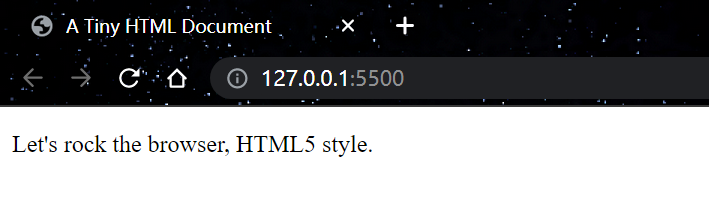
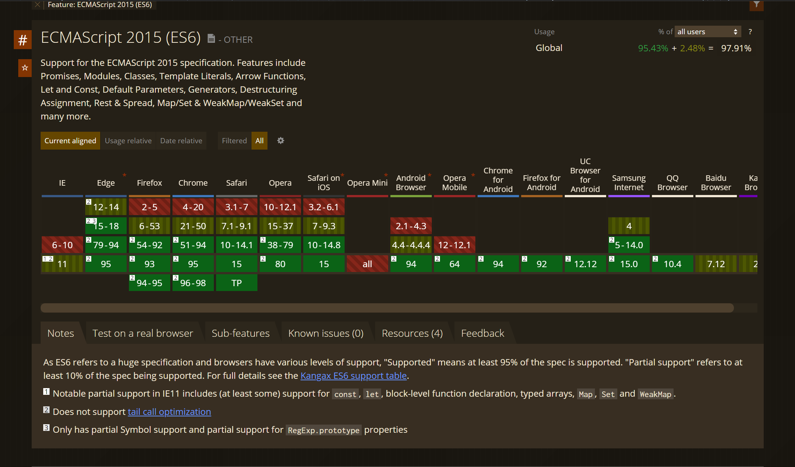
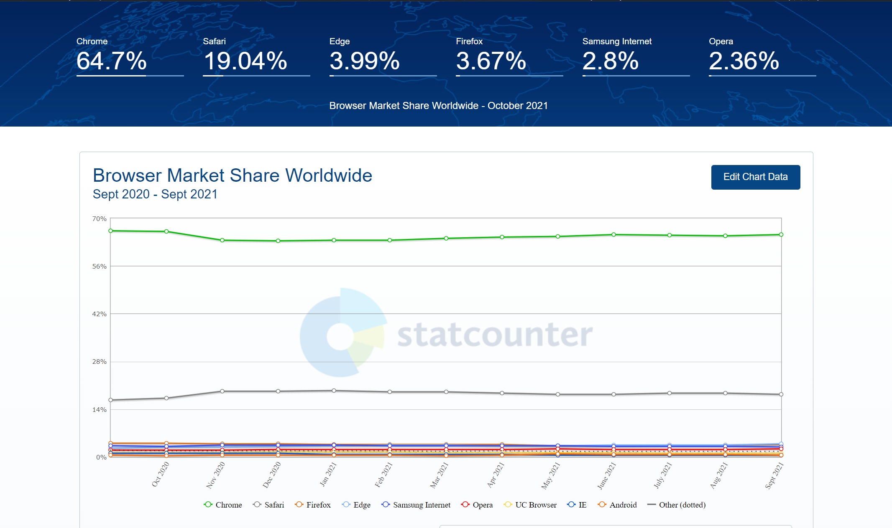

```json
{
  "item": "HTML5 权威指南",
  "priority": 3,
  "span": "1 week",
  "plan": "2 chapter/ 1 day"
}
```

**目录：**

- [1. HTML5 简介](#1-html5-简介)
  - [1.1. HTML5 的故事](#11-html5-的故事)
    - [1.1.1. XHTML 1.0：更严格的标准](#111-xhtml-10更严格的标准)
    - [1.1.2. XHTML 2：意想不到的失败](#112-xhtml-2意想不到的失败)
    - [1.1.3. HTML5：起死回生](#113-html5起死回生)
    - [1.1.4. HTML：活着的语言](#114-html活着的语言)
  - [1.2. HTML5 的三个主要原理](#12-html5-的三个主要原理)
    - [1.2.1. 不破坏 Web](#121-不破坏-web)
    - [1.2.2. 修补牛蹄子路](#122-修补牛蹄子路)
    - [1.2.3. 实用至上](#123-实用至上)
  - [1.3. HTML5 标记初体验](#13-html5-标记初体验)
    - [1.3.1. HTML5 文档类型](#131-html5-文档类型)
    - [1.3.2. 字符编码](#132-字符编码)
    - [1.3.3. 页面语言](#133-页面语言)
    - [1.3.4. 添加样式表](#134-添加样式表)
    - [1.3.5. 添加 JavaScript](#135-添加-javascript)
    - [1.3.6. 最终结果](#136-最终结果)
  - [1.4. HTML5 语法](#14-html5-语法)
    - [1.4.1. 放松的规则](#141-放松的规则)
    - [1.4.2. HTML5 验证](#142-html5-验证)
    - [1.4.3. XHTML 的回归](#143-xhtml-的回归)
  - [1.5. HTML5 元素家族](#15-html5-元素家族)
    - [1.5.1. 新增的元素](#151-新增的元素)
    - [1.5.2. 删除的元素](#152-删除的元素)
    - [1.5.3. 改变的元素](#153-改变的元素)
    - [1.5.4. 调整的元素](#154-调整的元素)
    - [1.5.5. 标准化的元素](#155-标准化的元素)
  - [1.6. 今天开始使用 HTML5](#16-今天开始使用-html5)
    - [1.6.1. 了解浏览器支持情况](#161-了解浏览器支持情况)
    - [1.6.2. 浏览器装机情况统计](#162-浏览器装机情况统计)
    - [1.6.3. 通过 Modernizr 检测功能](#163-通过-modernizr-检测功能)
    - [1.6.4. 使用“腻子脚本”填补功能缺陷](#164-使用腻子脚本填补功能缺陷)
- [2. HTML 基础](#2-html-基础)
  - [2.1. 元素](#21-元素)
    - [2.1.1. 虚元素](#211-虚元素)
  - [2.2. 元素属性](#22-元素属性)
    - [2.2.1. 元素关系](#221-元素关系)
    - [2.2.2. 元素类型](#222-元素类型)
    - [2.2.3. 布尔属性](#223-布尔属性)
    - [2.2.4. 自定义属性](#224-自定义属性)
  - [2.3. HTML 文档](#23-html-文档)
    - [2.3.1. 外层结构](#231-外层结构)
    - [2.3.2. head](#232-head)
    - [2.3.3. body](#233-body)
  - [2.4. HTML 实体](#24-html-实体)
  - [2.5. 全局属性](#25-全局属性)
    - [2.5.1. 选择器属性](#251-选择器属性)
    - [2.5.2. tabIndx](#252-tabindx)
    - [2.5.3. accessKey](#253-accesskey)
    - [2.5.4. contentEditable](#254-contenteditable)
    - [2.5.5. hidden](#255-hidden)
    - [2.5.6. lang](#256-lang)
    - [2.5.7. title](#257-title)
    - [2.5.8. style](#258-style)
    - [2.5.9. draggable](#259-draggable)
- [3. CSS 基础](#3-css-基础)
  - [3.1. 定义和应用样式](#31-定义和应用样式)
    - [3.1.1. CSS 声明](#311-css-声明)
    - [3.1.2. 行内样式](#312-行内样式)
    - [3.1.3. 内部样式表](#313-内部样式表)
    - [3.1.4. 外部样式表](#314-外部样式表)
  - [3.2. 层叠和继承](#32-层叠和继承)
    - [3.2.1. 浏览器样式](#321-浏览器样式)
    - [3.2.2. 用户样式](#322-用户样式)
    - [3.2.3. import](#323-import)
    - [3.2.4. 样式冲突](#324-样式冲突)
    - [3.2.5. 继承](#325-继承)
  - [3.3. 颜色](#33-颜色)
  - [3.4. 长度](#34-长度)
  - [3.5. 其他单位](#35-其他单位)

# 1. HTML5 简介

如果说 HTML 是一部电影，那 HTML5 就是一次大转折。HTML 本来是不会活过 21 世纪的。官方 Web 标准组织 W3C 早在 1998 年就已经对 HTML 撒手不管了。W3C 把未来都寄托在 XHTML 这个更具现代特色的后续标准身上，XHTML 被视为 HTML 的严肃整洁版。 但 XHTML 举步维艰，是一群被剥夺了话语权的人，让 HTML 起死回生并为本书将要探讨的功能奠定了基础。

在本章里，你会了解 HTML 死亡的原因，以及它又是怎样复活的；了解 HTML5 的设计原理与功能；还将见识恼人的浏览器支持问题。在这一章，你将第一次看到真正的 HTML5 文档。

## 1.1. HTML5 的故事

HTML 的基本思想——使用元素为内容添加结构——从 Web 诞生以来就没有变过。事实上，即使是最陈旧的网页，在最新的浏览器中仍然可以得到完美的呈现。

年长和成功也会带来风险，那就是所有人都想取代你！1998 年，W3C 停止了对 HTML 的维护，作为对它的改进，开始制定一个基于 XML 的后续版本——XHTML 1.0。

### 1.1.1. XHTML 1.0：更严格的标准

XHTML 与 HTML 的语法绝大部分都是相同的，只不过要求更严格。很多以前不够严谨的 HTML 标记，在 XHTML 中都变成了不能接受的。

例如，假设你想把标题中的最后一个词标记为斜体，本来应该写：

```html
<h1>
  The Life of a
  <i>Duck</i>
</h1>
```

但你一不小心放错了最后两个标签的位置：

```html
<h1>The Life of a <i>Duck</h1></i>
```

浏览器在遇到这个稍微有点乱的标记之后，能明白你想干什么。于是，它就一声不吭地把最后一个词变成斜体。可是，标签不匹配违反了 XHTML 的规定。如果把页面复制到一个 XHTML 验证器中（或使用 Dreamweaver 之类的网页设计工具时），你就会看到一个警告，告诉你哪里有错误。从 Web 设计的角度看，XHTML 基于严格规则的这种提示很有用，因为你可以发现微小的错误，这些错误会导致在不同浏览器中显示结果不一致（这些错误在编辑和增强页面时还可能导致更严重的问题）。

最初，XHTML 获得了成功。由于厌倦了浏览器的古怪行为和怎么写都可以通过的不正常状态，专业的 Web 开发人员对 XHTML 还是非常拥护的。后来，XHTML 标准又强迫他们养成更好的习惯，同时放弃 HTML 中那些并不完善的格式化功能。可是，与 XML 工具协同，降低自动化程序处理页面的难度，方便地移植到移动平台，以及 XHTML 语言自身的可扩展性等这些预期的好处，从来没有在 XHTML 身上实现过。

即便如此，XHTML 仍然成为最严肃的 Web 设计师所遵循的标准。尽管看起来所有人都挺满意的，但实际上却存在一个潜规则：浏览器虽然理解 XHTML 标记，但却不会严格地按照标准执行错误检查。这就意味着页面仍然可以不遵守 XHTML 规则，浏览器则视而不见。事实上，没有什么可以阻止 Web 开发人员把乱糟糟的标记和陈旧的 HTML 内容混在一起，然后还说这是 XHTML 页面。世界上根本就没有一个浏览器站出来反对这种行为。这种情况让那些负责 XHTML 标准的人深感不安。

### 1.1.2. XHTML 2：意想不到的失败

解决方案就是通过 XHTML 2 来扭转这个乱糟糟的局面。这个新版本规定了严格的错误处理规则，强制要求浏览器拒绝无效的 XHTML 2 页面，同时也摒弃了很多从 HTML 沿袭下来的怪异行为和编码惯例。比如，以编号方式（`<h1>`、`<h2>`、`<h3>`等）区分标题的方法被一个新的`<h>`元素取代，这个元素的重要性取决于它在网页中的位置。类似地，由于允许 Web 开发人员将任何元素转换为链接，`<a>`元素的地位一落千丈。而``元素因为增加了一种提供替代内容的新方式，也丧失了原有的 alt 属性。

这些变化是 XHTML 2 的典型特征。从理论上看，这些改变的目的是让网页更整洁也更有逻辑性。而从实践角度说，这就要求 Web 设计人员必须改变以前编写网页的方式（已经存在的网页必须更新），但付出这些代价却没有增加任何新功能，让这种改变失去了价值。与此同时，XHTML 2 还宣布作废了几个众所周知的元素，比如用于加粗文本的`<b>`、用于变斜体的`<i>`和用于在网页中嵌入另一个网页的`<iframe>`，但这些元素在 Web 设计人员中仍然深得人心。

但最糟糕的，还是慢得要死的制定过程。XHTML 2 的制定过程整整拖了 5 年才完成，开发人员的激情早已荡然无存了。

### 1.1.3. HTML5：起死回生

几乎与此同时，从 2004 年开始就有一群人从另外一个角度展望 Web 的未来。他们想的不是从 HTML 中挑出各式各样的毛病（或者干脆说是主张“不纯粹的哲学观”），而是它还缺少什么 Web 开发人员编码时急需的功能。

归根结底，HTML 最早是作为显示文档的手段出现的。辅之以 JavaScript，它其实已经演变成了一个系统，可以开发搜索引擎、网上商店、在线地图、邮件客户端以及其他各种能够想象得到的 Web 应用。虽然设计巧妙的 Web 应用可以实现很多令人赞叹的功能，但开发这样的应用远非易事。多数 Web 应用都得手动编写大量 JavaScript 代码，还要用到一个或多个流行的 JavaScript 工具包，乃至在 Web 服务器上运行的服务器端模块。要让所有这些方面在不同的浏览器中都能紧密配合不出差错是一个挑战。即使是赢得了挑战，你还要记住把这些方面联系到一起的那些错综复杂的细节。

开发浏览器的人对这种情况特别关注。于是，来自 Opera Software（开发 Opera 浏览器的公司）和 Mozilla Foundation（开发 Firefox 浏览器的组织）的一些具有超前意识的人纷纷建言，希望 XHTML 能加入一些对开发人员更有用的功能。但他们的建议并没有被采纳，结果 Opera、Mozilla 和苹果公司自发地组建了 WHATWG（Web Hypertext Application Technology Working Group，Web 超文本应用技术工作组），致力于寻找新的解决方案。

WHATWG 的目的不是抛弃 HTML，而是考虑以无障碍、向后兼容的方式去扩展它。这个组织最早的工作成果包含两个补充规范：Web Application 1.0 和 Web Forms 2.0。而 HTML5 正是在这两个标准的基础上发展起来的。

注意 HTML5 中的数字 5 表示这个标准是 HTML 的后续版本（在 XHTML 之前，HTML 的版本号是 4.01）。当然，这个解释也不完全正确，因为 HTML5 支持自 HTML 4.01 发布以来的 10 年间出现在网页中的所有新东西，包括严格的 XHTML 风格的语法（只要你愿意就可以用）和大量的 JavaScript 创新。但不管怎么说，这个名字仍然清楚地表明：HTML5 虽然支持 XHTML 的规定，但它要求的则是 HTML 的规则。

2007 年，WHATWG 获得了全球 Web 开发人员空前的支持。痛定思痛之后，W3C 宣布解散负责制定 XHTML 2 标准的工作组，并开始致力于将 HTML5 改造为正式的标准。就这样，最初的 HTML5 被分割成多个容易管理的模块，而本来统称为 HTML5 的很多功能分散到了几个独立的标准中（更多信息，请详见后面的附注栏）。

提示 W3C 官方 HTML5 标准的网址是 http://www.w3.org/TR/html5。

**HTML5 包含哪些功能**

HTML5 包含多个标准，这些标准之间彼此关联。这种局面既好又不好。说好，是因为浏览器可以迅速实现 HTML5 中业已成熟的部分，而任由其他部分继续发展。说不好，则是因为编写网页的人必须检查浏览器是否支持自己想用的功能。本书将会介绍一些检测浏览器的技术，有的很麻烦，有的则没有那么麻烦。

以下列出了 HTML5 涵盖的一些主要功能。

- HTML5 核心。这一部分主要由 W3C 官方的规范组成，涉及新的语义元素（第 2 章和第 3 章）、新的增强的 Web 表单微件（第 4 章）、音频和视频支持（第 5 章）以及通过 JavaScript 绘图的 Canvas（第 8 章和第 9 章）。
- 曾经属于 HTML5 的功能。这一部分源自 WHATWG 最初制定的 HTML5 规范，其中大多数功能需要 JavaScript 且支持富 Web 应用开发。最重要的包括本地数据存储（第 10 章）、离线应用（第 11 章）和消息传递（第 12 章），但本书要介绍的内容还不止这些。
- 有时候会被称为 HTML5 的功能。这些通常是指下一代功能，虽然它们从未进入过 HTML5 标准，但人们还是经常会把它们与 HTML5 相提并论。这部分包括 CSS3（第 6 章和第 7 章）和地理定位（第 13 章）。

甚至连 W3C 都在有意无意地模糊“真正的”HTML5（已有标准）和“宣传用”版本（包括 HTML5 的所有新增部分和补充规范）之间的界限。举个例子，官方 W3C 标志网站（www.w3.org/html/logo）鼓励人们生成用于宣传CSS3和SVG的HTML5标志，而前两个标准在HTML5出现之前就已经在开发了。

### 1.1.4. HTML：活着的语言

从 W3C 到 WHATWG，然后再回到 W3C，这个过程导致了相当罕见的转换与磨合。从技术上说，什么是或什么不是 HTML5 由 W3C 说了算。但与此同时，WHATWG 一直在设计未来的 HTML 功能。直到最近，他们才不再把自己的工作成果称为 HTML5，而是简单地称为 HTML，表明 HTML 还会继续活下去。

因为 HTML 是一门活着的语言，所以 HTML 页面永远不会作废，也不会无法阅读。HTML 页面永远不需要版本号（甚至连文档类型声明都不需要），Web 开发人员也永远不需要为了让它能在新浏览器中运行，而把自己的标记从一个版本“升级”到另一个版本。同样，任何时候在 HTML 标准中都可能增添新功能。

Web 开发人员听到这么说，第一反应通常是大惑不解。毕竟，谁希望浏览器对标准的支持各不相同，而谁又愿意在选择功能时只凭它们将来会得到支持这个可能性呢？然而，冷静下来想一想，大多数 Web 开发人员还是不情愿地接受了这个现实：无论如何，浏览器从 Web 诞生的那一天起始终都是这样的。

前面我们解释过，今天的浏览器乐于接受支持一大堆乱七八糟的功能这个现实。你可以在激进的 XHTML 页面中加上像`<marquee>`元素（用于创建滚动文本，已废弃）这样被认为是倒行逆施的东西，任何浏览器都不会反对。类似地，即便是在对最老标准的支持方面，有些浏览器也仍然存在一些广为人知的遗漏。比如，有些浏览器开发商在完整地支持 CSS2 之前就开始实现 CSS3，结果很多 CSS2 特性后来都没有实现。唯一的区别就是 HTML5 现在把“活着的语言”变成了常规状态。同样，就像我们正在用新的、创新性的一章来介绍 HTML 一样，它经过了一番轮回终于又恢复了它的本来面貌，这不也正是一个天大的讽刺吗？

提示 要了解当下正在发展中的 HTML，包括被称为 HTML5 的部分和少量但始终在变化的、新的、还没有得到支持的功能，请访问http://whatwg.org/html。

## 1.2. HTML5 的三个主要原理

此时此刻，有的读者可能已经按捺不住了，迫不急待地想知道真正的 HTML5 页面到底是什么样子的。不过在此之前，有必要先了解一下制定 HTML5 规范的那些人当时是怎么想的。只有理解了这门语言背后的设计思想，才能真正明白本书将要介绍的那些古怪的行为、复杂的现象和偶尔会让人抓耳挠腮的问题。

### 1.2.1. 不破坏 Web

“不破坏 Web”的意思是标准不应该引入导致已有的网页无法工作的改变。幸运的是，这种事故极少发生。

“不破坏 Web”还意味着标准不应该出人意料地更改规则，不能认定今天还完美无缺的网页到了明天就要作废（即使可以使用也要作废）。比如，XHTML 2 破坏了 Web，因为它要求马上就显著改变以前编写网页的方式。没错，原来的网页还能用，但那都是浏览器支持向后兼容的功劳。如果你为将来打算，想按照最新标准重写网页，就得浪费数不清的时间去纠正 XHTML 2 已经明令禁止的“错误”。

HTML5 的立场不一样。HTML5 之前可以接受的，在 HTML5 中照样可以接受。事实也是，符合 HTML 4.01 标准的网页在 HTML5 中仍然是有效的。

注意 与以往的标准不同，HTML5 不仅向浏览器开发商明示该支持什么，还利用文档说明并规范化了它们原来的处理方式。由于 HTML5 标准描述的都是事实，而不是抛出一堆理想的规则了事，因此它有望成为有史以来受支持程度最高的 Web 标准。

**HTML5 怎么处理废弃元素**

因为 HTML5 支持所有 HTML，所以它支持很多被认为是废弃的功能。其中包括像`<font>`这样的格式化元素，被人厌恶的`<blink>`和`<marquee>`等特效元素，以及难对付的 HTML 框架体系。

这种无所不包的开放性是令很多 HTML5 新手感到困惑的一个原因。一方面，HTML5 无论如何还是应该禁止使用这些过时的元素，因为它们已经很多年没有出现在官方规范里了。另一方面，现代浏览器依然悄无声息地支持着这些元素，而 HTML5 就是要体现浏览器真实的处理方式。那么这个标准到底要怎么做呢？

为解决这个问题，HTML5 规范包含两个独立的部分。第一部分（也是本书将要介绍的）面向 Web 开发人员，要求摒弃过去的那些坏习惯和被废弃的元素。通过使用 HTML5 验证器可以确保遵循 HTML5 标准的这一部分。

第二部分，也是 HTML5 规范中篇幅更长的部分，针对的是浏览器开发商。它们需要支持 HTML 中存在的一切，以做到向后兼容。理想情况下，HTML5 标准中应该包含足够的信息，让人能够据以从头开发一个新浏览器，而且无论是处理新的还是旧的标记，该浏览器都应该能够与今天的现代浏览器完全兼容。这一部分标准就是告诉浏览器如何处理那些官方不鼓励使用但仍然必须支持的废弃元素。

有时候，HTML5 规范也会对浏览器应如何处理各种错误（如漏写或错配了标签）作出正式规定。这一点其实很重要，因为它可以确保有缺陷的页面在不同浏览器中都能够得到同样的处理，甚至都规定了将页面映射为 DOM（Document Object Model，文档对象模型，即内存中表现页面元素的对象树，供 JavaScript 使用）这么细节的问题。为了写出标准的这个冗长又乏味的部分，HTML5 的制定者们在现代浏览器上进行了彻底的测试，以便发现还没有作出规定的错误处理行为。然后再把该行为加到标准中。

### 1.2.2. 修补牛蹄子路

牛蹄子路（cowpath）指的是高低不平但使用频率很高的路，通过它可以从一个地方到达另一个地方。之所以存在牛蹄子路，就是因为有人走。也许这条路走起来不是最舒服的，但某种程度上却是最实际的解决之道。

HTML5 标准化了这些非官方（但广泛应用）的技术。或许与利用新方法修的高速公路相比，牛蹄子路没有那么平坦宽阔，但它赢得胜利的机会更大。因为对于一般的网站设计人员来说，切换到新技术可能会超出他们的能力范围，或者他们根本就没有兴趣。更大的问题在于，使用旧浏览器的访客无法因为新技术而受益。XHTML 2 企图把人们赶出牛蹄子路，结果败得非常惨。

注意 修补牛蹄子路有一个明显的好处：它使用已经得到浏览器某种程度支持的既定技术。假设有一种只被七成浏览器支持的漂亮的新技术，还有一种任何情况都能工作但不那么雅观的 hack，Web 开发人员始终都会选择不那么雅观的 hack，因为它适合更多的用户。

“修补牛蹄子路”的方法也需要折中。有时候，这意味着要包容那些得到广泛支持但设计却很拙劣的功能。HTML5 的拖放就是一个例子（参见 10.3.5 节），这个功能完全以微软为 IE5 设计的拖放机制为基础。尽管这个拖放功能目前得到了所有浏览器的支持，但由于使用起来不灵活而且过度复杂，因此几乎没有人不反感它。为此，不少的 Web 设计人员也抱怨“HTML5 不仅鼓励不良行为，而且还给它们正名。”

### 1.2.3. 实用至上

这个原理很简单：改变应该以实用为目的。改变得越多，代价也就越大。Web 开发人员可能更希望标准是精心设计、始终如一，而且是没有怪异行为的。但这个理由还不足以改变一门已经用来创建了数十亿网页的语言。当然，到底需要不需要改变还是要由某个人根据利害来评判。而现有网页都是怎么做的或者说试图怎么去做，可以作为很好的判断依据。

例如，（在本书写作时）YouTube 是世界上第三受欢迎的网站，但由于 HTML5 之前的 HTML 不真正支持视频，YouTube 一直都得依赖 Flash 插件。使用 Flash 插件没什么问题，因为只要是能上网的计算机，基本上都会安装这个插件。不过也有例外，比如某些公司会锁定它们的计算机，不允许安装 Flash，另外一些移动设备（如 iPhone、iPad 和 Kindle）也不支持 Flash。不管有多少计算机安装了 Flash，扩展 HTML 标准，使其直接支持人们今天使用 Web 的一种最基本方式——看视频，毋庸置疑是有必要的。

而 HTML5 中添加了更多交互功能的背后也有着同样的动机。像拖放、可编辑的 HTML 内容、在 Canvas 中绘制二维图形等，都是同样的情况。这些功能在我们身边的网页中并不鲜见，只不过有的通过 Adobe Flash 或微软 Silverlight 等插件实现，而有的则是利用 JavaScript 库或（更艰苦地）完全通过手工编写 JavaScript 代码来实现。因此，为什么不在 HTML 标准中加入官方的支持，让这些功能在所有浏览器中都能一致地工作呢？HTML5 正是要这么做。

注意 Flash 等浏览器插件不会一夜之间就消失。尽管 HTML5 有很多创新，但通过它来构建复杂的图形界面应用，仍然不是件轻而易举的事。不过，HTML5 的终极目标很清楚：让网站不依赖插件也能够提供视频、丰富的交互功能以及各种漂亮的效果。

## 1.3. HTML5 标记初体验

下面是一个最简单的 HTML5 文档。

```html
<!DOCTYPE html>
<title>A Tiny HTML Document</title>
<p>Let's rock the browser, HTML5 style.</p>
```

开始是 HTML5 的文档类型声明（下一节会详细介绍），然后是页面标题和一些内容。在这里，内容是包含在一个段落中的文本。

想必读者已经知道它在浏览器中是个什么样子了，不过为了验证你的直觉，可以参考图 1-1。



甚至还可以进一步给这个文档瘦身。比如，HTML5 标准不要求必须有最后面那个`</p>`标签，因为浏览器知道在文档后面要关闭所有没有关闭的标签（HTML5 标准规定浏览器必须这样处理）。可是，这种简单的写法会让标记显得很乱，甚至可能导致意料之外的错误。

如果有其他方式提供标题信息，HTML5 标准也允许你省略`<title>`元素。比如，在通过电子邮件发送 HTML 文档时，可以把标题放在邮件的标题中，而把其他标记（文档类型声明以及内容）放在邮件的正文里。不过，这很明显是一种特例。

更常见的情况，则是充实这个已经瘦骨嶙峋的 HTML5 文档。大多数 Web 开发人员都认为使用`<head>`和`<body>`来分块可以避免导致混乱，因为可以把关于页面的信息（头部）与页面的实际内容（主体）分开。在为页面添加脚本、样式表和元数据的时候，这种结构特别实用：

```html
<!DOCTYPE html>
<head>
  <title>A Tiny HTML Document</title>
</head>
<body>
  <p>Let's rock the browser, HTML5 style.</p>
</body>
```

当然，代码中的缩进不是必需的。这里使用缩进就是为了让人一眼就能看清楚页面结构。

最后，还可以选择用`<html>`元素来封装整个文档（不包含文档类型声明那一行）。结果就成了这样：

```html
<!DOCTYPE html>
<html>
  <head>
    <title>A Tiny HTML Document</title>
  </head>
  <body>
    <p>Let's rock the browser, HTML5 style.</p>
  </body>
</html>
```

在 HTML5 以前，所有版本的 HTML 官方规范都要求使用`<html>`元素，而实际上用不用它对浏览器来说是无所谓的。HTML5 则规定可用可不用。

注意 使不使用`<html>`、`<head>`和`<body>`元素只代表一种风格。即便是在 HTML5 诞生之前就已经存在的浏览器中，不用这些元素，页面照样可以完美呈现。事实上，浏览器会自动假设页面中已经包含了这些元素。因此，如果用 JavaScript 来查询 DOM（表示页面中元素的一组对象，可以通过编程方式访问），仍然能够找到`<html>`、`<head>`和`<body>`元素，无论你实际上加了还是没加。

现在，这个示例比最简单的 HTML5 文档复杂一些，但比真正实用的 HTML5 网页又简单一些。接下来的几节，我们会陆续向其中加入新内容，同时也对标记进行简单介绍。

### 1.3.1. HTML5 文档类型

每个 HTML5 文档的第一行都必须是一个特定的文档类型声明。这个文档类型声明用于宣告后面的文档标记遵循哪个标准。以下文档声明表示文档标记遵循 HTML5 标准：

```html
<!DOCTYPE html>
```

HTML5 的文档类型声明给人的第一印象就是极其简单。特别是与冗长的 XHTML 1.0 严格型的文档类型声明相比，这一点更明显：

```html
<!DOCTYPE html PUBLIC "-//W3C//DTD XHTML 1.0 Strict//EN" "http://www.w3.org/TR/xhtml1/DTD/xhtml1-strict.dtd">
```

面对如此复杂的 XHTML 文档类型声明，就连专业的 Web 开发人员也不得不采用复制粘贴的方法。相比之下，HTML5 的文档类型声明简约至上，手工输入也不麻烦。

另外，HTML5 的文档声明还有一点值得注意，那就是它不包含官方规范的版本号（即 HTML5 中的 5）。事实上，这个声明仅仅表明当前页面是 HTML 页面。这与 HTML5 作为一门活着的语言（见 1.1.4 节）的远见是分不开的。换句话说，只要有新功能添加到 HTML 语言中，你在页面中就可以使用它们，而不必为此修改文档类型声明。

由此，不少读者可能都会提出一个问题：既然 HTML5 是一门活语言，那为什么还要求网页中有这个所谓的文档类型声明呢？

要求保留文档类型声明，主要是由于历史原因。如果没有文档类型声明，那大多数浏览器（包括 Internet Explorer 和 Firefox）将转换到一种 **混杂模式(quirk mode)**。

IE5.5 引入了文档模式（document mode）的概念，这个概念是通过切换文档类型声明实现的。最初的两种文档模式是：混杂模式和标准模式。混杂模式会让 IE 的行为与（包含非标准特性的）IE5 相同，而标准模式则让 IE 的行为更接近标准行为。虽然这两种模式主要影响 CSS 内容的呈现，但在某些情况下也会影响到 JavaScript 的解释执行。

在这种模式下，浏览器会尝试根据有点不那么正常的规则呈现网页（那些规则是在浏览器的老版本中使用的）。而问题是，不同浏览器的混杂模式也不一样，因此为一种浏览器设计的页面到了另一个浏览器中，不是字体大小不一样，就是布局上有瑕疵，或者出现其他不一致的问题。

而在添加了文档类型声明后，浏览器就知道你想要使用更严格的 **标准模式(standard mode)**，在这种模式下，所有现代浏览器都会以一致的格式和布局来显示网页。浏览器不关心你使用的是哪种文档类型（个别情况下还有些例外），只要它检查到你有某种文档类型声明就好。HTML5 的文档类型声明是最短的有效文档类型声明，因此它总是能触发标准模式。

提示 HTML5 的文档类型声明可以触发所有具备标准模式的浏览器的标准模式，包括那些对 HTML5 一无所知的浏览器。为此，从现在开始，你可以在任何网页中都使用 HTML5 文档类型声明，即便使用很少得到支持的 HTML5 功能也没问题。

虽然文档类型声明主要的目的是告诉浏览器去做什么，但其他代理也可以检测该声明，比如，HTML5 验证器、搜索引擎、设计工具，还有人——在想知道你当初在页面中想写什么样的标记时。

### 1.3.2. 字符编码

字符编码是一种标准，计算机根据它把文本转换成保存在文档中的字节序列（或者在打开文件时再将字节序列转换成文本形式）。由于历史原因，现有的编码标准有很多种。但实际上，所有英文网站今天都在使用一种叫 UTF-8 的编码，这种编码简洁、转换速度快，而且支持任何你想要的非英文字符。

一般来说，经过配置的 Web 服务器会告诉浏览器它提供的网页采用了什么编码。但除非是你自己配置的 Web 服务器，否则这一步始终是不确定的。由于浏览器在猜测网页编码的时候可能会引发一些说不清的安全问题，因此最好在自己的标记中也加上编码信息。

在 HTML5 文档中添加字符编码信息也很简单。只要像下面这样在`<head>`区块的最开始处（如果没有添加`<head>`元素，则是紧跟在文档类型声明之后）添加相应的`<meta>`元素即可：

```html
<head>
  <meta charset="utf-8" />
  <title>A Tiny HTML Document</title>
</head>
```

Dreamweaver 等设计工具在创建新网页时会自动添加这个元信息，它们也会确保将文件保存为 UTF 编码格式。不过，如果你使用的是简单的文本编辑器，那就还要自己选择将文件保存为正确的格式。比如，使用 Windows 中的记事本程序编写 HTML 页面后，必须在“保存为”对话框下方的“编码”列表中选择“UTF-8”。而在使用 Mac OS 中的 TextEdit 时，首先需要选择“格式 ”
“生成纯文本”，以确保程序将页面保存为纯文本，然后必须再从“保存为”对话框的“纯文本编码”弹出菜单中选择“Unicode(UTF-8)”。

### 1.3.3. 页面语言

指明网页中使用的自然语言是一种好习惯。这个信息有时候对其他人有用，比如搜索引擎可
以通过它来筛选搜索结果，确保只向搜索者返回页面语言与他使用的语言相同的页面。

为给内容指定语言，可以在任何元素上使用 lang 属性，并为该属性指定相应的语言代码（比如，en 表示英语，zh-Hans 表示简体中文）。各国的语言代码可以在这里查到：https://www.w3schools.com/tags/ref_language_codes.asp。为整个页面添加语言说明的最简单方式，就是为`<html>`元素指定 lang 属性：

```html
<html lang="en"></html>
```

如果页面中包含多种语言的文本，那么这个细节信息对屏幕阅读器也是很有用的。在这种情况下，可以为文本中的不同区块指定 lang 属性，指明该区块中文本的语言（例如，可以给包含不同语言文本的`<div>`元素指定不同的 lang 属性）。这样，屏幕阅读器就可以选择朗读适当的文本了。

### 1.3.4. 添加样式表

只要是经过特意设计的专业网站，就一定会使用样式表。指定想要使用的 CSS 样式表时，需要在 HTML5 文档的`<head>`区块中添加`<link>`元素，例如：

```html
<head>
  <meta charset="utf-8" />
  <title>A Tiny HTML Document</title>
  <link href="styles.css" rel="stylesheet" />
</head>
```

这跟向传统的 HTML 文档中添加样式表大同小异，但稍微简单一点。

注意 因为 CSS 是网页中唯一可用的样式表语言，所以网页中过去要求的 type="text/css"属性就没有什么必要了。

### 1.3.5. 添加 JavaScript

JavaScript 最早是为了给网页添加一些闪光点和吸引力才出现的，不过编写起来比较费时间。今天，JavaScript 的主要用途不再是装饰用户界面，而是开发新奇的 Web 应用，包括在浏览器中运行的极其先进的电子邮件客户端、文字处理程序，以及地图引擎。

在 HTML5 页面中添加 JavaScript 与在传统页面中添加差不多，下面就是一个引用外部 JavaScript 代码文件的示例：

```html
<head>
  <meta charset="utf-8" />
  <title>A Tiny HTML Document</title>
  <script src="scripts.js"></script>
</head>
```

没有必要加上 language="JavaScript"属性。浏览器会假定你想要使用 JavaScript，除非你想使用其他脚本语言，因为 JavaScript 是唯一被浏览器广泛支持的 HTML 脚本编写语言，所以你不会指定其他语言。不过，即使是引用外部 JavaScript 文件，也不能忘了后面的`</script>`标签。假如你不写这个标签，或者使用空元素语法想缩短标记，页面将不会执行加载脚本。

如果你在 Internet Explorer 中要花大量时间测试包含 JavaScript 的页面，还应该在`<head>`区块中包含一行特殊的注释，叫做 **Web 标志(mark of the Web)**，参见：：http://msdn.microsoft.com/zh-cn/library/ms537628(v=vs.85).aspx；这行注释要放在指定字符编码的元数据标签后面，如下所示：

```html
<head>
  <meta charset="utf-8" />
  <!-- saved from url=(0014)about:internet -->
  <title>A Tiny HTML Document</title>
  <script src="scripts.js"></script>
</head>
```

这条注释告诉 Internet Explorer 将页面视为从远程网站上下载下来的。否则，IE 会切换到一种特殊的锁定模式，弹出一条安全警告，在你点了“允许阻止的内容”按钮之后才会执行 JavaScript 代码。

其他所有浏览器都会忽略这个“Web 标志”注释，对远程站点和本地文件使用相同的安全设置。

### 1.3.6. 最终结果

```html
<!DOCTYPE html>
<html lang="en">
  <head>
    <meta charset="utf-8" />
    <title>A Tiny HTML Document</title>
    <link href="styles.css" rel="stylesheet" />
    <script src="scripts.js"></script>
  </head>
  <body>
    <p>Let's rock the browser, HTML5 style.</p>
  </body>
</html>
```

虽然这不再是一个最短的 HTML5 文档，但以它为基础可以构建出任何网页。这个例子本身没什么可圈可点之处，不过在下一章创建真实网页的过程中，我们会为内容精心设计布局并通过 CSS 应用样式。

注意 本节介绍的所有 HTML5 语法——新的文档类型声明、声明字符编码的元数据元素、语言信息属性和引用样式表及 JavaScript 标签，同时适用于新旧浏览器。因为这些语法依赖于所有浏览器的默认行为和内置的纠错机制。

## 1.4. HTML5 语法

如前所述，HTML5 放松了某些规则。这是因为 HTML5 的制定者想让这门语言更紧密地反映浏览器的现实。换句话说，他们想缩小“可以工作的网页”与“根据标准是有效的网页”之间的差距。接下来，我们就介绍一下 HTML5 改变的语法规则。

注意 没错，还有很多浏览器支持的老式做法被 HTML5 标准严格排除在外。要想在自己的见面中及时改正这些老毛病，需要用到 1.4.2 节介绍的 HTML5 验证器。

### 1.4.1. 放松的规则

在初次体验 HTML5 文档之后，我们知道 HTML5 并不要求网页中必须包含`<html>`、`<head>`和`<body>`元素（尽管它们的存在有时候非常有用）。但 HTML5 的轻松态度还不止于此。

HTML5 不区分大小写，因此类似下面这样的标记是没有问题的：

```html
<p>
  Capital and lowercase letters
  <em>don't matter</em>
  in tag names.
</p>
.
```

HTML5 还允许省略关闭 **空元素(void element)** 的斜杠；所谓空元素，就是不会嵌套内容的元素，如``（图像）、`<br>`（换行）或`<hr>`（水平线）。以下是三种添加换行的等价方式：

```html
I cannot
<br />
move backward
<br />
or forward.
<br />
I am caught
```

HTML5 也修改属性的语法规则。属性值中只要不包含受限的字符（比如>、=或空格），就可以不加引号。下面这个``元素就利用了这一点：

```html

```

只有属性名没有属性值也可以。虽然 XHTML 要求必须采用如下冗余的语法将复选框设置为选中状态：

```html
<input type="checkbox" checked="checked" />
```

但现在可以只包含属性名，回到 HTML 4.01 时代的传统短语法形式：

```html
<input type="checkbox" checked />
```

对某些人来说，HTML5 最令人担心的还不是这些。他们担心那些经常改变风格的开发人员会在严格的和松散的语法之间摇摆不定，特别是在一个文档内部也经常转换风格。可是，这种情况在 XHTML 时代同样存在。无论是严格还是松散，良好的风格都取决于 Web 设计师，而浏览器则会无条件地接受你扔给它的任何东西。

如果能做到如下几点（也是本书后续示例遵循的约定——尽管不是必须遵循的），基本上就可以算作良好的 HTML5 风格了。

- 包含可选的`<html>`、`<body>`和`<head>`元素。要给页面定义自然语言（见 1.3.3 节），`<html>`是最理想的地方；而`<body>`和`<head>`有助于将页面内容与其他页面信息分离。
- 标签全部小写（如用`<p>`而非`<P>`）。虽然不是必须这么做，但这种形式很常见，输入起来要轻松容易得多（因为不需要按 Shift 键），而且不会让人触目惊心。
- 为属性值加引号。加引号是有理由的——防止你在不经意间犯错。要知道，没有引号的话，一个无效字符就可能破坏整个页面。

不过，还有一些老的约定这里并没有列出来（你也可以忽略）。本书的示例不会关闭空元素，因为在基于 HTML5 编写代码时，大多数人都不屑于添加额外的斜杠（/）。类似地，在属性名与属性值相同的情况下，还一味地留恋长属性的形式也没有什么道理。

### 1.4.2. HTML5 验证

没准儿新的松散的 HTML5 语法让你觉得很舒服。没准儿，一想到欢快的浏览器背后可能隐藏着不一致的、到处都是错误的标记，你简直夜不能寐。如果你不幸是后一种情况，那么一定会高兴听到这个消息：有验证工具可以帮你抓住那些与 HTML5 推荐标准不相符的标记，甚至都不会惊扰浏览器。

以下就是 HTML5 验证器会关注的一些可能的问题：

- 缺少必需的元素（例如`<title>`元素）；
- 有开始标签但没有结束标签；
- 标签嵌套错误；
- 不包含必要属性的标签（例如没有 src 属性的``元素）；
- 元素或内容放错了地方（例如把文本直接放在了`<head>`区块中）。

Dreamweaver 等 Web 设计工具都有它们自带的验证器。如果你嫌麻烦，也可以使用在线验证工具，下面我们展示如何使用 W3C 标准组织提供的流行的验证器。

1. 在浏览器中，打开http://validator.w3.org（图1-2）。


1. 单击相应的选项卡，提供 HTML 内容。

- “Validate by URI”可以验证已经存在的网页。只要在 Address（地址）框中输入页面的 URL 即可（例如http://www.mysloppysite.com/FlawedPage.html）。
- “Validate by File Upload”可以验证你电脑硬盘上的页面。首先，单击 Browse（浏览）按钮（在 Chrome 中单击 Choose File<选择文件>）。在“打开”对话框中，选择 HTML 文件并单击 Open（打开）。
- “Validate by Direct Input”可以验证任何标记——只要在大文本框里输入即可。从文本编辑器中直接把标记复制粘贴到 W3C 验证页面的文本框里是最简单的方式。

在继续之前，可以单击 More Options（更多选项）修改设置，不过一般不用。最好是让验证器自动检测文档类型，因为这样验证器会使用你在网页中指定的文档类型。类似地，除非你的页面中使用了不同的语言，而验证器无法确定正确的字符集，否则就用自动检测好了。

3. 单击 Check（检测）按钮。

这样就会把 HTML 页面发送到 W3C 验证器。稍微等一会儿，就会看到报告。你会看到自己的文档是否通过了验证，而如果失败的话，则会看到验证器检测到的错误。

注意 即便是验证之后没有发现一点问题的文档，验证器也会给出一些警告，包括字符编码是自动检测到的，HTML5 验证服务还处于试验阶段、还不完善，等等。

### 1.4.3. XHTML 的回归

如前所述，HTML5 宣布了上一个 Web 王朝——XHTML 时代的终结。但是，现实可没有那么简单，XHTML 的拥趸也不必放弃上一代标记语言中自己最热爱的东西。

首先，别忘了 XHTML 语法还在呢。XHTML 强制要求的规则要么仍具有指导意义（例如，元素要正确嵌套），要么仍然是一种得到支持的可选约定（例如，空元素可以包含结束的斜杠）。要是想强制使用 XHTML 语法呢？也许你担心自己（或者自己的同事）在不经意间“堕落”到使用过去 HTML 的松散语法。不要紧，可以使用 XHTML5；这个标准还没有多少人知道，其本质是给 HTML5 加上了 XML 的限制。

如果想把一个 HTML5 文档转换成 XHTML5 文档，必须在`<html>`元素中明确添加 XHTML 命名空间、关闭每一个元素、所有标签都要小写……下面就是一个 XHTML5 文档的示例：

```html
<!DOCTYPE html>
<html lang="en" xmlns="http://www.w3.org/1999/xhtml">
  <head>
    <meta charset="utf-8" />
    <title>A Tiny HTML Document</title>
    <link href="styles.css" rel="stylesheet" />
    <script src="scripts.js"></script>
  </head>
  <body>
    <p>Let's rock the browser, XHTML5 style.</p>
  </body>
</html>
```

这样，就可以使用 XHTML5 验证器基于早先的 XHTML 规则对其进行更严格的错误检测了。标准的 W3C 的验证器不行，但可以使用http://validator.w3.org/nu，这个验证器在Preset（预设）下拉列表中提供了XHTML5选项。如果你不是直接输入页面的标记，或者不是把标记粘贴到文本框中，那还需要选上“Be lax about content-type”（不严格要求 content-type）。

按照上述步骤，你可以创建并验证一个 XHTML 文档。可是，浏览器仍然只会将你的页面当成 HTML5 文档来解释，只不过这个文档有意要向 XML 靠拢罢了。除此之外，浏览器不会应用任何规则。

如果你想系统地支持 XHTML5， 还必须配置 Web 服务器， 以 application/xhtml+xml 或 application/xml 的 MIME 类型来提供网页（不能再使用 text/html；有关 MIME 类型请参见 5.3.1 节）。不过，在致电主机托管公司之前，务必清醒地认识到：这一修改会导致 IE9 之前所有版本的 Internet Explorer 均无法显示你的页面。换句话说，真正的 XHTML5 有浏览器兼容性问题。
有时候，即便支持 XHTML5 的浏览器在处理 XHTML5 文档时也会与处理普通的 HTML5 文档有所区别。这些浏览器将它作为 XML 文档处理，如果处理失败（比如因为你有个地方没写对），浏览器就不会再解释文档的其他部分了。

到底什么时候使用 XHTML5？对于绝大多数 Web 开发人员，无论是一般人还是 HTML5 的铁杆粉丝，都没有必要使用 XHTML5，以免招惹麻烦。唯一的例外，就是那些以 XML 作为开发目标的程序员。例如，想要使用 XQuery 和 XPath 等 XML 相关的标准来操作页面内容的开发人员。

提示 对于好奇的读者，我可以告诉你一个技巧，能让浏览器切换到 XHTML 模式——只要把文件的扩展名改为.xhtml 或.xht 即可。然后在硬盘中打开这个文件，多数浏览器（包括 Firefox、Chrome 和 IE9+）都会认为该页面是从 Web 服务器下载下来的，而且 MIME 类型为 XML。如果页面中有什么错误，浏览器窗口会显示只处理了一部分的页面（IE）、XML 错误消息（Firefox）或二者的组合（Chrome）。

## 1.5. HTML5 元素家族

到目前为止，本章集中讨论了 HTML5 语法的变化，但更重要的则是新增、减少及改变了 HTML 哪些支持的元素。接下来的几节将分别讨论这些方面的变化。

### 1.5.1. 新增的元素

在接下来的几章，我们将主要把时间放在学习新元素上，这些元素在此之前从来没有在网页中出现过。表 1-1 列表出这些新元素（以及哪一章包含对相应元素的详细介绍）。

**表 1-1 HTML5 新增的元素**

| 类 别                  | 元 素                                                                                                                             | 哪部分详细介绍                           |
| ---------------------- | --------------------------------------------------------------------------------------------------------------------------------- | ---------------------------------------- |
| 用于构建页面的语义元素 | `<article>`、`<aside>`、`<figcaption>`、`<figure>`、`<footer>`、`<header>`、`<nav>`、`<section>`、`<details>`、`<summary>`        | 第 2 章                                  |
| 用于标识文本的语义元素 | `<mark>`、`<time>`、`<wbr>`（以前就支持，但现在已经正式列入规范）                                                                 | 第 3 章                                  |
| Web 表单及交互         | `<input>`（不是新元素，但增加了很多了类型）、`<datalist>`、`<keygen>`、`<meter>`、`<progress>`、`<command>`、`<menu>`、`<output>` | 第 4 章                                  |
| 音频、视频及插件       | `<audio>`、`<video>`、`<source>`、`<embed>`（以前就支持，但现在已经正式列入规范）                                                 | 第 5 章                                  |
| Canvas                 | `<canvas>`                                                                                                                        | 第 8 章                                  |
| 非英语支持             | `<bdo>`、`<rp>`、`<rt>` `<ruby>`                                                                                                  | HTML5 规范http://dev.w3.org/html5/markup |

### 1.5.2. 删除的元素

HTML5 一方面添加了新元素，另一方面也从官方标准中剔除了少量元素。这些元素仍然可以得到浏览器支持，但任何遵循规范的 HTML5 验证器都会敏感地查出它们的藏身之所，并给出错误提示。

最明显的一点是，HTML5 沿袭了不欢迎表现性元素的思想（最初萌发于 XHTML）。所谓表现性元素，指的是那些仅仅是为网页添加样式的元素，而连最菜的 Web 设计人员也知道那是样式表该干的事儿。被剔除的元素都是专业开发人员很多年没有用过的元素（如`<big>`、`<center>`、`<font>`、`<tt>`和`<strike>`）。HTML 的表现性属性也与之“同归于尽”了，没有什么必要在这里列出来了。

此外，HTML5 进一步埋葬了 Web 开发人员原来已经摒弃的 HTML 框架。最初，HTML 框架似乎是在浏览器窗口中显示多个网页的不错方式，但如今，框架往往意味着严重的可访问性问题，因为它们难以适应搜索引擎、辅助软件和移动设备。而有意思的是，`<iframe>`元素（通过它可以将一个网页放在另一个网页中）倒是侥幸得以保留。究其原因，主要是 Web 应用经常要利用`<iframe>`实现一些集成任务，比如在网页中包含 YouTube 窗口、广告和谷歌搜索框等。

还有另外一些元素，由于冗余或容易导致误会等原因也被剔除了，比如`<acronym>`（代之以`<abbr>`）和`<applet>`（因为`<object>`更好）。但元素家族的绝大部分成员照旧还生活在 HTML5 时代。

注意 HTML5 元素家族中保留的元素超过 100 个。除此之外，差不多有 30 个新元素，还有大约 10 个有显著改变。要了解完整的元素列表（以及哪些是新元素、哪些改变了），请参考 http://dev.w3.org/html5/markup/。

### 1.5.3. 改变的元素

HTML5 还有另一个奇怪的做法：有时候会将一个旧元素用于新的目的。例如，`<small>`元素的用途不再是减少文本字体的大小（这本来应该是样式表的任务）。HTML5 虽然删除了`<big>`元素，但却保留了`<small>`元素，不过含义变了。现在，`<small>`元素表示“附属细则”（small print），比如页面底部没人想让你看到那些法律条款：

```html
<small>
  The creators of this site will not be held liable for any injuries that may
  result from unsupervised unicycle racing.
</small>
```

放在`<small>`元素中的文本仍然照常显示，只不过字体稍小一点，除非你可使用样式表重写它的样式。

注意 人们对`<small>`元素有两种看法。一种看法认为它做到了最大限度的向后兼容，因为老浏览器都支持`<small>`元素，而 HTML5 页面中还将继续支持它。另一种看法认为它会导致旧网页中相应元素的语义变化，过去是用`<small>`元素来减少文本大小，但其中的文本不一定就是“附属细则”之类的。

另一个改变的元素是`<hr>`（horizontal rule，水平线），用于在两个区块间画一条线。在 HTML5 中，`<hr>`表示主题的转换，即从一个主题变为另一个主题。默认的格式还在，只不过又赋予了新的含义。

类似地，`<s>`（struck text，删除的文本）也不仅仅是给文本加一条删除线那么简单了，它现在表示不再准确或不再相关的内容。`<hr>`元素与`<s>`元素的变化都不及`<small>`元素那么大，至少还与它们传统 HTML 中的用法有联系。

**粗体和斜体**

要说最重要的变化，非粗体和斜体这两个格式化元素莫属。XHTML 1.0 诞生后，HTML 中最常用的两个表示粗体和斜体的元素`<b>`和`<i>`部分被`<strong>`和`<em>`元素取代。其背后的思想是停止从格式（粗体和斜体）的角度来看问题，而是要换成使用具有真实逻辑含义（重要或重音）的
元素。这种思想当然很有意义，但`<b>`和`<i>`这两个标签仍然作为 XHTML 新引入的两个标签的简写形式存在着，因为大家对它们更熟悉。

HTML5 尝试解决这个问题。它没有强迫开发人员放弃`<b>`和`<i>`，而是为这两个元素赋予了新的含义。背后的思想就是允许上述 4 个元素在有效的 HTML5 文档中共存，但结果多少让人有点迷惑，下面分别说明。

- 使用`<strong>`表示重要的文本内容，也就是那些需要在周围文本中突出出来的文本。
- 使用`<b>`表示应该用粗体表示的文本，但该文本并不比其他文本更重要。比如，关键字、产品名称等所有需要用粗体表示的文本都可以用这个标签。
- 使用`<em>`表示重读的文本，也就是在朗读的时候要大声读出来。
- 使用`<i>`表示应该用斜体表示的文本，但该文本并不比其他文本更重要。比如，外文单词、技术术语等所有需要使用斜体表示的文本都可以用这个标签。

以下这段代码以适当的方式使用了上述全部 4 个标签：

```html
<strong>Breaking news!</strong>
There's a sale on
<i>leche quemada</i>
candy at the
<b>El Azul</b>
restaurant. Don't delay, because when the last candy is gone, it's
<em>gone</em>
.
```

对 Web 开发人员来说，他们有的会遵循 HTML5 这个善意的规则，有的还是继续使用自己最熟悉的元素去标粗体和斜体格式。

### 1.5.4. 调整的元素

HTML5 也调整了一些元素的使用规则。要说啊，这些调整只有那些死钻 HTML 的家伙才会注意到，但偶尔也会产生比较大的影响。举一个例子，不太常用的`<address>`元素并不适合标注邮政地址（尽管 address 是“地址”的意思）。实际上，这个元素只有一个目的，即提供 HTML 文档作者的联系信息，比如电子邮件地址或网站链接：

```html
Our website is managed by:
<address>
<a href="mailto:jsolo@mysite.com">John Solo</a>,
<a href="mailto:lcheng@mysite.com">Lisa Cheng<a>, and
<a href="mailto:rpavane@mysite.com">Ryan Pavane</a>.
</address>
```

再比如，`<cite>`元素的含义也不一样了。当然，像下面这样引用某些作品（如新闻、文章、电视节目）还是可以的：

```html
<p>
  Charles Dickens wrote
  <cite>A Tale of Two Cities</cite>
  .
</p>
```

可是，现在用`<cite>`去标注人名已经不对了。这个变化最终导致了令人意想不到的争议，因为以前是可以这么用的。一些“骨灰”级的 Web 开发人员公开发表言论，鼓动人们不用遵守`<cite>`的新使用规则。这可真让人有点匪夷所思，毕竟你一辈子能在编辑网页的时候看见几回`<cite>`元素啊？

对用于创建链接的`<a>`元素的调整幅度相对更大一些。HTML 以前的版本允许用`<a>`元素来标注可以单击的文本或图像。而在 HTML5 中，可以在`<a>`元素中放置任何东西；就是说，你在里面放上一大段文字、一个列表、几幅图像……都没有问题。（如果你真这么做，那就会发现里面的所有文本都会变成蓝色并带有下划线，而图像则会产生蓝色的边框。）Web 浏览器支持这种做法已经有很多年了，HTML5 只不过是把这种行为写进了规范，即便这种用法没什么大用处，但毕竟已经列入了标准。

还有一些调整在目前所有浏览器中都还未得到支持。例如，`<ol>`元素（有序列表）现在有了一个 reversed 属性，用于反转序号（直到 1 或其他通过 start 属性设置的正序时的起始值）。不过，这个属性目前只有 Chrome 和 Safari 支持。

在学习本书的过程中，我们还会陆续介绍其他一些被调整了使用规则的元素。

### 1.5.5. 标准化的元素

HTML5 还把一些浏览器实际支持，但并没有得到之前的 HTML 或 XHTML 规范承认的元素加入了标准。其中最广为人知的一个元素就是`<embed>`，这个元素在目前的网页中得到了普遍使用，成为了一种向页面中加入插件的通用方法。

另一个新元素是`<wbr>`，表示可以在某处断行。换句话说，如果某个词太长了，一行放不下，那浏览器就会在`<wbr>`标注的地方断开：

```html
<p>
  Many linguists remain unconvinced that
  <b>
    supercali
    <wbr />
    fragilistic
    <wbr />
    expialidocious
  </b>
  is indeed a word.
</p>
```

如果需要在小空间（如表格单元或小方块）里放长名字（比如编程语言中的变量名），可以用`<wbr>`来标注可以在名字的什么地方断行。不过，即使浏览器支持`<wbr>`，它也只会在相应空间盛不下长名字时才会断行。

说到`<wbr>`，难免会让人想起类似的`<nobr>`元素，后者用于阻止文本换行，可用空间再小也不行。但 HTML5 认为`<nobr>`已经不合时宜，建议所有自重的 Web 开发人员不要再使用它了。要想达到同样的效果，可以在 CSS 中使用 white-space 属性，将它的值设定为 nowrap。

## 1.6. 今天开始使用 HTML5

在使用 HTML5 之前，必须知道你的用户浏览器对它的支持情况。毕竟，我们希望得到的是一个耀眼的新页面，而非一堆混乱的标记和遇上过时浏览器就错误百出的脚本。

稍后，我们会介绍怎么知道 HTML5 的哪个具体功能得到了哪些浏览器的支持，以及你的用户中有多大比例在使用这些浏览器。不过，在此之前，我们先概括一下 HTML5 当前受支持的情况。

- 如果你的用户使用流行的 Chrome 或 Firefox，总体来说问题不大。这两款浏览器不仅已经支持 HTML5 很多年了，而且都能够自动升级。换句话说，不大可能有这两款浏览器的老版本存在。
- 如果你的用户使用 Safari 或 Opera，那也还好。这两款浏览器同样支持 HTML5 很多年了，同样也没有多少老版本用户。
- 如果你的用户使用平板电脑或智能手机，那可能某些功能会有一些限制，本书后面还会介绍到。不过，所有今天的移动浏览器在设计时都会考虑支持 HTML5，因此你的网页偶尔可能出现点问题，但总体还可以接受。
- 如果你的用户使用旧版本的 IE，也就是 IE10 之前的任何版本，那大多数 HTML5 功能都将无法使用。问题在哪儿呢？因为如今很多旧版本 Windows 仍然常见，这些操作系统都预装了旧版本 IE。更糟糕的是，很多旧版本 Windows 会阻止用户升级到现代的支持 HTML5 的 IE。比如 Windows Vista 只允许用户使用 IE9，而在令人谈之色变的 Windows XP 上则只能用 IE8。

并非微软想要阻挠 Web 的发展，而是新版本 IE 都是针对新硬件设计的。换句话说，新软件放到旧硬件上就是不能运行。然而，使用旧版 Windows 的用户还可以选择 Firefox 替代 IE，只不过有人不知道怎么安装 Firefox，或者不被允许这么干罢了。

注意 目前（2021 年 11 月）微软已经宣布要逐渐放弃了对 IE 的维护转至新的 Edge 浏览器，截至日期为 2022 年 6 月 15 日，。目前桌面浏览器的市场占有率排名为：Chrome 64.7%，Safari 19.04%，Edge 3.99%，Firefox 3.67%，Samsung Internet 2.8%，Opera 2.36%。

因此将来考虑到适配 IE11 浏览器或更老的浏览器的情况会逐渐减少。虽然如此，如果你依然希望适配 IE11 以前的浏览器，你可以使用 **腻子脚本(polyfill)** 等等。

### 1.6.1. 了解浏览器支持情况

到底能使用哪些 HTML5 的功能，最终还是由浏览器开发商说了算。如果它们不支持某个功能，无论标准里怎么说，最终还是不能用。今天，主流的浏览器差不多有四五个（不包括智能手机、平板电脑等能上网的设备中的移动浏览器）。作为个体，没有几个 Web 开发人员能自己完全测试每个浏览器的每一项功能，更不用说检测那些还被很多人使用的老浏览器的支持情况了。

好在，有一个 Can I use 网站可以帮我们。这个网站可以详细地列出每一款主流浏览器对 HTML5 的支持情况。更重要的是，它还能让你针对实际需要的功能查询浏览器。下面是这个网站的使用指南。

(1) 在浏览器中打开 http://caniuse.com。可以看到，主页面中有很多分了组的链接，如CSS、HTML5，等等。
(2) 选择你想了解的功能。

找到功能的最简单方法，就是在顶部的搜索框里输入并搜索。

或者，也可以通过点击首页中的链接来查询某一功能。比如，HTML5 链接组是 HTML5 标准中规定的功能；JS API 组是那些依赖 JavaScript 的功能，这些功能一开始属于 HTML5，但后来又被剥离了出来；而 CSS 组是属于 CSS3 的功能。

提示 点击每个组的链接，比如 HTML5 或 JS API，可以一次性查看所有功能的受支持情况。

(3) 查看结果（图 1-4）。



在每个功能的表格中，都会包含一组不同的浏览器版本。表格中用单元格的颜色表示对功能的支持情况：红色表示不支持，浅绿色表示支持，橄榄绿色表示部分支持，灰色表示不确定（一般是因为浏览器的当前版本还在开发过程中，相应功能还没有加入）。
(4) 查看更多浏览器细节。
起初，这个支持表格只包含流行浏览器的最新版本。而通过调整，也可以让它包含其他浏览器的支持情况，比如 IE10 或 Android 版移动 Firefox 浏览器。

### 1.6.2. 浏览器装机情况统计

怎么知道应该关注哪个浏览器版本呢？浏览器采用情况统计可以告诉你，有多少用户的浏览器支持你想使用的功能。为此，可以查看流行的流量跟踪站点 GlobalStats，用法如下。

(1) 在浏览器中打开 http://gs.statcounter.com。
打开网站后，可以看到一个折线图，显示着最近几年常用的浏览器。但此时的图表不包含版本信息，从中也看不出来有多少人还在使用 IE 的那些问题版本（IE10 之前的版本）。要看到这些信息，还要调整设置。
(2) 找到 Stat 链接（图表左下方），点击打开设置项，选择 Brower Version（Combine Chrome&Firefox）。

这样，不仅可以看到目前正在使用的浏览器，也能看到使用的是它们的哪个版本。组合 Chorme 和 Firefox，是因为这两款浏览器更新太快，这样可以减少十几条折线，让图形简单直观（图 1-5）。



(3) 在 Region 中选择地理区域。
默认设置是全球（Worldwide），即全世界的使用统计信息。可以在这里选择具体的国家（如 Bolivia）或地区（如 North America）。
(4) 在 Period 中选择日期范围。
一般来说，我们会关注一整年的浏览器使用率变化情况。但如有必要，也可以选择更短的时间范围，比如过去的三个月。
(5) 使用图表右侧的选项按钮切换图表类型。
选择 Line，就是以折线图显示浏览器使用率随时间推移的变化情况。选择 Bar，就是以柱形图显示当前浏览器使用率。选择 Map，则以彩色地图显示某地区使用率最高的浏览器。GlobalStats 每天都通过它遍布数百万网站的跟踪代码来生成统计信息。虽然涉及的页面量巨大，数据量也非常大，但总归还是整个 Web 的一小部分。换句话说，你不能假定自己的网站访客都使用相同的浏览器。

更进一步，浏览器装机份额还会随用户所在国家和网站类型而变化。比如，德国 40%以上的用户使用 Firefox，位居第一。在访问 TechCrunch 网站（计算机极客最喜欢的新闻网站）的用户中，使用旧版本 Internet Explorer 的非常少。所以说，要想设计符合自己用户需求的网站，就必须以你自己的页面生成的统计信息作为依据。（如果你还没有在自己的站点中使用网页跟踪服务，我推荐你使用最好用而且免费的 Google Analytics：www.google.com/analytics。）

### 1.6.3. 通过 Modernizr 检测功能

检测功能是应对浏览器支持差异的一个重要策略。典型的模式是：加载页面，通过 JavaScript 脚本检测某个具体的功能是否可用。然后，可以对用户给出提示（最衰的做法）、平稳退化到没那么花哨的版本（稍好一些），或者采用其他方法实现浏览器本该支持的 HTML5 功能（最佳）。

遗憾的是，由于 HTML5 本质上是一个松散的相关标准的集合，因此不可能通过一次测试就能验证所有功能。相反，为了检测不同的功能，必须分别运行各种不同的测试——甚至，有时候还会测试浏览器是否支持某项功能的某个部分，而测试速度会非常快。

检测支持通常需要检查某个可编程对象的属性，或者创建一个对象并以特定的方式使用它。不过，在按照这种思路编写测试代码之前，一定要三思而行；因为弄不好，可能会非常麻烦。比如，由于种种原因，你的测试代码在某些浏览器上总是失败，或者过不了多久，又要重写测试代码。所以，我建议你使用 Modernizr（http://www.modernizr.com），它是一个小巧的、持续更新的工具，专门用于测试浏览器对很多HTML5及相关功能的支持情况。如果你想使用新的CSS3功能，本书6.1.3节还将介绍一个实现后备支持的绝妙技巧。

### 1.6.4. 使用“腻子脚本”填补功能缺陷

Modernizr 可以帮你找出浏览器支持上的缺陷。它会在某个功能不可用时提醒你，但除此之外不会帮你弥补这些缺陷。而这正是我们要介绍的 **腻子脚本(polyfill)** 的用途所在。从根本上说，腻子脚本就是一大堆五花八门的技术，目的就是填平旧浏览器对 HTML5 支持上的缺陷。英文单词 polyfill 源自英国的一种腻子粉，而腻子粉就是在刷墙漆之前用来填补墙面裂缝和漏洞的（腻子粉在美国叫 spackling paste）。在 HTML5 中，理想的腻子脚本可以直接放到页面中使用，不必多做额外的工作。然后，这些脚本就能无缝地保持向后兼容，而且一点都不唐突，让你在其他人苦思冥想变通方案时就能用上纯粹的 HTML5。

不过，腻子脚本并不完美。有些腻子脚本依赖的技术同样得不到普遍支持。例如，有一个“腻子脚本”可以通过 Silverlight 插件在老版本的 Internet Explorer 中模拟 HTML5 的画布。而假如访客不愿意安装 Silverlight，那你还得考虑一种后备方案。还有一些腻子脚本实现的功能比 HTML5 规定的功能少一些，或者性能上要差一点。

有时候，本书会告诉你某个腻子脚本可以考虑。假如你想了解更多的信息，可以在 GitHub 上找到最相关的信息，乃至各种 HTML5 腻子脚本的完整集合，页面地址为：http://tinyurl.com/polyfill。不过我还要提醒一句：这些腻子脚本在品质、性能和支持等方面有着非常大的差异。

提示 光知道针对 HTML5 的某项功能有一个腻子脚本还不够。在自己的网站中实际地使用它们之前，必须先在各种老浏览器上测试，事先掌握它们的实际运行效果。

# 2. HTML 基础

开发人员多少都知道一点 HTML。近年来它的身影随处可见，即便是那些从不需要写 HTML 代码的人，也可能见过一些。为了让读者打好基础，本章将回头介绍 HTML 的基本知识：HTML 的目标和其工作原理。我会解释一些 HTML 中的基本术语，并且介绍一些几乎所有网页都要用到的核心元素。

顾名思义，HTML 是一种标记语言。其标记以应用于文档内容（例如文本）的元素为其存在的形式。在后面的各节中，我会解释各种 HTML 元素的区别，以及使用各种属性配置这些元素的方法，并且介绍一系列可用于所有 HTML 元素的属性，称为全局属性。

## 2.1. 元素

以下是一个文本内容使用了 HTML 元素的例子：

```html
我正在深入学习
<i>HTML</i>
。
```

这个例子中，我们使用`i`标记了 HTML，使它变为斜体显示。`<i>HTML</i>` 整体为一个 **HTML 元素(HTML Element)**。具体来讲，几乎每一个元素（不是所有的元素）都分为三部分：开始标签（`<i>`），结束标签（`</i>`），和 **元素内容(Element Content)**（HTML）。其中开始标签和结束标签称为 **标签(tag)**。

元素使得浏览器可以根据标签来具体显示被标签包裹起来的内容。不同的标签使得内容有不同的显示效果。例如，`<i>` 标签使得文本斜体显示。

HTML 规定标签名不分大小写，大写和小写标签，对内容的显示效果是相同的。例如：`<I>HTML</I>` 和 `<i>HTML</i>` 的显示效果是相同的。但是最为推荐的标记风格是全部使用小写，这样更为方便，也更加统一。

HTML 规定了各式各样的标签，它们在 HTML 文档中起着不同的作用。`<i>` 标签是文本标签的一个例子。

标签应用在内容上改变内容的显示方式，这种想法在如今受到强烈的反对。现在的观点是标签应用在内容上只可以说明内容的含义或者文档结构，然后使用 CSS 来控制内容的显示，这样便可以做到 HTML 和 CSS 的松散耦合。

基于这些反对，HTML5 引进了很多的 **语义元素(Semantic Element)**，语义元素就是只用来说明内容的含义或者文档结构的，它们不会对内容的显示产生影响。例如，`<nav>` 只用来说明所标记内容表示一个导航链接，不会对 `<nav>` 标签包含的内容的显示产生影响。

虽然 HTML5 引入了很多的语义元素，但大部分以前的那些影响内容显示的标签并没有被废弃，你依然可以使用那些标签。

### 2.1.1. 虚元素

我们刚才说过，并不是所有的元素都包含：开始标签，内容，以及结束标签，实际上，有一种元素只包含一个结束标签，这种元素被称为 **虚元素(Void Element)**。例如，`</hr>` 就是这样一个例子，使用这个元素，会显示一条横线，用来表示内容的分隔。

虚元素并不是一定要用结束标签表示，事实上，你还可以使用开始标签表示。但是为了规范起见，我们推荐使用结束标签。

## 2.2. 元素属性

HTML 元素内可以使用 **属性(Attributes)**。具体来说，你可以在一个元素的开始标签里，使用 `键=值` 来补充这个元素的信息。

来看下面一个例子：

```html
<button id="btn">点击我！</button>
```

这个例子中，button 元素的开始标签里多了一个 `id="btn"`，这相当于指定了这个 button 元素的 id 为值："btn"。

元素的属性只能用在开始标签内，不能用于结束标签。属性值必须使用双引号包含起来，你也可以使用单引号，不过并不推荐。

有些属性可用于所有的 HTML 元素，这些属性称为 **全局属性(Global Attributes)**。而有一些属性只能用于特定的元素，这些属性称为 **局部属性(Local Attributes)**。本书后面
的章节会具体讲解。

一个元素可以使用多个属性，这些属性用空格分开。来看下面一个例子：

```html
<input type="text" name="userName"></input>
```

这个例子中，input 元素使用了 2 个属性：type 和 name。type 用来指定 input 的类型，这里 `type="text"` 指定这个 input 元素为文本类型。name 属性用来指定 input 的名称，这个名称在用 JavaScript 获取这个 input 的时候会用到。

这个例子中，input 元素开始标签内的 autofocus 属性并没有值，我们只是简单地写上了 autofocus，这也当然是可以起到效果的。autofocus 可以自动将焦点转移到 input 元素上。

### 2.2.1. 元素关系

HTML 文档中的元素之间有着明确的关系。如果元素 a 包含了元素 b，那么 b 是 a 元素的 **子元素(child)**，或者说 a 是 b 元素的 **父元素(parent)**。如果元素 a1 和 a2 在并列位置，那么称 a1 和 a2 为 **兄弟元素(sibling)**。

不是任何元素都可以成为某一个元素的子元素，这是有限制的。这种限制取决于父子元素的类型。除此之外，CSS 和 DOM 都会用到元素关系。

### 2.2.2. 元素类型

HTML 规范将元素分为 3 大类：**元数据元素(Metadata Element)**，**流元素(Flow Element)** 和 **短语元素(Phrasing Element)**。

元数据元素描述了文档的元数据信息，向浏览器提供了如何处理文档。

另外两种类型的元素的主要用途就是确定一个元素的合法子元素。短语元素是 HTML 文档的基本组成。流元素是短语元素的超集。

有些元素无法归入上述三种类型，这些元素要么没有什么特别的含义，要么只能用在一些非常有限的情况下。li 元素就是受限元素的一个例子。它表示列表项，只能有三种父元素： ol（表示有序列表）、ul（表示无序列表） 和 menu（表示菜单）。

### 2.2.3. 布尔属性

有些属性不需要一个值，只需写上属性键即可。这种属性称为 **布尔属性(Boolean Attributes)**。

来看一个例子：

```html
<input type="text" name="userName" autofocus></input>
```

### 2.2.4. 自定义属性

除了 HTML 内置的元素属性外，开发者可以自定义属性，这些自定义属性的键必须以 `data-` 开头。

例如：

```html
<article
  id="electric-cars"
  data-columns="3"
  data-index-number="12314"
  data-parent="cars"
>
  ...
</article>
```

这个例子中，有 3 个自定义属性：data-columns，data-index-number，data-parent。它们可以指定这个 article 元素的所在列，索引号，以及父元素信息。

自定义属性配合 JavaScript 非常方便。

## 2.3. HTML 文档

HTML 元素是 HTML 文档的构成单位。通过各式各样的元素的重复，嵌套，最终形成了 HTML 文档，也就是网页。但 HTML 文档一般有约定俗称的结构。

下面展示了一个通用的 HTML 文档结构：

```html
<!DOCTYPE html>
<html lang="zh-Hans">
  <head>
    <meta charset="utf-8">
    <title>文档</title>
  </head>
  <body>
    一段文本。
  <body>
</html>
```

下面的章节我们会一步步介绍。

### 2.3.1. 外层结构

HTML 文档的第一行是文档类型声明：`<!DOCTYPE html>`。这个元素表示这个文档是 HTML5 的 HTML 文档。在历史上，具有同等地位的还有其他一些标记语言，文档中可能会混合使用多种标记语言。但如今 HTML5 已经成为占绝对优势的标记语言，即使在文档中省略 DOCTYPE，绝大多数浏览器仍然假定处理的是 HTML5 文档。但是写上总是保险的做法。

紧接着文档类型声明的是 html 元素，html 元素用于包含 head 和 body 元素，使得文档声明和文档分隔清楚。

### 2.3.2. head

**元数据元素(meta-data Element)** 用来描述文档的信息，并不是文档的内容。所有的元数据元素都被放在 head 元素内部。例如 `<meta charset="utf-8">` 指定文档的字符集为 utf-8。

head 内常用的还有 title 元素，用来指定网页标签页的标题。除此之外，link 元素用来指定文档需要的外部链接信息，如 `<link rel="stylesheet" href="main.css">` 指定了文档的外部样式表。style 和 script 元素用来指定内联的层叠样式表和脚本。

### 2.3.3. body

head 元素用来放置文档元信息元素，而 body 元素放置的元素就是文档实际的内容。

我们编写 HTML 文档实际上大部分都在编写 HTML 文档的内容。因此都是在 body 元素内部编写的。

## 2.4. HTML 实体

从本章的例子中可以看到，HTML 文档中有些字符具有特殊含义最明显的是<和>这两个字符。有时需要在文档内容中用到这些字符，但不想让它们被当做 HTML 处理。为此应该使用 **HTML 实体(HTML entity)**。实体是浏览器用来替代特殊字符的一种代码。下表列出了一些常用实体。

| Result       | Description | Entity Name | Entity Number |
| ------------ | ----------- | ----------- | ------------- |
| non-breaking | 空格        | &nbsp;      | &#160;        |
| <            | 小于        | &lt;        | &#60;         |
| >            | 大于        | &gt;        | &#62;         |
| &            | 和          | &amp;       | &#38;         |
| "            | 双引号      | &quot;      | &#34;         |
| '            | 单引号      | &apos;      | &#39;         |
| ©            | 版权        | &copy;      | &#169;        |
| ®            | 注册商标    | &reg;       | &#174;        |

每个特殊字符都有一个实体编号，可以用来在文档内容中代表该字符。例如，字符 & 的实体编号是&#38;。特别常用的特殊字符还有对应的实体名称。例如，对于浏览器来说，&#38 和 &amp 是相同的。

## 2.5. 全局属性

前面讲过全局属性可以用于所有的 HTML 元素，本节涉及了一些常用的全局属性。

### 2.5.1. 选择器属性

class 和 id 属性可以标记元素的类别和唯一标识符。这在 CSS 选择器以及 JavaScript 中获取和选择元素非常有用。

class 和 id 属性的唯一区别就是 class 属性可以标识一类元素，而 id 属性只可以标识一个元素。

### 2.5.2. tabIndx

tabIndex 全局属性可以指定使用键盘上的 Tab 键转移焦点索引。例如：

```html
<body>
  <button tabindex="-1">点击我！</button>
  <label>
    User Name
    <input type="text" tabindex="1" />
  </label>

  <label>
    Password
    <input type="password" tabindex="2" />
  </label>
</body>
```

在这个例子中，我们为 button 设置了 tabIndex 为 -1，这就意味着 button 不能通过 tab 键转移到焦点。而其他两个 Input 分别设置了 tabIndex 为 1 和 2，这样在用 tab 切换焦点时，我们就可以先切换到用户名字段，再到密码字段。

### 2.5.3. accessKey

accessKey 为元素设置了焦点键盘快捷键。用户可以通过键盘快捷键将焦点方便地转到元素。不同地浏览器快捷键可能不同，详情参考[这篇文章](https://developer.mozilla.org/en-US/docs/Web/HTML/Global_attributes/accesskey)。Chrome 浏览器可以使用 Alt + accessKet 的方式。

例如：

```html
<!DOCTYPE html>
<html lang="zh-Hans">
  <head>
    <meta charset="utf-8">
    <title>Doc</title>
  </head>
  <body>
    <button accesskey="u">上传</button>
    <button accesskey="s">提交</button>
  <body>
</html>
```

这个 html 设计了两个按钮分别带有 accessKey 为 "u" 和 "s"。用户可以通过 Alt + U 将焦点快捷地转到上传按钮上。

### 2.5.4. contentEditable

contentEditable 是 HTML5 新增的属性，这个属性设计的目的是富文本编辑。这个属性可以将一个元素变为可编辑状态。
这个属性往往要配合 document.execCommand() 方法以实现富文本编辑。

MDN 的[这篇文章](https://developer.mozilla.org/en-US/docs/Web/Guide/HTML/Editable_content) 中实现了一个复杂的富文本编辑器。效果如下：


### 2.5.5. hidden

全局属性 hidden 是一个布尔属性，表示一个元素尚未或者不再相关。例如，它可以被用来隐藏一个页面元素直到登录完毕。如果一个元素设置了这个属性，它就不会被显示。

hidden 属性不能用于隐藏那些可以在其它板块中合理显示的内容。 例如，用 hidden 属性去隐藏一个选项卡对话框种的面板是不正确的，因为选项卡界面只不过是溢出显示的一种——一个可以等量于一个只显示所有 form 表单控件的拥有滚动条的大页面。类似地，用 hidden 属性在某个特定板块中隐藏一部分内容也是不正确的，——如果某些内容被标记为隐藏，它将从所有版块中隐藏,包括例如屏幕阅读器.

隐藏元素不应与非隐藏元素链接，作为隐藏元素的后代的元素仍然是活动的，这意味着脚本元素仍然可以执行，表单元素仍然可以提交。

比如说，用 href 标签链接到一个带有 hidden 标签的区块是不对的。 如果这个区块和这个页面不相干，或者这个区块不适用于这个页面，那没有任何理由需要链接到它。

不过，你还是可以使用 ARIA aria-describedby 标签去引用本身是隐藏的一些描述。

类似的，你也可以将一个带有 hidden 标签的 canvas 元素作为屏幕外的缓存区域，或者在表单控件中引用一个已经隐藏的表单。

```html
<!DOCTYPE html>
<html lang="en">
  <head>
    <meta charset="UTF-8" />
    <meta http-equiv="X-UA-Compatible" content="IE=edge" />
    <meta name="viewport" content="width=device-width, initial-scale=1.0" />
    <title>Document</title>
  </head>
  <body>
    <div id="target">隐藏文字</div>
    <button id="btn">切换隐藏</button>
    <script>
      const target = document.querySelector('#target');
      const btn = document.querySelector('#btn');

      btn.addEventListener('click', () => {
        if (target.hasAttribute('hidden')) {
          target.removeAttribute('hidden');
        } else {
          target.setAttribute('hidden', 'hidden');
        }
      });
    </script>
  </body>
</html>
```

上面的代码中，通过切换隐藏按钮可以将 div 在隐藏和不隐藏之间切换。

### 2.5.6. lang

lang 全局属性参与了元素语言的定义。这个语言是不可编辑元素写入的语言，或者可编辑元素应该写入的语言。标签包含单个条目，值的格式由 用于定义语言的标签 (BCP47) IETF 文档定义。如果标签的内容是空字符串，语言就设为未知。如果标签内容是无效的，根据 BCP47，它就设为无效。

通常在 html 元素上添加 lang 属性可以为整个网页指定语言，你也可以在单独的块上添加 lang 属性，这样语言效果只局限于这个块。

```html
<html lang="zh-Hans"></html>
```

### 2.5.7. title

title 全局属性 包含了表示咨询信息文本，和它属于的元素相关。这个信息通常存在，但绝不必要，作为提示信息展示给用户。一些典型用例：

链接：被链接文档的标题或描述
媒体元素，例如图像：描述或关联信息
段落：脚注或者相关的评论
引用：作者信息，以及其他
如果省略了这个属性，就意味着这个元素的最近祖先的标题仍然是相关的（并且可以用作元素的提示信息）。如果这个属性设为空字符串，它就明确意味着，它的最近祖先的标题是不相关的（并且不应用于这个元素的提示信息）。

### 2.5.8. style

style 全局属性可以为单个元素指定它的样式，这种指定样式的方式优先级更高。

例如：

```html
<!DOCTYPE html>
<html lang="en">
  <head>
    <meta charset="UTF-8" />
    <meta http-equiv="X-UA-Compatible" content="IE=edge" />
    <meta name="viewport" content="width=device-width, initial-scale=1.0" />
    <title>Document</title>
    <style>
      #target {
        background-color: pink;
      }
    </style>
  </head>
  <body>
    <span id="target" style="background-color: skyblue;">一段文本</span>
  </body>
</html>
```

在这个例子中，div 的背景颜色为天蓝色而不是粉红色。

### 2.5.9. draggable

全局属性 draggable 是一个枚举类型的属性，用于标识元素是否允许使用 拖放操作 API (en-US) 拖动。它的取值如下：

true，表示元素可以被拖动
false，表示元素不可以被拖动
如果该属性没有设值，则默认值 为 auto ，表示使用浏览器定义的默认行为。

这个属性是枚举类型，而不是 布尔类型 。这意味着必须显式指定值为 true 或者 false ，像 `<label draggable>Example Label</label>` 这样的简写是不允许的。正确的用法是 `<label draggable="true">Example Label</label>`。

默认情况下，只有已选中的文本、图片、链接可以拖动。对其它的元素来说，必须按拖动机制的顺序设置 ondragstart 事件才能正常工作。

```html
<p
  draggable="true"
  ondragstart="event.dataTransfer.setData('text/plain', 'This text may be dragged')"
>
  This text
  <strong>may</strong>
  be dragged.
</p>
```

属性 draggable 设置为 "true"，所以这个元素变成可拖拽的。如果该属性被省略或被设置为 "false"，则该元素将不可拖拽，此时拖拽只会选中文本。

draggable 属性可在任意元素上设置，包括图像和链接。然而，对于后两者，该属性的默认值是 true，所以你只会在禁用这二者的拖拽时使用到 draggable 属性，将其设置为 false。

# 3. CSS 基础

CSS（层叠样式表）用来规定 HTML 文档的呈现形式（外观和格式编排）。本章将说明如何创建和应用 CSS 样式，解释层叠样式表这个名称的由来，为后续章节打下基础。

## 3.1. 定义和应用样式

### 3.1.1. CSS 声明

CSS 样式由一条或多条以分号隔开的样式声明组成。每条声明包含着一个 CSS 属性和该属性的值，二者以冒号分隔。

```css
background-color: yellow;
color: green;
```

在这个例子中，有 2 条 CSS 声明，第一条指定了背景色为 yellow，第 2 条指定了前景色为 green。

CSS 属性花样繁多，每种属性都控制着其应用元素某方面的外观。

### 3.1.2. 行内样式

样式不是定义了就了事，它还需要被应用，也即告诉浏览器它要影响哪些元素。把样式应用到元素身上的各种方式中，最直接的是使用全局属性 style。

你可以在一个元素的全局属性 style 中指定它的样式，例如：

```html
<!DOCTYPE html>
<html lang="en">
  <head>
    <meta charset="UTF-8" />
    <meta http-equiv="X-UA-Compatible" content="IE=edge" />
    <meta name="viewport" content="width=device-width, initial-scale=1.0" />
    <title>Document</title>
  </head>
  <body>
    <div
      style="width: 100px; height: 100px; border: 2px solid yellow; background-color: skyblue; display: flex; align-items: center; justify-content: center; color: white;"
    >
      一段文字
    </div>
  </body>
</html>
```

### 3.1.3. 内部样式表

直接对元素应用样式有它的用处，但是对于可能大量需要各种样式的复杂文档来说就显得缺乏效率。这样做不仅需要逐个元素设好样式，而且软件更新时还不得不逐个元素仔细搞好样式调整，很容易出错。我们可以换种方法，用 style 元素（而不是 style 属性）定义内部样式表，通过 CSS 选择器指示浏览器应用样式。

此时的 CSS 语法为选择器后跟花括号，花括号中写 CSS 声明。

```html
<!DOCTYPE html>
<html lang="en">
  <head>
    <meta charset="UTF-8" />
    <meta http-equiv="X-UA-Compatible" content="IE=edge" />
    <meta name="viewport" content="width=device-width, initial-scale=1.0" />
    <style>
      a {
        text-decoration: none;
      }
      a:active {
        color: purple;
      }
      a:visited {
        color: red;
      }
    </style>
    <title>Document</title>
  </head>
  <body>
    <a href="http://www.google.com/">去 google</a>
    <a href="http://www.baidu.com/">去 baidu</a>
  </body>
</html>
```

这个例子改写了超链接的默认样式。没有激活的链接没有下划线，为蓝色。激活的链接没有下划线，为紫色。访问过的连接没有下划线，为红色。

### 3.1.4. 外部样式表

如果有一套样式要用于多个 HTML 文档，那么与其在每一个文档中重复定义相同的样式，不如另外创建一个独立的样式表文件。这种文件按惯例以．css 为文件扩展名，其中包含着用户的样式定义。

样式表中用不着 style 元素，需要什么样式，只需要为其设计好选择器，后面再跟上一套样式声明即可。然后 HTML 文档就可以用 link 元素将这些样式导入其中。如下面是 style.css 的代码：

```css
a {
  text-decoration: none;
}
a:active {
  color: purple;
}
a:visited {
  color: red;
}
```

下面是对应 html 代码：

```html
<!DOCTYPE html>
<html lang="en">
  <head>
    <meta charset="UTF-8" />
    <meta http-equiv="X-UA-Compatible" content="IE=edge" />
    <meta name="viewport" content="width=device-width, initial-scale=1.0" />
    <link rel="stylesheet" href="style.css" />
    <title>Document</title>
  </head>
  <body>
    <a href="http://www.google.com/">去 google</a>
    <a href="http://www.baidu.com/">去 baidu</a>
  </body>
</html>
```

文档想要链接多少样式表都行，为每个样式表使用一个 link 元素即可。如果不同样式表中的样式使用了相同的选择器，那么这些样式表的导入顺序很重要，在此情况下得以应用的是后导入的样式。

1. **从其他样式表导入样式**

可以用＠import 语句将样式从一个样式表导入另一个样式表。

例如，你可以把一个基本的 base.css 导入一个另外样式表中：

base.css:

```css
body {
  width: 100vw;
  height: 100vh;
  margin: 0;
  display: flex;
  align-items: center;
  justify-content: center;
}

a {
  text-decoration: none;
}
a:active {
  color: purple;
}
a:visited {
  color: red;
}
```

style.css

```css
@import url(base.style);

#target {
  max-width: 100px;
}
```

2. **声明样式表的字符编码**

在 CSS 样式表中可以出现在@import 语句之前的只有@charset 语句。后者用于声明样式表使用的字符编码。下面示范了如何表示样式表使用的是 UTF-8 编码（这是最常见的编码）。

```css
@charset "utf-8";
@import url(base.style);

#target {
  max-width: 100px;
}
```

## 3.2. 层叠和继承

要想掌握样式表，弄清样式层叠和继承这两个概念是关键。浏览器根据层叠和继承规则确定显示一个元素时各种样式属性采用的值。每个元素都有一套浏览器呈现页面时要用到的CSS属性。对于每一个这种属性，浏览器都需要查看一下其所有的样式来源。前面已经讲过三种定义样式的方式（行内样式、内部样式表和外部样式表），但是要知道，样式还有另外两个来源。

### 3.2.1. 浏览器样式

浏览器样式（更恰当的名称是用户代理样式） 是元素尚未设置样式时浏览器应用在它身上的默认样式。这些样式因浏览器而略有差异， 不过大体一致。以a元素（超链接）为例，想想没有特别为它定义样式时浏览器会怎样显示。下面代码所示为一个不含任何样式的简单HTML文档。

```html

```

### 3.2.2. 用户样式

### 3.2.3. import

### 3.2.4. 样式冲突

### 3.2.5. 继承

## 3.3. 颜色

## 3.4. 长度

## 3.5. 其他单位

