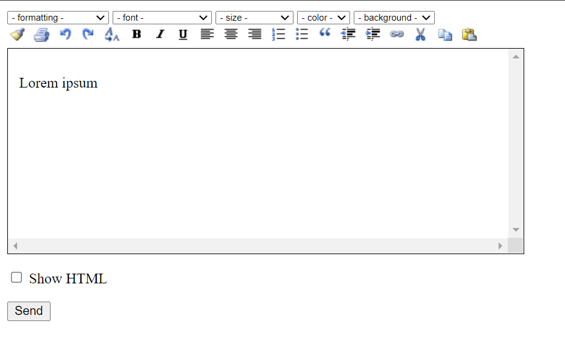

**目录：**

- [1. HTML5 背景](#1-html5-背景)
  - [1.1. HTML 的历史](#11-html-的历史)
    - [1.1.1. JavaScript 的出场](#111-javascript-的出场)
    - [1.1.2. 浏览器战争的结束](#112-浏览器战争的结束)
    - [1.1.3. 插件称雄](#113-插件称雄)
    - [1.1.4. 语义 HTML](#114-语义-html)
    - [1.1.5. HTML 标准滞后于使用](#115-html-标准滞后于使用)
  - [1.2. HTML5 简介](#12-html5-简介)
    - [1.2.1. 新标准](#121-新标准)
    - [1.2.2. 引入原生多媒体](#122-引入原生多媒体)
    - [1.2.3. 引入可编程内容](#123-引入可编程内容)
    - [1.2.4. 引入语义 Web](#124-引入语义-web)
- [2. HTML 基础](#2-html-基础)
  - [2.1. 元素](#21-元素)
    - [2.1.1. 虚元素](#211-虚元素)
  - [2.2. 元素属性](#22-元素属性)
    - [2.2.1. 元素关系](#221-元素关系)
    - [2.2.2. 元素类型](#222-元素类型)
    - [2.2.3. 布尔属性](#223-布尔属性)
    - [2.2.4. 自定义属性](#224-自定义属性)
  - [2.3. HTML 文档](#23-html-文档)
    - [2.3.1. 外层结构](#231-外层结构)
    - [2.3.2. head](#232-head)
    - [2.3.3. body](#233-body)
  - [2.4. HTML 实体](#24-html-实体)
  - [2.5. 全局属性](#25-全局属性)
    - [2.5.1. 选择器属性](#251-选择器属性)
    - [2.5.2. 键盘快捷键属性](#252-键盘快捷键属性)
    - [2.5.3. contentEditable](#253-contenteditable)
    - [2.5.4. hidden](#254-hidden)
    - [2.5.5. lang](#255-lang)
    - [2.5.6. title](#256-title)
    - [2.5.7. draggable](#257-draggable)
    - [2.5.8. style](#258-style)
- [3. HTML5 元素背景](#3-html5-元素背景)
  - [3.1. 语义和呈现分离](#31-语义和呈现分离)
  - [3.2. 元素选用原则](#32-元素选用原则)
    - [3.2.1. 少亦可为多](#321-少亦可为多)
    - [3.2.2. 别误用元素](#322-别误用元素)
    - [3.2.3. 具体为佳，一以贯之](#323-具体为佳一以贯之)
    - [3.2.4. 对用户不要想当然](#324-对用户不要想当然)
  - [3.3. 元素说明体例](#33-元素说明体例)
  - [3.4. 元素速览](#34-元素速览)
    - [3.4.1. 文档和元数据元素](#341-文档和元数据元素)
    - [3.4.2. 内容分区](#342-内容分区)
    - [3.4.3. 内容分组](#343-内容分组)
    - [3.4.4. 文本元素](#344-文本元素)
    - [3.4.5. 表格](#345-表格)
    - [3.4.6. 表单](#346-表单)
    - [3.4.7. 嵌入内容](#347-嵌入内容)
- [4. 文档和元数据](#4-文档和元数据)
  - [4.1. 文档元素](#41-文档元素)
    - [4.1.1. DOCTYPE](#411-doctype)
    - [4.1.2. html](#412-html)
    - [4.1.3. head](#413-head)
    - [4.1.4. body](#414-body)
  - [4.2. 元数据元素](#42-元数据元素)
    - [4.2.1. title](#421-title)
    - [4.2.2. base](#422-base)
    - [4.2.3. meta](#423-meta)
    - [4.2.4. style](#424-style)
    - [4.2.5. link](#425-link)
    - [4.2.6. script](#426-script)
    - [4.2.7. noscript](#427-noscript)
- [5. 内容分区](#5-内容分区)
  - [5.1. header](#51-header)
    - [5.1.1. nav](#511-nav)
  - [5.2. main](#52-main)
    - [5.2.1. arcticle](#521-arcticle)
    - [5.2.2. section](#522-section)
    - [5.2.3. h1 到 h6](#523-h1-到-h6)
  - [5.3. aside](#53-aside)
  - [5.4. footer](#54-footer)
    - [5.4.1. address](#541-address)
  - [5.5. details 和 summary](#55-details-和-summary)
- [6. 内容分组](#6-内容分组)
  - [6.1. div](#61-div)
  - [6.2. 列表](#62-列表)
    - [6.2.1. ol](#621-ol)
    - [6.2.2. ul](#622-ul)
    - [6.2.3. li](#623-li)
  - [6.3. p](#63-p)
  - [6.4. pre](#64-pre)
  - [6.5. blockquote](#65-blockquote)
  - [6.6. hr](#66-hr)
  - [6.7. figure 和 figcaption](#67-figure-和-figcaption)
- [7. 文本语义](#7-文本语义)
  - [7.1. span](#71-span)
  - [7.2. a](#72-a)
  - [7.3. 基本文本元素](#73-基本文本元素)
    - [7.3.1. b](#731-b)
    - [7.3.2. i](#732-i)
    - [7.3.3. s](#733-s)
    - [7.3.4. u](#734-u)
    - [7.3.5. strong](#735-strong)
    - [7.3.6. em](#736-em)
    - [7.3.7. sup 和 sub](#737-sup-和-sub)
    - [7.3.8. small](#738-small)
  - [7.4. 换行](#74-换行)
    - [7.4.1. 强制换行 br](#741-强制换行-br)
    - [7.4.2. 安全换行 wbr](#742-安全换行-wbr)
  - [7.5. 代码相关](#75-代码相关)
  - [7.6. 论文相关](#76-论文相关)
    - [7.6.1. 缩写](#761-缩写)
    - [7.6.2. 定义术语](#762-定义术语)
    - [7.6.3. 标题引用](#763-标题引用)
    - [7.6.4. 引文](#764-引文)
  - [7.7. 注音](#77-注音)
  - [7.8. 其他文本元素](#78-其他文本元素)
    - [7.8.1. mark](#781-mark)
    - [7.8.2. del 与 ins](#782-del-与-ins)
    - [7.8.3. 日期和时间](#783-日期和时间)
- [8. 表格](#8-表格)
  - [8.1. 基本表格元素](#81-基本表格元素)
  - [8.2. 表头 th](#82-表头-th)
  - [8.3. tbody 与 thead](#83-tbody-与-thead)
  - [8.4. tfoot](#84-tfoot)
  - [8.5. 不规则表格](#85-不规则表格)
  - [8.6. colgroup 和 col](#86-colgroup-和-col)
  - [8.7. 表格标题 caption](#87-表格标题-caption)
- [9. 表单](#9-表单)
  - [9.1. form](#91-form)
    - [9.1.1. action](#911-action)
    - [9.1.2. method](#912-method)
    - [9.1.3. enctype](#913-enctype)
    - [9.1.4. autocomplete](#914-autocomplete)
    - [9.1.5. target](#915-target)
    - [9.1.6. name](#916-name)
    - [9.1.7. form 属性](#917-form-属性)
  - [9.2. label](#92-label)
  - [9.3. input](#93-input)
    - [9.3.1. 公共属性](#931-公共属性)
    - [9.3.2. 输入文本](#932-输入文本)
    - [9.3.3. 输入密码](#933-输入密码)
    - [9.3.4. 作为按钮](#934-作为按钮)
    - [9.3.5. 输入数据](#935-输入数据)
    - [9.3.6. 固定选项](#936-固定选项)
    - [9.3.7. 输入 email 和 url 等](#937-输入-email-和-url-等)
    - [9.3.8. 输入时间和日期](#938-输入时间和日期)
    - [9.3.9. 输入颜色](#939-输入颜色)
    - [9.3.10. 用于搜索](#9310-用于搜索)
    - [9.3.11. 隐藏输入控件](#9311-隐藏输入控件)
    - [9.3.12. 上传文件](#9312-上传文件)
    - [9.3.13. 图片按钮](#9313-图片按钮)
  - [9.4. button](#94-button)
    - [9.4.1. submit](#941-submit)
    - [9.4.2. reset](#942-reset)
    - [9.4.3. 一般用法](#943-一般用法)
  - [9.5. select](#95-select)
  - [9.6. textarea](#96-textarea)
  - [9.7. fieldset](#97-fieldset)
- [10. 嵌入元素](#10-嵌入元素)
  - [10.1. img](#101-img)
  - [10.2. map 和 area](#102-map-和-area)
  - [10.3. iframe](#103-iframe)
  - [10.4. 插件](#104-插件)
    - [10.4.1. embed](#1041-embed)
    - [10.4.2. object](#1042-object)
  - [10.5. 指示条](#105-指示条)
    - [10.5.1. progress](#1051-progress)
    - [10.5.2. meter](#1052-meter)
  - [10.6. 音视频](#106-音视频)
    - [10.6.1. video](#1061-video)
  - [10.7. audio](#107-audio)
  - [10.8. track](#108-track)
  - [10.9. canvas](#109-canvas)
- [11. CSS 基础](#11-css-基础)
  - [11.1. 定义和应用样式](#111-定义和应用样式)
    - [11.1.1. CSS 声明](#1111-css-声明)
    - [11.1.2. 行内样式](#1112-行内样式)
    - [11.1.3. 内部样式表](#1113-内部样式表)
    - [11.1.4. 外部样式表](#1114-外部样式表)
  - [11.2. 层叠和继承](#112-层叠和继承)
    - [11.2.1. 用户代理样式](#1121-用户代理样式)
    - [11.2.2. 样式的层叠](#1122-样式的层叠)
    - [11.2.3. !important](#1123-important)
    - [11.2.4. 样式冲突](#1124-样式冲突)
    - [11.2.5. 继承](#1125-继承)
  - [11.3. 颜色](#113-颜色)
  - [11.4. 长度](#114-长度)
    - [11.4.1. 绝对单位](#1141-绝对单位)
    - [11.4.2. 相对单位](#1142-相对单位)
  - [11.5. 其他单位](#115-其他单位)
    - [11.5.1. 角度](#1151-角度)
    - [11.5.2. 时间](#1152-时间)
- [12. 理解 CSS](#12-理解-css)
  - [12.1. CSS 标准化](#121-css-标准化)
  - [12.2. 盒模型](#122-盒模型)
  - [12.3. 选择器概览](#123-选择器概览)
    - [12.3.1. 基本选择器](#1231-基本选择器)
    - [12.3.2. 组合选择器](#1232-组合选择器)
    - [12.3.3. 伪元素选择器](#1233-伪元素选择器)
    - [12.3.4. 伪类选择器](#1234-伪类选择器)
    - [12.3.5. 分组选择器](#1235-分组选择器)
  - [12.4. 属性概览](#124-属性概览)
    - [12.4.2. 盒模型属性](#1242-盒模型属性)
    - [12.4.3. 布局属性](#1243-布局属性)
    - [12.4.4. 文本属性](#1244-文本属性)
    - [12.4.5. 过渡，动画和变换属性](#1245-过渡动画和变换属性)

# 1. HTML5 背景

**HTML(Hypertext Markup Language, 超文本标记语言)** 诞生于 20 世纪 90 年代初。我与它的初次遵适大约是在 1993 年或 1994 年，当时我还在伦敦附近一个大学的研究实验室工作。那时浏览器只有 NCSAMosaic 这一种，Web 服务器的种类也屈指可数。

回想那段日子我们对 HTML 和万维网的着迷，仍不免有些惊讶。那时我们还得不厌其烦地把"World Wide Web"（万维网） 这三个单词全写出来，因为它的知名度还没有那么高，远没有今天这么受人瞩目，还不能只简称其为“ Web”。

那时一切都还很简陋。我还记得当时盯着一些慢腾腾加载的宝石图片看的情景。这都是宽带革命之前的事，整个大学享有的带宽大致与如今的一部移动电话相当。不过我们还是很激动。为迎接新时代的到来，大家都在忙着修改课题经费申请。尽管我们上网能做的只是看看另一所大学的咖啡壶图片（这所大学也在伦敦附近，但过去喝杯咖啡却并不近），我们还是有一种强烈的感觉：技术世界已经分为 Web 诞生前和诞生后两个时代了。

光阴荏苒，在许多用户眼中，Web 跟因特网变成了一回事儿，而我们也远远超越了为几张宝石图片就雀跃不已的层次。在此过程中，HTML 有过扩充，有过增强，有过扭曲，有过煎熬，见过争斗，见过官司，受过忽视，受过追捧，曾被贬为雕虫小技，也曾被誉为未来之星。待尘埃落定，它巳然成为亿万人日常生活不可或缺的一部分。

本书讲述的是 HTML5。这是 HTML 标准的最新版本，意在为这项重要技术带来秩序、条理和改进。曾经的青涩少年终于成熟了。

## 1.1. HTML 的历史

讲 HTML 的书都有“HTML 的历史” 这样一节，其中大都会提供 HTML 标准从诞生至今的详细年表。需要这类信息的读者可以去查查维基百科，不过这些信息读起来可能比较枯燥乏味，用处也不大。本书只关心其中几个重要转折点和一个长期存在的发展态势，旨在让读者明白 HTML 是如何成型的，明白为什么最终走到了 HTML5。

### 1.1.1. JavaScript 的出场

JavaScrip 语言出自一家名为网景的公司。它的出现标志着内嵌在 Web 浏览器中的客户端脚本程序控制功能的发端。原本是一种静态内容载体的 HTML 因此变得有点丰富起来。之所以说“有点丰富＂，是因为现在我们在浏览器中见到的这种复杂交互方式是经过一段时间的发展之后才形成的。

JavaScript 并非 HTML 规范核心的组成部分，然而 Web 浏览器、HTML 和 JavaScrip 之间的关系是如此紧密，以至于根本无法将它们分开讨论。HTML5 规范假定可以使用 JavaScript, 而且要想使用 HTML5 中新增的一些最为引人注目的特性也需要用到 JavaScript。

### 1.1.2. 浏览器战争的结束

浏览器市场也有过激烈的竞争。主要的角逐者是微软和网景，它们都把在自己的浏览器中添加一些独有的特性当做竞争手段。其如意算盘是这样打的：诱人的专有特性会诱使开发人员制作出只能在特定浏览器上使用的内容，而诱人的内容又会诱使用户对能提供这种内容的浏览器青眯有加，由此市场霸业可成。

可惜人算不如天算。这样做的结果是 Web 开发人员要么只使用那些所有浏览器都有的特性，要么煞费苦心地想些变通办法来使用各款浏览器中勉强相当的那些特性。这是一种煎熬，而且其后遗症直到现在仍然在影响 Web 开发。

微软用免费提供 IE 来与网景收费的 Navigator 抢生意，这一招儿后来被认定违反垄断法。很多人指责微软是网景垮台的罪魁祸首。这一指控或许不无道理，不过在我这个曾在那段时期为网景做过大约 18 个月顾问的人看来，我从没见过像它那样一根筋地自残的公司。有些公司注定要成为别人的前车之鉴，网景就是其中之一。

浏览器战争以网景倒台及微软受到惩处结束，为基于标准的网络浏览奠定了基础。HTML 规范有了改进，遵从这个规范成了准则。现在的浏览器需要凭遵守标准的程度来竞争。这是一次天翻地覆的转折，开发人员和用户均受益于此。

### 1.1.3. 插件称雄

插件是 Web 世界的“益虫”。它们可以提供一些单用 HTML 很难实现的高级特性和丰富内容。有些插件特性如此丰富、部署如此普遍，以至于不少网站只提供用于这种插件的内容。Adobe 公司的 Flash 正是这样一个典型。我经常见到完全用 Flash 实现的网站。按说这也没什么不妥，不过这就意味着浏览器和 HTML 除了 Flash 容器一职外再无他用。

浏览器开发商看插件不顺眼，因为它把控制权转移到了插件开发商手中。HTML5 的一大改进就是着力于让浏览器直接处理那些原来要使用 Flash 的富内容(rich content)。苹果和微软是疏远 Flash 的两个急先锋。前者的 OS 不支持 Flash，后者则在 Windows8 附带的 Metro 风格的 IE 中禁用了 Flash。

### 1.1.4. 语义 HTML

HTML 标准的早期版本不太关心将内容的意义与其呈现方式分开。想表示一段文字的重要性，使用一个让文字显示为粗体的 HTML 元素就是了。把粗体内容与重要内容关联起来是用户的事。这对人类用户来说很容易，却会让自动化工具犯难。自 HTML 初次亮相以来，对内容进行自动处理日趋重要，人们也越来越致力于分开 HTML 元素的意义与内容在浏览器中的呈现方式。

### 1.1.5. HTML 标准滞后于使用

制定标准一般都是一个长期过程，像 HTML 这种应用广泛的技术更是如此。参与方众多，每家都想把新标准往符合自己利益或观点的方向引。而标准并不是法律，标准制定机构害怕分裂甚于一切。因此对于未来的特性和改进该当如何，各方经常陷入旷日持久的讨价还价。

负责制定 HTML 标准的是 **W3C(World Wide Web Consortium, 万维网联盟)**。这是一项棘手的任务。一条提案要花不少时间才能成为标准。而对 HTML 核心规范的修改则需经过很长时间才会得到批准。

冗长的标准制定过程带来的结果就是 W3C 总是要多绕一些路，总是在将已经被大家接受的实际做法追认为标准。HTML 规范反映的只是几年前关于 Web 内容的前沿思考。这削弱了 HTML 标准的重要性，因为真正的革新并非来自 W3C，而是来自浏览器和插件。

## 1.2. HTML5 简介

HTML5 不仅仅是 HTML 规范的最新版本，它还是一系列用来制作现代富 Web 内容的相关技术的总称。后面各章将会介绍这些技术，其中最重要的三项技术是 HTML5 核心规范、CSS(Cascading Style Sheets, 层叠样式表） 和 JavaScript。

HTML5 核心规范定义用以标记内容的元素，并明确其含义。CSS 可用于控制标记过的内容呈现在用户面前的外貌。JavaScript 则可以用来操纵 HTML 文档的内容以及响应用户的操作，此外要想使用 HTML5 新增元素的一些为编程目的设计的特性也需要用到 JavaScript。

有些人（那些挑剔、执拗、爱钻牛角尖的人）会说 HTML5 所指的只是 HTML 元素。别管他们。这些人看不出 Web 内容的本质所发生的根本性变化。用于网页的各种技术之间的关联已经变得如此紧密，以致于需要通晓这些技术才能制作 Web 内容。如果只使用 HTML 元素，不用 css，这样制作出来的内容会让用户觉得不便阅读。如果用了 HTML 和 css, 但不用 JavaScript, 那就无法为用户的操作提供即时反馈，也无法使用 HTML5 中的一些高级特性。

### 1.2.1. 新标准

为了应对漫长的标准化过程以及标准落后于常见用法的清况，HTM5 及其相关技术是作为一系列小型标准而制定的。其中有些标准只有区区几页，涉及的只是某项特性中一个高度细化的方面。当然，其他一些标准仍然有密密麻麻的几百页，涵盖了相关功能的所有方面。

这样做的目的是让较小的团体可以合作设计和将对他们较为重要的特性标准化，争议较少的特性可以先标准化，不必受围绕其他特性发生的争论的拖累。

这个办法有利也有弊。好处是可以加快标准制定步伐。主要的弊端在于难以全面掌握制定中的各个标准的情况以及这些标准之间的关系。技术规范的质量也有所下降。有些标准中存在着一些歧义，致使浏览器中的实现出现了不一致的情况。

最大的不足之处大概要算没有一条可用来评估 HTML5 达标情况的基准线。我们现在还处于初始阶段，但是不能指望用户可能用到的所有浏览器都实现了要用的特性。因此采用 HTML5 中的特性是件复杂的事情，需要仔细评估相关标准得到支持的情况。W3C 公布过一个正式的 HTML5 徽标，但是它并不代表对 HTML5 标准及相关技术的全面支持。

### 1.2.2. 引入原生多媒体

HTML5 的一大改进就是支持在浏览器中直接播放视频和音频文件（也就是说不借助于插件）。这是 W3C 对插件风靡现象的一种反应。原生(native)多媒体支持再结合其他 HTML 特性可望大有作为。

### 1.2.3. 引入可编程内容

HTML5 最大的变化之一是添加了 canvas 元素。这个元素是对插件现象的另一反应，它提供了一个通用的绘图平面，开发人员可以用它完成一些通常用 Adobe Flash 完成的任务。

这个特性之所以重要，部分原因在于要使用 canvas 元素就必须用到 JavaScript。编程从而成了 HTML 文档中第一层次的事情，这是一个重大转变。

### 1.2.4. 引入语义 Web

HTML5 引入了一些用来分开元素的含义和内容呈现方式的特性和规则。这是 HTML5 中的一个重要概念。这个主题在本书中将多次论及，它标志着 HTML 在走向成熟的道路上又迈上了一个新台阶，反映出制作和使用 HTML 内容的方式的多样性。这个变化（它逐步体现在之前的 HTML 版本中）稍稍增加了 Web 开发者的负担，这是因为开发者需要先标记内容然后再定义其呈现方式。不过有些实用的新改进可以减轻这种负担。

# 2. HTML 基础

开发人员多少都知道一点 HTML。近年来它的身影随处可见，即便是那些从不需要写 HTML 代码的人，也可能见过一些。为了让读者打好基础，本章将回头介绍 HTML 的基本知识：HTML 的目标和其工作原理。我会解释一些 HTML 中的基本术语，并且介绍一些几乎所有网页都要用到的核心元素。

顾名思义，HTML 是一种标记语言。其标记以应用于文档内容（例如文本）的元素为其存在的形式。在后面的各节中，我会解释各种 HTML 元素的区别，以及使用各种属性配置这些元素的方法，并且介绍一系列可用于所有 HTML 元素的属性，称为全局属性。

## 2.1. 元素

以下是一个文本内容使用了 HTML 元素的例子：

```html
我正在深入学习
<i>HTML</i>
。
```

这个例子中，我们使用`i`标记了 HTML，使它变为斜体显示。`<i>HTML</i>` 整体为一个 **HTML 元素(HTML Element)**。具体来讲，几乎每一个元素（不是所有的元素）都分为三部分：开始标签（`<i>`），结束标签（`</i>`），和 **元素内容(Element Content)**（HTML）。其中开始标签和结束标签称为 **标签(tag)**。

元素使得浏览器可以根据标签来具体显示被标签包裹起来的内容。不同的标签使得内容有不同的显示效果。例如，`<i>` 标签使得文本斜体显示。

HTML 规定标签名不分大小写，大写和小写标签，对内容的显示效果是相同的。例如：`<I>HTML</I>` 和 `<i>HTML</i>` 的显示效果是相同的。但是最为推荐的标记风格是全部使用小写，这样更为方便，也更加统一。

HTML 规定了各式各样的标签，它们在 HTML 文档中起着不同的作用。`<i>` 标签是文本标签的一个例子。

标签应用在内容上改变内容的显示方式，这种想法在如今受到强烈的反对。现在的观点是标签应用在内容上只可以说明内容的含义或者文档结构，然后使用 CSS 来控制内容的显示，这样便可以做到 HTML 和 CSS 的松散耦合。

基于这些反对，HTML5 引进了很多的 **语义元素(Semantic Element)**，语义元素就是只用来说明内容的含义或者文档结构的，它们不会对内容的显示产生影响。例如，`<nav>` 只用来说明所标记内容表示一个导航链接，不会对 `<nav>` 标签包含的内容的显示产生影响。

虽然 HTML5 引入了很多的语义元素，但大部分以前的那些影响内容显示的标签并没有被废弃，你依然可以使用那些标签。

### 2.1.1. 虚元素

我们刚才说过，并不是所有的元素都包含：开始标签，内容，以及结束标签，实际上，有一种元素只包含一个结束标签，这种元素被称为 **虚元素(Void Element)**。例如，`</hr>` 就是这样一个例子，使用这个元素，会显示一条横线，用来表示内容的分隔。

虚元素并不是一定要用结束标签表示，事实上，你还可以使用开始标签表示。但是为了规范起见，我们推荐使用结束标签。

## 2.2. 元素属性

HTML 元素内可以使用 **属性(Attributes)**。具体来说，你可以在一个元素的开始标签里，使用 `键=值` 来补充这个元素的信息。

来看下面一个例子：

```html
<button id="btn">点击我！</button>
```

这个例子中，button 元素的开始标签里多了一个 `id="btn"`，这相当于指定了这个 button 元素的 id 为值："btn"。

元素的属性只能用在开始标签内，不能用于结束标签。属性值必须使用双引号包含起来，你也可以使用单引号，不过并不推荐。

有些属性可用于所有的 HTML 元素，这些属性称为 **全局属性(Global Attributes)**。而有一些属性只能用于特定的元素，这些属性称为 **局部属性(Local Attributes)**。本书后面
的章节会具体讲解。

一个元素可以使用多个属性，这些属性用空格分开。来看下面一个例子：

```html
<input type="text" name="userName"></input>
```

这个例子中，input 元素使用了 2 个属性：type 和 name。type 用来指定 input 的类型，这里 `type="text"` 指定这个 input 元素为文本类型。name 属性用来指定 input 的名称，这个名称在用 JavaScript 获取这个 input 的时候会用到。

这个例子中，input 元素开始标签内的 autofocus 属性并没有值，我们只是简单地写上了 autofocus，这也当然是可以起到效果的。autofocus 可以自动将焦点转移到 input 元素上。

### 2.2.1. 元素关系

HTML 文档中的元素之间有着明确的关系。如果元素 a 包含了元素 b，那么 b 是 a 元素的 **子元素(child)**，或者说 a 是 b 元素的 **父元素(parent)**。如果元素 a1 和 a2 在并列位置，那么称 a1 和 a2 为 **兄弟元素(sibling)**。

不是任何元素都可以成为某一个元素的子元素，这是有限制的。这种限制取决于父子元素的类型。除此之外，CSS 和 DOM 都会用到元素关系。

### 2.2.2. 元素类型

HTML 规范将元素分为 3 大类：**元数据元素(Metadata Element)**，**流元素(Flow Element)** 和 **短语元素(Phrasing Element)**。

元数据元素描述了文档的元数据信息，向浏览器提供了如何处理文档。

另外两种类型的元素的主要用途就是确定一个元素的合法子元素。短语元素是 HTML 文档的基本组成。流元素是短语元素的超集。

有些元素无法归入上述三种类型，这些元素要么没有什么特别的含义，要么只能用在一些非常有限的情况下。li 元素就是受限元素的一个例子。它表示列表项，只能有三种父元素： ol（表示有序列表）、ul（表示无序列表） 和 menu（表示菜单）。

### 2.2.3. 布尔属性

有些属性不需要一个值，只需写上属性键即可。这种属性称为 **布尔属性(Boolean Attributes)**。

来看一个例子：

```html
<input type="text" name="userName" autofocus></input>
```

### 2.2.4. 自定义属性

除了 HTML 内置的元素属性外，开发者可以自定义属性，这些自定义属性的键必须以 `data-` 开头。

例如：

```html
<article
  id="electric-cars"
  data-columns="3"
  data-index-number="12314"
  data-parent="cars"
>
  ...
</article>
```

这个例子中，有 3 个自定义属性：data-columns，data-index-number，data-parent。它们可以指定这个 article 元素的所在列，索引号，以及父元素信息。

自定义属性配合 JavaScript 非常方便。

## 2.3. HTML 文档

HTML 元素是 HTML 文档的构成单位。通过各式各样的元素的重复，嵌套，最终形成了 HTML 文档，也就是网页。但 HTML 文档一般有约定俗称的结构。

下面展示了一个通用的 HTML 文档结构：

```html
<!DOCTYPE html>
<html lang="zh-CN">
  <head>
    <meta charset="utf-8">
    <title>文档</title>
  </head>
  <body>
    一段文本。
  <body>
</html>
```

下面的章节我们会一步步介绍。

### 2.3.1. 外层结构

HTML 文档的第一行是文档类型声明：`<!DOCTYPE html>`。这个元素表示这个文档是 HTML5 的 HTML 文档。在历史上，具有同等地位的还有其他一些标记语言，文档中可能会混合使用多种标记语言。但如今 HTML5 已经成为占绝对优势的标记语言，即使在文档中省略 DOCTYPE，绝大多数浏览器仍然假定处理的是 HTML5 文档。但是写上总是保险的做法。

紧接着文档类型声明的是 html 元素，html 元素用于包含 head 和 body 元素，使得文档声明和文档分隔清楚。

### 2.3.2. head

**元数据元素(meta-data Element)** 用来描述文档的信息，并不是文档的内容。所有的元数据元素都被放在 head 元素内部。例如 `<meta charset="utf-8">` 指定文档的字符集为 utf-8。

head 内常用的还有 title 元素，用来指定网页标签页的标题。除此之外，link 元素用来指定文档需要的外部链接信息，如 `<link rel="stylesheet" href="main.css">` 指定了文档的外部样式表。style 和 script 元素用来指定内联的层叠样式表和脚本。

### 2.3.3. body

head 元素用来放置文档元信息元素，而 body 元素放置的元素就是文档实际的内容。

我们编写 HTML 文档实际上大部分都在编写 HTML 文档的内容。因此都是在 body 元素内部编写的。

## 2.4. HTML 实体

从本章的例子中可以看到，HTML 文档中有些字符具有特殊含义最明显的是<和>这两个字符。有时需要在文档内容中用到这些字符，但不想让它们被当做 HTML 处理。为此应该使用 **HTML 实体(HTML entity)**。实体是浏览器用来替代特殊字符的一种代码。下表列出了一些常用实体。

| Result       | Description | Entity Name | Entity Number |
| ------------ | ----------- | ----------- | ------------- |
| non-breaking | 空格        | &nbsp;      | &#160;        |
| <            | 小于        | &lt;        | &#60;         |
| >            | 大于        | &gt;        | &#62;         |
| &            | 和          | &amp;       | &#38;         |
| "            | 双引号      | &quot;      | &#34;         |
| '            | 单引号      | &apos;      | &#39;         |
| ©            | 版权        | &copy;      | &#169;        |
| ®            | 注册商标    | &reg;       | &#174;        |

每个特殊字符都有一个实体编号，可以用来在文档内容中代表该字符。例如，字符 & 的实体编号是&#38;。特别常用的特殊字符还有对应的实体名称。例如，对于浏览器来说，&#38 和 &amp 是相同的。

## 2.5. 全局属性

前面讲过全局属性可以用于所有的 HTML 元素，本节涉及了一些常用的全局属性。

### 2.5.1. 选择器属性

class 和 id 属性可以标记元素的类别和唯一标识符。这在 CSS 选择器以及 JavaScript 中获取和选择元素非常有用。

class 和 id 属性的唯一区别就是 class 属性可以标识一类元素，而 id 属性只可以标识一个元素。

### 2.5.2. 键盘快捷键属性

1. **tabIndx**

tabIndex 全局属性可以指定使用键盘上的 Tab 键转移焦点索引。例如：

```html
<body>
  <button tabindex="-1">点击我！</button>
  <label>
    User Name
    <input type="text" tabindex="1" />
  </label>

  <label>
    Password
    <input type="password" tabindex="2" />
  </label>
</body>
```

在这个例子中，我们为 button 设置了 tabIndex 为 -1，这就意味着 button 不能通过 tab 键转移到焦点。而其他两个 Input 分别设置了 tabIndex 为 1 和 2，这样在用 tab 切换焦点时，我们就可以先切换到用户名字段，再到密码字段。

2. **accessKey**

accessKey 为元素设置了焦点键盘快捷键。用户可以通过键盘快捷键将焦点方便地转到元素。不同地浏览器快捷键可能不同，详情参考[这篇文章](https://developer.mozilla.org/en-US/docs/Web/HTML/Global_attributes/accesskey)。Chrome 浏览器可以使用 Alt + accessKet 的方式。

例如：

```html
<!DOCTYPE html>
<html lang="zh-CN">
  <head>
    <meta charset="utf-8">
    <title>Doc</title>
  </head>
  <body>
    <button accesskey="u">上传</button>
    <button accesskey="s">提交</button>
  <body>
</html>
```

这个 html 设计了两个按钮分别带有 accessKey 为 "u" 和 "s"。用户可以通过 Alt + U 将焦点快捷地转到上传按钮上。

### 2.5.3. contentEditable

contentEditable 是 HTML5 新增的属性，这个属性设计的目的是富文本编辑。这个属性可以将一个元素变为可编辑状态。
这个属性往往要配合 document.execCommand() 方法以实现富文本编辑。

MDN 的[这篇文章](https://developer.mozilla.org/en-US/docs/Web/Guide/HTML/Editable_content) 中实现了一个复杂的富文本编辑器。效果如下：



### 2.5.4. hidden

全局属性 hidden 是一个布尔属性，表示一个元素尚未或者不再相关。例如，它可以被用来隐藏一个页面元素直到登录完毕。如果一个元素设置了这个属性，它就不会被显示。

hidden 属性不能用于隐藏那些可以在其它板块中合理显示的内容。 例如，用 hidden 属性去隐藏一个选项卡对话框种的面板是不正确的，因为选项卡界面只不过是溢出显示的一种——一个可以等量于一个只显示所有 form 表单控件的拥有滚动条的大页面。类似地，用 hidden 属性在某个特定板块中隐藏一部分内容也是不正确的，——如果某些内容被标记为隐藏，它将从所有版块中隐藏,包括例如屏幕阅读器.

隐藏元素不应与非隐藏元素链接，作为隐藏元素的后代的元素仍然是活动的，这意味着脚本元素仍然可以执行，表单元素仍然可以提交。

比如说，用 href 标签链接到一个带有 hidden 标签的区块是不对的。 如果这个区块和这个页面不相干，或者这个区块不适用于这个页面，那没有任何理由需要链接到它。

不过，你还是可以使用 ARIA aria-describedby 标签去引用本身是隐藏的一些描述。

类似的，你也可以将一个带有 hidden 标签的 canvas 元素作为屏幕外的缓存区域，或者在表单控件中引用一个已经隐藏的表单。

```html
<!DOCTYPE html>
<html lang="en">
  <head>
    <meta charset="UTF-8" />
    <meta http-equiv="X-UA-Compatible" content="IE=edge" />
    <meta name="viewport" content="width=device-width, initial-scale=1.0" />
    <title>Document</title>
  </head>
  <body>
    <div id="target">隐藏文字</div>
    <button id="btn">切换隐藏</button>
    <script>
      const target = document.querySelector('#target');
      const btn = document.querySelector('#btn');

      btn.addEventListener('click', () => {
        if (target.hasAttribute('hidden')) {
          target.removeAttribute('hidden');
        } else {
          target.setAttribute('hidden', 'hidden');
        }
      });
    </script>
  </body>
</html>
```

上面的代码中，通过切换隐藏按钮可以将 div 在隐藏和不隐藏之间切换。

### 2.5.5. lang

lang 全局属性参与了元素语言的定义。这个语言是不可编辑元素写入的语言，或者可编辑元素应该写入的语言。标签包含单个条目，值的格式由 用于定义语言的标签 (BCP47) IETF 文档定义。如果标签的内容是空字符串，语言就设为未知。如果标签内容是无效的，根据 BCP47，它就设为无效。

通常在 html 元素上添加 lang 属性可以为整个网页指定语言，你也可以在单独的块上添加 lang 属性，这样语言效果只局限于这个块。

```html
<html lang="zh-CN"></html>
```

### 2.5.6. title

title 全局属性 包含了表示咨询信息文本，和它属于的元素相关。这个信息通常存在，但绝不必要，作为提示信息展示给用户。一些典型用例：

链接：被链接文档的标题或描述
媒体元素，例如图像：描述或关联信息
段落：脚注或者相关的评论
引用：作者信息，以及其他
如果省略了这个属性，就意味着这个元素的最近祖先的标题仍然是相关的（并且可以用作元素的提示信息）。如果这个属性设为空字符串，它就明确意味着，它的最近祖先的标题是不相关的（并且不应用于这个元素的提示信息）。

### 2.5.7. draggable

全局属性 draggable 是一个枚举类型的属性，用于标识元素是否允许使用 拖放操作 API (en-US) 拖动。它的取值如下：

true，表示元素可以被拖动
false，表示元素不可以被拖动
如果该属性没有设值，则默认值 为 auto ，表示使用浏览器定义的默认行为。

这个属性是枚举类型，而不是 布尔类型 。这意味着必须显式指定值为 true 或者 false ，像 `<label draggable>Example Label</label>` 这样的简写是不允许的。正确的用法是 `<label draggable="true">Example Label</label>`。

默认情况下，只有已选中的文本、图片、链接可以拖动。对其它的元素来说，必须按拖动机制的顺序设置 ondragstart 事件才能正常工作。

```html
<p
  draggable="true"
  ondragstart="event.dataTransfer.setData('text/plain', 'This text may be dragged')"
>
  This text
  <strong>may</strong>
  be dragged.
</p>
```

属性 draggable 设置为 "true"，所以这个元素变成可拖拽的。如果该属性被省略或被设置为 "false"，则该元素将不可拖拽，此时拖拽只会选中文本。

draggable 属性可在任意元素上设置，包括图像和链接。然而，对于后两者，该属性的默认值是 true，所以你只会在禁用这二者的拖拽时使用到 draggable 属性，将其设置为 false。

### 2.5.8. style

style 全局属性可以为单个元素指定它的样式，这种指定样式的方式优先级更高。

例如：

```html
<!DOCTYPE html>
<html lang="en">
  <head>
    <meta charset="UTF-8" />
    <meta http-equiv="X-UA-Compatible" content="IE=edge" />
    <meta name="viewport" content="width=device-width, initial-scale=1.0" />
    <title>Document</title>
    <style>
      #target {
        background-color: pink;
      }
    </style>
  </head>
  <body>
    <span id="target" style="background-color: skyblue;">一段文本</span>
  </body>
</html>
```

在这个例子中，div 的背景颜色为天蓝色而不是粉红色。

# 3. HTML5 元素背景

HTML5 定义的各种元素将从下一章开始介绍。许多元素在 HTML4 中也存在，但是很多情况下元素的含义已经发生了变化，或者其使用方式已经有所不同。在介绍这些元素之前，我想先介绍一下它们的背景知识，为后续各章奠定基础。知道如何使用这些元素与理解其含义同等重要。

## 3.1. 语义和呈现分离

HTML5 中的一大主要变化是基本信念方面的：将元素的语义与元素对其内容呈现结果的影响分开。从原理上讲这的确合乎情理。HTML 元素负责文档内容的结构和含义，内容的呈现则由应用于元素上的 CSS 样式控制。HTML 文档的用户未必都需要显示它们，不掺合呈现方面的事有助于简化 HTML 的处理以及从中自动提炼含义。

HTML5 中新增的大多数元素都有具体的含义。例如，article 元素可以用来表示适于联合供稿的独立成篇的内容，而 figure 元素表示的自然是图片。

HTMIA 中的许多元素产生在呈现与含义分离观念形成之前。这造成了一种尴尬局面。以 b 元素为例，在 HTML5 之前的版本中，b 元素会指示浏览器以粗体显示其开始和结束标签之间的内容。而 HTML5 不再提倡纯属呈现因素的元素，所以给 b 元素下了个新定义（以下内容摘自 w3c.org 的"HTML: The Markup Language"):

b 元素表示一段文字（将这段文宇从周围文字中凸现出未并不表示特别的强调或重要性），习惯上使用粗体呈现，其使用场合包括文章提要中的关键宇或产品评论中的产品名称等。

这番裹脚布一般的辞令无非是说：b 元素告诉浏览器用粗体显示文字。b 元素没有任何语义，它只起呈现方面的作用。这个圆滑的定义透露了 HTML5 的一个重要信号：我们处在过渡时期。保留那些旧元素是因为它们用得实在太广泛了。让 HTML5 抛弃那些 HTMIA 元素是不切实际的，那样做无疑会减缓其被采用的进程。这样一来，HTML5 就成了一个“双速” 标准。一部分元素（特别是那些新元素）只有语义方面的作用；而另一部分元素（特别是那些名字只有一个字母的）因为招牌如此之老，新标准在呈现与含义分离的原则上也只得向其屈服：尽管它不愿坦然承认这一点。

从下一章开始，在阅读元素说明的时候，对新思维和老路子之间的这种敏感关系最好要心里有数。它确实有助于解释读者碰到的一些琐碎的怪象。

我的建议是：在语义方面要求严格点不为过，只要有条件，尽量避用那些具有浓重呈现意味或纯粹起呈现作用的元素。定义一个自定义类然后借助它应用所需样式并不复杂。只要做到样式的采用是以内容类型为依据而不是随心所欲，你至少也保持了一颗向着语义的心。

## 3.2. 元素选用原则

就算撇开呈现方面的事不论，HTML5 规范仍然存在一些含混的地方。有些元素过于一般化，乍一看可能不招人喜欢。

那些元素固然一般化，但这是因为用 HTML 元素来标记的内容类型实在太多了。我写的大多数都是本书这样的东西，所以见到 section、article、heading 和 figure 这些术语的时候，想到的是 Apress 出版社在结构和样式方面对作者所提的要求。换了别的内容，同一批术语的含义却又不一样了。例如，技术规范、合同和博客文章都具有 section，但这个术语在三种情况下的含义截然不同。我们没有为书籍、技术规范、合同和博客文章中的 section 各自定义一个术语，而是使用一个通用的术语，附加一定的解释。在选择用来标记内容的元素方面我给读者总结了几条原则，接下来我们就来逐一说明。

### 3.2.1. 少亦可为多

开发者在使用元素的时候容易忘乎所以，把文档弄得标记密布。标记只应该应内容对语义的需要使用。不需要定义复杂标题也就不需要使用 hgroup 元素，只有那些引文比较重要的文档（如期刊文章）才需要用 cite 元素标记的详细引文。

判断该用多少标记需要经验。有条经验法则是：问问自己打算如何发挥一个元素的语义作用，如果不能马上答出就不用这个元素。

### 3.2.2. 别误用元素

每个元素针对的是一种特定类型的内容即便像 b 元素这类纯属呈现用途的元素也是如此。对内容进行标记时，只宜将元素用于它们原定的用途，不要创造自有的语义。如果找不到适合自己所要含义的元素，可以考虑使用通用元素（如 span 或 div)，并且用全局属性 class 表明其含义。CSS 样式不是类属性唯一的用途。

### 3.2.3. 具体为佳，一以贯之

用来标记内容的元素应该选择最为具体的那个。如果已有元素能恰当表明内容的类型，就不要使用通用元素。HTML4 中存在一种依赖 div 元素构建页面结构的倾向，其缺陷在于它们的语义并非显而易见。有些人或许会定义一个名为 article 的类，并且藉以应用各种样式，但是这样做所传达出的含义无法与使用 article 元素相提并论。

同样，同一个元素的使用在整个页面、网站或 Web 应用系统上要保持一致。对于作者来说，他们以后修改自己的 HTML 文档的工作可以因此更加轻松，对于要处理 HTML 文档的其他人亦然。

### 3.2.4. 对用户不要想当然

有人可能觉得 HTML 文档的用户关心的只是它在浏览器中的呈现结果，所以不用为标记的语义准确性劳神。呈现与语义分离原则的目的完全是为了让 HTML 文档更易千程序化处理，所以随着 HTML5 的采用和实现愈加广泛，HTML 内容的这种使用会日益增多。如果不关心标记的准确性和一致性，这样的 HTML 文档处理起来更为困难，用户能为其找到的用处也很有限。

## 3.3. 元素说明体例

本书在介绍每一个元素时，都会列出一个摘要表，表中襄括了与该元素相关的要点，读者在制作 HTML 文档时可以回头参考一下。下表是这种摘要表的一个例子。它介绍的是用来表示有序列表的 ol 元素。

| 元素              | ol                                                                                                                                                                |
| ----------------- | ----------------------------------------------------------------------------------------------------------------------------------------------------------------- |
| 元素类型          | 流元素                                                                                                                                                            |
| 允许具有的父元素  | 任何可以包含流元素的元素                                                                                                                                          |
| 局部属性          | start、reversed 和 type                                                                                                                                           |
| 内容              | 0、或多个 li 元素                                                                                                                                                 |
| 标签用法          | 开始和结束标签                                                                                                                                                    |
| 是否为 HTML5 新增 | 否                                                                                                                                                                |
| 在 HTML5 中的变化 | reversed 属性是 HTML5 中新增的。在 HTM 区中已不赞成使用的 start 和 type 属性在 HTML5 中又得以恢复，不过其含义变成了语义（而不是呈现）方面的。compact 属性不再使用 |
| 习惯样式          | ol { display: block; list-style-type: decimal;margin-before: 1em; margin-after: 1em; margin-start: 0; margin-end: 0;padding-start: 40px; }                        |

摘要表中的信息包括：哪些元素可成为该元素的父元素，该元素可以包含什么类型的内容，标签应该怎样使用，默认呈现样式，该元素是否为 HTML5 新增或在 HTML5 中发生了什么变化。关于允许具有什么父元素和内容的信息，其依据是介绍过的元素类型（主要是流元素和短语元素）。

## 3.4. 元素速览

接下来的表可让读者跑马观花地认识一下后面各章将要介绍的所有 HTML5 元素。

### 3.4.1. 文档和元数据元素

文档和元数据元素的用途包括创建 HTML 文档的上层建筑，向浏览器说明文档的情况，定义脚本程序和 CSS 样式，提供浏览器禁用脚本时要显示的内容。

| 元素     | 说明                                                                                                                                                   | 类型         | 新增或有无变化 |
| -------- | ------------------------------------------------------------------------------------------------------------------------------------------------------ | ------------ | -------------- |
| DOCTYPE  | 表示 HTML 文档的类型                                                                                                                                   | 无           | 有变化         |
| html     | 表示一个 HTML 文档的根（顶级元素），所以它也被称为根元素。所有其他元素必须是此元素的后代。                                                             | 无           | 有变化         |
| head     | 规定文档相关的配置信息（元数据），包括文档的标题，引用的文档样式和脚本等。                                                                             | 无           | 无变化         |
| body     | 表示文档的内容。document.body 属性提供了可以轻松访问文档的 body 元素的脚本。                                                                           | 无           | 有变化         |
| title    | 定义文档的标题，显示在 Browser 的标题栏或标签页上。它只应该包含文本，若是包含有标签，则它包含的任何标签都将被忽略。                                    | 元数据       | 无变化         |
| meta     | 表示那些不能由其它 HTML 元相关（meta-related）元素（(base、link, script、style 或 title）之一表示的任何 Metadata 信息。                                | 元数据       | 有变化         |
| link     | 规定了当前文档与外部资源的关系。该元素最常用于链接样式表，此外也可以被用来创建站点图标(比如 PC 端的“favicon”图标和移动设备上用以显示在主屏幕的图标) 。 | 元数据       | 有变化         |
| style    | 包含文档的样式信息或者文档的部分内容。默认情况下，该标签的样式信息通常是 CSS 的格式。                                                                  | 元数据       | 有变化         |
| script   | 定义内部脚本或外部脚本                                                                                                                                 | 元数据，短语 | 有变化         |
| noscript | 如果页面上的脚本类型不受支持或者当前在浏览器中关闭了脚本，则在 HTML `<noscript>` 元素中定义脚本未被执行时的替代内容。                                  | 元数据，短语 | 有变化         |
| base     | 指定用于一个文档中包含的所有相对 URL 的根 URL。一份中只能有一个 `<base>` 元素。                                                                        | 元数据       | 无变化         |

### 3.4.2. 内容分区

内容分区元素允许你将文档内容从逻辑上进行组织划分。使用包括页眉(header)、页脚(footer)、导航(nav)和标题(h1~h6)等分区元素，来为页面内容创建明确的大纲，以便区分各个章节的内容。

| 元素     | 说明                                                                                                                                                                                   | 类型 | 新增或有无变化 |
| -------- | -------------------------------------------------------------------------------------------------------------------------------------------------------------------------------------- | ---- | -------------- |
| header   | 用于展示介绍性内容，通常包含一组介绍性的或是辅助导航的实用元素。它可能包含一些标题元素，但也可能包含其他元素，比如 Logo、搜索框、作者名称，等等。                                      | 流   | 新增           |
| nav      | 表示页面的一部分，其目的是在当前文档或其他文档中提供导航链接。导航部分的常见示例是菜单，目录和索引。                                                                                   | 流   | 新增           |
| main     | 呈现了文档的 body 或应用的主体部分。主体部分由与文档直接相关，或者扩展于文档的中心主题、应用的主要功能部分的内容组成。                                                                 | 流   | 新增           |
| article  | 表示文档、页面、应用或网站中的独立结构，其意在成为可独立分配的或可复用的结构，如在发布中，它可能是论坛帖子、杂志或新闻文章、博客、用户提交的评论、交互式组件，或者其他独立的内容项目。 | 流   | 新增           |
| section  | 表示一个包含在 HTML 文档中的独立部分，它没有更具体的语义元素来表示，一般来说会有包含一个标题。                                                                                         | 流   | 新增           |
| h1 到 h6 | 呈现了六个不同的级别的标题，`<h1>` 级别最高，而 `<h6>` 级别最低。                                                                                                                      | 流   | 无变化         |
| details  | 可创建一个挂件，仅在被切换成展开状态时，它才会显示内含的信息。`<summary>` 元素可为该部件提供概要或者标签。                                                                             | 流   | 新增           |
| summary  | 用作 一个`<details>`元素的一个内容的摘要，标题或图例。                                                                                                                                 | 无   | 新增           |
| aside    | 表示一个和其余页面内容几乎无关的部分，被认为是独立于该内容的一部分并且可以被单独的拆分出来而不会使整体受影响。                                                                         | 流   | 新增           |
| footer   | 表示最近一个章节内容或者根节点（sectioning root ）元素的页脚。一个页脚通常包含该章节作者、版权数据或者与文档相关的链接等信息。                                                         | 流   | 新增           |
| address  | 表示其中的 HTML 提供了某个人或某个组织（等等）的联系信息。                                                                                                                             | 流   | 新增           |

### 3.4.3. 内容分组

| 元素       | 说明                                                                                                                                                                                                                                                         | 类型 | 新增或有无变化 |
| ---------- | ------------------------------------------------------------------------------------------------------------------------------------------------------------------------------------------------------------------------------------------------------------ | ---- | -------------- |
| div        | 一个通用型的流内容容器，在不使用 CSS 的情况下，其对内容或布局没有任何影响。                                                                                                                                                                                  | 流   | 无变化         |
| p          | 表示文本的一个段落。该元素通常表现为一整块与相邻文本分离的文本，或以垂直的空白隔离或以首行缩进。                                                                                                                                                             | 流   | 有变化         |
| ol         | 表示有序列表，通常渲染为一个带编号的列表。                                                                                                                                                                                                                   | 流   | 有变化         |
| ul         | 表示一个内可含多个元素的无序列表或项目符号列表。                                                                                                                                                                                                             | 流   | 有变化         |
| li         | 用于表示列表里的条目。它必须包含在一个父元素里：一个有序列表(ol)，一个无序列表(ul)，或者一个菜单 (menu)。在菜单或者无序列表里，列表条目通常用点排列显示；在有序列表里，列表条目通常在左边显示按升序排列的计数，例如数字或者字母。                            | 无   | 有变化         |
| dl         | 是一个包含术语定义以及描述的列表，通常用于展示词汇表或者元数据 (键-值对列表)。                                                                                                                                                                               | 流   | 无变化         |
| dd         | 用于在一个定义列表中声明一个术语。该元素仅能作为 dl 的子元素出现。通常在该元素后面会跟着 dd 元素，然而，多个连续出现的 `<dt>` 元素都将由出现在它们后面的第一个 dd 元素定义。                                                                                 | 无   | 无变化         |
| dd         | 用来指明一个描述列表 (dl) 元素中一个术语的描述。这个元素只能作为描述列表元素的子元素出现，并且必须跟着一个 dt 元素。                                                                                                                                         | 无   | 无变化         |
| pre        | 表示预定义格式文本。在该元素中的文本通常按照原文件中的编排，以等宽字体的形式展现出来，文本中的空白符（比如空格和换行符）都会显示出来。(紧跟在 `<pre>` 开始标签后的换行符也会被省略)                                                                          | 流   | 无变化         |
| blockquote | 代表其中的文字是引用内容。通常在渲染时，这部分的内容会有一定的缩进（注 中说明了如何更改）。若引文来源于网络，则可以将原内容的出处 URL 地址设置到 cite 特性上，若要以文本的形式告知读者引文的出处时，可以通过 cite 元素。                                     | 流   | 无变化         |
| hr         | 表示段落级元素之间的主题转换（例如，一个故事中的场景的改变，或一个章节的主题的改变）。                                                                                                                                                                       | 流   | 有变化         |
| figure     | 代表一段独立的内容, 经常与说明（caption） figcaption 配合使用, 并且作为一个独立的引用单元。当它属于主内容流（main flow）时，它的位置独立于主体。这个标签经常是在主文中引用的图片，插图，表格，代码段等等，当这部分转移到附录中或者其他页面时不会影响到主体。 | 流   | 新增           |
| figcaption | 是与其相关联的图片的说明/标题，用?于描述其父节点 figure 元素里的其他数据。这意味着 `<figcaption>` 在 figure 块里是第一个或最后一个。同时 HTML Figcaption 元素是可选的；如果没有该元素，这个父节点的图片只是会没有说明/标题。                                 | 无   | 新增           |

### 3.4.4. 文本元素

文本元素用来为内容提供基本的结构和含义。

| 元素   | 说明                                                                                                                                                                                                                                                                    | 类型     | 新增或有无变化 |
| ------ | ----------------------------------------------------------------------------------------------------------------------------------------------------------------------------------------------------------------------------------------------------------------------- | -------- | -------------- |
| span   | 短语内容的通用行内容器，并没有任何特殊语义。可以使用它来编组元素以达到某种样式意图（通过使用类或者 Id 属性），或者这些元素有着共同的属性，比如 lang。应该在没有其他合适的语义元素时才使用它。`<span>` 与 div 元素很相似，但 div 是一个 块元素 而 `<span>` 则是 行内元素 | 短语     | 无变化         |
| a      | 生成超链接                                                                                                                                                                                                                                                              | 短语，流 | 有变化         |
| strong | 表示文本十分重要，一般用粗体显示。                                                                                                                                                                                                                                      | 短语     | 无变化         |
| em     | 标记出需要用户着重阅读的内容，`<em>` 元素是可以嵌套的，嵌套层次越深，则其包含的内容被认定为越需要着重阅读。                                                                                                                                                             | 短语     | 无变化         |
| b      | 用于吸引读者的注意到该元素的内容上（如果没有另加特别强调）。这个元素过去被认为是粗体（Boldface）元素，并且大多数浏览器仍然将文字显示为粗体。                                                                                                                            | 短语     | 有变化         |
| i      | 表现因某些原因需要区分普通文本的一系列文本。例如技术术语、外文短语或是小说中人物的思想活动等，它的内容通常以斜体显示。                                                                                                                                                  | 短语     | 有变化         |
| u      | 表示一个需要标注为非文本化（non-textual）的内联文本域。默认情况下渲染为一个实线下划线，可以用 CSS 替换。                                                                                                                                                                | 短语     | 有变化         |
| s      | 使用删除线来渲染文本。使用 `<s>`元素来表示不再相关，或者不再准确的事情。                                                                                                                                                                                                | 短语     | 有变化         |
| mark   | HTML 标记文本元素(< Mark >)表示为引用或符号目的而标记或突出显示的文本，这是由于标记的段落在封闭上下文中的相关性或重要性造成的。                                                                                                                                         | 短语     | 新增           |
| del    | 表示一些被从文档中删除的文字内容。                                                                                                                                                                                                                                      | 短语，流 | 新增           |
| ins    | 定义已经被插入文档中的文本。                                                                                                                                                                                                                                            | 短语，流 | 无变化         |
| small  | 表示边注释和附属细则，包括版权和法律文本。                                                                                                                                                                                                                              | 短语     | 有变化         |
| q      | 表示一个封闭的并且是短的行内引用的文本. 这个标签是用来引用短的文本，所以请不要引入换行符; 对于长的文本的引用请使用 blockquote 替代.                                                                                                                                     | 短语     | 无变化         |
| cite   | 表示一个作品的引用，且必须包含作品的标题。这个引用可能是一个根据适当的上下文约定关联引用的元数据的缩写。                                                                                                                                                                | 短语     | 有变化         |
| sub    | 表示下标                                                                                                                                                                                                                                                                | 短语     | 无变化         |
| sup    | 表示上标                                                                                                                                                                                                                                                                | 短语     | 无变化         |
| code   | 呈现一段计算机代码. 默认情况下, 它以浏览器的默认等宽字体显示.                                                                                                                                                                                                           | 短语     | 无变化         |
| var    | 表示变量的名称，或者由用户提供的值。                                                                                                                                                                                                                                    | 短语     | 无变化         |
| samp   | 用于标识计算机程序输出，通常使用浏览器缺省的 monotype 字体（例如 Lucida Console）。                                                                                                                                                                                     | 短语     | 无变化         |
| ruby   | 用来展示东亚文字注音或字符注释                                                                                                                                                                                                                                          | 短语     | 新增           |
| rp     | 用于为那些不能使用 ruby 元素展示 ruby 注解的浏览器，提供随后的圆括号。                                                                                                                                                                                                  | 短语     | 新增           |
| rt     | 包含字符的发音，字符在 ruby 注解中出现，它用于描述东亚字符的发音。这个元素始终在 ruby 元素中使用。                                                                                                                                                                      | 短语     | 新增           |
| abbr   | 用于代表缩写，并且可以通过可选的 title 属性提供完整的描述。                                                                                                                                                                                                             | 短语     | 无变化         |
| time   | 用来表示 24 小时制时间或者公历日期，若表示日期则也可包含时间和时区。                                                                                                                                                                                                    | 短语     | 新增           |
| br     | 在文本中生成一个换行（回车）符号。此元素在写诗和地址时很有用，这些地方的换行都非常重要。                                                                                                                                                                                | 短语     | 无变化         |
| wbr    | 一个文本中的位置，其中浏览器可以选择来换行，虽然它的换行规则可能不会在这里换行。                                                                                                                                                                                        | 短语     | 新增           |
| dfn    | 表示术语的一个定义。                                                                                                                                                                                                                                                    | 短语     | 无变化         |

### 3.4.5. 表格

表格在 HTML5 中的主要变化是不能再用来控制页面布局，这项工作交给了 CSS 布局特性。

| 元素     | 说明                                                                                                                                                                           | 类型 | 新增或有无变化 |
| -------- | ------------------------------------------------------------------------------------------------------------------------------------------------------------------------------ | ---- | -------------- |
| table    | 表示表格数据 — 即通过二维数据表表示的信息。                                                                                                                                    | 流   | 有变化         |
| caption  | 展示一个表格的标题，它常常作为 table 的第一个子元素出现，同时显示在表格内容的最前面，但是，它同样可以被 CSS 样式化，所以，它同样可以出现在任何一个一个相对于表格的做任意位置。 | 无   | 有变化         |
| thead    | 定义了一组定义表格的列头的行。                                                                                                                                                 | 无   | 有变化         |
| tbody    | 表示表格主体                                                                                                                                                                   | 无   | 有变化         |
| tfoot    | 定义了一组表格中各列的汇总行。                                                                                                                                                 | 无   | 有变化         |
| td       | 定义了一个包含数据的表格单元格                                                                                                                                                 | 无   | 有变化         |
| th       | 表示标题行单元格                                                                                                                                                               | 无   | 有变化         |
| tr       | 表示一行单元格                                                                                                                                                                 | 无   | 有变化         |
| col      | 定义表格中的列，并用于定义所有公共单元格上的公共语义。它通常位于 colgroup 元素内。                                                                                             | 无   | 有变化         |
| colgroup | 用来定义表中的一组列表。                                                                                                                                                       | 无   | 有变化         |

### 3.4.6. 表单

表单元素用于创建 HTML 表单，以便获取用户的输入数据。HTML5 中对这方面关注较多，并且新增了不少元素和特性（包括在用户提交表单时在客户端验证输入数据的功能）。

| 元素     | 说明                                                                  | 类型 | 新增或有无变化 |
| -------- | --------------------------------------------------------------------- | ---- | -------------- |
| form     | 表示文档中的一个区域，此区域包含交互控件，用于向 Web 服务器提交信息。 | 流   | 有变化         |
| fieldset | 表示一组表单元素                                                      | 流   | 有变化         |
| legend   | 表示 fieldset 的说明性标签                                            | 无   | 无变化         |
| label    | 对表单元素的说明标签                                                  | 短语 | 有变化         |
| input    | 表示收集用户输入数据的控件                                            | 短语 | 有变化         |
| textarea | 表示收集用户输入多行文本的控件                                        | 短语 | 有变化         |
| output   | 表示计算结果                                                          | 短语 | 新增           |
| select   | 提供给用户一组的选项                                                  | 短语 | 有变化         |
| datalist | 提供一组建议值                                                        | 流   | 有变化         |
| option   | 表示供用户选择的一个选项                                              | 无   | 无变化         |
| optgroup | 表示一组相关的选项                                                    | 无   | 无变化         |
| button   | 表示提交或者一般的按钮                                                | 短语 | 有变化         |

### 3.4.7. 嵌入内容

嵌入元素用于在 HTML 文档中嵌入内容，例如图片，音频，视频或者画布。

| 元素     | 说明                                                                                                           | 类型     | 新增或有无变化 |
| -------- | -------------------------------------------------------------------------------------------------------------- | -------- | -------------- |
| img      | 嵌入图片                                                                                                       | 短语     | 有变化         |
| svg      | 嵌入可伸缩矢量图                                                                                               | 无       | 新增           |
| grogress | 表示一个进度条                                                                                                 | 流       | 新增           |
| meter    | 用来显示已知范围的标量值或者分数值。                                                                           | 短语     | 新增           |
| audio    | 嵌入音频                                                                                                       | 无       | 新增           |
| video    | 嵌入视频                                                                                                       | 无       | 新增           |
| track    | 被当作媒体元素—audio 和 video 的子元素来使用。它允许指定时序文本字幕（或者基于时间的数据），例如自动处理字幕。 | 无       | 新增           |
| map      | 与 area 属性一起使用来定义一个图像映射(一个可点击的链接区域).                                                  | 短语，流 | 有变化         |
| area     | 在 amp 内部使用，表示一个可点击的热区                                                                          | 短语     | 有变化         |
| embed    | 将外部内容嵌入文档中的指定位置。此内容由外部应用程序或其他交互式内容源（如浏览器插件）提供                     | 短语     | 新增           |
| iframe   | 通过创建一个浏览上下文，在一个文档内部嵌入文档                                                                 | 短语     | 有变化         |
| object   | 表示引入一个外部资源，这个资源可能是一张图片，一个嵌入的浏览上下文，亦或是一个插件所使用的资源。               | 短语，流 | 有变化         |
| param    | 为 object 元素定义参数                                                                                         | 无       | 无变化         |
| source   | 为 audio 或者 video 元素指定多个媒体资源。这是一个空元素。                                                     | 无       | 新增           |
| canvas   | 可被用来通过 JavaScript 绘制图形及图形动画。                                                                   | 短语，流 | 新增           |

# 4. 文档和元数据

本章介绍的是最基础的 HTML5 元素：**文档元素** 和 **元数据元素**。它们是创建 HTML 文档和说明其内容的元素。

这些元素不那么有趣，但是非常重要。读者如果想跳过本章先学习后面的内容，等以后再回头阅读本章也可以，但务必要回头读一遍。每个 HTML 文档至少都要用到一些这类元素（用到所有这类元素是经常的事），懂得如何正确使用它们对于创建遵守标准的 HTML5 文档很关键。

## 4.1. 文档元素

先从文档元素讲起。这些基础成分确定了 HTML 文档的轮廓以及浏览器的初始环境。文档元素只有 4 个，但是任何 HTML 文档都需要所有这些元素。

### 4.1.1. DOCTYPE

在 HTML 中，文档类型 doctype 的声明是必要的。在所有文档的头部，你都将会看到`<!DOCTYPE html>` 的身影。这个声明的目的是防止浏览器在渲染文档时，切换到我们称为“怪异模式(兼容模式)”的渲染模式。`<!DOCTYPE html>` 确保浏览器按照最佳的相关规范进行渲染，而不是使用一个不符合规范的渲染模式。

在很久以前的网络上，页面通常有两种版本：为网景（Netscape）的 Navigator 准备的版本，以及为微软（Microsoft）的 Internet Explorer 准备的版本。当 W3C 创立网络标准后，为了不破坏当时既有的网站，浏览器不能直接弃用这些标准。因此，浏览器采用了两种模式，用以把能符合新规范的网站和老旧网站区分开。

目前浏览器的排版引擎使用三种模式：**怪异模式(Quirks mode)**、**接近标准模式(Almost standards mode)**、以及 **标准模式(Standards mode)**。在怪异模式下，排版会模拟 Navigator 4 与 Internet Explorer 5 的非标准行为。为了支持在网络标准被广泛采用前，就已经建好的网站，这么做是必要的。在标准模式下，行为即（但愿如此）由 HTML 与 CSS 的规范描述的行为。在接近标准模式下，只有少数的怪异行为被实现。

在 quirks 模式和标准模式之间一个突出的不同是对 CSS IE 盒模型缺陷的处理。在第 6 版之前，Internet Explorer 曾经使用一种决定一个元素的盒模型的宽度和高度的，与 CSS 规范所指定相冲突的算法，而且由于 Internet Explorer 的流行，很多依赖于这种不正确的算法的网页被创建。而在版本 6, Internet Explorer 在标准模式下渲染时使用了 CSS 规范的算法，而在 quirks 模式下使用先前的，不规范的算法。

另一个值得一提的不同点是某些行内（inline）元素的垂直对齐；很多早期的浏览器对齐图片至包含它们的盒子的下边框，虽然 CSS 的规范要求它们被对齐至盒内文本的基线。标准模式下，基于 Gecko 的浏览器将会对齐至基线，而在 quirks 模式下它们会对齐至底部。

此外，很多早期的浏览器对表格内部的字体样式不实施继承；结果是，字体样式必须为整个文档作为一个整体指定一次，并且为表格再次指定一次，尽管 CSS 规范要求字体样式被继承进表格。如果字号使用相对单位指定，一个标准兼容的浏览器会继承基准字号，然后应用于表格内的相对字号：比如，一个声明了基准字号为 80%的页面内声明表格为 80%（以保证在不正确继承字号的浏览器中有 80%的字号）的字号将会，在一个标准兼容的浏览器里，显示具有 64%字号的表格。结果是，浏览器在怪异模式典型的不对表格继承字号。

在绝大多数浏览器，文档对象模型的扩展 document.compatMode 指示当前页面的渲染模式。在标准模式和接近标准模式，document.compatMode 包含值'CSS1Compat'，然而在怪异模式该值为'BackCompat'。

此外，在 Mozilla Firefox 和 Opera 一个给定页面的渲染模式也被指示在“页面信息”的信息框中。而在 Internet Explorer 8 及更高版本的 IE 中，文档模式被显示于 Internet Explorer 开发人员工具中，且可以被用户更改。在 Internet Explorer 中还有 document.documentMode 的私有 JavaScript 扩展，其取值为 5, 7, 8, 9, 10 之一的浮点型变量。

### 4.1.2. html

html 元素表示一个 HTML 文档的根（顶级元素），所以它也被称为根元素。所有其他元素必须是此元素的后代。

下表概括了 html 元素。

| 元素         | html                            |
| ------------ | ------------------------------- |
| 元素类型     | 无                              |
| 父元素       | 无                              |
| 局部属性     | manifest                        |
| 内容         | head，body 各一                 |
| 标签         | 开始标签+内容+结束标签          |
| 关于 html5   | html5 以前就有，manifest 为新增 |
| 用户代理样式 | display: block;                 |

### 4.1.3. head

HTML head 元素了规定文档相关的配置信息（元数据），包括文档的标题，引用的文档样式和脚本等。

下表概括了 head 元素。

| 元素         | head                       |
| ------------ | -------------------------- |
| 元素类型     | 无                         |
| 父元素       | html                       |
| 局部属性     | 无                         |
| 内容         | 元数据元素，必须包含 title |
| 标签         | 开始标签+内容+结束标签     |
| 关于 html5   | html5 以前就有             |
| 用户代理样式 | display: none;             |

### 4.1.4. body

HTML body 元素表示文档的内容。document.body 属性提供了可以轻松访问文档的 body 元素的脚本。

下表总结了 body 元素。

| 元素         | body                                                 |
| ------------ | ---------------------------------------------------- |
| 元素类型     | 无                                                   |
| 父元素       | html                                                 |
| 局部属性     | on\*属性                                             |
| 内容         | 流元素，短语元素                                     |
| 标签         | 开始标签+内容+结束标签                               |
| 关于 html5   | html5 以前就有，废弃了很多样式属性，新增了 on\* 属性 |
| 用户代理样式 | display: block; margin: 8px                          |

## 4.2. 元数据元素

元数据元素可以用来提供关于 HTML 文档的信息。它们不是文档内容，但提供了关于文档本身的信息。元数据元素应放在 head 元素中。

### 4.2.1. title

title 元素了定义文档的标题，显示在浏览器的标题栏或标签页上。它只应该包含文本，若是包含有标签，则它包含的任何标签都将被忽略。

下表概括了 title 元素。

| 元素         | title                  |
| ------------ | ---------------------- |
| 元素类型     | 元数据                 |
| 父元素       | head                   |
| 局部属性     | 无                     |
| 内容         | 简短的文本             |
| 标签         | 开始标签+内容+结束标签 |
| 关于 html5   | html5 以前就有         |
| 用户代理样式 | display: none;         |

页面标题的内容可能对搜索引擎优化（SEO）具有重要意义。 通常，较长的描述性标题要比简短或一般性标题更好。 标题的内容是搜索引擎算法用来确定在搜索结果中列出页面顺序的组件之一。 同样，标题是初始的“挂钩”，您可以通过它吸引浏览浏览结果页面的读者的注意力。

撰写好标题的一些准则和技巧：

- 避免使用一两个单词的标题。 对于词汇表或参考样式的页面，请使用描述性短语或术语-定义对。
- 搜索引擎通常显示页面标题的前 55 至 60 个字符。 超出此范围的文本可能会丢失，因此请尽量不要使标题更长。 如果您必须使用较长的标题，请确保重要的部分出现在前面，并且标题中可能要删除的部分中没有关键内容。
- 不要使用“关键字集合”。 如果标题只是单词列表，则算法通常会降低页面在搜索结果中的位置。
- 尝试确保您的标题在您自己的网站中尽可能唯一。 标题重复（或几乎重复）可能会导致搜索结果不准确。

### 4.2.2. base

base 元素指定用于一个文档中包含的所有相对 URL 的根 URL。head 中只能有一个 base 元素。

一个文档的基本 URL，可以通过使用 document.baseURI 的脚本查询。如果文档不包含 base 元素，baseURI 默认为 document.location.href。

下表总结了 base 元素。

| 元素         | base           |
| ------------ | -------------- |
| 元素类型     | 元数据         |
| 父元素       | head           |
| 局部属性     | href, target   |
| 内容         | 无             |
| 标签         | 虚元素形式     |
| 关于 html5   | html5 以前就有 |
| 用户代理样式 | display: none; |

1. **href 属性**

href 属性指定了解析文档此后部分中的相对 URL 要用到的基准 URL。

用于文档中相对 URL 地址的基础 URL。

例如，如果指定了 href="https://example.com/" ，则在页面上出现的 URL 地址都会以这个基地址构建，如果一个超链接指定了 href="login.html"，那么完整的链接就是 href="https://example.com/login.html"。

2. **target 属性**

默认浏览上下文的关键字或作者定义的名称，当没有明确目标的链接 `<a>` 或表单 `<form>` 导致导航被激活时显示其结果。该属性值定位到浏览上下文（例如选项卡，窗口或内联框 `<iframe>` ）。

以下的关键字指定特殊的意思：

\_self: 载入结果到当前浏览上下文中。（该值是元素的默认值）。
\_blank: 载入结果到一个新的未命名的浏览上下文。
\_parent: 载入结果到父级浏览上下文（如果当前页是内联框）。如果没有父级结构，该选项的行为和\_self 一样。
\_top: 载入结果到顶级浏览上下文（该浏览上下文是当前上下文的最顶级上下文）。如果没有父级，该选项的行为和\_self 一样。

### 4.2.3. meta

meta 元素可以用来定义文档的各种元数据。它有多种不同用法，而且一个 HTML 文档中可以包含多个 meta 元素。

下表总结了 meta 元素。

| 元素         | meta                               |
| ------------ | ---------------------------------- |
| 元素类型     | 元数据                             |
| 父元素       | head                               |
| 局部属性     | name, content, charset, http-equiv |
| 内容         | 无                                 |
| 标签         | 虚元素形式                         |
| 关于 html5   | html5 以前就有, charset 为新增     |
| 用户代理样式 | display: none;                     |

下面介绍几种 meta 元素的用法。注意每个 meta 元素只能用于一种用途。如果在这些特性中想要使用的不止一个，那就应该在 head 元素中添加多个 meta 元素。

1. **指定字符编码**

meta 元素的一种用途是声明 HTML 文档内容所用的字符编码。

例如：`<meta charset="utf-8">` 声明了文档的字符编码为 utf-8。

2. **指定名-值对**

meta 元素的另一个用途是用名-值对定义元数据，为此需要用到其 name 和 content 属性。

下表总结了常用元数据名称。

| 名称             | 说明                                                                                                          |
| ---------------- | ------------------------------------------------------------------------------------------------------------- |
| application-name | 网页中所运行的应用程序的名称。                                                                                |
| author           | 文档作者的名字                                                                                                |
| description      | 一段简短而精确的、对页面内容的描述。一些浏览器，比如 Firefox 和 Opera，将其用作书签的默认描述。               |
| generator        | 生成此页面的软件的标识符。                                                                                    |
| keywords         | 与页面内容相关的关键词，使用逗号分隔。                                                                        |
| referrer         | 控制由当前文档发出的请求的 HTTP Referer 请求头。                                                              |
| theme-color      | 表示当前页面的建议颜色，在自定义当前页面从或页面周围的用户界面的显示时，用户代理应当使用此颜色。              |
| color-scheme     | 指定与当前文档兼容的一种或多种配色方案。                                                                      |
| viewport         | 为视口的初始大小提供指示。目前仅用于移动设备。                                                                |
| creator          | 当前文档的创建者，例如某个组织或者机构。如果有不止一个创建者，则应当使用多个名称为 creator 的 `<meta>` 元素。 |
| googlebot        | robots 的替代名称，只被 Googlebot（Google 的网页爬虫/索引搜寻器）使用。                                       |
| publisher        | 当前文档的发布者/出版者。                                                                                     |
| robots           | 爬虫、协作搜寻器，或者“机器人”，对此页面的处理行为，或者说，应当遵守的规则。                                  |

- referrer

referrer 元数据名称对应 content 的取值如下表所示。

| 值                                                             | 说明                                                                                                                                                                                       |
| -------------------------------------------------------------- | ------------------------------------------------------------------------------------------------------------------------------------------------------------------------------------------ |
| no-referrer                                                    | 不发送 HTTP Referer 请求头。                                                                                                                                                               |
| origin                                                         | 只发送当前文档的 origin。                                                                                                                                                                  |
| no-referrer-when-downgrade                                     | 如果请求目标与当前页面一样安全或者更加安全（HTTP(S)→HTTPS），则发送完整 URL；如果请求目标更加不安全（HTTPS→HTTP），则不发送 referrer。这是默认行为。                                       |
| origin-when-cross-origin                                       | 对同源请求发送完整 URL（不含 URL 参数），其他情况下，只发送 origin。                                                                                                                       |
| same-origin                                                    | 对同源请求发送完整 URL（不含 URL 参数），其他情况下，请求不包含 referrer 请求头。                                                                                                          |
| strict-origin                                                  | 如果请求目标与当前页面一样安全或者更加安全（HTTP(S)→HTTPS），则发送 origin；如果请求目标更加不安全（HTTPS→HTTP），则不发送 referrer。                                                      |
| strict-origin-when-cross-origin                                | 对同源请求发送完整 URL（不含 URL 参数）；其他情况下，如果请求目标与当前页面一样安全或者更加安全（HTTP(S)→HTTPS），则发送 origin；如果请求目标更加不安全（HTTPS→HTTP），则不发送 referrer。 |
| unsafe-URL 对同源请求和跨源请求发送完整 URL（不含 URL 参数）。 |

- color-scheme

color-scheme 的 content 属性的值应当为以下值中的一个：

| 值         | 说明                                                                                                                                                                                                                         |
| ---------- | ---------------------------------------------------------------------------------------------------------------------------------------------------------------------------------------------------------------------------- | ------------------------------------------------------------------------------------------------------------------------------------------------------------------------------------------------ |
| normal     | 该文档未指定（unaware of）配色方案，应当仅使用默认配色进行渲染。                                                                                                                                                             |
| [light     | dark]+                                                                                                                                                                                                                       | 文档所支持的一种或多种配色方案。如果多次指定同一个配色方案，则与仅指定一次效果相同。如果指定了多种配色方案，则表示文档优先选择第一种方案——如果用户更倾向于选择第二种配色方案，则可以接受第二种。 |
| only light | 表示文档仅支持浅色模式，也就是浅色背景色和深色前景色。按照规范，only dark 是无效的。如果在文档不支持深色模式的情况下强迫其以深色模式进行渲染，会导致内容不可读。所以，在未经配置的情况下，所有主要浏览器均默认使用浅色模式。 |

- viewport

viewport 对应 content 的值如下表所示，表中的各值可以同时存在。

| 值            | 可能的附加值                         | 描述                                                                                                                                          |
| ------------- | ------------------------------------ | --------------------------------------------------------------------------------------------------------------------------------------------- |
| width         | 一个正整数，或者字符串 device-width  | 定义 viewport 的宽度，如果值为正整数，则单位为像素。                                                                                          |
| height        | 一个正整数，或者字符串 device-height | 定义 viewport 的高度。未被任何浏览器使用。                                                                                                    |
| initial-scale | 一个 0.0 和 10.0 之间的正数          | 定义设备宽度（宽度和高度中更小的那个：如果是纵向屏幕，就是 device-width，如果是横向屏幕，就是 device-height）与 viewport 大小之间的缩放比例。 |
| maximum-scale | 一个 0.0 和 10.0 之间的正数          | 定义缩放的最大值，必须大于等于 minimum-scale，否则表现将不可预测。浏览器设置可以忽略此规则；iOS 10 开始，Safari iOS 默认忽略此规则。          |
| minimum-scale | 一个 0.0 和 10.0 之间的正数          | 定义缩放的最小值，必须小于等于 maximum-scale，否则表现将不可预测。浏览器设置可以忽略此规则；iOS 10 开始，Safari iOS 默认忽略此规则。          |
| user-scalable | yes 或者 no                          | 默认为 yes，如果设置为 no，用户将无法缩放当前页面。浏览器设置可以忽略此规则；iOS 10 开始，Safari iOS 默认忽略此规则。                         |

3. **模拟 HTTP 首部字段**

meta 元素的最后一种用途是改写 HTTP 首部字段的值。服务器和浏览器之间传输 HTML 数据时一般用的就是 HTTP。本书不打算详细介绍 HTTP, 读者只要知道服务器的每条响应都包含着一组向浏览器说明其内容的字段即可。http-equiv 属性的用途是指定所要模拟的标头字段名称，字段值则由 content 属性指定。

http-equiv 名称总结在下表。

| 名称                    | 说明                                                                                                                                                                                     |
| ----------------------- | ---------------------------------------------------------------------------------------------------------------------------------------------------------------------------------------- |
| content-security-policy | 它允许页面作者定义当前页的内容策略。 内容策略主要指定允许的服务器源和脚本端点，这有助于防止跨站点脚本攻击。                                                                              |
| content-type            | 如果使用这个属性，其值必须是"text/html; charset=utf-8"。注意：该属性只能用于 MIME type 为 text/html 的文档，不能用于 MIME 类型为 XML 的文档。                                            |
| default-style           | 设置默认 CSS 样式表组的名称。                                                                                                                                                            |
| x-ua-compatible         | 如果指定，则 content 属性必须具有值 "IE=edge"。用户代理必须忽略此指示。                                                                                                                  |
| refresh                 | 这个属性指定:如果 content 只包含一个正整数，则为重新载入页面的时间间隔(秒)；如果 content 包含一个正整数，并且后面跟着字符串 ';url=' 和一个合法的 URL，则是重定向到指定链接的时间间隔(秒) |

### 4.2.4. style

style 元素可用来定义 HTML 文档的内部样式表(link 元素则是用来导入外部样式表中的样式）。

style 元素总结在下表。

| 元素         | style                    |
| ------------ | ------------------------ |
| 元素类型     | 无                       |
| 父元素       | 任何可以包含元数据的元素 |
| 局部属性     | type, media, title       |
| 内容         | css 样式规则             |
| 标签         | 开始标签+内容+结束标签   |
| 关于 html5   | html5 以前就有           |
| 用户代理样式 | display: none;           |

1. **type**

该属性以 MIME 类型（不应该指定字符集）定义样式语言。如果该属性未指定，则默认为 text/css。

2. **media**

该属性规定该样式适用于哪个媒体。属性的取值 CSS 媒体查询，默认值为 all。

每条媒体查询语句都由一个可选的媒体类型和任意数量的媒体特性表达式构成。可以使用多种逻辑操作符合并多条媒体查询语句。媒体查询语句不区分大小写。

当媒体类型（如果指定）与在其上显示文档的设备匹配并且所有媒体功能表达式都计算为 true 时，媒体查询将计算为 true。 涉及未知媒体类型的查询始终为 false。

```html
<style media="screen and (min-width: 500px)" type="text/css">
  a {
    color: Red;
    font-style: italic;
  }
</style>
```

上面的 style 中样式只适用于屏幕宽度至少为 500px 的屏幕。

3. **title**

指定可选的样式表。

### 4.2.5. link

link 元素可用来在 HTML 文档和外部资源(css 样式表是最典型的情况）之间建立联系。

下表总结了 link 元素。

| 元素         | link                      |
| ------------ | ------------------------- |
| 元素类型     | 元数据                    |
| 父元素       | head, noscript            |
| 局部属性     | rel, href, type, media 等 |
| 内容         | 无                        |
| 标签         | 虚元素形式                |
| 关于 html5   | html5 以前就有            |
| 用户代理样式 | display: none;            |

下表总结了 link 的局部属性。

| 属性     | 说明                                                  |
| -------- | ----------------------------------------------------- |
| rel      | 说明文档与所关联资源的关系类型                        |
| type     | 指定所关联资源的 MIME 类型，如 text/css、image/x-icon |
| href     | 指定 link 指向的资源的 URL                            |
| media    | 说明所关联的内容用于哪种设备。                        |
| hreflang | 说明所关联资源使用的语言                              |

为 rel 属性设定的值决定了浏览器对待 link 元素的方式。下表总结了 rel 属性常用的值。

| 值         | 说明                                                     |
| ---------- | -------------------------------------------------------- |
| stylesheet | 链接到文档的外部样式表                                   |
| alternate  | 链接到文档的替换版本，比如另一种语言                     |
| author     | 链接到文档的作者                                         |
| help       | 链接到文档的说明文档                                     |
| icon       | 链接到网页的图标                                         |
| license    | 链接到网页的许可证                                       |
| manifest   | 表示链接到的文件是 Web App Manifest                      |
| prefetch   | 提示浏览器提前加载链接的资源，因为它可能会被用户请求。   |
| preload    | 告诉浏览器下载资源，因为在当前导航期间稍后将需要该资源。 |

1. **链接到样式表**

```html
<link rel="stylesheet" type="text/css" href="styles.css" />
```

上面的 link 元素链接到了同一级目录下名叫 style.css 的样式表文件。

同时，我们还可以通过媒体查询有选择地加载样式表。

<link href="desktop.css" rel="stylesheet" type="text/css" media="screen and (min-width: 600px)" />

上面的 link 元素仅在屏幕宽度为 600px 以上时，才进行加载。

2. **链接到图标**

除了 CSS 样式表，link 元素最常见的用处要算定义与页面联系在一起的图标。各种浏览器处理这种图标的方式有所不同，常见的做法是将其显示在相应的标签页标签上或收藏夹中相应的项目前（如果用户收藏了这个页面的话）。这是一个 32 像素 X 32 像素的图像格式为 .ico。浏览器都支持这种图像格式，该图像的文件名为 favicon.ico。

要想使用这个网站标志，需要在页面中添加一个 link 元素，如果网站标志文件位于/favicon.ico (即 Web 服务器的根目录），那就不必用到 link 元素。大多数浏览器在栽入页面时都会自动请求这个文件，就算没有 link 元素也是如此。

```html
<link rel="shortcut icon" href="favicon.ico" type="image/x-icon" />
```

3. **预先获取资源**

可以要求浏览器预先获取预计很快就要用到的资源。

```html
<link rel="prefetch" href="/page2.html" />
```

此例将 rel 属性设置为 prefetch, 并且要求载入 HTML 页面 page2.html, 为用户点击某个链接以执行其他需要这个页面的操作做好准备。

### 4.2.6. script

script 元素可以用来在页面中加入脚本，方式有在文档中定义脚本和引用外部文件中的脚本两种。最常用的脚本类型是 JavaScript（这也是本书所用的脚本类型），不过浏览器也的确支持一些别的脚本语言。

下表总结了 script 元素。

| 元素         | script                                                                                                          |
| ------------ | --------------------------------------------------------------------------------------------------------------- |
| 元素类型     | 元数据，短语                                                                                                    |
| 父元素       | 可以包含元数据或短语元素的任何元素                                                                              |
| 局部属性     | type 、src 、defer 、async                                                                                      |
| 内容         | 脚本                                                                                                            |
| 标签         | 开始标签+内容+结束标签                                                                                          |
| 关于 html5   | html5 以前就有，在 HTML5 中 type 属性可有可无，async 属性是新增的，HTML 中的属性 language 在 HTML5 中已不再使用 |
| 用户代理样式 | display: none;                                                                                                  |

这个元素所属类型因其用法而异。位于 head 元素中的 script 元素属于元数据元素，位于其他元素（如 body 或 section) 中的则属于短语元素。

接下来要介绍的是如何用 script 元素完成各种任务。下表总结了 script 元素的常用属性。

| 属性  | 说明                                                               |
| ----- | ------------------------------------------------------------------ |
| type  | 表示所引用或定义的脚本的类型，对于 JavaScript 脚本这个属性可以省略 |
| src   | 指定外部脚本文件的 URL                                             |
| defer | 延迟执行脚本，只能与 src 属性一同使用                              |
| async | 异步执行脚本，只能与 src 属性一同使用                              |

1. **内部脚本和外部脚本**

定义脚本最简单的方式是内部脚本，也即将 JavaScript 语句放于 script 元素中。

```html
<body>
  <script>
    console.log('script loaded!');
  </script>
</body>
```

上述例子中，script 元素并没有 type 属性，这是因为 type 默认就是 JavaScript 脚本。

当 script 元素定义了 src 属性，这个属性指定了脚本文件的位置，这种方式就是外部脚本。此时，script 元素内部如果有脚本，那么会被直接忽略。

```html
<body>
  <script src="main.js"></script>
</body>
```

上述例子指定了位置为同一目录下名叫 main.js 的外部脚本。

2. **异步和延迟执行脚本**

异步和延迟脚本只能用于外部脚本。这 2 种控制脚本加载和执行时通过布尔属性 async 和 defer 完成的。

如下为一个延迟执行的脚本。

```html
<head>
  <script src="main.js" defer></script>
</head>
```

延迟执行脚本是指，浏览器会并发地下载该脚本，等到 DOM 加载完成之后再执行该脚本。而异步脚本则是下载完成后就立即执行。

不过如果为了兼容性考虑，延迟执行脚本的做法是将外部脚本放在 `</body>` 的前面。

ES6 新增了模块的概念，通过指定 script 的 type 值为 "module" 就相当于定义一个外部脚本为模块脚本，模块脚本默认会延迟执行。

### 4.2.7. noscript

noscript 元素可以用来向禁用了 JavaScript 或浏览器不支持 JavaScript 的用户显示一些内容。

| 元素         | script                                     |
| ------------ | ------------------------------------------ |
| 元素类型     | 元数据，短语，流                           |
| 父元素       | 可以包含元数据，短语元素或流元素的任何元素 |
| 局部属性     | 无                                         |
| 内容         | 短语元素和流元素                           |
| 标签         | 开始标签+内容+结束标签                     |
| 关于 html5   | 无                                         |
| 用户代理样式 | display: none;                             |

与 script 元素类似，noscript 元素所属类型取决于它在文档中的位置。

尽管现在 JavaScript 已经得到了广泛支持，但是仍然有一些专门用途的浏览器不支持它。而且就算浏览器支持 JavaScript, 用户也可能会禁用它一许多大公司都有禁止员工启用 JavaScript 的规定。noscript 元素可以用来应对这些用户，其办法是显示不需要 JavaScript 功能的内容，再不济也要告诉他们需要启用 JavaScript 才能使用此网站或页面。

下面的代码是一个用 noscript 元素显示一条简短信息的例子。

```html
<head>
  <noscript>
    <h1>您的浏览器禁用了脚本或不支持脚本！</h1>
  </noscript>
</head>
```

也可以使用 meta 元素将用户引导至另一个网页。

```html
<head>
  <noscript>
    <meta http-equiv="refresh" content="0; http://www.example.com/" />
  </noscript>
</head>
```

# 5. 内容分区

本章将要介绍用来表示内容的不同部分的元素，说明如何划分内容以便将各个主题和概念分隔开来。这些元素大都是新增的，它们构成了语义和呈现分离实践的重要基础。然而这也意味着这些元素有点难以演示，因为它们在外观上对内容的影响微乎其微，甚至根本没有影响。

## 5.1. header

HTML `<header>` 元素用于展示介绍性内容，通常包含一组介绍性的或是辅助导航的实用元素。它可能包含一些标题元素，但也可能包含其他元素，比如 Logo、搜索框、作者名称，等等。

下表概括了 header 元素。

| 元素         | header                                              |
| ------------ | --------------------------------------------------- |
| 元素类型     | 流                                                  |
| 父元素       | 可以包含流元素的任何元素，但不能是 header 和 footer |
| 局部属性     | 无                                                  |
| 内容         | 流元素                                              |
| 标签         | 开始标签+内容+结束标签                              |
| 关于 html5   | HTML5 新增                                          |
| 用户代理样式 | display: block;                                     |

header 元素有两种用法：

1. **充当网页的首部**

例如：

```html
<header>
  <h1>主页标题</h1>
  
</header>
<main>主体</main>
<aside>侧边栏</aside>
<footer>底部</footer>
```

这个例子中，header 充当网页的首部。

2. **充当 article 或其他元素的首部**

```html
<article>
  <header>
    <h2>The Planet Earth</h2>
    <p>Posted on Wednesday, 4 October 2017 by Jane Smith</p>
  </header>
  <p>
    We live on a planet that's blue and green, with so many things still unseen.
  </p>
  <p>
    <a href="https://janesmith.com/the-planet-earth/">Continue reading....</a>
  </p>
</article>
```

这个例子中，header 首当 article 元素的首部。

header 在不同的元素内部有不同的含义。

### 5.1.1. nav

nav 元素表示文档中的一个区域，它包含着到其他页面或同一页面的其他部分的链接。显然，并非所有的超链接都要放到 nav 元素中。该元素的目的是规划出文档的主要导航区域。

并不是所有的链接都必须使用`<nav>`元素，它只用来将一些热门的链接放入导航栏，例如`<footer>`元素就常用来在页面底部包含一个不常用到，没必要加入`<nav>`的链接列表.

一个网页也可能含有多个`<nav>`元素，例如一个是网站内的导航列表，另一个是本页面内的导航列表.

下表概括了 nav 元素。

| 元素         | header                                     |
| ------------ | ------------------------------------------ |
| 元素类型     | 流                                         |
| 父元素       | 可以包含流元素的任何元素，但不能是 address |
| 局部属性     | 无                                         |
| 内容         | 流元素                                     |
| 标签         | 开始标签+内容+结束标签                     |
| 关于 html5   | HTML5 新增                                 |
| 用户代理样式 | display: block;                            |

下面的示例展示了 nav 的用法。

```html
<header>
  <nav>
    <ul>
      <li><a href="#home">Home</a></li>
      <li><a href="#about">About</a></li>
      <li><a href="#content">Contact</a></li>
    </ul>
  </nav>
</header>
```

## 5.2. main

HTML `<main>` 元素呈现了文档的 `<body>` 或应用的主体部分。主体部分由与文档直接相关，或者扩展于文档的中心主题、应用的主要功能部分的内容组成。

在文档中，`<main>` 元素的内容应当是独一无二的。任何同时存在于任意一系列文档中的相同、重复内容，比如侧边栏、导航栏链接、版权信息、网站 Logo，搜索框（除非搜索框为文档的主要功能），都不应当被包含在其内。

`<main>` 对文档的大纲（outline）没有贡献；也就是说，它与诸如 `<body>` 之类的元素，诸如 `<h2>` 之类的标题等不同，`<main>` 不会影响 DOM 的页面结构概念。它仅有提供信息的作用。

下表总结了 main 元素。

| 元素         | main                                                              |
| ------------ | ----------------------------------------------------------------- |
| 元素类型     | 流                                                                |
| 父元素       | 可以包含流元素的任何元素，但不能是 article, aside, header, footer |
| 局部属性     | 无                                                                |
| 内容         | 流元素                                                            |
| 标签         | 开始标签+内容+结束标签                                            |
| 关于 html5   | HTML5 新增                                                        |
| 用户代理样式 | display: block;                                                   |

下面的示例展示了 main 元素的用法。

```html
<header></header>

<main>
  <h1>Apples</h1>
  <p>The apple is the pomaceous fruit of the apple tree.</p>

  <article>
    <h2>Red Delicious</h2>
    <p>
      These bright red apples are the most common found in many supermarkets.
    </p>
    <p>...</p>
    <p>...</p>
  </article>

  <article>
    <h2>Granny Smith</h2>
    <p>These juicy, green apples make a great filling for apple pies.</p>
    <p>...</p>
    <p>...</p>
  </article>
</main>

<aside></aside>
<footer></footer>
```

`<main>` 标签受广泛支持。对于 IE 浏览器 11 版本和低于 11 的版本，推荐向 `<main>` 元素添加 "main" 这一 ARIA 角色，以保证其可访问性。(屏幕阅读器，如 JAWS，当与较旧版本的 Internet Explorer 一起使用时，需包括此 role 属性才能理解 `<main>` 元素的语义含义）。

```html
<main role="main">...</main>
```

### 5.2.1. arcticle

HTML `<article>` 元素表示文档、页面、应用或网站中的独立结构，其意在成为可独立分配的或可复用的结构，如在发布中，它可能是论坛帖子、杂志或新闻文章、博客、用户提交的评论、交互式组件，或者其他独立的内容项目。​​

下表概括了 article 元素。

| 元素         | article                                    |
| ------------ | ------------------------------------------ |
| 元素类型     | 流                                         |
| 父元素       | 可以包含流元素的任何元素，但不能是 address |
| 局部属性     | 无                                         |
| 内容         | 流元素                                     |
| 标签         | 开始标签+内容+结束标签                     |
| 关于 html5   | HTML5 新增                                 |
| 用户代理样式 | display: block;                            |

下面的示例展示了 article 的用法。

```html
<article class="forecast">
  <h1>Weather forecast for Seattle</h1>
  <article class="day-forecast">
    <h2>03 March 2018</h2>
    <p>Rain.</p>
  </article>
  <article class="day-forecast">
    <h2>04 March 2018</h2>
    <p>Periods of rain.</p>
  </article>
  <article class="day-forecast">
    <h2>05 March 2018</h2>
    <p>Heavy rain.</p>
  </article>
</article>
```

给定文档中可以包含多篇文章;例如，阅读器在博客上滚动时一个接一个地显示每篇文章的文本，每个帖子将包含在`<article>`元素中，可能包含一个或多个`<section>`。

每个`<article>`，通常包括标题（`<h1> - <h6>`元素）作为`<article>`元素的子元素。

当`<article>`元素嵌套使用时，则该元素代表与外层元素有关的文章。例如，代表博客评论的`<article>`元素可嵌套在代表博客文章的`<article>`元素中。

`<article>` 元素的作者信息可通过`<address>`元素提供，但是不适用于嵌套的`<article>`元素。

`<article>` 元素的发布日期和时间可通过 `<time>` 元素的 pubdate 属性表示。

可以使用`<time>` 元素的 datetime 属性来描述`<article>`元素的发布日期和时间。请注意`<time>`的 pubdate 属性不再是 W3C HTML5 标准。

示例：

```html
<article class="film_review">
  <header>
    <h2>Jurassic Park</h2>
  </header>
  <section class="main_review">
    <p>Dinos were great!</p>
  </section>
  <section class="user_reviews">
    <article class="user_review">
      <p>Way too scary for me.</p>
      <footer>
        <p>
          Posted on
          <time datetime="2015-05-16 19:00">May 16</time>
          by Lisa.
        </p>
      </footer>
    </article>
    <article class="user_review">
      <p>I agree, dinos are my favorite.</p>
      <footer>
        <p>
          Posted on
          <time datetime="2015-05-17 19:00">May 17</time>
          by Tom.
        </p>
      </footer>
    </article>
  </section>
  <footer>
    <p>
      Posted on
      <time datetime="2015-05-15 19:00">May 15</time>
      by Staff.
    </p>
  </footer>
</article>
```

### 5.2.2. section

section 元素是 HTML5 中新增的。顾名思义，它表示的是文档中的一节。使用标题元素的时候实际上也生成了隐含的节。用 section 元素则可以明确地生成节并且将其与标题分开。至于什么情况下应该使用 section 元素，并没有一个明确的规定。不过从经验上讲，section 元素用来包含的是那种应该列入文档大纲或目录中的内容。section 元素通常包含一个或多个段落及一个标题，不过标题并不是必需的。

下表概括了 section 元素。

| 元素         | section                                    |
| ------------ | ------------------------------------------ |
| 元素类型     | 流                                         |
| 父元素       | 可以包含流元素的任何元素，但不能是 address |
| 局部属性     | 无                                         |
| 内容         | 流元素                                     |
| 标签         | 开始标签+内容+结束标签                     |
| 关于 html5   | HTML5 新增                                 |
| 用户代理样式 | display: block;                            |

下面的示例展示了 section 元素的用法。

```html
<h1>Choosing an Apple</h1>
<section>
  <h2>Introduction</h2>
  <p>
    This document provides a guide to help with the important task of choosing
    the correct Apple.
  </p>
</section>

<section>
  <h2>Criteria</h2>
  <p>
    There are many different criteria to be considered when choosing an Apple —
    size, color, firmness, sweetness, tartness...
  </p>
</section>
```

一般通过是否包含一个标题 (`<h1>-<h6>`) 作为子节点来辨识每一个`<section>`。

如果 `<section>` 元素的内容可以单独在多个媒体上发表，应该使用 `<article>` 而不是 `<section>`。

不要把 `<section>` 元素作为一个普通的容器来使用，这是本应该是`<div>`的用法。 一般来说，一个 `<section>` 应该出现在文档大纲中。

### 5.2.3. h1 到 h6

HTML `<h1>–<h6>` 标题(Heading)元素呈现了六个不同的级别的标题，`<h1>` 级别最高，而 `<h6>` 级别最低。

下表概括了这些标题元素。

| 元素         | h1-h6                                      |
| ------------ | ------------------------------------------ |
| 元素类型     | 流                                         |
| 父元素       | 可以包含流元素的任何元素，但不能是 address |
| 局部属性     | 无                                         |
| 内容         | 流元素                                     |
| 标签         | 开始标签+内容+结束标签                     |
| 关于 html5   | 无                                         |
| 用户代理样式 | 详见下文                                   |

h1 标题的用户代理样式为：

```css
h1 {
  display: block;
  font-size: 2em;
  margin-block-start: 0.67em;
  margin-block-end: 0.67em;
  margin-inline-start: 0px;
  margin-inline-end: 0px;
  font-weight: bold;
}
```

比 h1 级别小的其他标题，除了 font-size 和 margin-block-start/end 有变化外，其他用户代理样式都是相同的。

同级标题通常用来将内容分作几个部分，每个部分一个主题。而各级标题则通常用来表示同一主题的各个方面。这些元素还有一个额外的好处是它们构成了文档的大纲，因此用户只要随便浏览一下文档的各级标题即可初步了解其大意和结构，他们通过标题体系还能迅速导航到感兴趣的内容。

除了合同和技术规范这类高度技术性和精确的文档外，很少有什么内容有必要用到更深层次的标题。大多数内容最多只需要用到两级或三级标题。

下面的示例展示了标题元素的用法。

```html
<h1>Beetles</h1>
<h2>External morphology</h2>
<h3>Head</h3>
<h4>Mouthparts</h4>
<h3>Thorax</h3>
<h4>Prothorax</h4>
<h4>Pterothorax</h4>
```

用户代理可以使用标题信息，例如自动构建文档的目录。

不要为了减小标题的字体而使用低级别的标题，而是使用 CSS font-size 属性。

避免跳过某级标题：始终要从 `<h1>` 开始，接下来依次使用 `<h2>` 等等。

使用 `<section>` 元素时，为了方便起见，你应该考虑避免在同一个页面上重复使用 `<h1>`，`<h1>` 应被用于表示页面的标题，其他的标题当从 `<h2>` 开始。在使用 section 时，应当为每个 section 都使用一个 `<h2>`。

## 5.3. aside

HTML `<aside>` 元素表示一个和其余页面内容几乎无关的部分，被认为是独立于该内容的一部分并且可以被单独的拆分出来而不会使整体受影响。其通常表现为侧边栏或者标注框。

下表概括了 aside 元素的用法。

| 元素         | aside                                      |
| ------------ | ------------------------------------------ |
| 元素类型     | 流                                         |
| 父元素       | 可以包含流元素的任何元素，但不能是 address |
| 局部属性     | 无                                         |
| 内容         | 流元素                                     |
| 标签         | 开始标签+内容+结束标签                     |
| 关于 html5   | HTML 新增                                  |
| 用户代理样式 | display: block;                            |

下面的示例展示了 aside 的用法。

```html
<article>
  <p>
    迪斯尼电影
    <cite>海的女儿</cite>
    （
    <cite>The Little Mermaid</cite>
    ）于 1989 年首次登上银幕。
  </p>
  <aside>在首次发行期间，该片便收获了 8700 万美元的票房。</aside>
  <p>更多有关该电影的信息…</p>
</article>
```

## 5.4. footer

HTML `<footer>` 元素表示最近一个章节内容或者根节点元素的页脚。一个页脚通常包含该章节作者、版权数据或者与文档相关的链接等信息。

下表概括了 footer 元素的用法。

| 元素         | footer                                                     |
| ------------ | ---------------------------------------------------------- |
| 元素类型     | 流                                                         |
| 父元素       | 可以包含流元素的任何元素，但不能是 address, header, footer |
| 局部属性     | 无                                                         |
| 内容         | 流元素                                                     |
| 标签         | 开始标签+内容+结束标签                                     |
| 关于 html5   | HTML 新增                                                  |
| 用户代理样式 | display: block;                                            |

下面的示例展示了 footer 的用法。

```html
<article>
  <h1>How to be a wizard</h1>
  <ol>
    <li>Grow a long, majestic beard.</li>
    <li>Wear a tall, pointed hat.</li>
    <li>Have I mentioned the beard?</li>
  </ol>
  <footer>
    <p>© 2018 Gandalf</p>
  </footer>
</article>
```

`<footer>` 元素内的作者信息应包含在 `<address>`元素中。

`<footer>` 元素不是章节内容，因此在 outline 中不能包含新的章节。

### 5.4.1. address

HTML `<address>` 元素表示其中的 HTML 提供了某个人或某个组织（等等）的联系信息。

下表概括了 address 元素的用法。

| 元素         | address                                                      |
| ------------ | ------------------------------------------------------------ |
| 元素类型     | 流                                                           |
| 父元素       | 可以包含流元素的任何元素                                     |
| 局部属性     | 无                                                           |
| 内容         | 流元素，但不能是 address, header, footer, nav, aside,section |
| 标签         | 开始标签+内容+结束标签                                       |
| 关于 html5   | HTML 新增                                                    |
| 用户代理样式 | display: block; font-style: italic;                          |

下面的示例展示了 address 的用法。

```html
<address>
  <a href="mailto:jim@rock.com">jim@rock.com</a>
  <br />
  <a href="tel:+13115552368">(311) 555-2368</a>
</address>
```

当表示一个和联系信息无关的任意的地址时，请改用 `<p>` 元素而不是 `<address>` 元素。

这个元素不能包含除联系信息之外的任何信息，比如出版日期（这应当被包含在 `<time>` 元素之中）。通常，`<address>` 元素可以放在 `<footer>` 元素之中（如果存在的话）。

## 5.5. details 和 summary

HTML `<details>` 元素可创建一个挂件，仅在被切换成展开状态时，它才会显示内含的信息。`<summary>` 元素可为该部件提供概要或者标签。

下表总结了 summary

| 元素         | summary                |
| ------------ | ---------------------- |
| 元素类型     | 无                     |
| 父元素       | details                |
| 局部属性     | open                   |
| 内容         | 短语元素               |
| 标签         | 开始标签+内容+结束标签 |
| 关于 html5   | HTML 新增              |
| 用户代理样式 | display: block;        |

下面的示例展示了这 2 个元素的用法。

```html
<details open>
  <summary>System Requirements</summary>
  <p>
    Requires a computer running an operating system. The computer must have some
    memory and ideally some kind of long-term storage. An input device as well
    as some form of output device is recommended.
  </p>
</details>
```

open 属性是一个布尔属性，使用它，可以使 details 挂件一开始就处于展开状态。

IE 浏览器不支持这个元素。

# 6. 内容分组

本章介绍的是用来组织相关内容的 HTML 元素，它们能够给予文档内容更多的结构和含义。本章中的元素大多数是流元素，只有一个例外：a 元素。该元素独特之处在于其所属元素类型取决于其包含的内容。

## 6.1. div

HTML `<div>` 元素 (或 HTML 文档分区元素) 是一个通用型的流内容容器，在不使用 CSS 的情况下，其对内容或布局没有任何影响。

作为一个“纯粹的”容器，`<div>` 元素在语义上不表示任何特定类型的内容。然而，其可以将内容分组，从而可以使用 class 或是 id 属性方便的定义内容的格式，也可以在一段文档中划分标记出使用另一种语言书写的内容（使用 lang 属性）等等。

下表总结了 div 元素。

| 元素         | div                      |
| ------------ | ------------------------ |
| 元素类型     | 流                       |
| 父元素       | 可以包含流元素的任何元素 |
| 局部属性     | 无                       |
| 内容         | 流元素                   |
| 标签         | 开始标签+内容+结束标签   |
| 关于 html5   | 无                       |
| 用户代理样式 | display: block;          |

下面的示例展示了 div 的用法。

```css
.shadowbox {
  width: 15em;
  border: 1px solid #333;
  box-shadow: 8px 8px 5px #444;
  padding: 8px 12px;
  background-image: linear-gradient(180deg, #fff, #ddd 40%, #ccc);
}
```

```html
<div class="shadowbox">
  <p>Here's a very interesting note displayed in a lovely shadowed box.</p>
</div>
```

## 6.2. 列表

HTML 定义了几个用来生成内容项目列表的元素。列表的类型有有序列表、无序列表和说明列表，详见后述。

### 6.2.1. ol

HTML `<ol>` 元素表示有序列表，通常渲染为一个带编号的列表。列表项目用 li 元素表示（随后会有介绍）。

下表总结了 ol 元素。

| 元素         | ol                                                                                   |
| ------------ | ------------------------------------------------------------------------------------ |
| 元素类型     | 流                                                                                   |
| 父元素       | 可以包含流元素的任何元素                                                             |
| 局部属性     | reversed, start, type                                                                |
| 内容         | 0 或多个 li 元素                                                                     |
| 标签         | 开始标签+内容+结束标签                                                               |
| 关于 html5   | reversed 属性是 HTML5 中新增的。HTMIA 不赞成使用的 start 和 type 属性在 HTML5 中恢复 |
| 用户代理样式 | 见下                                                                                 |

ol 的用户代理样式为：

```css
ol {
  display: block;
  list-style-type: decimal;
  margin-block-start: 1em;
  margin-block-end: 1em;
  margin-inline-start: 0px;
  margin-inline-end: 0px;
  padding-inline-start: 40px;
}
```

下面的示例展示了 ol 的用法。

```html
<ol>
  <li>项目1</li>
  <li>项目2</li>
  <li>项目3</li>
</ol>
```

1. **reversed**

如果使用了 reversed 属性，那么列表编号采用降序。

2. **start**

一个整数值属性，指定了列表编号的起始值。此属性的值应为阿拉伯数字，尽管列表条目的编号类型 type 属性可能指定为了罗马数字编号等其他类型的编号。比如说，想要让元素的编号从英文字母 "d" 或者罗马数字 "iv" 开始，都应当使用 start="4"。

这个属性在 HTML4 中弃用，但是在 HTML5 中被重新引入。

3. **type**

设置编号的类型：

a 表示小写英文字母编号
A 表示大写英文字母编号
i 表示小写罗马数字编号
I 表示大写罗马数字编号
1 表示数字编号（默认）

编号类型适用于整个列表，除非在 `<ol>` 元素的 `<li>` 元素中使用不同的 type 属性。

这个属性在 HTML4 中弃用，但是在 HTML5 中被重新引入。除非列表中序号很重要（比如，在法律或者技术文件中条目通常被需要所引用），否则请使用 CSS list-style-type 属性替代。

### 6.2.2. ul

ul 元素表示无序列表。与 ol 元素一样，ul 元素中的列表项用 li 元素（后文将有介绍）表示。

| 元素         | ul                       |
| ------------ | ------------------------ |
| 元素类型     | 流                       |
| 父元素       | 可以包含流元素的任何元素 |
| 局部属性     | 无                       |
| 内容         | 0 或多个 li 元素         |
| 标签         | 开始标签+内容+结束标签   |
| 关于 html5   | 无                       |
| 用户代理样式 | 见下                     |

ul 的用户代理样式为：

```css
ul {
  display: block;
  list-style-type: disc;
  margin-block-start: 1em;
  margin-block-end: 1em;
  margin-inline-start: 0px;
  margin-inline-end: 0px;
  padding-inline-start: 40px;
}
```

### 6.2.3. li

li 元素表示列表中的项目。它可以与 ul、ol 和 menu 元素搭配使用。

下表概括了 li 元素。

| 元素         | li                                                    |
| ------------ | ----------------------------------------------------- |
| 元素类型     | 无                                                    |
| 父元素       | ul, ol, menu                                          |
| 局部属性     | value                                                 |
| 内容         | 流元素                                                |
| 标签         | 开始标签+内容+结束标签                                |
| 关于 html5   | 无                                                    |
| 用户代理样式 | display: list-item; text-align: -webkit-match-parent; |

li 元素非常简单，它表示父元素中的一个列表项。其 value 属性可以用来生成不连续的有序列表。

1. **value**

这个整数型属性表明了本 `<li>` 元素在有序列表 （由 `<ol>` 元素定义）中的序号。本属性值只能用数字，即使列表使用罗马数字或字母来展示。随后的列表条目会从设置的值开始计数。value 属性对于无序列表 (`<ul>`) 或者菜单 (`<menu>`) 无效。

```html
<ol type="I">
  <li value="3">third item</li>
  <li>fourth item</li>
  <li>fifth item</li>
</ol>
```

## 6.3. p

HTML `<p>`元素（或者说 HTML 段落元素）表示文本的一个段落。该元素通常表现为一整块与相邻文本分离的文本，或以垂直的空白隔离或以首行缩进。

| 元素         | p                        |
| ------------ | ------------------------ |
| 元素类型     | 流                       |
| 父元素       | 任何可以包含流元素的元素 |
| 局部属性     | 无                       |
| 内容         | 短语元素                 |
| 标签         | 开始标签+内容+结束标签   |
| 关于 html5   | 无                       |
| 用户代理样式 | 想见下                   |

p 的用户代理样式为：

```css
p {
  display: block;
  margin-block-start: 1em;
  margin-block-end: 1em;
  margin-inline-start: 0px;
  margin-inline-end: 0px;
}
```

## 6.4. pre

pre 元素可以改变浏览器处理内容的方式，阻止合并空白字符，让源文档中的格式得以保留。这在文档中有一部分内容的原始格式意义重大时可以排上用场。除此之外最好不要使用这个元素，这是因为它削弱了通过使用元素和样式来控制呈现结果这一机制的灵活性。

下表概括了 pre 元素。

| 元素         | pre                      |
| ------------ | ------------------------ |
| 元素类型     | 流                       |
| 父元素       | 任何可以包含流元素的元素 |
| 局部属性     | 无                       |
| 内容         | 短语元素                 |
| 标签         | 开始标签+内容+结束标签   |
| 关于 html5   | 无                       |
| 用户代理样式 | 见下                     |

pre 的用户代理样式为：

```css
pre {
  display: block;
  font-family: monospace;
  white-space: pre;
  margin: 1em 0px;
}
```

下面的示例展示了 pre 的用法：

```html
<pre>
  L          TE
    A       A
      C    V
       R A
       DOU
       LOU
      REUSE
      QUE TU
      PORTES
    ET QUI T'
    ORNE O CI
     VILISÉ
    OTE-  TU VEUX
     LA    BIEN
    SI      RESPI
            RER       - Apollinaire
</pre>
```

## 6.5. blockquote

blockquote 元素表示引自他处的一片内容。通常在渲染时，这部分的内容会有一定的缩进。

下表概括了 blockquote 元素。

| 元素         | blockquote               |
| ------------ | ------------------------ |
| 元素类型     | 流                       |
| 父元素       | 任何可以包含流元素的元素 |
| 局部属性     | cite                     |
| 内容         | 流元素                   |
| 标签         | 开始标签+内容+结束标签   |
| 关于 html5   | 无                       |
| 用户代理样式 | 见下                     |

用户代理样式如下：

```css
blockquote {
  display: block;
  margin-block-start: 1em;
  margin-block-end: 1em;
  margin-inline-start: 40px;
  margin-inline-end: 40px;
}
```

1. **cite**

该元素的 cite 属性可以用来指定所引用的内容的来源。

下面的示例展示了 blockquote 的用法。

```html
<blockquote cite="https://tools.ietf.org/html/rfc1149">
  <p>
    Avian carriers can provide high delay, low throughput, and low altitude
    service. The connection topology is limited to a single point-to-point path
    for each carrier, used with standard carriers, but many carriers can be used
    without significant interference with each other, outside of early spring.
    This is because of the 3D ether space available to the carriers, in contrast
    to the 1D ether used by IEEE802.3. The carriers have an intrinsic collision
    avoidance system, which increases availability.
  </p>
</blockquote>
```

## 6.6. hr

HTML `<hr>` 元素表示段落级元素之间的主题转换（例如，一个故事中的场景的改变，或一个章节的主题的改变）。

在 HTML 的早期版本中，它是一个水平线。现在它仍能在可视化浏览器中表现为水平线，但目前被定义为语义上的，而不是表现层面上。所以如果想画一条横线，请使用适当的 css 样式来修饰。

| 元素         | hr                       |
| ------------ | ------------------------ |
| 元素类型     | 流                       |
| 父元素       | 任何可以包含流元素的元素 |
| 局部属性     | 无                       |
| 内容         | 无                       |
| 标签         | 虚元素形式               |
| 关于 html5   | hr 的局部属性被废弃      |
| 用户代理样式 | 见下                     |

hr 的用户代理样式如下：

```css
hr {
  display: block;
  unicode-bidi: isolate;
  margin-block-start: 0.5em;
  margin-block-end: 0.5em;
  margin-inline-start: auto;
  margin-inline-end: auto;
  overflow: hidden;
  border-style: inset;
  border-width: 1px;
}
```

下面的示例展示了 hr 的用法。

```html
<p>§1: The first rule of Fight Club is: You do not talk about Fight Club.</p>

<hr />

<p>§2: The second rule of Fight Club is: Always bring cupcakes.</p>
```

```css
hr {
  border: none;
  border-top: 3px double #333;
  color: #333;
  overflow: visible;
  text-align: center;
  height: 5px;
}

hr:after {
  background: #fff;
  content: '§';
  padding: 0 4px;
  position: relative;
  top: -13px;
}
```

## 6.7. figure 和 figcaption

最后要讲的组织元素与插图有关。HTML5 是这样定义插图(figure)的： “一个独立的内容单元，可带标题。通常作为一个整体被文档的主体引用，把它从文档主体中删除也不会影响文档的意思。”这个定义相当笼统，外延不限于传统意义上的插图一某种图表或图示。

插图用 figure 元素定义，概括在下表。

| 元素         | figure                   |
| ------------ | ------------------------ |
| 元素类型     | 流                       |
| 父元素       | 任何可以包含流元素的元素 |
| 局部属性     | 无                       |
| 内容         | 流元素，figcaption       |
| 标签         | 开始标签+内容+结束标签   |
| 关于 html5   | HTML5 新增               |
| 用户代理样式 | 见下                     |

figure 的用户代理样式如下：

```css
figure {
  display: block;
  margin-block-start: 1em;
  margin-block-end: 1em;
  margin-inline-start: 40px;
  margin-inline-end: 40px;
}
```

figcaption 的概括如下表。

| 元素         | figcaption             |
| ------------ | ---------------------- |
| 元素类型     | 无                     |
| 父元素       | figure                 |
| 局部属性     | 无                     |
| 内容         | 流元素                 |
| 标签         | 开始标签+内容+结束标签 |
| 关于 html5   | HTML5 新增             |
| 用户代理样式 | display: block;        |

下面的示例展示了两个元素的用法：

```html
<figure>
  
  <figcaption>MDN Logo</figcaption>
</figure>
```

# 7. 文本语义

现在将目光从大尺度的、结构性的文档元素转向细粒度层次：文本层面的元素（简称文本元素）。把这些元素加入文本当中，也就引入了结构和含义。在揣摩本章例子的过程中可以明显体会到这一点。

HTML5 规范明确指出：使用元素应该完全从元素的语义出发。但是，为了让大家都过得轻松一点，规范也明确表示：对于某些元素，传统上与其联系在一起的样式也是语义的一部分。这有点敷衍了事的味道，但却有助于保持与旧版 HTML 的兼容。这类元素中有些元素的含义非常明确。例如，cite 元素专门用来引述另一部作品（比如书籍或电影）的标题。然而许多其他元素的含义却比较含糊，实际上与呈现方式颇有瓜葛，有悖 HTML5 标准的目标。

我的建议是务实一点。首先，如果存在符合需求的专用元素就用这种元素。其次，避开那些补了点语义脂粉的呈现性元素（如 b 元素），把呈现工作交给 CSS 打理。最后，不管选择使用什么元素，都要在 HTML 文档中贯彻始终。

## 7.1. span

HTML `<span>` 元素是短语内容的通用行内容器，并没有任何特殊语义。可以使用它来编组元素以达到某种样式意图（通过使用类或者 Id 属性），或者这些元素有着共同的属性，比如 lang。应该在没有其他合适的语义元素时才使用它。

下表总结了 span 元素。

| 元素         | span                       |
| ------------ | -------------------------- |
| 元素类型     | 短语                       |
| 父元素       | 可以包含短语元素的任何元素 |
| 局部属性     | 无                         |
| 内容         | 短语元素                   |
| 标签         | 开始标签+内容+结束标签     |
| 关于 html5   | 无                         |
| 用户代理样式 | 无                         |

下面的例子展示了 span 的用法。

```html
<p>
  一段
  <span class="red">文本</span>
  。
</p>
```

```css
.red {
  color: red;
}
```

## 7.2. a

超链接是 HTML 中的关键特性，是用户赖以在内容中（在同一文档中和不同页面间）导航的基础。

下表总结了 a 元素。

| 元素         | a                                    |
| ------------ | ------------------------------------ |
| 元素类型     | 短语，流                             |
| 父元素       | 可以包含短语元素的任何元素           |
| 局部属性     | href, hreflang, target, rel, type    |
| 内容         | 短语元素，流元素                     |
| 标签         | 开始标签+内容+结束标签               |
| 关于 html5   | 废弃了过时的属性，恢复了 target 属性 |
| 用户代理样式 | 见下                                 |

a 元素的用户代理样式如下：

```css
a:-webkit-any-link {
  color: -webkit-link;
  cursor: pointer;
  text-decoration: underline;
}
```

1. **href**

包含超链接指向的 URL 或 URL 片段。

URL 片段是哈希标记（#）前面的名称，哈希标记指定当前文档中的内部目标位置（HTML 元素的 ID）。URL 不限于基于 Web（HTTP）的文档，也可以使用浏览器支持的任何协议。例如，在大多数浏览器中正常工作的 file:、ftp:和 mailto：。

下面的例子展示了 href 的用法。

```html
<a href="http://www.google.com/">google</a>
```

2. **target**

该属性指定在何处显示链接的资源。 取值为标签（tab），窗口（window），或框架（iframe）等浏览上下文的名称或其他关键词。以下关键字具有特殊的意义:

\_self: 当前页面加载，即当前的响应到同一 HTML 4 frame（或 HTML5 浏览上下文）。此值是默认的，如果没有指定属性的话。
\_blank: 新窗口打开，即到一个新的未命名的 HTML4 窗口或 HTML5 浏览器上下文
\_parent: 加载响应到当前框架的 HTML4 父框架或当前的 HTML5 浏览上下文的父浏览上下文。如果没有 parent 框架或者浏览上下文，此选项的行为方式与 \_self 相同。
\_top: IHTML4 中：加载的响应成完整的，原来的窗口，取消所有其它 frame。 HTML5 中：加载响应进入顶层浏览上下文（即，浏览上下文，它是当前的一个的祖先，并且没有 parent）。如果没有 parent 框架或者浏览上下文，此选项的行为方式相同\_self

下面的例子展示了 target 的用法。

```html
<a href="http://www.google.com/" target="_blank">google</a>
```

3. **其他属性**

type 指定在一个 MIME type 链接目标的形式的媒体类型。其仅提供建议，并没有内置的功能。
hreflang 用于指定链接文档的人类语言。其仅提供建议，并没有内置的功能。hreflang 允许的值取决于 HTML5 BCP47。

## 7.3. 基本文本元素

### 7.3.1. b

HTML 提醒注意（Bring Attention To）元素（`<b>`）用于吸引读者的注意到该元素的内容上（如果没有另加特别强调）。这个元素过去被认为是粗体（Boldface）元素，并且大多数浏览器仍然将文字显示为粗体。尽管如此，你不应将 `<b>` 元素用于显示粗体文字；替代方案是使用 CSS font-weight 属性来创建粗体文字。

下表总结了 b 元素。

| 元素         | b                          |
| ------------ | -------------------------- |
| 元素类型     | 短语                       |
| 父元素       | 可以包含短语元素的任何元素 |
| 局部属性     | 无                         |
| 内容         | 短语元素                   |
| 标签         | 开始标签+内容+结束标签     |
| 关于 html5   | 减少了语义性质             |
| 用户代理样式 | font-weight: bold;         |

下面的示例展示了 b 元素的用法。

```html
<p>
  This article describes several
  <b>text-level</b>
  elements. It explains their usage in an
  <b>HTML</b>
  document.
</p>
Keywords are displayed with the default style of the
<b>element, likely in bold.</b>
```

### 7.3.2. i

HTML 元素 `<i>` 用于表现因某些原因需要区分普通文本的一系列文本。例如技术术语、外文短语或是小说中人物的思想活动等，它的内容通常以斜体显示。

下表总结了 i 元素。

| 元素         | i                          |
| ------------ | -------------------------- |
| 元素类型     | 短语                       |
| 父元素       | 可以包含短语元素的任何元素 |
| 局部属性     | 无                         |
| 内容         | 短语元素                   |
| 标签         | 开始标签+内容+结束标签     |
| 关于 html5   | 减少了语义性质             |
| 用户代理样式 | font-style: italic;        |

下面的示例展示了 i 元素的用法。

```html
<p>
  The Latin phrase
  <i class="latin">Veni, vidi, vici</i>
  is often mentioned in music, art, and literature
</p>
```

### 7.3.3. s

HTML `<s>` 元素 使用删除线来渲染文本。使用 `<s>` 元素来表示不再相关，或者不再准确的事情。但是当表示文档编辑时，不提倡使用 `<s>` ；为此，提倡使用 `<del>` 和 `<ins>` 元素。

下表总结了 s 元素。

| 元素         | s                              |
| ------------ | ------------------------------ |
| 元素类型     | 短语                           |
| 父元素       | 可以包含短语元素的任何元素     |
| 局部属性     | 无                             |
| 内容         | 短语元素                       |
| 标签         | 开始标签+内容+结束标签         |
| 关于 html5   | 减少了语义性质                 |
| 用户代理样式 | text-decoration: line-through; |

下面的示例展示了 s 元素的用法。

```html
<s>Today's Special: Salmon</s>
SOLD OUT
<br />
<span style="text-decoration:line-through;">Today's Special: Salmon</span>
SOLD OUT
```

### 7.3.4. u

u 元素让一段文字从周围内容中凸现出来，但并不表示强调或其重要性有所增加。这个说明很含糊。u 元素以前只具有呈现方面的作用（为文字加上下划线），没有实际的语义。实际上这仍是一个呈现性的元素，其效果是为文字添加下划线。

| 元素         | u                           |
| ------------ | --------------------------- |
| 元素类型     | 短语                        |
| 父元素       | 可以包含短语元素的任何元素  |
| 局部属性     | 无                          |
| 内容         | 短语元素                    |
| 标签         | 开始标签+内容+结束标签      |
| 关于 html5   | 减少了语义性质              |
| 用户代理样式 | text-decoration: underline; |

下面的示例展示了 u 元素的用法。

```html
<p>
  You could use this element to highlight
  <u>speling</u>
  mistakes, so the writer can
  <u>corect</u>
  them.
</p>
```

```css
u {
  text-decoration: #f00 wavy underline;
}
```

### 7.3.5. strong

strong 元素表示一段重要文字。

下表总结了 strong 元素。

| 元素         | strong                     |
| ------------ | -------------------------- |
| 元素类型     | 短语                       |
| 父元素       | 可以包含短语元素的任何元素 |
| 局部属性     | 无                         |
| 内容         | 短语元素                   |
| 标签         | 开始标签+内容+结束标签     |
| 关于 html5   | 无                         |
| 用户代理样式 | font-weight: bold;         |

下面的示例展示了 strong 的用法。

```html
<strong>Warning:</strong>
Eating too many oranges can give you heart burn.
```

### 7.3.6. em

HTML 着重元素 `<em>` 标记出需要用户着重阅读的内容，`<em>` 元素是可以嵌套的，嵌套层次越深，则其包含的内容被认定为越需要着重阅读。

| 元素         | em                         |
| ------------ | -------------------------- |
| 元素类型     | 短语                       |
| 父元素       | 可以包含短语元素的任何元素 |
| 局部属性     | 无                         |
| 内容         | 短语元素                   |
| 标签         | 开始标签+内容+结束标签     |
| 关于 html5   | 无                         |
| 用户代理样式 | font-style: italic;        |

下面的示例展示了 em 元素的用法。

```html
<p>
  In HTML 5, what was previously called
  <em>block-level</em>
  content is now called
  <em>flow</em>
  content.
</p>
```

### 7.3.7. sup 和 sub

sup 和 sub 用于上下标。下表概括了这 2 个元素的用法。

| 元素         | sup 和 sub                                                                                  |
| ------------ | ------------------------------------------------------------------------------------------- |
| 元素类型     | 短语                                                                                        |
| 父元素       | 可以包含短语元素的任何元素                                                                  |
| 局部属性     | 无                                                                                          |
| 内容         | 短语元素                                                                                    |
| 标签         | 开始标签+内容+结束标签                                                                      |
| 关于 html5   | 无                                                                                          |
| 用户代理样式 | sup {vertical-align: sup; font-size: smaller} sub {vertical-align: sub; font-size: smaller} |

下面的示例展示这 2 个元素的用法。

```html
The equation represented the circle
<i>
  O
  <sub>1</sub>
</i>
is
<i>
  x
  <sup>2</sup>
  + y
  <sup>2</sup>
  = 1
</i>
.
```

### 7.3.8. small

HTML 中的`<small>`元素將使文本的字体变小一号。(例如从大变成中等，从中等变成小，从小变成超小)。在 HTML5 中，除了它的样式含义，这个元素被重新定义为表示边注释和附属细则，包括版权和法律文本。

下表总结了 small 元素。

| 元素         | small                      |
| ------------ | -------------------------- |
| 元素类型     | 短语                       |
| 父元素       | 可以包含短语元素的任何元素 |
| 局部属性     | 无                         |
| 内容         | 短语元素                   |
| 标签         | 开始标签+内容+结束标签     |
| 关于 html5   | 无                         |
| 用户代理样式 | font-size: smaller;        |

下面的例子展示 small 元素的用法。

```html
<p>
  This is the first sentence.
  <small>This whole sentence is in small letters.</small>
</p>
```

## 7.4. 换行

有两个元素可以用来控制内容换行：br 和 wbr 元素。

### 7.4.1. 强制换行 br

br 元素会引起一次换行。其习惯样式是将后续内容转移到新行上。

下表概括了 br 元素。

| 元素         | br                         |
| ------------ | -------------------------- |
| 元素类型     | 短语                       |
| 父元素       | 可以包含短语元素的任何元素 |
| 局部属性     | 无                         |
| 内容         | 无                         |
| 标签         | 虚元素形式                 |
| 关于 html5   | 无                         |
| 用户代理样式 | 无                         |

下面的示例展示了 br 的用法。

```html
<p>
  O’er all the hilltops
  <br />
  Is quiet now,
  <br />
  In all the treetops
  <br />
  Hearest thou
  <br />
  Hardly a breath;
  <br />
  The birds are asleep in the trees:
  <br />
  Wait, soon like these
  <br />
  Thou too shalt rest.
</p>
```

### 7.4.2. 安全换行 wbr

wbr 元素是 HTML5 中新增的，用来表示长度超过当前浏览器窗口的内容适合在此换行，究竟换不换行由浏览器决定。wbr 元素只不过是对恰当的换行位置的建议而已。

下表概括了 wbr 元素。

| 元素         | br                         |
| ------------ | -------------------------- |
| 元素类型     | 短语                       |
| 父元素       | 可以包含短语元素的任何元素 |
| 局部属性     | 无                         |
| 内容         | 无                         |
| 标签         | 虚元素形式                 |
| 关于 html5   | 无                         |
| 用户代理样式 | 无                         |

下面的示例展示了 br 的用法。

```html
This is a very long word: Super
<wbr />
califragilistic
<wbr />
>expialidocious. We can help the browser display long words with the
<code>wbr</code>
element.
```

## 7.5. 代码相关

有四个元素暴露了 HTML 的极客起源。下表概括了这些元素。它们都没有定义局部属性，都不是 HTML5 中新增的，在 HTML5 中也没有任何改变。

| 元素 | 说明                       | 用户代理样式            |
| ---- | -------------------------- | ----------------------- |
| code | 表示计算机代码片段         | font-family: monospace; |
| var  | 在编程语境中表示变量       | font-style: italic;     |
| samp | 表示程序或计算机系统的输出 | font-family: monospace; |
| kbd  | 表示用户输入               | font-family: monospace; |

下面的示例展示了上面 4 个元素的用法。

```html
<code>
  var fruits= ["apples", "oranges", "mangoes", "cherries"];
  <br />
  document.writeln("I like "+ fruits.length+" fruits");
</code>
<Ip>
  <p>
    The variable in this example is
    <var>fruits</var>
    <lp>
      <p>
        The output from the code is:
        <samp>I like 4 fruits</samp>
        <lp>
          <p>
            When prompted for my favorite fruit, I typed:
            <kbd>cherries</kbd>
          </p>
        </lp>
      </p>
    </lp>
  </p>
</Ip>
```

## 7.6. 论文相关

下面要讲的四个元素可以用来表示标题引用、引文、定义及缩写。它们在专业的论文中经常使用。

### 7.6.1. 缩写

abbr 元素用来表示缩写。其 title 属性表示的是该缩写代表的完整词语。下表概括了该元素。

| 元素         | abbr                       |
| ------------ | -------------------------- |
| 元素类型     | 短语                       |
| 父元素       | 可以包含短语元素的任何元素 |
| 局部属性     | 无                         |
| 内容         | 无                         |
| 标签         | 开始标签+内容+结束标签     |
| 关于 html5   | 无                         |
| 用户代理样式 | 无                         |

下面的例子展示 abbr 的用法。

```html
<p>
  You can use
  <abbr title="Cascading Style Sheets">CSS</abbr>
  to style your
  <abbr title="HyperText Markup Language">HTML</abbr>
  .
</p>
```

### 7.6.2. 定义术语

dfn 元素表示定义中的术语，也即在用来解释一个词（或短语）的含义的句子中的词（或短语）。

下表概括了这个元素。

| 元素         | dfn                        |
| ------------ | -------------------------- |
| 元素类型     | 短语                       |
| 父元素       | 可以包含短语元素的任何元素 |
| 局部属性     | 无                         |
| 内容         | 文本                       |
| 标签         | 开始标签+内容+结束标签     |
| 关于 html5   | 无                         |
| 用户代理样式 | 无                         |

下面的例子展示 abbr 的用法。

```html
<p>
  You can use
  <abbr title="Cascading Style Sheets">CSS</abbr>
  to style your
  <abbr title="HyperText Markup Language">HTML</abbr>
  .
</p>
```

如果 dfn 元素包含一个 abbr 元素，那么该缩写词就是要定义的术语。如果元素内容为文字并且没有 title 属性，那么其文字内容就是要定义的术语。该元素没有习惯样式，因此其内容看上去没有什么特别之处。

下面的例子展示了 dfn 元素的用法。

```html
<p>
  <dfn id="def-internet">The Internet</dfn>
  is a global system of interconnected networks that use the Internet Protocol
  Suite (TCP/IP) to serve billions of users worldwide.
</p>
```

### 7.6.3. 标题引用

cite 元素表示所引用作品（如图书、文章、电影和诗歌）的标题。

下表概括了这个元素。

| 元素         | cite                       |
| ------------ | -------------------------- |
| 元素类型     | 短语                       |
| 父元素       | 可以包含短语元素的任何元素 |
| 局部属性     | 无                         |
| 内容         | 文本                       |
| 标签         | 开始标签+内容+结束标签     |
| 关于 html5   | 无                         |
| 用户代理样式 | font-style: italic;        |

### 7.6.4. 引文

q 元素表示引自他处的内容。

下表概括了这个元素。

| 元素         | q                          |
| ------------ | -------------------------- |
| 元素类型     | 短语                       |
| 父元素       | 可以包含短语元素的任何元素 |
| 局部属性     | cite                       |
| 内容         | 文本                       |
| 标签         | 开始标签+内容+结束标签     |
| 关于 html5   | 无                         |
| 用户代理样式 | 见下                       |

q 的用户代理样式为：

```css
q {
  display: inline;
}

q::before {
  content: open-quote;
}

q::after {
  content: close-quote;
}
```

下面的例子展示 q 元素的用法。

```html
<p>
  Everytime Kenny is killed, Stan will announce
  <q cite="http://en.wikipedia.org/wiki/Kenny_McCormick#Cultural_impact">
    Oh my God, you/they killed Kenny!
  </q>
  .
</p>
```

## 7.7. 注音

注音符号(ruby character) 是用来帮助读者掌握表意语言（如汉语和日语）文字正确发音的符号，位于这些文字上方或右方。ruby 元素表示一段包含注音符号的文字。

下表概括了该元素。

| 元素         | ruby                       |
| ------------ | -------------------------- |
| 元素类型     | 短语                       |
| 父元素       | 可以包含短语元素的任何元素 |
| 局部属性     | cite                       |
| 内容         | 短语元素，rt，rd           |
| 标签         | 开始标签+内容+结束标签     |
| 关于 html5   | html5 新增                 |
| 用户代理样式 | text-indent: 0;            |

ruby 元素需要与 rt 元素和 rp 元素搭配使用。后面两个元素也是 HTML5 中新增的。rt 元素用来标记注音符号，rp 元素则用来标记供不支持注音符号特性的浏览器显示在注音符号前后的括号。

下面的例子展示 q 元素的用法。

```html
<ruby>
  汉
  <rp>(</rp>
  <rt>han</rt>
  <rp>)</rp>
  字
  <rp>(</rp>
  <rt>zi</rt>
  <rp>)</rp>
</ruby>
```

## 7.8. 其他文本元素

### 7.8.1. mark

mark 元素是 HTML5 中新增的，用来表示因为与某段上下文相关而被突出显示的一段文字。

下表概括了 mark 元素。

| 元素         | mark                                    |
| ------------ | --------------------------------------- |
| 元素类型     | 短语                                    |
| 父元素       | 可以包含短语元素的任何元素              |
| 局部属性     | cite                                    |
| 内容         | 短语元素，rt，rd                        |
| 标签         | 开始标签+内容+结束标签                  |
| 关于 html5   | html5 新增                              |
| 用户代理样式 | background-color: yellow; color: black; |

下面的示例展示了 mark 元素的用法。

```html
<p>
  &lt;mark&gt; 元素用于
  <mark>高亮</mark>
  文本
</p>
```

### 7.8.2. del 与 ins

ins 元素和 del 元素可以分别用来表示文档中添加和删除的文字。

下面 2 个表分别概括了 ins 和 del 元素。

| 元素         | ins                                                            |
| ------------ | -------------------------------------------------------------- |
| 元素类型     | 身为短语元素的子元素时为短语元素，身为流元素的子元素时为流元素 |
| 父元素       | 流元素，短语元素                                               |
| 局部属性     | cite, datetime                                                 |
| 内容         | 短语元素，流元素                                               |
| 标签         | 开始标签+内容+结束标签                                         |
| 关于 html5   | 无                                                             |
| 用户代理样式 | text-decoration: underline;                                    |

| 元素         | del                                                            |
| ------------ | -------------------------------------------------------------- |
| 元素类型     | 身为短语元素的子元素时为短语元素，身为流元素的子元素时为流元素 |
| 父元素       | 流元素，短语元素                                               |
| 局部属性     | cite, datetime                                                 |
| 内容         | 短语元素，流元素                                               |
| 标签         | 开始标签+内容+结束标签                                         |
| 关于 html5   | 无                                                             |
| 用户代理样式 | text-decoration: line-through;                                 |

下面的例子展示这 2 个元素的用法。

```html
<p>“You're late!”</p>
<del>
  <p>“I apologize for the delay.”</p>
</del>
<ins cite="../howtobeawizard.html" datetime="2018-05">
  <p>“A wizard is never late …”</p>
</ins>
```

```css
ins {
  display: block;
  text-decoration: none;
  position: relative;
}

del {
  background-color: #fbb;
}

ins {
  background-color: #d4fcbc;
}

del::before,
ins::before {
  position: absolute;
  left: 0.5rem;
  font-family: monospace;
}

del::before {
  content: '−';
}

ins::before {
  content: '+';
}

p {
  margin: 0 1.8rem 0;
  font-family: Georgia, serif;
  font-size: 1rem;
}
```

### 7.8.3. 日期和时间

time 元素可以用来表示时间或日期。

下表概括了 time 元素。

| 元素         | time                                    |
| ------------ | --------------------------------------- |
| 元素类型     | 短语                                    |
| 父元素       | 可以包含短语元素的任何元素              |
| 局部属性     | datetime, pubdate                       |
| 内容         | 短语元素                                |
| 标签         | 开始标签+内容+结束标签                  |
| 关于 html5   | html5 新增                              |
| 用户代理样式 | background-color: yellow; color: black; |

下面的例子展示了 time 的用法。

```html
<p>
  The concert starts at
  <time>20:00</time>
  .
</p>
<article>
  <p>
    This article was created on
    <time pubdate>2011-01-28</time>
    .
  </p>
</article>
<p>
  The concert took place on
  <time datetime="2001-05-15 19:00">May 15</time>
  .
</p>
```

# 8. 表格

## 8.1. 基本表格元素

有三个元素是每个表格都必须要有的：table、tr 和 td。制作表格的元素还有其他一些稍后就会介绍，但是必须从本节所讲的三个元素学起。首先要讲的元素 table, 是 HTML 用以支持表格式内容的核心元素，它表示 HTML 文档中的表格。

下表概括了 table 元素。

| 元素         | table                                              |
| ------------ | -------------------------------------------------- |
| 元素类型     | 流                                                 |
| 父元素       | 任何包含流元素的元素                               |
| 局部属性     | 无                                                 |
| 内容         | caption, colgroup, thead, tbody, tfoot, tr, th, td |
| 标签         | 开始标签+内容+结束标签                             |
| 关于 html5   | 废弃了很多局部属性                                 |
| 用户代理样式 | 见下                                               |

table 的用户代理见下。

```css
table {
  display: table;
  border-collapse: separate;
  box-sizing: border-box;
  text-indent: initial;
  border-spacing: 2px;
  border-color: gray;
}
```

下一个核心表格元素是 tr，它表示表格中的行。HTML 表格基于行而不是列，每个行必须分别标记。下表概括了 tr 元素。

| 元素         | tr                         |
| ------------ | -------------------------- |
| 元素类型     | 无                         |
| 父元素       | table, thead, tfoot, tbody |
| 局部属性     | 无                         |
| 内容         | 1 个至多个 td 或 th 元素   |
| 标签         | 开始标签+内容+结束标签     |
| 关于 html5   | 废弃了很多局部属性         |
| 用户代理样式 | 见下                       |

tr 的用户代理样式如下。

```css
tr {
  display: table-row;
  vertical-align: inherit;
  border-color: inherit;
}
```

三个核心元素中的最后一个是 td, 它表示表格中的单元格。下表概括了 td 元素。

| 元素         | td                        |
| ------------ | ------------------------- |
| 元素类型     | 无                        |
| 父元素       | tr                        |
| 局部属性     | colspan, rowspan, headers |
| 内容         | 流内容                    |
| 标签         | 开始标签+内容+结束标签    |
| 关于 html5   | 废弃了很多局部属性        |
| 用户代理样式 | 见下                      |

td 的局部属性见下。

```css
td {
  display: table-cell;
  vertical-align: inherit;
}
```

有了这三个元素，就可以用它们组装出表格。

```html
<table>
  <tr>
    <td>Apples</td>
    <td>Green</td>
    <td>Medium</td>
  </tr>
  <tr>
    <td>Oranges</td>
    <td>Orange</td>
    <td>Large</td>
  </tr>
</table>
```

## 8.2. 表头 th

th 元素表示表头的单元格，它可以用来区分数据和对数据的说明。下表概括了 th 元素。

| 元素         | th                               |
| ------------ | -------------------------------- |
| 元素类型     | 无                               |
| 父元素       | tr                               |
| 局部属性     | colspan, rowspan, headers, scope |
| 内容         | 流内容                           |
| 标签         | 开始标签+内容+结束标签           |
| 关于 html5   | 废弃了很多局部属性               |
| 用户代理样式 | 见下                             |

th 的用户代理如下。

```css
th {
  display: table-cell;
  vertical-align: inherit;
  font-weight: bold;
  text-align: -internal-center;
}
```

## 8.3. tbody 与 thead

tbody 元素表示构成表格主体的全体行：不包括表头行和表脚行（它们分别由 thead 和 tfoot 元素表示，稍后就会介绍）。

下表概括了 tbody 元素。

| 元素         | tbody                  |
| ------------ | ---------------------- |
| 元素类型     | 无                     |
| 父元素       | table                  |
| 局部属性     | 无                     |
| 内容         | 0 个 至多个 tr 元素    |
| 标签         | 开始标签+内容+结束标签 |
| 关于 html5   | 废弃了很多局部属性     |
| 用户代理样式 | 见下                   |

tbody 的用户代理样式如下。

```css
tbody {
  display: table-row-group;
  vertical-align: middle;
  border-color: inherit;
}
```

顺便提一句，即便在文档中表格没有用到 tbody 元素，大多数浏览器在处理 table 元素的时候都会自动插入 tbody 元素。因此完全根据文档中的表格结构来设计的 CSS 选择器有可能不管用。例如，由于浏览器在 table 和 tr 元素之间插了一个 tbody 元素，所以 table> tr 这个选择器会失效。为了应对这种情况，需要使用 table> tbody > tr 或 table tr（没有字符＞）这样的选择器，或者干脆写成 tbody> tr。

thead 元素用来标记表格的标题行。下表概括了 thead 元素。

| 元素         | thead                  |
| ------------ | ---------------------- |
| 元素类型     | 无                     |
| 父元素       | table                  |
| 局部属性     | 无                     |
| 内容         | 0 个 至多个 tr 元素    |
| 标签         | 开始标签+内容+结束标签 |
| 关于 html5   | 废弃了很多局部属性     |
| 用户代理样式 | 见下                   |

thead 的用户代理样式如下。

```css
thead {
  display: table-header-group;
  vertical-align: middle;
  border-color: inherit;
}
```

下面的例子展示了上述元素的用法。

```html
<table>
  <thead>
    <tr>
      <th scope="col">Items</th>
      <th scope="col">Expenditure</th>
    </tr>
  </thead>
  <tbody>
    <tr>
      <th scope="row">Donuts</th>
      <td>3,000</td>
    </tr>
    <tr>
      <th scope="row">Stationery</th>
      <td>18,000</td>
    </tr>
  </tbody>
</table>
```

```css
thead,
tfoot {
  background-color: #3f87a6;
  color: #fff;
}

tbody {
  background-color: #e4f0f5;
}

table {
  border-collapse: collapse;
  border: 2px solid rgb(200, 200, 200);
  letter-spacing: 1px;
  font-family: sans-serif;
  font-size: 0.8rem;
}

td,
th {
  border: 1px solid rgb(190, 190, 190);
  padding: 5px 10px;
}

td {
  text-align: center;
}
```

这个改变看似不大，但是表格增加了这些结构之后，区别处理不同类型的单元格就容易多了，也不再那么容易受表格设计改动的影响。

## 8.4. tfoot

tfoot 元素用来标记组成表脚的行。下表概括了 tfoot 元素。

| 元素         | tfoot                  |
| ------------ | ---------------------- |
| 元素类型     | 无                     |
| 父元素       | table                  |
| 局部属性     | 无                     |
| 内容         | 0 个 至多个 tr 元素    |
| 标签         | 开始标签+内容+结束标签 |
| 关于 html5   | 废弃了很多局部属性     |
| 用户代理样式 | 见下                   |

tfoot 的用户代理样式如下：

```css
tfoot {
  display: table-footer-group;
  vertical-align: middle;
  border-color: inherit;
}
```

下面的例子示范了如何用 tfoot 元素为表格生成表脚。在 HTML5 之前，tfoot 元素只能出现在 tbody 元素（如果省略 tbody 元素，则是第一个 tr 元素）之前。在 HTML5 中则可以把 tfoot 元素放在 tbody 元素之后或最后一个 tr 元素之后，这与浏览器显示表格的方式更为一致。我觉得以编程方式用模板生成 HTML 代码时把 tfoot 放在 tbody 之前通常更方便一点，而手工编写 HTML 代码时把 tfoot 放在 tbody 之后要更自然一点。

```html
<table>
  <thead>
    <tr>
      <th>Rank</th>
      <th>Name</th>
      <th>Color</th>
      <th>Size</th>
    </tr>
  </thead>
  <tfoot>
    <tr>
      <th>Rank</th>
      <th>Name</th>
      <th>Color</th>
      <th>Size</th>
    </tr>
  </tfoot>
  <tbody>
    <tr>
      <th>Favorite:</th>
      <td>Apples</td>
      <td>Green</td>
      <td>Medium</td>
    </tr>
    <tr>
      <th>2nd Favorite:</th>
      <td>Oranges</td>
      <td>Orange</td>
      <td>Large</td>
    </tr>
    <tr>
      <th>3rd Favorite:</th>
      <td>Pomegranate</td>
      <td>A kind of greeny-red</td>
      <td>Varies from medium to large</td>
    </tr>
  </tbody>
</table>
```

## 8.5. 不规则表格

大多数表格都是简单的网格形式，每个单元格占据网格中的一个位置。但是为了表示更复杂的数据，有时需要制作不规则的表格，其中的单元格会跨越几行或几列。这种表格的制作要用到 td 和 th 元素的 colspan 和 rowspan 属性。

下面的代码示范了如何用这些属性制作不规则表格。

```html
<table>
  <thead>
    <tr>
      <th>Rank</th>
      <th>Name</th>
      <th>Color</th>
      <th colspan="2">Size&Votes</th>
    </tr>
  </thead>
  <tbody>
    <tr>
      <th>Favorite:</th>
      <td>Apples</td>
      <td>Green</td>
      <td>Medium</td>
      <td>500</td>
    </tr>
    <tr>
      <th>2nd Favorite:</th>
      <td>Oranges</td>
      <td>Orange</td>
      <td>Large</td>
      <td>450</td>
    </tr>
    <tr>
      <th>3rd Favorite:</th>
      <td>Pomegranate</td>
      <td colspan="2" rowspan="2">
        Pomegranates and cherries can both come in a range of colors and sizes.
      </td>
      <td>203</td>
    </tr>
    <tr>
      <th rowspan="2">Joint 4th:</th>
      <td>Cherries</td>
      <td rowspan="2">75</td>
    </tr>
    <tr>
      <td>Pineapple</td>
      <td>Brown</td>
      <td>Very Large</td>
    </tr>
  </tbody>
</table>
```

```css
table {
  border: 1px solid black;
}
```

## 8.6. colgroup 和 col

HTML 中的表格是基千行的。单元格的定义都要放在 tr 元素中，而表格则是一行一行地组建出来的。因此对列应用样式有点不方便，对于包含不规则单元格的表格更是如此。这个问题的解决办法是使用 colgroup 和 col 元素。colgroup 代表一组列。

下表概括了 colgroup 元素。

| 元素         | colgroup                                              |
| ------------ | ----------------------------------------------------- |
| 元素类型     | 无                                                    |
| 父元素       | table                                                 |
| 局部属性     | span                                                  |
| 内容         | 零个或多个 col 元素（只有未设置 span 属性时才能使用） |
| 标签         | 开始标签+内容+结束标签                                |
| 关于 html5   | 废弃了很多局部属性                                    |
| 用户代理样式 | display: table-column-group;                          |

下面的例子展示了 colgroup 的用法。

```html
<table>
  <caption>Superheros and sidekicks</caption>
  <colgroup>
    <col />
    <col span="2" class="batman" />
    <col span="2" class="flash" />
  </colgroup>
  <tr>
    <td> </td>
    <th scope="col">Batman</th>
    <th scope="col">Robin</th>
    <th scope="col">The Flash</th>
    <th scope="col">Kid Flash</th>
  </tr>
  <tr>
    <th scope="row">Skill</th>
    <td>Smarts</td>
    <td>Dex, acrobat</td>
    <td>Super speed</td>
    <td>Super speed</td>
  </tr>
</table>
```

```css
.batman {
  background-color: #d7d9f2;
}

.flash {
  background-color: #ffe8d4;
}

caption {
  padding: 8px;
  caption-side: bottom;
}

table {
  border-collapse: collapse;
  border: 2px solid rgb(100, 100, 100);
  letter-spacing: 1px;
  font-family: sans-serif;
  font-size: 0.7rem;
}

td,
th {
  border: 1px solid rgb(100, 100, 100);
  padding: 10px 10px;
}

td {
  text-align: center;
}
```

## 8.7. 表格标题 caption

caption 元素可以用来为表格定义一个标题并将其与表格关联起来。

下表概括了 caption 元素。

| 元素         | caption                                     |
| ------------ | ------------------------------------------- |
| 元素类型     | 无                                          |
| 父元素       | table                                       |
| 局部属性     | 无                                          |
| 内容         | 流元素，但不能是 table                      |
| 标签         | 开始标签+内容+结束标签                      |
| 关于 html5   | 废弃了 align 属性                           |
| 用户代理样式 | display: table-caption; text-align: center; |

caption 一般放于 thead 元素之前。

# 9. 表单

表单是 HTML 中获取用户输入的手段。它对于 Web 应用系统极其重要，然而 HTML 定义的功能落后于表单的使用方式已有多年。在 HTML5 中，整个表单系统巳经彻底改造过，面貌焕然一新，标准的步伐已经跟上了表单的应用实践。

## 9.1. form

HTML `<form>` 元素表示文档中的一个区域，此区域包含交互控件，用于向 Web 服务器提交信息。

下表总结了 form 元素。

| 元素         | form                                                                            |
| ------------ | ------------------------------------------------------------------------------- |
| 元素类型     | 流                                                                              |
| 父元素       | 可以包含流元素的元素，但不能是 form                                             |
| 局部属性     | action, accept-charset, method, enctype, name, autocomplete, target, novalidate |
| 内容         | 流元素，主要是 label 和 input                                                   |
| 标签         | 开始标签+内容+结束标签                                                          |
| 关于 html5   | 新增了 novalidate, autocomplete                                                 |
| 用户代理样式 | display: block; margin-top: 0em;                                                |

### 9.1.1. action

action 属性说明了提交表单时浏览器应该把从用户收集的数据发送到什么地方。我想把数据提交给自己用 nodejs 编写的 web 服务器处理，所以要把表单发至开发服务器 localhost 上位于 8080 端口的/form 这个 URL。

下面的代码展示了这个用法：

```html
<form method="post" action="http://titan:8o8o/form"></form>
```

如果不设置 form 元素的 action 属性，那么浏览器会将表单数据发到用以加载该 HTML 文档的 URL。这看似毫无意义，其实不然，好几个流行的 Web 应用系统开发框架都依赖于这个特性。

如果为 action 属性指定的是一个相对 URL，那么该值会被嫁接在当前页的 URL（如果使用了介绍过的 base 元素，则是该元素的 href 属性值）的后面。

下面的代码展示了这一点：

```html
<head>
  ...
  <base href="http://localhost:8080" />
  ...
</head>
<body>
  <form action="/form" method="post"></form>
</body>
```

### 9.1.2. method

method 属性指定了用来将表单数据发送到服务器的 HTTP 方法。允许的值有 get 和 post 这两个，它们分别对应于 HTTP 的 GET 和 POST 方法。未设置 method 属性时使用的默认值为 get。

GET 请求是安全的，同一个请求可以发起任意多次而不会产生额外作用。POST 请求则用于不安全交互，提交数据的行为会导致服务器状态的改变。

### 9.1.3. enctype

当 method 属性值为 post 时，enctype 就是将表单的内容提交给服务器的 MIME 类型 。可能的取值有：

- application/x-www-form-urlencoded：未指定属性时的默认值。
- multipart/form-data：当表单包含 type=file 的 `<input>` 元素时使用此值。
- text/plain：出现于 HTML5，用于调试。

这个值可被 `<button>`、`<input type="submit">` 或 `<input type="image">` 元素上的 formenctype 属性覆盖。

下面的例子展示了文件上传的表单：

```html
<form action="/fileupload" method="post" enctype="multipart/form-data">
  <label for="fileupload">上传文件：</label>
  <input type="file" name="file" id="" />
  <button type="submit">上传</button>
</form>
```

### 9.1.4. autocomplete

浏览器可以记住用户输入表单的数据，并在再次遇到类似表单的时候自动使用这些数据帮用户填写。这种技术可以让用户免于反复输入同样的数据之苦。这方面的一个典型例子是用户在线购买商品或服务的时候输入的姓名和送货信息。每个网站都有自己的购物车和注册程序，但是浏览器可以使用用户在其他表单中输入过的数据加快结账过程。用以判断哪些数据可以重复使用的技术因浏览器而异，不过一种常用的方法是查看 input 元素的 name 属性。

一般来说，表单的自动完成功能有益于用户，对 Web 应用系统也有一点帮助。不过有时网页作者并不想让浏览器自动填写表单。

下面的代码示范了如何使用 form 元素的 autocomplete 属性达到这个目的。

```html
<form autocomplete="off" method="post" action="http://localhost:8080/form">
  <input name="fave" />
  <input name="name" />
  <button>Submit Vote</button>
</form>
```

autocomplete 属性允许的值有两个：on 和 off。如果不设置这个属性的话，其默认值为 on, 表示允许浏览器填写表单。

input 元素也有 autocomplete 属性，可以用于单个元素的自动完成功能，form 元素的 autocomplete 属性设置的是表单中的 input 元素默认的行为方式。而各个 input 元素在该属性上的设置可以覆盖这个默认行为方式。上面的代码清单正是这样做的。此例在 form 元素上禁用了自动完成功能，但在第一个 input 元素上 􀃮 仅是在这个元素上，又重新开启了该功能。
至于第二个 input 元素，因为没有设置 autocomplete 属性，所以采用的是 form 层面的设置。

一般来说，最好让自动完成功能保持开启状态。用户习惯让浏览器自动填写表单，而且在网上办理任何一种业务时往往都会用到好几个表单。关闭这个功能千涉了用户的偏好和工作习惯。根据我自己的体会，在禁用了自动完成功能的网站上购物有点折磨人，尤其是需要在表单中填写姓名和地址等非常基本的信息的时候。有些网站对信用卡数据禁用自动完成功能，这个更有意义一点。不过即便如此，这种做法也要谨慎使用，要充分考虑各种理由。

### 9.1.5. target

默认情况下浏览器会用提交表单后服务器反馈的信息替换表单所在的原页面。这可以用 form 元素的 target 属性予以改变。该属性的工作机制与 a 元素的 target 属性一样。

### 9.1.6. name

name 属性可以用来为表单设置一个独一无二的标识符，以便使用 DOM 时区分各个表单。

提交表单时其 name 属性值不会被发送给服务器，所以该属性的用处仅限于 DOM 中，不像 input 元素的同名属性那么重要。要是 input 元素不设置 name 属性，那么用户在其中输入的数据在提交表单时不会被发送给服务器。

### 9.1.7. form 属性

在 HTML4 中，input 、button 和其他与表单相关的元素必须放在 form 元素中。本章前面所有例子都是这样做的。在 HTML5 中，这条限制不复存在。现在可以将这类元素与文档中任何地方的表单挂钩。input 、button 元素以及其他与表单相关的元素都定义了一个 form 属性，该属性正是用于这个目的。要将某个这类元素与并非其祖先元素的 form 元素挂钩，只需要将其 form 属性设置为相关 form 元素的 id 属性值即可。

## 9.2. label

label 元素用于表示用户界面中某个元素的说明。

下表概括了 label 元素。

| 元素         | label                  |
| ------------ | ---------------------- |
| 元素类型     | 短语                   |
| 父元素       | 可以包含短语元素的元素 |
| 局部属性     | for, form              |
| 内容         | 短语元素               |
| 标签         | 开始标签+内容+结束标签 |
| 关于 html5   | 新增了一些属性         |
| 用户代理样式 | cursor: default;       |

下面的例子展示了 label 的用法。

```html
<label>用户名：</label>
<input type="text" name="username" />
<label>密码：</label>
<input type="password" name="password" />
```

1. **for**

即和 `<label>` 元素在同一文档中的 可关联标签的元素 的 id。 文档中第一个 id 值与 `<label>` 元素 for 属性值相同的元素，如果可关联标签（labelable），则为已关联标签的控件，其标签就是这个 `<label>` 元素。如果这个元素不可关联标签，则 for 属性没有效果。如果文档中还有其他元素的 id 值也和 for 属性相同，for 属性对这些元素也没有影响。

2. **form**

表示与 label 元素关联的 `<form>` 元素（即它的表单拥有者）。如果声明了该属性，其值应是同一文档中 `<form>` 元素的 id。因此你可以将 label 元素放在文档的任何位置，而不仅作为 `<form>` 元素的后代。

## 9.3. input

第二种关键元素是 input, 其用途是收集用户输入数据。input 元素在浏览器中显示为一个简单的文本框。用户就在这个文本框中输入内容。这是最基本的一种 input 元素。后面会介绍收集用户输入数据的多种选择，包括 HTML5 中新增的一些很棒的特性。

下表概括了 input 元素。

| 元素         | input                                    |
| ------------ | ---------------------------------------- |
| 元素类型     | 短语                                     |
| 父元素       | 可以包含短语元素的元素                   |
| 局部属性     | autofocus, name, disabled, form, type 等 |
| 内容         | 无                                       |
| 标签         | 虚元素形式                               |
| 关于 html5   | 新增了各种 type 的 input 元素            |
| 用户代理样式 | 见下                                     |

input 的用户代理样式比较复杂，各个 type 的 input 都有自己的用户代理样式。

```css
input {
  -webkit-writing-mode: horizontal-tb !important;
  font-style: ;
  font-variant-ligatures: ;
  font-variant-caps: ;
  font-variant-numeric: ;
  font-variant-east-asian: ;
  font-weight: ;
  font-stretch: ;
  font-size: ;
  font-family: ;
  text-rendering: auto;
  color: -internal-light-dark(black, white);
  letter-spacing: normal;
  word-spacing: normal;
  line-height: normal;
  text-transform: none;
  text-indent: 0px;
  text-shadow: none;
  display: inline-block;
  text-align: start;
  appearance: auto;
  -webkit-rtl-ordering: logical;
  cursor: text;
  background-color: -internal-light-dark(rgb(255, 255, 255), rgb(59, 59, 59));
  margin: 0em;
  padding: 1px 2px;
  border-width: 2px;
  border-style: inset;
  border-color: -internal-light-dark(rgb(118, 118, 118), rgb(133, 133, 133));
  border-image: initial;
}
```

### 9.3.1. 公共属性

以下属性为所有类型的 input 输入控件所共有。

1. **name**

name 属性表示 input 表单控件的名字。以名字/值对的形式随表单一起提交。

2. **value**

表单控件的值。以名字/值对的形式随表单一起提交

3. **type**

input 表单控件的类型

4. **disabled**

禁用表单控件

5. **required**

布尔值。表示此值为必填项或者提交表单前必须先检查该值

6. **readonly**

布尔值。存在时表示控件的值不可编辑

7. **autofocus**

页面加载时自动聚焦到此表单控件

8. **autocomplete**

用于表单的自动填充功能

### 9.3.2. 输入文本

type 属性设置为 text 的 input 元素在浏览器中显示为一个单行文本框。上一章用到的 input 元素就是这个样子，这是未设置 type 属性情况下的默认形式。

下表罗列了可用于这种类型 input 的各种特殊属性。

| 属性        | 说明                                                                 | 是否为 HTML5 新增 |
| ----------- | -------------------------------------------------------------------- | ----------------- |
| list        | 指定为文本框提供建议值的 datalist 元素，其值为 datalist 元素的 id 值 | 是                |
| size        | 通过指定文本框中可见的字符数目设定其宽度                             | 否                |
| maxlength   | 设定用户可以在文本框中输入的字符的最大数目                           | 否                |
| pattern     | 指定一个用于输入验证的正则表达式                                     | 是                |
| dirname     | 表单区域的一个名字，用于在提交表单时发送元素的方向性                 | 是                |
| placeholder | 指定关于所需数据类型的提示                                           | 是                |

1. **list**

可以将 input 元素的 list 属性设置为一个 datalist 元素的 id 属性值，这样用户在文本框中输入数据时只需要从后一元素提供的一批选项中进行选择就行了。下表概括了 datalist 元素。

| 元素         | datalist               |
| ------------ | ---------------------- |
| 元素类型     | 短语                   |
| 父元素       | 可以包含短语元素的元素 |
| 局部属性     | 无                     |
| 内容         | option 元素和短语元素  |
| 标签         | 开始标签+内容+结束标签 |
| 关于 html5   | 无                     |
| 用户代理样式 | display: none;         |

datalist 元素是 HTML5 中新增的，它可以用来提供一批值，以便帮助用户输入需要的数据。不同类型的 input 元素使用 datalist 元素的方式略有差异。对千 text 型 input 元素，datalist 元素提供的值以自动补全建议值的方式呈现。提供给用户选择的值各用一个 option 元素指定。

下表概括了 option 元素。

| 元素         | option                           |
| ------------ | -------------------------------- |
| 元素类型     | 无                               |
| 父元素       | dadalist, select                 |
| 局部属性     | disabled, selected, label, value |
| 内容         | 文本                             |
| 标签         | 开始标签+内容+结束标签           |
| 关于 html5   | 无                               |
| 用户代理样式 | 见下                             |

option 的用户代理样式如下：

```css
option {
  font-weight: normal;
  display: block;
  white-space: nowrap;
  min-height: 1.2em;
  padding: 0px 2px 1px;
}
```

下面的例子展示了了如何用 datalist 和 option 元素为文本框准备好一批值。

```html
<datalist id="fruits">
  <option>cherry</option>
  <option>banana</option>
  <option>mango</option>
  <option>orange</option>
  <option>blueberry</option>
</datalist>
<input type="text" list="fruits" />
```

2. **size 和 maxlength**

有两个属性能够对文本框的大小产生影响。maxlength 属性设定了用户能够输入的字符的最大数目，size 属性则设定了文本框能够显示的字符数目。二者的字符数目均以正整数表示。

下面的代码示范了这两个属性的用法。

```html
<input type="text" name="usename" size="10" maxlength="10" />
```

除了 maxlength 之外，当然还有 minlength 属性，这个属性指定了最少的能输入字符长度。

3. **placeholder**

先前的例子中的文本框在文档刚载入时都是空的，不过它们不是非这样不可。设计者可以用 value 属性设置一个默认值，还可以用 placeholder 属性设置一段提示文字，告诉用户应该输入什么类型的数据。

下面的例子展示了这一点。

```html
<input type="text" name="username" placeholder="你的手机号" />
```

4. **pattern**

在获取用户输入数据的时候，得到的有可能是一些不堪敷用的东西。其原因可能是用户输入出错，也可能是设计者没有把自己想要的数据类型说清楚。

HTML5 引入了对输入验证(input validation) 的支持。设计者可以告诉浏览器自己需要什么类型的数据，然后浏览器在提交表单之前会使用这些信息检查用户输入的数据是否有效。要是数据有问题，浏览器会提示用户进行更正，而且只有把这些问题解决之后才能提交表单。

在浏览器中验证输入数据不是什么新鲜事儿，但是在 HTML5 之前要这样做只能使用 JavaScript 库，比如 jQuery 出色的输入验证插件。

在浏览器中验证输入数据的好处在于用户可以立刻得到问题反馈。要不然用户就得先提交表单，等到服务器回应之后才能处理其发现的问题。如果网速较慢而且服务器比较繁忙，这个过程会慢得让人心烦。

输入验证是通过表单元素的一些属性控制的。

下表罗列了表单元素（及 input 元素的各种类型）对各种验证属性的支待情况。

| 验证属性 | 元素                                                                                 |
| -------- | ------------------------------------------------------------------------------------ |
| min、max | input (datetime 、datetime-local 、date 、month 、time 、week 、number 及 range 型） |
| pattern  | input (text 、password 、email 、url 、search 及 tel 型）                            |

本节来讲讲，pattern 的用法，min 和 max 属性会放到后面来讲。pattern 属性可以用来确保输入值与一个正则表达式匹配。

下面展示了匹配一个手机号（中国手机号）的 input 元素。

```html
<label for="username">用户名：</label>
<input
  type="text"
  name="username"
  maxlength="11"
  size="11"
  placeholder="你的手机号"
  pattern="^1[3-9]\d{9}$"
  required
  autofocus
/>
```

### 9.3.3. 输入密码

type 属性值设置为 password 的 input 元素用于输入密码。用户输入的字符在这种文本框中显示为星号（\*）之类的掩饰字符。

input 元素在 type 属性被设置为 password 时可以使用一些额外属性: maxlength，minlength, pattern，palceholder，size。这些属性 text 型 input 元素也有，而且用法相同。

下面的代码展示了一个包含数字,英文,字符中的两种以上，长度为 6-20 的密码输入框。

```html
<label for="password">密码：</label>
<input
  type="password"
  name="password"
  maxlength="20"
  minlength="6"
  size="20"
  placeholder="你的密码"
  pattern="^(?![0-9]+$)(?![a-z]+$)(?![A-Z]+$)(?!([^(0-9a-zA-Z)])+$).{6,20}$"
  required
/>
```

### 9.3.4. 作为按钮

将 input 元素的 type 属性设置为 submit 、reset 和 button 会生成类似 button 元素那样的按钮。

submit 型 input 元素可用的额外属性与 button 元素的同名属性用法相同。reset 和 button 型 input 元素没有定义任何额外的属性。

### 9.3.5. 输入数据

1. **number**

type 属性设置为 number 的 input 元素生成的输入框只接受数值。有些浏览器（如 Chrome) 还会在旁边显示用来上调和下调数值的箭头形小按钮。下表介绍了这种类型的 input 元素可用的额外属性。

| 属性 | 说明                                                                   | 是否为 HTML5 新增 |
| ---- | ---------------------------------------------------------------------- | ----------------- |
| list | 指定为文本框提供建议值的 datalist 元素                                 | 是                |
| min  | 设定可接受的最小值（也是下调按钮［如果有的话）的下限）以便进行输入验证 | 是                |
| max  | 设定可接受的最大值（也是上调按钮［如果有的话）的上限）以便进行输人验证 | 是                |
| step | 指定上下调节数值的步长                                                 | 是                |

min、max、step 和 value 属性值可以是整数或小数，如 3 和 3.14 都是有效值。

下面的代码示范了 number 型 input 元素的用法。

```html
<input type="number" name="age" min="0" max="130" step="1" />
```

2. **range**

获取数值的另一种办法是使用 range 型 input 元素。用户只能用它从事先规定的范围内选择一个数值。range 型 input 元素支持的属性与 number 型相同，但二者在浏览器中的显示结果不同。

下面的代码清单示范了 range 型 input 元素的用法。

```html
<input type="range" name="price" step="1" min="0" max="100" value="1" />
```

3. **checkbox**

checkbox 型 input 元素会生成供用户选择是或否的复选框。

这种类型的 input 元素支持的额外属性 checked 设置了该属性的复选框刚显示出来时或重置表单后呈勾选状态。

下面的例子展示了这种类型 input 的用法。

```html
<input type="checkbox" name="havejob" checked />
```

### 9.3.6. 固定选项

radio 型 input 元素可以用来生成一组单选按钮，供用户从一批固定的选项中作出选择。它适合于可用有效数据不多的情况。这种 input 元素的额外属性 checked 指定了 input 元素的选中状态。

下面的例子展示了这种用法。

```html
<fieldset>
  <legend>Vote for your favorite fruit</legend>
  <label for="apples">
    <input type="radio" checked value="Apples" id="apples" name="fave" />
    Apples
  </label>
  <label for="oranges">
    <input type="radio" value="Oranges" id="oranges" narne="fave" />
    Oranges
  </label>
  <label for="cherries">
    <input type="radio" value="Cherries" id="cherries" name="fave" />
    Cherries
  </label>
</fieldset>
```

### 9.3.7. 输入 email 和 url 等

type 属性设置为 email 、tel 和 url 的 input 元素能接受的输入数据分别为有效的电子邮箱地址、电话号码和 URL。

这三种 input 元素均支持 text 文本框的额外属性，都显示为普通文本框的样子，它们只有在提交表单的时候才会检查用户输入的数据。这是 HTML5 中新增的输入数据检查功能之一，至于检查的效果则各有不同。所有主流浏览器都支持 email 型 input 元素，并能正确识别有效的电子邮箱地址。而 url 型 input 元素则时灵时不灵。浏览器对 tel 型 input 元素的支待是最差的。

下面的代码展示了这些用法。

```html
<label for="email">Enter your gmail.com email:</label>

<input type="email" id="email" pattern=".+@gmail\.com" size="30" required />

<label for="url">Enter an https:// URL:</label>

<input
  type="url"
  name="url"
  id="url"
  placeholder="https://example.com"
  pattern="https://.*"
  size="30"
  required
/>

<input
  type="tel"
  name="username"
  maxlength="11"
  size="11"
  placeholder="你的手机号"
  pattern="^1[3-9]\d{9}$"
  required
  autofocus
/>
```

### 9.3.8. 输入时间和日期

HTML5 中增加了一些 input 元素的新类型，供用户输入日期和时间。下表介绍了这些类型的 input 元素。

| type 属性值    | 说明                                                                                             | 示例             |
| -------------- | ------------------------------------------------------------------------------------------------ | ---------------- |
| date           | 输入日期的控件（年、月、日，不包括时间）。在支持的浏览器激活时打开日期选择器或年月日的数字滚轮。 | 2021/11/22       |
| datetime-local | 输入日期和时间的控件，不包括时区。在支持的浏览器激活时打开日期选择器或年月日的数字滚轮。         | 2021/11/22 20:04 |
| month          | 输入年和月的控件，没有时区。                                                                     | 2021 年 11 月    |
| time           | 用于输入时间的控件，不包括时区。                                                                 | 20:11            |
| week           | 用于输入以年和周数组成的日期，不带时区。                                                         | 2021 年第 47 周  |

datetime 类型已经被废弃。

这些类型的元素都有以下额外的属性：min, max, step, list。

下面的示例展示了这些用法。

```html
<label for="bday">Enter your birthday:</label>
<input type="date" id="bday" name="bday" />

<label for="party">输入预订宴会的日期和时间：</label>
<input
  id="party"
  type="datetime-local"
  name="partydate"
  min="2017-06-01T08:30"
  max="2017-06-30T16:30"
/>
<label for="start">Start month:</label>

<input type="month" id="start" name="start" min="2018-03" value="2018-05" />
<label for="week">Choose a week in May or June:</label>

<input
  type="week"
  name="week"
  id="camp-week"
  min="2018-W18"
  max="2018-W26"
  required
/>
<label for="appt">Choose a time for your meeting:</label>

<input type="time" id="appt" name="appt" min="09:00" max="18:00" required />

<small>Office hours are 9am to 6pm</small>
```

### 9.3.9. 输入颜色

color 型 input 元素只能用来选择颜色。这种类型的 input 元素还支持讲过的 list 属性。

这种 input 元素中的颜色值以 7 个字符的格式表示：以 # 开头，接下来是三个两位十六进制数，它们分别代表红、绿、蓝三种原色的值（如＃FF1234)。CSS 中的颜色名（如 red 和 black) 不能用在这里。

此元素的外观会因浏览器不同而不同，可能是简单的验证颜色输入格式的文本框，也可能使用平台原生或自定义样式的颜色选择器。其 UI 除要能接收文本格式的颜色外，未要求其他特性。

下面的代码示范了这种 input 元素的用法。

```html
<input type="color" value="#ff0000" />
```

### 9.3.10. 用于搜索

search 型 input 元素会生成一个单行文本框，供用户输入搜索用词。这种 input 元素有点与众不同，它实际上什么事都不做。它既不会对用户输入的数据作出限制，也没有诸如搜索本页或借助用户的默认搜索引擎进行搜索这样的功能。这类 input 元素支持的额外属性与 text 型 input 元素相同。

下面的代码示范了其用法。

```html
<label for="site-search">Search the site:</label>
<input type="search" id="site-search" name="q" />
<button>Search</button>
```

### 9.3.11. 隐藏输入控件

"hidden" 类型的 `<input>` 元素允许 Web 开发者存放一些用户不可见、不可改的数据，在用户提交表单时，这些数据会一并发送出。比如，正被请求或编辑的内容的 ID，或是一个唯一的安全令牌。这些隐藏的 `<input>` 元素在渲染完成的页面中完全不可见，而且没有方法可以使它重新变为可见。

下面的代码展示了这种用法。

```html
<input id="prodId" name="prodId" type="hidden" value="xm234jq" />
```

### 9.3.12. 上传文件

使用 type="file" 的 `<input>` 元素使得用户可以选择一个或多个元素以提交表单的方式上传到服务器上，或者通过 Javascript 的 File API 对文件进行操作。

该类型的 input 元素支持以下额外属性。

| 属性     | 说明                                     | 是否 HTML 新增 |
| -------- | ---------------------------------------- | -------------- |
| accept   | 指定输入文件 MIME 的类型                 | 否             |
| capture  | 当输入文件为图片或视频时，采用哪个摄像头 | 是             |
| multiple | 表示上传多个文件                         | 是             |
| files    | 表示输入文件的数组                       | 是             |

1. **accept**

accept 属性是一个字符串，它定义了文件 input 应该接受的文件类型。这个字符串是一个以逗号为分隔的唯一文件类型说明符列表。由于给定的文件类型可以用多种方式指定，因此当你需要给定格式的文件时，提供一组完整的类型指定符是非常有用的。

唯一文件类型说明符是一个字符串，表示在 file 类型的 `<input>` 元素中用户可以选择的文件类型。每个唯一文件类型说明符可以采用下列形式之一：

- 一个以英文句号（"."）开头的合法的不区分大小写的文件名扩展名。例如： .jpg，.pdf 或 .doc。
- 一个不带扩展名的 MIME 类型字符串。
- 字符串 audio/\*，表示“任何音频文件”。
- 字符串 video/\*，表示 “任何视频文件”。
- 字符串 image/\*，表示 “任何图片文件”。

accept 属性的值是一个包含一个或多个（用逗号分隔）这种唯一文件类型说明符的字符串。 例如，一个文件选择器需要能被表示成一张图片的内容，包括标准的图片格式和 PDF 文件，大概是这样的：

```html
<input type="file" accept="image/*,.pdf" />
```

2. **capture**

capture (en-US) 属性是一个字符串，如果 accept (en-US) 属性指出了 input 是图片或者视频类型，则它指定了使用哪个摄像头去这些数据。值 user 表示应该使用前置摄像头和/或麦克风。值 environment 表示应该使用后置摄像头和/或麦克风。如果缺少此属性，则 user agent 可以自由决定做什么。如果请求的前置模式不可用，则用户代理可能退回到其首选的默认模式。

3. **multiple**

ultiple 属性指定可以一次选择多个文件。 用户可以用他们选择的平台允许的任何方式从文件选择器中选择多个文件（如，按住 Shift or Control，然后单击）。如果您只想让用户为每个`<input>` 选择一个文件，那么省略 multiple 属性。

4. **files**

被选择的文件以 HTMLInputElement.files 属性返回，它是一个包含一列 File 对象的 FileList 对象。FileList 的行为像一个数组，所以你可以检查 length 属性来获得已选择文件的数量。

每个 File 包含下列信息：

- name
  文件名。
- lastModified
  一个数字，指定文件最后一次修改的日期和时间，以 UNIX 新纪元（1970 年 1 月 1 日午夜）以来的毫秒数表示。
- lastModifiedDate
  一个 Date 对象，表示文件最后一次修改的日期和时间。这被弃用，并且不应使用。使用 lastModified 作为替代。
- size
  以字节数为单位的文件大小。
- type
  文件的 MIME 类型。

### 9.3.13. 图片按钮

`<input type="image">` 标签是一个图片提交按钮。你必须使用 src 属性来定义图片的源，并且使用 alt 来定义当图片无法显示的时候的替代文字。 height 和 width 属性是用来定义图片的高和宽的。

如下例所示：

```html
<input type="image" name="image" src="/files/2917/fxlogo.png" width="50" />
```

## 9.4. button

最后一个关键元素是 button。用户需要有一种方法告诉浏览器：所有数据已经输入完毕，该把它们发给服务器了。这个事情多半是用 button 元素来做。

下表概括了 button 元素。

| 元素         | button                                          |
| ------------ | ----------------------------------------------- |
| 元素类型     | 短语                                            |
| 父元素       | 可以包含短语元素的元素                          |
| 局部属性     | name, disabled, form, type, autofocus, value 等 |
| 内容         | 短语元素                                        |
| 标签         | 开始标签+内容+结束标签                          |
| 关于 html5   | 新增了一些属性                                  |
| 用户代理样式 | 见下                                            |

button 的用户代理样式如下：

```css
button {
  appearance: auto;
  -webkit-writing-mode: horizontal-tb !important;
  font-style: ;
  font-variant-ligatures: ;
  font-variant-caps: ;
  font-variant-numeric: ;
  font-variant-east-asian: ;
  font-weight: ;
  font-stretch: ;
  font-size: ;
  font-family: ;
  text-rendering: auto;
  color: -internal-light-dark(black, white);
  letter-spacing: normal;
  word-spacing: normal;
  line-height: normal;
  text-transform: none;
  text-indent: 0px;
  text-shadow: none;
  display: inline-block;
  text-align: center;
  align-items: flex-start;
  cursor: default;
  box-sizing: border-box;
  background-color: -internal-light-dark(rgb(239, 239, 239), rgb(59, 59, 59));
  margin: 0em;
  padding: 1px 6px;
  border-width: 2px;
  border-style: outset;
  border-color: -internal-light-dark(rgb(118, 118, 118), rgb(133, 133, 133));
  border-image: initial;
}
```

### 9.4.1. submit

如果将 button 元素的 type 属性设置为 submit, 那么按下该按钮会提交包含它的表单。这是未设置 type 属性的 button 元素的默认行为。采用这种方法使用该元素时，它还有额外的一些属性可用，如下表所述。

| 属性           | 说明                                                                 |
| -------------- | -------------------------------------------------------------------- |
| form           | 指定按钮关联的表单                                                   |
| formaction     | 覆盖 form 元素的 action 属性，另行指定表单将要提交到的 URL。         |
| formenctype    | 覆盖 form 元素的 enctype 属性，另行指定表单的编码方式。              |
| fornmethod     | 覆盖 form 元素的 method 属性                                         |
| formtarget     | 覆盖 form 元素的 target 属性。                                       |
| formnovalidate | 覆盖 form 元素的 novalidate 属性，表明是否应执行客户端数据有效性检查 |

下面的例子展示了 submit button 的用法。

```html
<button type="submit" formaction="http://localhost:8080/form" formmethod="post">
  Submit Vote
</button>
```

### 9.4.2. reset

如果将 button 元素的 type 属性设置为 reset, 那么按下按钮会将表单中所有 input 元素重置为初始状态。这样使用该元素时，没有额外的属性可用。

```html
<button type="reset">Reset</button>
```

### 9.4.3. 一般用法

如果将 button 元素的 type 属性设置为 button, 那么该 button 元素就仅仅是一个按钮。它没有特别的含义，在按下时也不会做任何事情。这样的按钮一般使用事件监听器，绑定一个事件处理器。

## 9.5. select

select 元素可以用来生成一个选项列表供用户选择。它比介绍过的 radiobutton 型 input 元素更紧凑，更适合于选项较多的情形。

该元素的 name、disabled、form、auto focus 和 required 属性与 input 元素的同名属性类似。size 属性用来设定要显示给用户的选项数目。元素如果设置了 multiple 属性的话，那么用户就能一次选择多个选项。

下表概括了 select 元素。

| 元素         | select                                                      |
| ------------ | ----------------------------------------------------------- |
| 元素类型     | 短语                                                        |
| 父元素       | 可以包含短语元素的元素                                      |
| 局部属性     | name、disabled、form、size、multiple、autofocus 和 required |
| 内容         | option                                                      |
| 标签         | 开始标签+内容+结束标签                                      |
| 关于 html5   | 新增了一些属性                                              |
| 用户代理样式 | 见下                                                        |

select 的用户代理样式见下。

```css
select {
  -webkit-writing-mode: horizontal-tb !important;
  font-style: ;
  font-variant-ligatures: ;
  font-variant-caps: ;
  font-variant-numeric: ;
  font-variant-east-asian: ;
  font-weight: ;
  font-stretch: ;
  font-size: ;
  font-family: ;
  text-rendering: auto;
  color: -internal-light-dark(black, white);
  letter-spacing: normal;
  word-spacing: normal;
  line-height: normal;
  text-transform: none;
  text-indent: 0px;
  text-shadow: none;
  display: inline-block;
  text-align: start;
  appearance: auto;
  box-sizing: border-box;
  align-items: center;
  white-space: pre;
  -webkit-rtl-ordering: logical;
  background-color: -internal-light-dark(rgb(255, 255, 255), rgb(59, 59, 59));
  cursor: default;
  margin: 0em;
  border-width: 1px;
  border-style: solid;
  border-color: -internal-light-dark(rgb(118, 118, 118), rgb(133, 133, 133));
  border-image: initial;
  border-radius: 0px;
}
```

提供给用户的选项由 option 元素定义。它就是与 datalist 元素搭配使用的那种 option 元素。

下面的代码示范了 select 和 option 元素的用法。

```html
<select id="fave" name="fave">
  <option value="apples" selected label="Apples">Apples</option>
  <option value="oranges" label="Oranges">Oranges</option>
  <option value="cherries" label="Cherries">Cherries</option>
  <option value="pears" label="Pears">Pears</option>
</select>
```

## 9.6. textarea

textarea 元素生成的是多行文本框，用户可以在里面输入多行文字。下表概括了 textarea 元素。

| 元素         | textarea                                                                                                    |
| ------------ | ----------------------------------------------------------------------------------------------------------- |
| 元素类型     | 短语                                                                                                        |
| 父元素       | 可以包含短语元素的元素                                                                                      |
| 局部属性     | name 、disabled 、form、readonly、maxlength、autofocus、required、placeholder、dirname、rows 、wrap 和 cols |
| 内容         | 文本                                                                                                        |
| 标签         | 开始标签+内容+结束标签                                                                                      |
| 关于 html5   | 新增了一些属性                                                                                              |
| 用户代理样式 | 见下                                                                                                        |

textarea 的用户代理样式如下。

```css
textarea {
  -webkit-writing-mode: horizontal-tb !important;
  font-style: ;
  font-variant-ligatures: ;
  font-variant-caps: ;
  font-variant-numeric: ;
  font-variant-east-asian: ;
  font-weight: ;
  font-stretch: ;
  font-size: ;
  font-family: monospace;
  text-rendering: auto;
  color: -internal-light-dark(black, white);
  letter-spacing: normal;
  word-spacing: normal;
  line-height: normal;
  text-transform: none;
  text-indent: 0px;
  text-shadow: none;
  display: inline-block;
  text-align: start;
  appearance: auto;
  -webkit-rtl-ordering: logical;
  resize: auto;
  cursor: text;
  white-space: pre-wrap;
  overflow-wrap: break-word;
  background-color: -internal-light-dark(rgb(255, 255, 255), rgb(59, 59, 59));
  column-count: initial !important;
  margin: 0em;
  border-width: 1px;
  border-style: solid;
  border-color: -internal-light-dark(rgb(118, 118, 118), rgb(133, 133, 133));
  border-image: initial;
  padding: 2px;
}
```

textarea 元素的 rows 和 cols 属性可用来设置其大小。wrap 属性有两个值：hard 和 soft, 可用来控制在用户输入的文字中插入换行符的方式。其他属性与 input 元素的同名属性用法相同。

1. **cols 和 rows**

cols 表示文本域的可见宽度，单位为字符的平均宽度。默认为 20。取值只能为正整数。rows 表示文本域的文本行数。

2. **wrap**

指定文本换行的方式。默认为 soft。可能的值为：

- hard: 在文本到达元素最大宽度的时候，浏览器自动插入换行符(CR+LF) 。比如指定 cols 值。
- soft: 在到达元素最大宽度的时候，不会自动插入换行符。

2. **spellcheck**

该属性设为 true 时，表明该元素会做拼写和语法检查。属性值为 default 时，表明元素有默认行为，可能会基于父元素的 spellcheck 值。属性值为 false 时，表明元素不做拼写和语法检查。

下面的示例展示了 textarea 的用法。

```html
<textarea name="textarea" rows="5" cols="30" minlength="10" maxlength="20">
Write something here</textarea
>
```

## 9.7. fieldset

对于更复杂的表单，有时需要将一些元素组织在一起。为此可以使用 fieldset 元素。下表概括了这个元素。

| 元素         | fieldset               |
| ------------ | ---------------------- |
| 元素类型     | 流                     |
| 父元素       | 可以包含流元素的元素   |
| 局部属性     | name, form, disabled   |
| 内容         | 流元素，legend         |
| 标签         | 开始标签+内容+结束标签 |
| 关于 html5   | 新增 form 属性         |
| 用户代理样式 | 见下                   |

fieldset 的用户代理样式如下：

```css
fieldset {
  display: block;
  margin-inline-start: 2px;
  margin-inline-end: 2px;
  padding-block-start: 0.35em;
  padding-inline-start: 0.75em;
  padding-inline-end: 0.75em;
  padding-block-end: 0.625em;
  min-inline-size: min-content;
  border-width: 2px;
  border-style: groove;
  border-color: threedface;
  border-image: initial;
}
```

下面的例子展示了 fieldset 的用法。

```html
<form method="post" action="http://localhost:8080/form">
  <fieldset>
    <p>
      <label for="name">
        Name:
        <input id="name" name="name" />
      </label>
    </p>
    <p>
      <label for="name">
        City:
        <input id="city" name="city" />
      </label>
    </p>
  </fieldset>
  <fieldset>
    <p>
      <label for="favel">
        #l:
        <input id="favel" name="fave1" />
      </label>
    </p>
    <p>
      <label for="fave2">
        #2:
        <input id="fave2" name="fave2" />
      </label>
    </p>
    <p>
      <label for="fave3">
        #3:
        <input id="fave3" name="fave3" />
      </label>
    </p>
  </fieldset>
  <button>Submit Vote</button>
</form>
```

1. **legend**

上面的例子中已将 input 元素分别编组，但是未向用户提供相关说明。在每一个 fieldset 元素中添加一个 legend 元素即可弥补这个缺点，下表概括了这个元素。

| 元素         | legend                 |
| ------------ | ---------------------- |
| 元素类型     | 无                     |
| 父元素       | fieldset               |
| 局部属性     | 无                     |
| 内容         | 短语元素               |
| 标签         | 开始标签+内容+结束标签 |
| 关于 html5   | 无                     |
| 用户代理样式 | 见下                   |

legend 的用户代理样式为：

```css
legend {
  display: block;
  padding-inline-start: 2px;
  padding-inline-end: 2px;
  border-width: initial;
  border-style: none;
  border-color: initial;
  border-image: initial;
}
```

2. **disabled**

本章前面已经示范过如何禁用单个 input 元素。通过设置 fieldset 元素的 disabled 属性，可以一次性地禁用多个 input 元素。此时 fieldset 元素中包含的所有 input 元素都会被禁用。

# 10. 嵌入元素

在这一章里，我会介绍一些元素，你可以用它们来给 HTML 文档嵌入内容。到目前为止，我的重点主要是放在用 HTML 元素给文档创建结构和意义上。这一章里的元素让你可以丰富这些文档。

## 10.1. img

img 元素允许我们在 HTML 文档里嵌入图像。下表概述了这个元素，它是使用最为广泛的 HTML 元素之一。

| 元素         | img                                                |
| ------------ | -------------------------------------------------- |
| 元素类型     | 短语元素                                           |
| 父元素       | 任何可以包含短语元素的元素                         |
| 局部属性     | src、alt、height 、width、crossorigin, decoding 等 |
| 内容         | 无                                                 |
| 标签         | 虚元素形式                                         |
| 关于 html5   | 废弃了一些属性                                     |
| 用户代理样式 | 见下                                               |

1. **src**

src 属性是必须的，它包含了你想嵌入的图片的文件路径。

下面的例子指定了一个路径。

```html
</img>
```

2. **alt**

alt 属性包含一条对图像的文本描述，这不是强制性的，但对可访问性而言，它难以置信地有用——屏幕阅读器会将这些描述读给需要使用阅读器的使用者听，让他们知道图像的含义。如果由于某种原因无法加载图像，普通浏览器也会在页面上显示 alt 属性中的备用文本：例如，网络错误、内容被屏蔽或链接过期时。

下面的例子指定了一个 alt 属性。

```html

```

3. **height 和 width**

图像的高度，在 HTML5 中的单位是 CSS 像素，在 HTML 4 中既可以是像素，也可以是百分比。可以只指定 width 和 height 中的一个值，浏览器会根据原始图像进行缩放。

```html

```

4. **crossorigin**

这个枚举属性表明是否必须使用 CORS 完成相关图像的抓取。启用 CORS 的图像 可以在 `<canvas>` 元素中重复使用，而不会被污染（tainted）。允许的值有：

- anonymous
  执行一个跨域请求（比如，有 Origin HTTP header）。但是没有发送证书（比如，没有 cookie，没有 X.509 证书，没有 HTTP 基本授权认证）。如果服务器没有把证书给到源站（没有设置 Access-Control-Allow-Origin HTTP 头），图像会被污染，而且它的使用会被限制。

- use-credentials
  一个有证书的跨域请求（比如，有 Origin HTTP header）被发送 （比如，cookie, 一份证书，或者 HTTP 基本验证信息）。如果服务器没有给源站发送证书（通过 Access-Control-Allow-Credentials HTTP header），图像将会被污染，且它的使用会受限制。

当用户并未显式使用本属性时，默认不使用 CORS 发起请求（例如，不会向服务器发送原有的 HTTP 头部信息），可防止其在 `<canvas>` 中的使用。如果无效，默认当做 anonymous 关键字生效。

5. **decoding**

- sync
  同步解码图像，实现与其他内容的显示相互斥的原子显示。此图像的解码将是一个原子操作，在完成解码显示之前，不被其他内容的显示而打断，因此其他内容的显示会被延迟。

- async
  异步解码图像，以减少其他内容的显示延迟。

- auto
  默认值：不指定解码方式，由浏览器决定哪一种对用户来说是最合适的。

6. **loading**

指示浏览器应当如何加载该图像。允许的值：

- eager
  立即加载图像，不管它是否在可视视口（visible viewport）之外（默认值）。
- lazy
  延迟加载图像，直到它和视口接近到一个计算得到的距离，由浏览器定义。

这是一个很新的属性，chrome 77 以上才支持。

7. **ismap**

这个布尔属性表示图像是否是服务器端 map 的一部分。如果是，那么点击图片的精准坐标将会被发送到服务器。

8. **usermap**

与元素相关联的 image map (en-US) 的部分 URL（以 '#' 开始的部分）。

## 10.2. map 和 area

我们可以创建一个客户端分区响应图，通过点击某张图像上的不同区域让浏览器导航到不同的 URL 上。这一过程不需要通过服务器引导，因此需要使用元素来定义图像上的各个区域以及它们所代表的行为。客户端分区响应图的关键元素是 map，下表概括了这个元素。

| 元素         | map                                                                |
| ------------ | ------------------------------------------------------------------ |
| 元素类型     | map 元素在包含短语内容时被视为短语元素，包含流内容时则被视为流元素 |
| 父元素       | 短语或流                                                           |
| 局部属性     | name                                                               |
| 内容         | 1 个至多个 area                                                    |
| 标签         | 开始标签+内容+结束标签                                             |
| 关于 html5   | 废弃了一些属性                                                     |
| 用户代理样式 | 如果使用了 id 属性，它的值必须和 name 属性相同                     |

map 元素包含一个或多个 area 元素，它们各自代表了图像上可被点击的一块区域。下表概述了 area 元素。

| 元素         | area                                                                |
| ------------ | ------------------------------------------------------------------- |
| 元素类型     | 短语                                                                |
| 父元素       | map                                                                 |
| 局部属性     | alt 、href 、target 、rel 、media、hreflang 、type、shape 、coords  |
| 内容         | 无                                                                  |
| 标签         | 虚元素形式                                                          |
| 关于 html5   | 废弃了一些属性                                                      |
| 用户代理样式 | rel、media 和 hreflang 属性是 HTML5 中新增的。nohref 属性现已被废弃 |

area 元素的属性可以被分为两类，第一类处理的是 area 所代表的图像区域被用户点击后浏览器会导航到的 URL。下表介绍了这一类属性，它们类似于你在其他元素上见到过的对应属性。

| 属性     | 说明                     |
| -------- | ------------------------ |
| href     | 链接 URL                 |
| alt      | 替代内容                 |
| target   | 打开新窗口的方式         |
| rel      | 当前文档和目标资源的关系 |
| media    | 适用媒体                 |
| hreflang | 目标资源的语言           |
| type     | 目标资源的 MIME 类型     |

第二类则包含了更有意思的属性：shape 和 coords 属性。可以用这些属性来标明用户可以点击的各个图像区域。shape 和 coords 属性是共同起作用的。coords 属性的意思根据 shape 属性的值而定。

- shape: rect

这个值代表了一个矩形区域。coords 属性必须由四个用逗号分隔的整数组成，它们代表了下列位置之间的距离：

1. 图像的左边缘与矩形的左侧
2. 图像的上边缘与矩形的上侧
3. 图像的右边缘与矩形的右侧
4. 图像的下边缘与矩形的下侧

circle 这个值代表了一个圆形区域。coords 属性必须由三个用逗号分隔的整数组成，它们代表了下列参数：

1. 从图像左边缘到圆心的距离
2. 从图像上边缘到圆心的距离
3. 圆的半径

- poly

这个值代表了一个多边形。coords 属性必须至少包含六个用逗号分隔的整数，每一对数字各代表多边形的一个顶点

- default

这个值的意思是默认区域，即覆盖整张图片。shape 属性使用这个值时不需要提供 coords 值

## 10.3. iframe

iframe 元素允许我们在现有的 HTML 文档中嵌入另一张文档。下表概括了这个元素。

| 元素         | iframe                                               |
| ------------ | ---------------------------------------------------- |
| 元素类型     | 短语                                                 |
| 父元素       | 可以包含短语元素的元素                               |
| 局部属性     | src、srcdoc、name 、width、height、sandbox、seamless |
| 内容         | 文本                                                 |
| 标签         | 开始标签+内容+结束标签                               |
| 关于 html5   | 调整了一些属性                                       |
| 用户代理样式 | border: 2px, inset;                                  |

下面的例子展示了用法。

```html
<iframe
  id="inlineFrameExample"
  title="Inline Frame Example"
  width="300"
  height="200"
  src="https://www.openstreetmap.org/export/embed.html?bbox=-0.004017949104309083%2C51.47612752641776%2C0.00030577182769775396%2C51.478569861898606&layer=mapnik"
></iframe>
```

## 10.4. 插件

object 和 embed 元素最初都是作为扩展浏览器能力的一种方式，用于添加插件支持，而插件能够处理浏览器不直接支持的内容。这些元素是在第 1 章里提到的浏览器战争时期被引入的，分别来自于不同的阵营。

之后，object 元素成了 HTM 区规范的一部分，而 embed 元素却没有（尽管 embed 元素已经被广泛使用）。为了公平对待这两种元素，HTML5 添加了对 embed 元素的支持。这样，出于兼容性的缘故，你就有了两个非常相似的元素。

### 10.4.1. embed

下表概括了 embed 元素。

| 元素         | embed                    |
| ------------ | ------------------------ |
| 元素类型     | 短语                     |
| 父元素       | 可以包含短语元素的元素   |
| 局部属性     | src, type, height, width |
| 内容         | 无                       |
| 标签         | 虚元素形式               |
| 关于 html5   | 新增                     |
| 用户代理样式 | 无                       |

下面展示了 embed 元素的用法。

```html
<embed type="video/quicktime" src="movie.mov" width="640" height="480" />
```

### 10.4.2. object

object 元素实现的效果和 embed 元素一样，但它的工作方式稍有不同，并带有一些额外的功能。

下表概括了 object 元素。

| 元素         | object                   |
| ------------ | ------------------------ |
| 元素类型     | 流或短语                 |
| 父元素       | 流或短语                 |
| 局部属性     | src, type, height, width |
| 内容         | 无                       |
| 标签         | 开始标签+内容+结束标签   |
| 关于 html5   | 调整了很多属性           |
| 用户代理样式 | 无                       |

data 属性提供了资源的地址，type 、width 和 height 属性和在 embed 元素里的意思一致。使用 param 元素来定义将要传递给插件的参数，每个需要定义的参数都各自使用一个 param 元素。

下表总结了 param 元素。

| 元素         | param          |
| ------------ | -------------- |
| 元素类型     | 无             |
| 父元素       | object         |
| 局部属性     | name, value    |
| 内容         | 无             |
| 标签         | 虚元素形式     |
| 关于 html5   | 无             |
| 用户代理样式 | display: none; |

下面的例子展示了 object 的用法。

```html
<object
  type="application/pdf"
  data="/media/examples/In-CC0.pdf"
  width="250"
  height="200"
></object>
```

## 10.5. 指示条

HTML5 有两个新元素允许我们显示指示条。

### 10.5.1. progress

progress 元素可以用来表现某项任务逐渐完成的过程。下表概述了 progress 元素。

| 元素         | progress               |
| ------------ | ---------------------- |
| 元素类型     | 短语                   |
| 父元素       | 任何包含短语的元素     |
| 局部属性     | value, max, form       |
| 内容         | 短语内容               |
| 标签         | 开始标签+内容+结束标签 |
| 关于 html5   | html5 新增             |
| 用户代理样式 | 见下                   |

progress 的用户代理样式见下：

```css
progress {
  -webkit-writing-mode: horizontal-tb !important;
  appearance: auto;
  box-sizing: border-box;
  display: inline-block;
  height: 1em;
  width: 10em;
  vertical-align: -0.2em;
}
```

value 属性定义了当前的进度，它位于 0 和 max 属性的值所构成的范围之间。当 max 属性被省略时，范围是 0 至 1。用浮点数来表示进度，比如 0.3 代表 30%。

下面的例子展示了 progress 的用法。

```html
<label>上传进度：</label>
<progress max="100" value="61.8"></progress>
```

### 10.5.2. meter

meter 元素显示了某个范围内所有可能值中的一个。下表概述了这个元素。

| 元素         | meter                              |
| ------------ | ---------------------------------- |
| 元素类型     | 短语                               |
| 父元素       | 任何包含短语的元素                 |
| 局部属性     | value, max, min, low, high, optium |
| 内容         | 短语内容                           |
| 标签         | 开始标签+内容+结束标签             |
| 关于 html5   | html5 新增                         |
| 用户代理样式 | 无                                 |

min 和 max 属性设定了可能值所处范围的边界，它们可以用浮点数来表示。meter 元素的显示可以分为三个部分：过低、过高和最佳。low 属性设置了一个值，在它之下的所有值都被认为是过低；high 属性设置了一个值，在它之上的所有值都被认为是过高；optimum 属性则指定了“最佳＇的值。

下面的代码展示了将这些属性应用到 meter 元素。

```html
<p>
  Heat the oven to
  <meter min="200" max="500" value="350">350 degrees</meter>
  .
</p>
```

## 10.6. 音视频

HTML5 支持直接在浏览器中播放音频和视频文件，不需要使用 Adobe Flash 这样的插件。插件是令浏览器崩溃的主要原因之一，特别是 Flash，这个插件导致的诸多问题已经让它声名狼藉。抛开名声不提，我也已经因为媒体播放的原因开始讨厌 Flash 了。我喜欢在写作的时候听播客(podcast)，而 Chrome 浏览器默认使用 Flash 播放它们。我喜欢集成带来的方便气但是它时不时会因为某些问题导致机器锁死。这都快让我发疯了，每一次我都会咒骂 Adobe 公司。Flash 的普遍性是很有用的，但软件的质量还有很多不尽如人意的地方。

正如你将在这一节里看到的，HTML 对原生音频和视频的支持潜力巨大，但还有一些问题亟待解决。这些问题主要是关于每种浏览器支持的媒体格式，以及浏览器对它们播放文件格式能力所做的不同解释。

### 10.6.1. video

可以用 video 元素在网页里嵌入视频内容。下表介绍了 video 元素。

| 元素         | video                                                                     |
| ------------ | ------------------------------------------------------------------------- |
| 元素类型     | 流/短语                                                                   |
| 父元素       | 任何包含流/短语的元素                                                     |
| 局部属性     | autoplay 、preload、controls 、loop、poster 、height 、width、muted 、src |
| 内容         | source 和 track 元素，以及短语和流内容                                    |
| 标签         | 开始标签+内容+结束标签                                                    |
| 关于 html5   | html5 新增                                                                |
| 用户代理样式 | 无                                                                        |

下面的例子展示了 video 元素的用法。

```html
<video
  width="360"
  height="240"
  src="./coast_sea_ocean_nature_water_beach_867.mp4"
  autoplay
  controls
  preload="none"
  muted
>
  Video cannot be displayed
</video>
```

如果浏览器不支持 video 元素或者无法播放视频，那么备用内容（开始和结束标签之间的内容）就会代替它显示。在这个例子里中，我显示了一段简单的文本消息，但常用的技巧是提供使用非 HTML5 技术（例如 Flash)的视频播放，以支待旧版的浏览器。

video 元素有许多属性，下表列出了它们。

| 属性     | 说明                                         |
| -------- | -------------------------------------------- |
| src      | 指定要视频地址                               |
| height   | 指定视频的高度                               |
| width    | 指定视频的宽度                               |
| controls | 除非此屈性存在，否则浏览器不会显示播放控件   |
| autoplay | 此属性会使浏览器一开始就自动播放视频         |
| preload  | 告诉浏览器是否要预先载入视频                 |
| loop     | 如果存在，此屈性会让浏览器反复播放视频       |
| poster   | 指定在视频数据载入时显示的图片               |
| muted    | 如果此屈性存在，视频从一开始就会处千静音状态 |

1. **src**

指定视频最简单的方式是使用 src 属性，并提供所需视频文件的 URL。这就是我在之前例子里所用的方法。

一个不幸的事实是，没有哪一种格式能够用于所有的主流浏览器。你必须以多种格式编码视频，直到出现统一的格式为止。

可以使用 source 元素来指定多个格式。下表介绍了这个元素。

| 元素         | source           |
| ------------ | ---------------- |
| 元素类型     | 无               |
| 父元素       | video, audio     |
| 局部属性     | src, type, media |
| 内容         | 无               |
| 标签         | 虚元素形式       |
| 关于 html5   | html5 新增       |
| 用户代理样式 | 无               |

下面的代码展示了上述用法。

```html
<video controls>
  <source src="myVideo.mp4" type="video/mp4" />
  <source src="myVideo.webm" type="video/webm" />
  <p>
    Your browser doesn't support HTML5 video. Here is a
    <a href="myVideo.mp4">link to the video</a>
    instead.
  </p>
</video>
```

浏览器会沿着列表顺序寻找它能够播放的视频文件。这可能会引发多个服务器请求以获得每个文件的额外信息。浏览器判断它是否能播放某个视频的依据之一是服务器返回的 MIME 类型。

2. **width 和 height**

如果省略 width 和 height 属性，浏览器就会显示一个很小的占位元素，并在元数据可用时（也就是当用户开始播放，或者 preload 属性被设为 metadata 时）把它调整到视频原始尺寸的大小。这可能会产生颤动感，因为页面布局需要调整以容纳视频。

如果指定 width 和 height 属性，浏览器会保持视频的长宽比（不必担心视频会向任一方向拉伸）。

下面的代码展示了 width 和 height 属性的用法。

```html
<video
  src="./coast_sea_ocean_nature_water_beach_867.mp4"
  controls
  preload="auto"
  width="600"
  height="240"
>
  Video cannot be displayed
</video>
```

3. **preload**

preload 属性告诉浏览器：当它加载完包含 vide6 元素的网页后，是否应该积极地去下载视频。预先加载视频减少了用户播放时的初始延迟，但如果用户不观看视频则会造成网络带宽的浪费。

下面介绍了这个属性允许设置的值。

- none: 提示作者认为用户不需要查看该视频，服务器也想要最小化访问流量；换句话说就是提示浏览器该视频不需要缓存。
- metadata: 提示尽管作者认为用户不需要查看该视频，不过抓取元数据（比如：长度）还是很合理的。
- auto: 用户需要这个视频优先加载；换句话说就是提示：如果需要的话，可以下载整个视频，即使用户并不一定会用它。
  空字符串：也就代指 auto 值。

假如不设置，默认值就是浏览器定义的了 （即，不同浏览器会选择自己的默认值），即使规范建议设置为 metadata。

4. **poster**

可以用 poster 属性向用户呈现一张占位图像。这张图像会显示在视频的位置，直至用户开始播放。

下面代码展示了如何使用 poster 属性。

```html
<video
  width="360"
  height="240"
  src="./coast_sea_ocean_nature_water_beach_867.mp4"
  controls
  preload="none"
  poster="poster.png"
>
  Video cannot be displayed
</video>
```

## 10.7. audio

audio 元素允许你在 HTML 文档里嵌入音频内容。

下表介绍了这个元素。

| 元素         | audio                                              |
| ------------ | -------------------------------------------------- |
| 元素类型     | 流/短语                                            |
| 父元素       | 任何能包含流或短语元素的元素                       |
| 局部属性     | autoplay 、preload 、controls 、loop 、muted 、src |
| 内容         | source 和 track 元素，以及短语和流内容             |
| 标签         | 开始标签+内容+结束标签                             |
| 关于 html5   | html5 新增                                         |
| 用户代理样式 | 无                                                 |

可以看到，audio 元素和 video 元素有许多共同点。

下面的代码展示了 audio 元素的用法。

```html
<audio controls src="/media/cc0-audio/t-rex-roar.mp3">
  Your browser does not support the
  <code>audio</code>
  element.
</audio>
```

## 10.8. track

HTML `<track>` 元素 被当作媒体元素—`<audio>` 和 `<video>`的子元素来使用。它允许指定时序文本字幕（或者基于时间的数据），例如自动处理字幕。字幕格式有 WebVTT 格式（.vtt 格式文件）— Web 视频文本字幕格式，以及指时序文本标记语言（TTML）格式。

track 给媒体元素添加的数据的类型在 kind 属性中设置，属性值可以是 subtitles, captions, descriptions, chapters 或 metadata。该元素指向当用户请求额外的数据时浏览器公开的包含定时文本的源文件。

一个 media 元素的任意两个 track 子元素不能有相同的 kind, srclang, 和 label 属性。

```html
<video controls src="/media/cc0-videos/friday.mp4">
  <track
    default
    kind="captions"
    srclang="en"
    src="/media/examples/friday.vtt"
  />
  Sorry, your browser doesn't support embedded videos.
</video>
```

1. **kind**

kind 定义了 text track 应该如何使用。如果省略了该属性，默认的 kind 值就是 subtitles。下面是允许的关键字：

- subtitles

字幕给观影者看不懂的内容提供了翻译。比如英文电影里非英文的对话框或者文字。字幕可能包含额外的内容，通常有附加的背景信息。比如在电影星球大战开头的文字，或者某个场景的日期，时间，还有地点。

- captions
  隐藏式字幕提供了音频的转录甚至是翻译。可能包含重要的非言语的信息，比如音乐提示或者音效。可以指定提示音的源文件 (e.g. music, text, character).适用于耳聋的用户或者当调成静音的时候。

- descriptions
  视频内容的文本描述。适用于失明用户或者当视频不可见的场景。

- chapters
  章节标题用于用户浏览媒体资源的时候。

- metadata
  脚本使用的 track。对用户不可见。

2. **default**

该属性定义了该 track 应该启用，除非用户首选项指定了更合适一个 track。每个媒体元素里面只有一个 track 元素可以有这个属性。

3. **label**

当列出可用的 text tracks 时，给浏览器使用的 text track 的标题，这种标题是用户可读的。

4. **src**

track 的地址。必须是合法的 URL。该属性必须定义。

5. **srclang**

track 文本数据的语言。它必须是合法的 BCP 47 语言标签。如果 kind 属性被设为 subtitles, 那么 srclang 必须定义。

下面也是一个例子。

```html
<video controls poster="/images/sample.gif">
  <source src="sample.mp4" type="video/mp4" />
  <source src="sample.ogv" type="video/ogv" />
  <track kind="captions" src="sampleCaptions.vtt" srclang="en" />
  <track kind="descriptions" src="sampleDescriptions.vtt" srclang="en" />
  <track kind="chapters" src="sampleChapters.vtt" srclang="en" />
  <track kind="subtitles" src="sampleSubtitles_de.vtt" srclang="de" />
  <track kind="subtitles" src="sampleSubtitles_en.vtt" srclang="en" />
  <track kind="subtitles" src="sampleSubtitles_ja.vtt" srclang="ja" />
  <track kind="subtitles" src="sampleSubtitles_oz.vtt" srclang="oz" />
  <track kind="metadata" src="keyStage1.vtt" srclang="en" label="Key Stage 1" />
  <track kind="metadata" src="keyStage2.vtt" srclang="en" label="Key Stage 2" />
  <track kind="metadata" src="keyStage3.vtt" srclang="en" label="Key Stage 3" />
  <!-- Fallback -->
  ...
</video>
```

## 10.9. canvas

`<canvas>` 元素可被用来通过 JavaScript（Canvas API 或 WebGL API）绘制图形及图形动画。

下面的例子展示了一个简单用法。

```html
<canvas id="canvas" width="300" height="300">
  抱歉，您的浏览器不支持canvas元素 （这些内容将会在不支持
  <canvas>元素的浏览器或是禁用了JavaScript的浏览器内渲染并展现）</canvas>
</canvas>
```

详细的内容可参见[这里](https://developer.mozilla.org/zh-CN/docs/Web/API/Canvas_API)。

# 11. CSS 基础

CSS（层叠样式表）用来规定 HTML 文档的呈现形式（外观和格式编排）。本章将说明如何创建和应用 CSS 样式，解释层叠样式表这个名称的由来，为后续章节打下基础。

## 11.1. 定义和应用样式

### 11.1.1. CSS 声明

CSS 样式由一条或多条以分号隔开的样式声明组成。每条声明包含着一个 CSS 属性和该属性的值，二者以冒号分隔。

```css
background-color: yellow;
color: green;
```

在这个例子中，有 2 条 CSS 声明，第一条指定了背景色为 yellow，第 2 条指定了前景色为 green。

CSS 属性花样繁多，每种属性都控制着其应用元素某方面的外观。

### 11.1.2. 行内样式

样式不是定义了就了事，它还需要被应用，也即告诉浏览器它要影响哪些元素。把样式应用到元素身上的各种方式中，最直接的是使用全局属性 style。

你可以在一个元素的全局属性 style 中指定它的样式，例如：

```html
<!DOCTYPE html>
<html lang="en">
  <head>
    <meta charset="UTF-8" />
    <meta http-equiv="X-UA-Compatible" content="IE=edge" />
    <meta name="viewport" content="width=device-width, initial-scale=1.0" />
    <title>Document</title>
  </head>
  <body>
    <div
      style="width: 100px; height: 100px; border: 2px solid yellow; background-color: skyblue; display: flex; align-items: center; justify-content: center; color: white;"
    >
      一段文字
    </div>
  </body>
</html>
```

### 11.1.3. 内部样式表

直接对元素应用样式有它的用处，但是对于可能大量需要各种样式的复杂文档来说就显得缺乏效率。这样做不仅需要逐个元素设好样式，而且软件更新时还不得不逐个元素仔细搞好样式调整，很容易出错。我们可以换种方法，用 style 元素（而不是 style 属性）定义内部样式表，通过 CSS 选择器指示浏览器应用样式。

此时的 CSS 语法为选择器后跟花括号，花括号中写 CSS 声明。

```html
<!DOCTYPE html>
<html lang="en">
  <head>
    <meta charset="UTF-8" />
    <meta http-equiv="X-UA-Compatible" content="IE=edge" />
    <meta name="viewport" content="width=device-width, initial-scale=1.0" />
    <style>
      a {
        text-decoration: none;
      }
      a:active {
        color: purple;
      }
      a:visited {
        color: red;
      }
    </style>
    <title>Document</title>
  </head>
  <body>
    <a href="http://www.google.com/">去 google</a>
    <a href="http://www.baidu.com/">去 baidu</a>
  </body>
</html>
```

这个例子改写了超链接的默认样式。没有激活的链接没有下划线，为蓝色。激活的链接没有下划线，为紫色。访问过的连接没有下划线，为红色。

### 11.1.4. 外部样式表

如果有一套样式要用于多个 HTML 文档，那么与其在每一个文档中重复定义相同的样式，不如另外创建一个独立的样式表文件。这种文件按惯例以．css 为文件扩展名，其中包含着用户的样式定义。

样式表中用不着 style 元素，需要什么样式，只需要为其设计好选择器，后面再跟上一套样式声明即可。然后 HTML 文档就可以用 link 元素将这些样式导入其中。如下面是 style.css 的代码：

```css
a {
  text-decoration: none;
}
a:active {
  color: purple;
}
a:visited {
  color: red;
}
```

下面是对应 html 代码：

```html
<!DOCTYPE html>
<html lang="en">
  <head>
    <meta charset="UTF-8" />
    <meta http-equiv="X-UA-Compatible" content="IE=edge" />
    <meta name="viewport" content="width=device-width, initial-scale=1.0" />
    <link rel="stylesheet" href="style.css" />
    <title>Document</title>
  </head>
  <body>
    <a href="http://www.google.com/">去 google</a>
    <a href="http://www.baidu.com/">去 baidu</a>
  </body>
</html>
```

文档想要链接多少样式表都行，为每个样式表使用一个 link 元素即可。如果不同样式表中的样式使用了相同的选择器，那么这些样式表的导入顺序很重要，在此情况下得以应用的是后导入的样式。

1. **从其他样式表导入样式**

可以用＠import 语句将样式从一个样式表导入另一个样式表。

例如，你可以把一个基本的 base.css 导入一个另外样式表中：

base.css:

```css
body {
  width: 100vw;
  height: 100vh;
  margin: 0;
  display: flex;
  align-items: center;
  justify-content: center;
}

a {
  text-decoration: none;
}
a:active {
  color: purple;
}
a:visited {
  color: red;
}
```

style.css

```css
@import url(base.style);

#target {
  max-width: 100px;
}
```

2. **声明样式表的字符编码**

在 CSS 样式表中可以出现在@import 语句之前的只有@charset 语句。后者用于声明样式表使用的字符编码。下面示范了如何表示样式表使用的是 UTF-8 编码（这是最常见的编码）。

```css
@charset "utf-8";
@import url(base.style);

#target {
  max-width: 100px;
}
```

## 11.2. 层叠和继承

要想掌握样式表，弄清样式层叠和继承这两个概念是关键。浏览器根据层叠和继承规则确定显示一个元素时各种样式属性采用的值。每个元素都有一套浏览器呈现页面时要用到的 CSS 属性。对于每一个这种属性，浏览器都需要查看一下其所有的样式来源。前面已经讲过三种定义样式的方式（行内样式、内部样式表和外部样式表），但是要知道，样式还有另外一种来源。

### 11.2.1. 用户代理样式

用户代理样式一般指元素尚未设置样式时浏览器应用在它身上的默认样式。这些样式因浏览器而略有差异，不过大体一致。以 a 元素（超链接）为例，想想没有特别为它定义样式时浏览器会怎样显示。下面代码所示为一个不含任何样式的简单 HTML 文档。

```html
<!DOCTYPE html>
<html lang="en">
  <head>
    <meta charset="UTF-8" />
    <meta http-equiv="X-UA-Compatible" content="IE=edge" />
    <meta name="viewport" content="width=device-width, initial-scale=1.0" />
    <title>Document</title>
  </head>
  <body>
    <a href="http://www.google.com/">google</a>
  </body>
</html>
```

我们对浏览器应用于链接的样式早已习以为常，以至于不会留意到它的存在。用户代理样式可以通过浏览器的控制台查看。如下是 Chrome 浏览器中，上面超链接的用户代理样式：

```css
a:-webkit-any-link {
  color: -webkit-link;
  cursor: pointer;
  text-decoration: underline;
}
```

虽然不是每一个 HTML 元素都有默认的浏览器样式，但是多数元素都有。本书介绍 HTML 元素的各章都会介绍常见浏览器一般都会应用的典型默认样式。

### 11.2.2. 样式的层叠

明白了浏览器所要查看的所有样式来源之后，现在可以看看浏览器要显示元素时求索一个 CSS 属性值的次序。这个次序很明确：

1. 行内样式（用元素的全局属性 style 定义的样式）；
2. 内部样式表（定义在 style 元素中的样式）；
3. 外部样式表（用 link 元素导入的样式）；
4. 浏览器样式（浏览器应用的默认样式）。

设想用户需要显示一个 a 元素。浏览器需要知道的一件事情是其文字应显示为哪种颜色。为了解决这个问题，它需要为 CSS 属性 color 找到一个值。首先它会查看所要呈现的那个元素是否具有一条设定了 color 值的行内样式。比如下面这种：

```html
<a style="color: blue;" href="http://www.google.com/">google</a>
```

如果不存在元素内嵌样式，那么接下来浏览器会看看是否有一个 style 元素包含着作用于那个元素的样式。比如下面这种：

```html
<style>
  a {
  color: red;
  ｝
</style>
```

如果不存在这样的 style 元素，那么浏览器接下来会查看用 link 元素载入的样式表。依次类推，直到找到一个 color 属性值或查完用户定义样式。在后面一种情况下，最终使用的将是浏览器默认样式中的值。

前述次序表中的前三个属性来源（行内样式、内部样式表和外部样式表）合称作者样式。定义在用户样式表中的样式称为用户样式。由浏览器的默认样式则称为用户代理样式（浏览器样式）。

### 11.2.3. !important

在样式属性值后用 !important 标记，可以改变正常的层叠次序。

例如：

```html
<!DOCTYPE html>
<html lang="en">
  <head>
    <meta charset="UTF-8" />
    <meta http-equiv="X-UA-Compatible" content="IE=edge" />
    <meta name="viewport" content="width=device-width, initial-scale=1.0" />
    <style>
      a {
        color: blue !important;
      }
    </style>
    <title>Document</title>
  </head>
  <body>
    <a style="color: red;" href="http://www.baidu.com/">baidu</a>
  </body>
</html>
```

这样浏览器在检查样式时，内部样式表的样式就会被首先查询。因此，这个例子中，超链接文字颜色是蓝色而不是红色。

### 11.2.4. 样式冲突

在使用内部或外部样式表时，有时可能发生 **样式冲突**。样式冲突是指定义在内部样式表或外部样式表中的多条样式规则可能作用于同一个元素。例如：

```css
<!DOCTYPE html>
<html lang="en">
  <head>
    <meta charset="UTF-8" />
    <meta http-equiv="X-UA-Compatible" content="IE=edge" />
    <meta name="viewport" content="width=device-width, initial-scale=1.0" />
    <style>
      a{
        color:blue;
      }

      a.myClass{
        color: green;
        background-color: yellow;
      }
    </style>
    <title>Document</title>
  </head>
  <body>
    <!--蓝色文字-->
    <a href="http://www.google.com/">google</a>

    <!--蓝色文字，黄色背景-->
    <a class="myClass" href="http://www.baidu.com/">baidu</a>
  </body>
</html>
```

在这些情况下，为了判断该用哪个值，浏览器会评估两条样式的具体程度，然后选中较为特殊的那条。样式的具体程度通过统计三类特征得出：

- a: 样式的选择器中 id 值的数目；
- b: 选择器中其他属性和伪类的数目；
- c: 选择器中元素名和伪元素的数目。

在评定具体程度时要按 a-b-c 的形式（其中每一个字母依次代表上述三类特征的统计结果）生成一个数字。它不是一个三位数。如果对某个样式算出的 a 值最大，那么它就是具体程度高的那个。只有 a 值相等时浏览器才会比较 b 值，此时 b 值较大的样式具体程度更高。只有 a 值和 b 值都分别相等时浏览器才会考虑 c 值。也就是说，1-0-0 这个得分比 0-5-5 这个得分代表的具体程度更高。

本例中 a.myclass 这个选择器含有一个 class 属性，于是该样式的值为 0-1-0 (0 个 id 值+1 个其他属性+0 个元素名）。另一条样式的具体程度值为 0-0-0（因为它不包含 id 值、其他属性或元素名）。因此浏览器在呈现被归入 myclass 类的 a 元素时将使用 a.myclass 样式中设定的 color 属性值。对于所有其他 a 元素，使用的则是另一条样式中设定的值。

如果同一个样式属性出现在具体程度相当的几条样式中，那么浏览器会根据其位置的先后选择所用的值，规则是后来者居上。

例如：

```html
<!DOCTYPE html>
<html lang="en">
  <head>
    <meta charset="UTF-8" />
    <meta http-equiv="X-UA-Compatible" content="IE=edge" />
    <meta name="viewport" content="width=device-width, initial-scale=1.0" />
    <style>
      a.myClass1 {
        color: blue;
      }

      a.myClass2 {
        color: red;
      }
    </style>
    <title>Document</title>
  </head>
  <body>
    <!--红色文字-->
    <a class="myClass1 myClass2" href="http://www.baidu.com/">baidu</a>
  </body>
</html>
```

此例 style 元素中定义的两条样式在具体程度上得分相同。因此，超链接应用了第 2 条样式。同样地，如果我们颠倒了这 2 条样式，那么超链接就会变为蓝色文字。读者不妨自行尝试。

根据样式的具体程度和定义次序确定选用的样式属性值，应该把各个属性分开考虑。本节的几个例子还定义了背景颜色属性的值。因为该值并非两个样式中都有，所以不会发生冲突，也就没有必要查找其他值。

### 11.2.5. 继承

如果浏览器在直接相关的样式中找不到某个属性的值，就会求助于继承机制，使用父元素的这个样式属性值。

例如：

```html
<!DOCTYPE html>
<html lang="en">
  <head>
    <meta charset="UTF-8" />
    <meta http-equiv="X-UA-Compatible" content="IE=edge" />
    <meta name="viewport" content="width=device-width, initial-scale=1.0" />
    <style>
      p {
        color: white;
        background-color: black;
        border: 1px solid yellow;
      }
    </style>
    <title>Document</title>
  </head>
  <body>
    <p>
      I like
      <!--继承父元素 p 的前景色-->
      <span>apples</span>
      and oranges.
    </p>
  </body>
</html>
```

本例关注的是浏览器应用于 span 元素（其父元素为 p) 的样式。这个文档并没有在针对 span 元素的样式中设定 color 属性值，但是浏览器显示该元素的文字内容时却使用了前景色 white。这个值系由父元素 p 继承而来。

令人挠头的是，并非所有 CSS 属性均可继承。这方面有条经验可供参考：与元素外观（文字颜色、字体等）相关的样式会被继承；与元素在页面上的布局相关的样式不会被继承。在样式中使用 inherit 这个特别设立的值可以强行实施继承，明确指示浏览器在该属性上使用父元素样式中的值。

例如：

```css
span {
  border: inherit;
}
```

此例定义了一条用于 span 元素的样式，其 border 属性值继承自父元素。因此 apples 就会出现黄色边框。

## 11.3. 颜色

颜色在网页中的作用非常重要。在 CSS 中设置颜色有好几种方法。最简单的办法是使用规定的颜色名称，或者设置红、绿、蓝三种颜色成分的值（十进制或十六进制）。设置颜色成分值时，十进制值以逗号分隔，十六进制值前面通常要加上一个`#`号（例如`#ffffff`，它代表白色）。你可以查看[MDN 参考](https://developer.mozilla.org/zh-CN/docs/Web/CSS/color_value)查看各种颜色代码。

**更复杂的颜色**

颜色名称和简单的十六进制数不是表示颜色的唯一方式。CSS 中还可以用一些函数选择颜色。下表逐一介绍了这些函数。

| 函数             | 说明示例                                                                             |
| ---------------- | ------------------------------------------------------------------------------------ | -------------------------------- |
| rgb(r, g, b)     | 用 RGB 模型表示颜色 color: rgb(112, 128,144)                                         |
| rgba(r, g, b, a) | 用 RGB 模型表示颜色，外加一个用于表示透明度的 a 值（0 代表全透明，1 代表完全不透明） | color: rgba(112, 128, 144, 0.4)  |
| hsl(h, s, l)     | 用 HSL 模型（色相(hue)、饱和度(saturation)和明度(Lightness)）表示颜色                | color: hsl(120, 100%, 22%)       |
| hsla(h, s, l, a) | 与 HSL 模式类似，只不过增加了一个表示透明度的 a 值                                   | color: hsla(120, 100%, 22%, 0.4) |

## 11.4. 长度

许多 CSS 属性要求为其设置长度值。width 属性和 font-size 属性就是这方面的例子。前者用于设置元素的宽度，后者用于设置元素内容的字号。

例如：

```html
<!DOCTYPE html>
<html>
  <head>
    <meta charset="UTF-8" />
    <style>
      body {
        margin: 0px;
        font-size: 20px;
      }
    </style>
    <title>Document</title>
  </head>
  <body>
    一段文本
  </body>
</html>
```

设置长度值时，应让数字和单位标识符连在一起，二者之间不加空格或其他字符。上面这个例子中将 body 的外边框（margin）的长度设为 0px，将其内容的文字大小设置为 20px。CSS 规定了两种类型的长度单位，一种是绝对单位，另一种是与其他属性挂钩的相对单位。下面介绍这两种单位。

### 11.4.1. 绝对单位

绝对长度单位是固定的，用其中任何一个单位表示的长度都会显示为该尺寸。

绝对长度单位不建议在屏幕上使用，因为屏幕尺寸变化太大。然而，如果输出媒介是已知的，例如印刷品的排版，则可以使用它们。

下表列出了常见的绝对单位：

| 单位 | 描述                          |
| ---- | ----------------------------- |
| cm   | 厘米                          |
| mm   | 毫米                          |
| in   | 英寸 (1 英寸 = 96px = 2.54cm) |
| px   | CSS 像素 (1px = 1/96 英寸)    |
| pt   | 点 (1pt = 1/72 英寸)          |
| pc   | 12 点活字 (1pc = 12 pt)       |

像素（px）是相对于观看设备而言的。对于低 DPI 设备，1px 是显示器的一个设备像素（点）。对于打印机和高分辨率的屏幕，1px 意味着多个设备像素，实际上这个数字大概等于 window.devicePixelRatio。

一条样式中可以混合使用多种单位，包括混合使用绝对单位和相对单位。如果能预先知道内容的呈现方式（例如为供打印的文档设计样式），那么绝对单位很有用处。我设计 CSS 样式不怎么使用绝对单位。个人认为相对单位更灵活、更容易管理，而且我也很少创作需要与现实世界度量挂钩的内容。

### 11.4.2. 相对单位

相对长度的规定和实现都比绝对长度更复杂，需要以严密、精确的语言明确定义。相对单位的测量需要依托其他类型的单位。可惜 CSS 规范的语言还没那么精确（这个问题巳经困扰 CSS 多年）。因此尽管 CSS 规定了许多既有趣又有用的相对单位，但是其中一些单位还没有得到浏览器广泛、一致的支持，用户还无法使用。下表出了主流浏览器支持的一些 CSS 相对单位。

| 单位 | 描述                                                |
| ---- | --------------------------------------------------- |
| em   | 相对于元素的字体大小（2em 表示当前字体大小的 2 倍） |
| ex   | 相对于字符“x”的高度                                 |
| ch   | 相对于数字“0”的宽度                                 |
| rem  | 相对于根元素的字体大小                              |
| lh   | 相对于元素的 line-height                            |
| vw   | 相对于视口宽度的 1%                                 |
| vh   | 相对于视口高度的 1%                                 |
| vmin | 相对于视口小尺寸的 1%                               |
| vmax | 相对于视口大尺寸的 1%                               |
| %    | 与父元素的相对值                                    |

下表中的数字指定了完全支持长度单位的第一个浏览器版本。

| 长度单位                          | Chrome | Edge | FireFox | Safari | Opera |
| --------------------------------- | ------ | ---- | ------- | ------ | ----- |
| em, ex, %, px, cm, mm, in, pt, pc | 1.0    | 3.0  | 1.0     | 1.0    | 3.5   |
| ch                                | 27.0   | 9.0  | 1.0     | 7.0    | 20.0  |
| rem                               | 4.0    | 9.0  | 3.6     | 4.1    | 11.6  |
| vh, vw                            | 20.0   | 9.0  | 19.0    | 6.0    | 20.0  |
| vmin                              | 20.0   | 12.0 | 19.0    | 6.0    | 20.0  |
| vmax                              | 26.0   | 16.0 | 19.0    | 7.0    | 20.0  |

下面我们具体看一下这些相对单位。

1. **em 与 rem**

em 单位的使用有两种情况：

- em 作为本元素的非 font-size 属性。此时，em 的大小就是本元素的字号大小。
- em 作为本元素的 font-size 属性。此时，em 的大小为父元素的字号大小。

来看下面几个例子。

```html
<!DOCTYPE html>
<html>
  <head>
    <meta charset="UTF-8" />
    <style>
      body {
        font-size: 20px;
        height: fit-content;
        border: 1px black solid;
        margin: 1em;
      }
    </style>
    <title>Document</title>
  </head>
  <body>
    一段文本
  </body>
</html>
```

这个例子中，我们改写了 body 的 margin 属性，这个属性的用户代理样式为 8px，现在改写为 1em。显然 margin 不是 font-size，因此它的大小就是 body 字体的大小，因此，我们可以看到这里的 1em = 20 px。当我们修改了本元素的字体时，margin 也会跟着变化。

再来看一个例子：

```html
<!DOCTYPE html>
<html>
  <head>
    <meta charset="UTF-8" />
    <style>
      body {
        font-size: 20px;
        margin: 0px;
      }

      span {
        font-size: 1em;
      }
    </style>
    <title>Document</title>
  </head>
  <body>
    <span>一段文本</span>
  </body>
</html>
```

这个例子中，span 元素最近的父元素为 body，span 元素的 font-size 属性值为 1em，因此这个大小就是父元素字号的大小：20px。

rem 则和 em 不同，它只相对于 html 元素（根元素）的字号大小。

来看这个例子：

```html
<!DOCTYPE html>
<html>
  <head>
    <meta charset="UTF-8" />
    <style>
      html {
        font-size: 20px;
      }
      body {
        font-size: 16px;
        margin: 0px;
      }
      span {
        font-size: 1rem;
      }
    </style>
    <title>Document</title>
  </head>
  <body>
    <span>一段文本</span>
  </body>
</html>
```

在这个例子中，span 的 font-size 属性被设置为 1rem，而 html 元素的 font-size 被设置为 20px。因此，这里的 1rem = 20px。而不是 16px。

2. **vw 与 vh**

1vw 代表视口宽度的 1%。而 1vh 表示视口高度的 1%。

视口 (viewport) 代表当前可见的计算机图形区域。在 Web 浏览器术语中，通常与浏览器窗口相同，但不包括浏览器的 UI，菜单栏等——即指你正在浏览的文档的那一部分。

文档，比如这篇文章，可能会非常长。你的 viewport 就是你现在所能见到的所有事物。值得注意的是“什么是视口区域”这个问题，页面中的一些导航菜单也包括在其中。Viewport 的大小取决于屏幕的大小，无论浏览器是否处于全屏模式，是否被用户缩放了。Viewport 外的区域，比如这个文档的 See Also 部分，可能需要滚动到其所在的区域才会出现在屏幕上。

- 在尺寸较大的设备中，在这些设备上，应用显示区域不一定是全屏的，viewport 是浏览器窗口的大小。
- 在大多数移动设备中，浏览器是全屏的，viewport 是整个屏幕的大小。
- 在全屏模式下，viewport 是设备屏幕的范围，窗口是浏览器窗口，浏览器窗口大小小于或等于视口的大小，并且文档是这个网站，文档的大小可比 viewport 长或宽。

概括地说，viewport 基本上是当前文档的可见部分。

在实测中，innerWidth 和 outerWidth 是相同的，但是 outerHeight 比 innerHeight 高 100px。这是因为 outerHeight 的测量包括浏览器框架在内，包括了地址栏和书签栏总共 100px 的高度，而浏览器没有左右边框。

innerHeight 和 innerWidth 所组成的区域通常被认为是布局视口 (layout viewport)。浏览器的框架不被认为是 viewport 的一部分。

Web 浏览器包含两个 viewport，**布局视口(layout viewport)** 和 **视觉视口(visual viewport)**。visual viewport 指当前浏览器中可见的部分，并且可以变化。当使用触屏双指缩放，当动态键盘在手机上弹出的时候，或者之前隐藏的地址栏变得可见的时候，visual viewport 缩小了，但是 layout viewport 却保持不变。

我们上面说到的固定的头部和尾部，固定在 layout viewport 的底部和顶部，所以当 visual viewport 缩小的时候,头部和尾部仍保留在视觉中。当你缩放页面时，布局视口可能不能被全部看到。如果你放大布局视口的中间部分，内容将在四个方向上扩展。如果你有一个固定的头部和底部，它们依然固定在布局视口的顶部和底部，因此它们可能会在设备屏幕的底部和顶部不可见-视觉视口。视觉视口是布局视口当前的可见部分如果你向下滚动，视觉视口的内容就会改变，并布局视口的底部就会滚动到可视区域。

视觉视口是屏幕的可视部分，不包括屏幕键盘，缩放外的区域。视觉视口比布局视口相同或者更小

对于一个包含框架，objects 或外部 svg 的页面，两者都有它们自己的 window 对象，只有最外层的 window 的视觉视口不同于布局视口。对于包含的文档，视觉视口与布局视口是相同的。

来看一个例子：

```html
<!DOCTYPE html>
<html>
  <head>
    <meta charset="UTF-8" />
    <style>
      body {
        width: 100vw;
        height: 100vh;
        margin: 0px;
        background-color: #eeffee;
        display: flex;
        align-items: center;
        justify-content: center;
        font-size: 20em;
        color: #ffeef8;
      }
    </style>
    <title>Document</title>
  </head>
  <body>
    <span>居中文字</span>
  </body>
</html>
```

这个例子中，我们将 body 的 width 设置为 100vw，高度设置为 100vh，margin 为 0px。这样 body 就占满了整个可见视口。接着我们将 body 设置为 flexbox，并居中字体。

vmin 和 vmax 和我们讲的上述单位很相似。但是也考虑到了屏幕旋转的影响。vmin 指的是可见视口中长度和宽度中较小的一个，vmax 则是较大的一个。

3. **%**

可以把一个度量单位表示为其他属性值的百分比，这正是%单位的用途。50%这个单位是相对于父元素的对应属性的大小而言的。

来看这个例子。

```html
<!DOCTYPE html>
<html>
  <head>
    <meta charset="UTF-8" />
    <style>
      html {
        height: 100%;
        background-color: skyblue;
      }

      body {
        margin: 0px;
        width: 50%;
        height: 50%;
        background-color: blueviolet;
      }

      #target {
        width: 50%;
        height: 50%;
        background-color: aliceblue;
      }
    </style>
    <title>Document</title>
  </head>
  <body>
    <div id="target"></div>
  </body>
</html>
```

这个例子中，html，body，div 的宽度和长度都是上一个 1/2。使用百分比单位会遇到两个麻烦。一是并非所有属性都能用这个单位。二是对于能用百分比单位的属性，那个百分比挂钩的其他属性各不相同。例如，对于 font-size 属性，挂钩的是元素继承到的 font-size 值；而对于 width 属性，挂钩的则是元素的包含块的宽度。

4. **cal()**

允许将 CSS 属性值设置为算式是 CSS3 定义的一个引人关注的特性。这种灵活手段在控制能力和精确程度方面都给样式设计工作提供了帮助。calc() 此 CSS 函数允许在声明 CSS 属性值时执行一些计算。它可以用在如下场合：`<length>`、`<frequency>`, `<angle>`、`<time>`、`<percentage>`、`<number>`、或 `<integer>`。

来看这个例子。

```css
/* property: calc(expression) */
width: calc(100% - 80px);
```

此 calc()函数用一个表达式作为它的参数，用这个表达式的结果作为值。这个表达式可以是任何如下操作符的组合，采用标准操作符处理法则的简单表达式。

+: 加法。
-: 减法。
\*: 乘法，乘数中至少有一个是 `<number>`。
/: 除法，除数（/ 右面的数）必须是 `<number>`。

表达式中的运算对象可以使用任意 `<length>` 值。如果你愿意，你可以在一个表达式中混用这类值的不同单位。在需要时，你还可以使用小括号来建立计算顺序。

## 11.5. 其他单位

CSS 中的单位不止有长度这一项，而是种类繁多。但是其中只有一小部分得到了广泛应用。下面要介绍的是本书用到的那些单位。

### 11.5.1. 角度

角度这种单位在旋转变换时可以用到。角度的表示方式是一个数字后跟一个单位，如 360deg。数字可以是负数，负数表示逆时针，而正数表示顺时针。

| 单位 | 说明                                                                                               |
| ---- | -------------------------------------------------------------------------------------------------- |
| deg  | 度。一个完整的圆是 360deg。例：0deg，90deg，14.23deg。                                             |
| grad | 百分度。一个完整的圆是 400grad。例：0grad，100grad，38.8grad。                                     |
| rad  | 弧度。一个完整的圆是 2π 弧度，约等于 6.2832rad。1rad 是 180/π 度。例：0rad，1.0708rad，6.2832rad。 |
| turn | 圈数。一个完整的圆是 1turn。例：0turn，0.25turn，1.2turn。                                         |

### 11.5.2. 时间

时间的单位可以在过渡中使用。时间单位包含秒（s）和毫秒（ms）。1 秒等于 1000 毫秒。

# 12. 理解 CSS

接下来的几章我们来看看 CSS (Cascading Style Sheet, 层叠样式表）定义的属性。前面简单回顾了 CSS 的基础知识，在深入研究细节之前，我们先通过本章来了解一些其他的背景知识。

## 12.1. CSS 标准化

CSS 有一段不堪回首的历史。那时候浏览器被看做划分市场的工具，浏览器厂商将 CSS 作为创建自己软件特有功能的利器。当时的情况可谓一团糟：具有相同名称的属性采用不同的方式处理，只能用浏览器特定的属性访问浏览器特定的功能。结果是 Web 开发人员不得不创建只在一种浏览器上运行的站点或应用程序。

好的一面是，不同浏览器通常会因速度、易用性以及与 CSS 等标准的兼容性而呈现差别（最后一点发挥的作用正越来越大）；不好的一面是 CSS 标准化过程并不理想。

在接下来的几章你会看到，CSS 包含大量功能。W3C (CSS 和 HTML 的标准组织） 并不想创建一个单一标准，而是将 CSS3 分割为多个模块(module)，并允许每个模块根据自身需要进行更新。这个想法非常了不起，它明显优于单一方法一—当然，这也代表不存在 CSS3 兼容性的整体标准了，开发人员需要仔细考量每一个模块，并判断是否已获得足够广泛的支持来使用该模块。

还有一个比较棘手的问题：目前还没有 CSS3 模块达到标准化过程的最后阶段（成为 W3C 推荐标准）。有些模块，特别是那些引入 CSS 新功能的模块，还只处于标准化过程的早期阶段（工作草案） ，随时都有可能变化。可能添加、修改或删除属性；可能出现新模块，也可能毙掉旧模块；不同模块之间的关系可能发生变化（某些模块往往依赖于其他模块中定义的属性或单位）。因此，当你阅读本书时，某些比较新的属性可能已经跟我撰写本书时有所不同了。

接下来的几章我会介绍一些比较稳定的模块的属性，没什么特殊情况的话，主流浏览器很快就会实现这些属性。这些特性基本已经稳定了，新版本的浏览器都会支持。有时候开发人员并不确定某个属性是否适合自己的项目。

在模块定义还不太稳定的阶段，浏览器会采用厂商前缀实现某个特性。这种做法不同以往，它允许早期采纳者试用浏览器实现的这些新属性。本书尽量避开这些试验性属性，但如果某些 CSS3 特性实在非常重要，我会在示例中加上厂商前缀。无论如何，带厂商前缀的实现都非常接近规范。

不同浏览器的厂商前缀不同，下表列出了几个常见浏览器厂商前缀。

| 浏览器            | 前缀     |
| ----------------- | -------- |
| Chrome, Safari    | -webkit- |
| Opera             | -o-      |
| Firefox           | -moz-    |
| Internet Explorer | -ms-     |

## 12.2. 盒模型

CSS 中的一个基本概念是盒模型(box model)。可见元素会在页面中占据一个矩形区域，该区域就是元素的盒子(box)，由四部分组成，由内到外为：元素内容->内边距->边框->外边距。

元素盒子有两个部分是可见的：元素内容和边框。内边距是内容和边框之间的空间，外边距是边框和页面上其他元素之间的空间。理解这四部分之间的相互关系对于高效利用 CSS 至关重要。在接下来的章节中，我们会学习控制外边距、内边距、边框的属性，以及控制内容整体外观的属性。

元素还可以包含其他元素。这种情况下，父元素的内容盒子称为子元素的 **块容器(container block)**，通常称为容器。

可以使用包含块的特征限定元素的外观。这不光适用于层叠属性和继承属性，还适用于显式定义的属性。

## 12.3. 选择器概览

我们将选择器及添加它们的 CSS 版本总结在下表中。

### 12.3.1. 基本选择器

| 选择器     | 语法       | 例子       | 说明                 | CSS 版本 |
| ---------- | ---------- | ---------- | -------------------- | -------- |
| 通用选择器 | \*         | \*         | 所有元素             | 2        |
| 元素选择器 | tagName    | input      | 特定标签名的元素     | 1        |
| 类选择器   | .className | .container | 特定类名的元素       | 1        |
| id 选择器  | #idName    | #nav-bar   | 特定 id 名的元素     | 1        |
| 属性选择器 | [attr] 等  | [checked]  | 和特定属性联系的元素 | 2, 3     |

### 12.3.2. 组合选择器

| 选择器         | 语法                            | 例子      | 说明                            | CSS 版本             |
| -------------- | ------------------------------- | --------- | ------------------------------- | -------------------- | --- |
| 后代选择器     | <基本选择器 A> <基本选择器 B>   | div, span | A 选定元素的包含 B 元素         | 1                    |
| 直接后代选择器 | <基本选择器 A> > <基本选择器 B> | div>span  | A 选定元素的直接包含 B 元素     | 2                    |
| 兄弟选择器     | <基本选择器 A> ~ <基本选择器 B> | p ~ span  | A 选定元素之后的同级 B 元素     | 3                    |
| 紧邻兄弟选择器 | <基本选择器 A> + <基本选择器 B> | p + span  | A 选定元素之后紧跟的同级 B 元素 | 2                    |
| 列选择器       | <列选择器>                      |           | <单元格选择器>                  | 选择列中的单元格元素 | 4   |

### 12.3.3. 伪元素选择器

| 选择器         | 语法                             | 例子            | 说明                                       | CSS 版本 |
| -------------- | -------------------------------- | --------------- | ------------------------------------------ | -------- |
| ::after        | <非伪元素选择器 S>::after        | p::after        | 创建一个子元素插入 S 的最后面              | 3        |
| :after         | <非伪元素选择器 S>:after         | p:after         | 创建一个子元素插入 S 的最后面，兼容 IE8    | 2        |
| ::before       | <非伪元素选择器 S>::before       | p::before       | 创建一个子元素插入 S 的最前面              | 3        |
| :before        | <非伪元素选择器 S>:before        | p:before        | 创建一个子元素插入 S 的最前面，兼容 IE8    | 2        |
| ::first-letter | <非伪元素选择器 S>::first-letter | p::first-letter | 选取第一个块级元素的文本内容的第一个字母   | 3        |
| :first-letter  | <非伪元素选择器 S>:first-letter  | p:first-letter  | 选取第一个块级元素的文本内容的第一个字母   | 2        |
| ::first-line   | <非伪元素选择器 S>::first-line   | p::first-line   | 选取第一个块级元素的文本内容的第一行       | 3        |
| :first-line    | <非伪元素选择器 S>:first-line    | p:first-line    | 选取第一个块级元素的文本内容的第一个字母   | 2        |
| ::selection    | <非伪元素选择器 S>::selection    | p::selectiob    | 选取第一个块级元素文本内容被用户高亮的部分 | 3        |

### 12.3.4. 伪类选择器

| 选择器               | 语法                          | 例子                   | 说明                                  | CSS 版本 |
| -------------------- | ----------------------------- | ---------------------- | ------------------------------------- | -------- |
| :first-child         | <选择器>:first-child          | p:first-child          | 选定元素中第一个子元素                | 2        |
| :last-child          | <选择器>:last-child           | p:last-child           | 选定元素中最后一个子元素              | 3        |
| :only-child          | <选择器>:last-child           | p:only-child           | 选定元素中唯一一个子元素              | 3        |
| :only-of-type        | <选择器>:only-of-type         | p:last-child           | 选定元素中唯一一个类型的子元素        | 3        |
| :nth-child(n)        | <选择器>:nth-child(n)         | p:nth-child-n          | 选定元素中第 n 个子元素               | 3        |
| :nth-last-child(n)   | <选择器>:nth-last-child(n)    | p:nth-last-child-n     | 选定元素中倒数第 n 个子元素           | 3        |
| :nth-of-type(n)      | <选择器>:nth-of-type(n)       | p:nth-of-type(n)       | 选定元素中特定类型的第 n 个子元素     | 3        |
| :nth-last-of-type(n) | <选择器>::nth-last-of-type(n) | p::nth-last-of-type(n) | 选定元素中特定类型的倒数第 n 个子元素 | 3        |
| :link                | <链接选择器>:link             | a:link                 | 选定链接的没有被访问状态              | 1        |
| :visited             | <链接选择器>:visited          | a:visited              | 选定链接的被访问状态                  | 1        |
| :hover               | <选择器>:hover                | div:hover              | 选定元素的被鼠标悬浮状态              | 2        |
| :active              | <选择器>:active               | a:active               | 选定元素的被激活状态                  | 2        |
| :enabled             | <选择器>:enabled              | button:enabled         | 选取已启用的元素                      | 3        |
| :disabled            | <选择器>:disabled             | button:disabled        | 选取已禁用的元素                      | 3        |
| :valid               | <选择器>:valid                | input:valid            | 选取验证有效的元素状态                | 3        |
| :invalid             | <选择器>:invalid              | input:invalid          | 选取验证无效的元素状态                | 3        |
| :required            | <选择器>:required             | input:required         | 选取必需的元素                        | 3        |
| :optional            | <选择器>:optional             | input:optional         | 选取非必需的元素状态                  | 3        |
| :checked             | <选择器>:checked              | input:checked          | 选取已选中的单选框和复选框            | 3        |
| :focus               | <选择器>:focus                | input:focus            | 选取已聚焦的元素状态                  | 3        |
| :empty               | <选择器>:empty                | p:empty                | 选择没有任何子元素的特定元素          | 3        |
| :not                 | <选择器>:not(<选择器>)        | p:not<.fancy>          | 选择不匹配特定选择器的元素            | 3        |
| :target              | <选择器>:target               | :target                | 选择 URL 片段标识符指向的元素         | 3        |

### 12.3.5. 分组选择器

| 选择器     | 语法                        | 例子       | 说明                     | CSS 版本 |
| ---------- | --------------------------- | ---------- | ------------------------ | -------- |
| 分组选择器 | <选择器 1>, <选择器 2>, ... | h1, h2, h3 | 每个选择器选中元素的并集 | 1        |

## 12.4. 属性概览

下面总结了 CSS 属性及添加相应属性的 CSS 版本。

### 12.4.2. 盒模型属性

下面表总结了配置元素盒子可能用到的属性。

1. **内容**

| 属性 | 说明 | CSS 版本 |
| overflow | 设置内容溢出元素盒子时的处理方式的简写属性 | 2 |
| overflow-x | 设置内容横向溢出元素盒子的处理方式 | 3 |
| overflow-y | 设置内容纵向溢出元素盒子的处理方式 | 3 |

2. **背景**

| 属性                  | 说明                                                   | CSS 版本 |
| --------------------- | ------------------------------------------------------ | -------- |
| background            | 设置所有背景值的简写属性                               | 1        |
| background-attachment | 设置元素的背景附着属性，决定背景图片是否随页面一起滚动 | 1        |
| background-clip       | 设置元素背景颜色和图像的裁剪区域                       | 3        |
| backgroud-color       | 设置背景颜色                                           | 1        |
| backgroud-image       | 设置背景图片                                           | 1        |
| background-origin     | 设置背景图像绘制的起始位置                             | 3        |
| background-position   | 设置背景图像在元素盒子中的位置                         | 1        |
| bacKground-repeat     | 设置背景图像的重复方式                                 | 1        |
| background-size       | 设置背景图像的绘制尺寸                                 | 3        |

3. **内边距**

| 属性           | 说明                                 | CSS 版本 |
| -------------- | ------------------------------------ | -------- |
| padding        | 设置元素盒子所有内边距宽度的简写属性 | 1        |
| padding-bottom | 设置盒子的下内边距的宽度             | 1        |
| padding-left   | 设置盒子的左内边距的宽度             | 1        |
| padding-right  | 设置盒子的右内边距的宽度             | 1        |
| padding-top    | 设置盒子的上内边距的宽度             | 1        |

4. **边框**

| 属性                       | 说明                           | CSS 版本 |
| -------------------------- | ------------------------------ | -------- |
| border                     | 设置所有边框的的简写属性       | 1        |
| border-bottom              | 为所有下边框设置宽度的简写属性 | 1        |
| border-bottom-color        | 设置下边框的颜色               | 1        |
| border-bottom-left-radius  | 设置边框左下角的弯曲半径       | 3        |
| border-bottom-right-radius | 设置边框右下角的弯曲半径       | 3        |
| border-botton-style        | 设置下边框的样式               | 1        |
| border-botton-width        | 设置下边框的宽度               | 1        |
| border-color               | 设置边框颜色的简写属性         | 1        |
| border-image               | 使用图像作为边框的简写属性     | 3        |
| border-image-outset        | 指定图像向边框盒外部扩展的区域 | 3        |
| border-image-repeat        | 指定边框图像的缩放和重复方式   | 3        |
| border-image-slice         | 指定边框图像的切割方式         | 3        |
| boder-image-source         | 设置边框图像的来源             | 3        |
| border-image-width         | 设置边框图像的宽度             | 3        |
| border-width               | 设置边框宽度的简写属性         | 1        |

5. **边框外轮框**

| 属性           | 说明                             | CSS 版本 |
| -------------- | -------------------------------- | -------- |
| outline-color  | 设置元素边框外围轮廓线的颜色     | 2        |
| outline-offset | 设置轮廓距离元素边框边缘的偏移量 | 2        |
| outline-style  | 设置轮廓的样式                   | 2        |
| outline-width  | 设置轮廓的宽度                   | 2        |
| outline        | 设置轮廓的简写属性               | 2        |

6. **外边距**

| 属性          | 说明                                 | CSS 版本 |
| ------------- | ------------------------------------ | -------- |
| margin        | 设置元素盒子四个外边距宽度的简写属性 | 1        |
| margin-bottom | 设置盒子的下外边距的宽度             | 1        |
| margin-left   | 设置盒子的左外边距的宽度             | 1        |
| margin-right  | 设置盒子的右外边距的宽度             | 1        |
| margin-top    | 设置盒子的上外边距的宽度             | 1        |

7. **盒子整体**

| 属性       | 说明                             | CSS 版本 |
| ---------- | -------------------------------- | -------- |
| box-shadow | 设置元素的一个或者多个阴影效果   | 3        |
| box-sizing | 设置要应用盒子尺寸相关属性的元素 | 3        |
| width      | 设置元素盒子的宽度               | 1        |
| min-width  | 设置元素盒子的最小宽度           | 2        |
| max-width  | 设置元素盒子的最大宽度           | 2        |
| height     | 设置元素盒子的高度               | 1        |
| min-height | 设置元素盒子的最小高度           | 2        |
| max-height | 设置元素盒子的最大高度           | 2        |
| display    | 设置元素盒子的类型               | 1        |
| visibility | 设置元素的可见性                 | 2        |

### 12.4.3. 布局属性

下面表格总结了一些布局属性。

1. **浮动和定位布局**

| 属性     | 说明                                                             | CSS 版本 |
| -------- | ---------------------------------------------------------------- | -------- |
| float    | 将元素移动到其包含块的左边界或者右边界，或者另一个浮动元素的边界 | 1        |
| clear    | 设置盒子的左边界、右边界或左右两个边界不允许出现浮动元素         | 1        |
| position | 设置元素的定位方式                                               | 2        |
| bottom   | 设置盒子的下外边距边界到包含块的内边距边界的距离                 | 2        |
| left     | 设置盒子的左外边距边界到包含块的内边距边界的距离                 | 2        |
| right    | 设置盒子的右外边距边界到包含块的内边距边界的距离                 | 2        |
| top      | 设置盒子的上外边距边界到包含块的内边距边界的距离                 | 2        |
| z-index  | 设置元素的层叠顺序                                               | 2        |

2. **多列布局**

| 属性              | 说明                               | CSS 版本 |
| ----------------- | ---------------------------------- | -------- |
| columns           | 多列布局中设置列宽和列数的简写属性 | 3        |
| column-width      | 设置列宽                           | 3        |
| column-count      | 设置列数                           | 3        |
| column-fill       | 设置列于列之间的内容如何分布       | 3        |
| column-gap        | 设置列与列之间的间隔               | 3        |
| column-rule       | 设置列与列之间直线的简写属性       | 3        |
| column-rule-color | 设置列与列之间直线的颜色           | 3        |
| column-rule-width | 设置列与列之间直线的宽度           | 3        |
| column-rule-style | 设置列与列之间直线的样式           | 3        |
| column-span       | 设置多列布局中元素跨越的列数       | 3        |

3. **弹性盒子布局**

| 属性            | 说明                                                               | CSS 版本 |
| --------------- | ------------------------------------------------------------------ | -------- |
| flex-flow       | 设置弹性盒子中主轴方向和内容溢出的简写属性                         | 3        |
| flex-direction  | 设置弹性盒子布局中主轴的方向                                       | 3        |
| flex-wrap       | 设置弹性盒子布局中内容溢出的处理方式                               | 3        |
| flex            | 设置 flex 子元素增长系数，收缩系数和占用主轴初始空间大小的简写属性 | 3        |
| flex-grow       | 设置 flex 子元素的增长系数                                         | 3        |
| felx-shrink     | 设置 flex 子元素的收缩系数                                         | 3        |
| flex-basis      | 设置 flex 子元素占用主轴初始空间大小                               | 3        |
| align-items     | 设置 flex 子元素在交叉轴上的位置                                   | 3        |
| align-self      | 覆写 flex 子元素本身的交叉轴位置                                   |
| justify-content | 设置 flex 子元素在主轴上的位置                                     | 3        |
| order           | 设置 flex 子元素本身的布局位置                                     | 3        |
| gap             | 设置 felx 子元素之间的主轴和交叉轴上的间隔的简写属性               | 3        |
| row-gap         | 设置 felx 子元素之间的主轴上的间隔的属性                           | 3        |
| column-gap      | 设置 felx 子元素之间的交叉轴上的间隔的属性                         | 3        |

// @TODO
4. **网格布局**

### 12.4.4. 文本属性


### 12.4.5. 过渡，动画和变换属性
